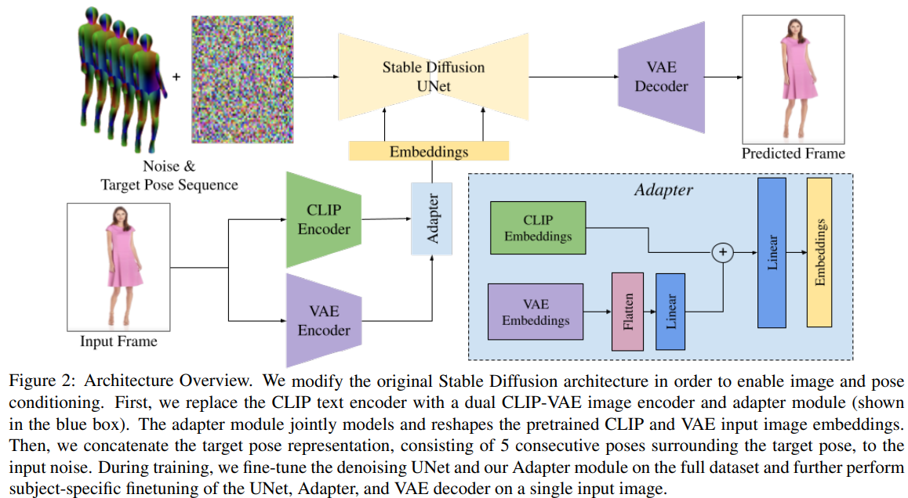
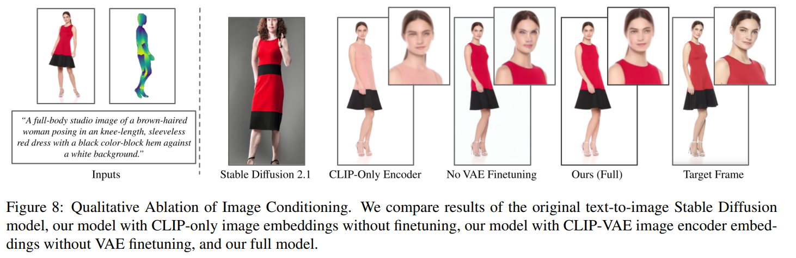
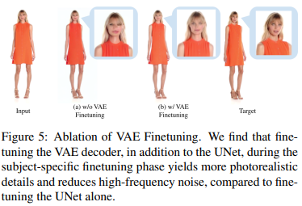

# DreamPose: Fashion Image-to-Video Synthesis via Stable Diffusion

> "DreamPose: Fashion Image-to-Video Synthesis via Stable Diffusion" Arxiv, 2023 Apr
> [paper](http://arxiv.org/abs/2304.06025v4) [code](https://github.com/johannakarras/DreamPose) [website](https://grail.cs.washington.edu/projects/dreampose/)
> [pdf](./2023_04_Arxiv_DreamPose--Fashion-Image-to-Video-Synthesis-via-Stable-Diffusion.pdf)
> Authors: Johanna Karras, Aleksander Holynski, Ting-Chun Wang, Ira Kemelmacher-Shlizerman

## Key-point

- Task: generating animated fashion videos from still images.
- Background
- :label: Label:

transform a **pretrained text-to-image model (Stable Diffusion [16])** into a pose-and-image guided video synthesis model, using a novel finetuning strategy

 a set of architectural changes to support the **added conditioning signals, and techniques to encourage temporal consistency**

## Contributions

## Related Work

### Conditioning Mechanisms for Diffusion Models

- "Instructpix2pix: Learning to follow image editing instructions" CVPR, 2022 Nov :star:
  [paper](https://arxiv.org/abs/2211.09800)

  图像编辑任务（改风格，改物体） image conditioning signals are often **concatenated with the input noise** to the denoising U-Net 适合**spatially aligned**的情况

## methods

modify the original Stable Diffusion architecture in order to enable image and pose conditioning.  replace the CLIP text encoder with a dual CLIP-VAE image encoder and adapter module 

1. 数据集属于一个小范围，去 fine-tune a pretrained Stable Diffusion model，需要 accept additional conditioning signals (image and pose), 
2. At inference time, we generate each frame independently && 多帧  with uniformly distributed Gaussian nois

需求：a method to effectively **condition the output image on target pose** while also enabling temporal consistency

InstructPix2Pix 直接将图和 noise concat，适合空间分布一致的情况。此方法生成另一个姿态的人物，空间布局有差异所以不适合用此方法。

- finetune Stable Diffusion 避免 Prior Loss

  > 参考 ControlNet， InstructPix2Pix

  A crucial objective 让输入和原来 SD 训练数据接近。

  改动：U-net input 层接收额外的 Pose（concat 到 noise 里面），Cross-Attn 输入context（CLIP image feature + VAE 特征），微调 VAE Decoder

- Image Condition

  1. 用现有 InstructPix2Pix 方法去 condition，适合输入输出空间布局一致的情况
     但 Pose 生成的帧和输入图在空间布局上有差异没法用
  2. 最简单想法：用 CLIP image embedding 替换 text-embedding，但发现 in practice that **CLIP image embeddings alone are insufficient** for capturing fine-grained details in the conditioning image。CLIP 图像特征细节不足

  方案：CLIP 图像embedding + VAE 特征；问题：architecture does not support VAE latents as a conditioning signal by default；解决 add an adapter module A that combines the CLIP and VAE embeddings

  一开始训练这个 Adapter 模仿 ControlNet，将 VAE 的权重置为0，只用 CLIP 特征

- Pose Condition: 用 InstructPix2Pix 方式 condition

  发现逐帧地和noise 加，生成图像各帧抖动很大，用几帧 pose 的特征一起和 noise 处理；concatenate the noisy latents $z_i$ with a target pose representation $c_p$ （5个 pose的特征）

  modify the UNet 输入 layer 加 10 个channel（5个 pose 的特征）改了模型结构

  > image-conditional diffusion methods
  > "Dreambooth: Fine tuning text-to-image diffusion models for subject-driven"
  > "Dreamfusion: Text-to-3d using 2d diffusion"
  > "Dreamix: Video diffusion models are general video editors"
  >
  > Pose 图用现成的 DensePose 预测

  1. 单独只训一帧 >> texture-sticking；做 DA Random Crop
  2. finetuning the VAE decoder

- 平衡图像 condition 和 Pose condition 的强度
  modulate the strength of image conditioning cI and pose conditioning cp during inference using dual **classifier-free guidance **

  > 参考 InstructPix2Pix

## Experiment

> ablation study 看那个模块有效，总结一下

- setting

  UBC Fashion dataset： 339 train & 100 test videos. Each video has a frame rate of 30 frames/second and is approximately 12 seconds long（15w帧，平均每个视频 360 帧）

- 做了 Stable Diffusion Image Conditioning 的消融实验

  

- 是否 Finetune VAE

  

## Limitations

1. 生成的一致性不足，帧见存在闪烁问题

2. finetuning and inference times are slow com

   a specific subject takes approximately 10 minutes for the UNet and 20 minutes for the VAE decoder

   **18 second per-frame rendering time.**

## Summary :star2:

> learn what & how to apply to our task

