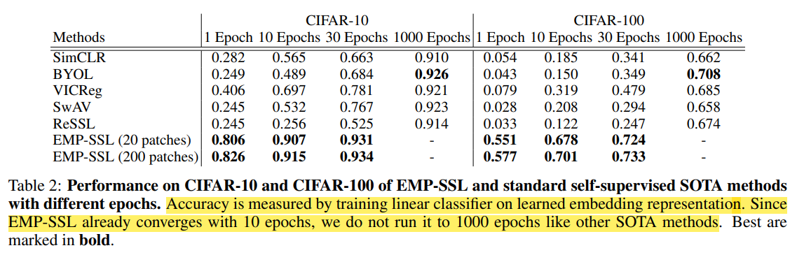
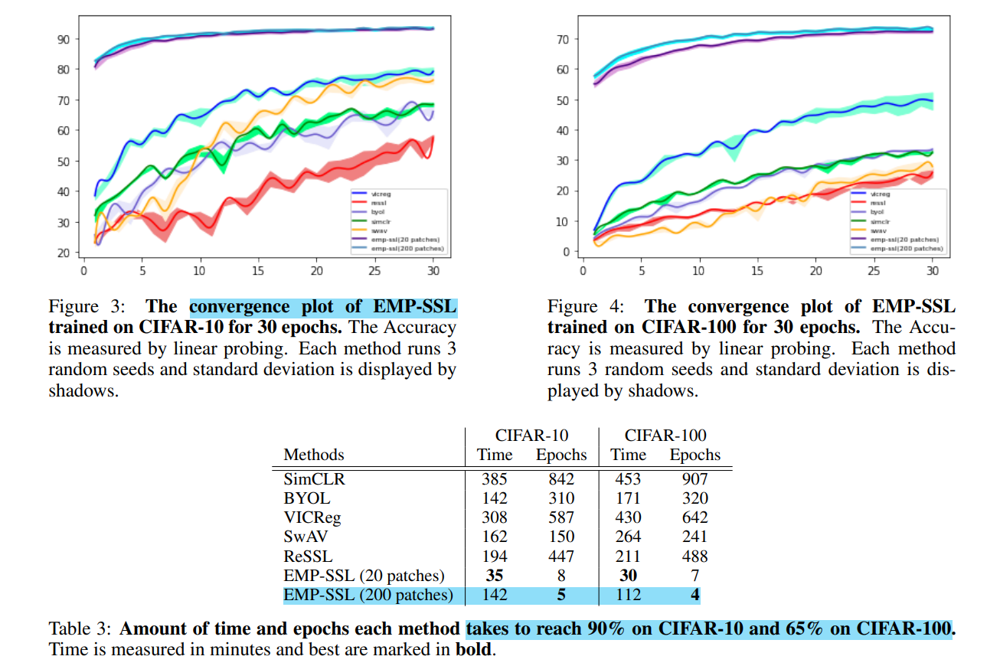

# EMP-SSL: Towards Self-Supervised Learning in One Training Epoch

> "EMP-SSL: Towards Self-Supervised Learning in One Training Epoch" Arxiv, 2023 Apr, **EMP-SSL**
> [paper](https://arxiv.org/abs/2304.03977) [code](https://github.com/tsb0601/EMP-SSL) [blog_explanation](https://mp.weixin.qq.com/s/OJphdhUrihKSVj14b6gLmA)
> [local pdf](./2023_04_Arxiv_EMP-SSL--Towards-Self-Supervised-Learning-in-One-Training-Epoch.pdf)

## **Key-point**

主要解决**自监督学习**训练效率低的问题。设计了一个 loss 使得相似的图，得到的  latent representation 更加接近，并且这样**学习到的 latent representation 有意义 & 训练加速& 很好的迁移性 && 有区分度** >> 思考怎么用于 diffusion 加速 ！:star:

发现 Joint-embedding 方法提高效率的关键是增加 patches 的数量（1 epoch 训到很好的效果），1 个 epoch 就在 CIFAR10 上收敛到 85%


**Contributions**

- 实验发现一种自监督学习方式，**学到的 latent code 更有意义，加速收敛**


## **Related Work**

- Linear probe

  linear probing – a collision resolution technique for searching the location of an element in a hash table.

- **learning more discriminative latent code like generative models** :star:
  "Training GANs with Stronger Augmentations via Contrastive Discriminator" Arxiv, 2021 Mar
  [paper](https://arxiv.org/abs/2103.09742)

- SSL(Self-Supervised Learning)

- LARS 优化器

  > [blog](https://www.jianshu.com/p/e430620d3acf) :+1:

  用于大 batchsize 时进行优化，对模型每个 layer 单独设置 learning rate，避免 batchsize 增大 learning rate 设置导致的不稳定问题。


## **methods**

**主要关注设计的 loss 优化 latent representation**，图像的 Encoder 和 Injection Mode 为 Res18 和 FC

> EMP-SSL 没有探索 prediction networks, momentum encoders, non-differentiable operators, or stop gradients 进一步提升性能的影响 >> future work


### Loss with Total Coding Rate(TCR) :star2: 

一种协方差正则化方法

- Total Coding Rate (TCR) [36, 35, 53, 15], which is a covariance regularization technique, to **avoid collapsed representation**
  $$
  R(Z) = \frac{1}{2} \log{\det{(I + \frac{feature\_dim}{batch\_num * \epsilon^2}Z*Z^T)}}
  $$
  

**covariance regularization is achieved by maximizing the Total Coding Rate (TCR).**

> 视频中，**有噪声的相邻帧认为是同一个场景的 augmentation** 需要 latent representation 接近

$$
Loss = \max{\frac{1}{n}\sum_{i=1}^{n}{(R(Z_i) ~+~\lambda\cdot D(Z_i, \bar{Z}))}}\\
\bar{Z} = \frac{1}{n}\sum_{i=1}^{n}{Z_i}\\
\text{where $n$ is augmented results number, $\bar{Z}$ is the mean of representations of different augmented
patches ,}\\
\text{In the TCR loss, λ is set to 200.0 and $\epsilon^2$is set to 0.2 (Exp setting)}
$$

- $D(Z_i, \bar{Z_i})$ 为余弦相似度函数


## **Experiment**

> ablation study 看那个模块有效，总结一下

We use a ResNet-18 [27] as the backbone and train for at most 30 epochs. We use a batch size of 100, the LARS optimizer [51] with η set to 0.005, and a weight decay of 1e-4.  In the TCR loss, λ is set to 200.0 and  2 is set to 0.2

### CIFAR-100 Cls

Accuracy is measured by **training linear classifier on learned embedding representation**

分类准确率指标 & 收敛速度均最优，很震撼 :zap:

<table><tr>
    <td></td>
    <td></td>
</table>


Several Fining:

1. EMP-SSL 10 个 Epoch 效果，优于其他 SOTA SSL 方法 1000 个 epoch的结果
2. patches 数量增加  $20 \rightarrow 200$ 效果有更优


### ablation study

- **number of patches $n$** to illustrate the importance of patch number in joint-embedding SSL

  patches =100 就很好了

- Transferability 但都还是分类任务只是数据集不一样

  > Note that despite similar names, CIFAR-10 and CIFAR-100 have very little overlap hence they are suitable for testing model’s transferability.

  the method’s better transferability to out of domain data

  (1) models pretrained on CIFAR-10 and linearly evaluated on CIFAR-100 (2) models pretrained on CIFAR-100 and linearly evaluated on CIFAR-10

  1. SOTA SSL 方法在一个上面好换成另一个就不行，**说明 SSL 的 latent representation 需要 generalize well to out-of-domain data instead of overfitting the training data**
  2. a larger number of training epochs causes the models to overfit to the training dataset.

  

$*v = \frac{v}{\max(\lVert v \rVert_p, \epsilon)}.*$

## Code

- res18

```python
from torchvision.models import resnet18, resnet34, resnet50

def getmodel(arch):
    """get resnet 18 model"""
    #backbone = resnet18()
    
    if arch == "resnet18-cifar":
        backbone = resnet18()
        backbone.conv1 = nn.Conv2d(3, 64, kernel_size=3, stride=1, padding=1, bias=False) 
        backbone.maxpool = nn.Identity()
        backbone.fc = nn.Identity()
        return backbone, 512  
    elif arch == "resnet18-imagenet":
        backbone = resnet18()    
        backbone.fc = nn.Identity()
        return backbone, 512
    elif arch == "resnet18-tinyimagenet":
        backbone = resnet18()    
        backbone.avgpool = nn.AdaptiveAvgPool2d(1)
        backbone.fc = nn.Identity()
        return backbone, 512
    else:
        raise NameError("{} not found in network architecture".format(arch))
```

- Total Coding Rate
  $$
  R(Z) = \frac{1}{2} \log{\det{(I + \frac{feature\_dim}{batch\_num * \epsilon^2}Z*Z^T)}}
  $$
  

  - `torch.logdet` [doc](https://pytorch.org/docs/stable/generated/torch.logdet.html?highlight=logdet#torch.logdet)
    Calculates log determinant of a square matrix or batches of square matrice

  ```python
  class TotalCodingRate(nn.Module):
      def __init__(self, eps=0.01):
          super(TotalCodingRate, self).__init__()
          self.eps = eps
          
      def compute_discrimn_loss(self, W):
          """Discriminative Loss."""
          p, m = W.shape  #[d, B]
          I = torch.eye(p,device=W.device)
          scalar = p / (m * self.eps)
          logdet = torch.logdet(I + scalar * W.matmul(W.T))
          return logdet / 2.
      
      def forward(self,X):
          return - self.compute_discrimn_loss(X.T)
  ```

  


## **Summary :star2:**

> learn what & how to apply to our task

- **learning more discriminative latent code like generative models** :star:

  思考怎么改进用到 diffusion 里面，参考 [related works 写的那个文章](#Related Work)

  实现 diffusion 加速

