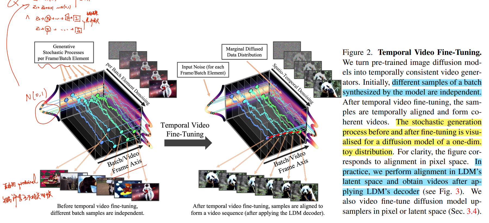
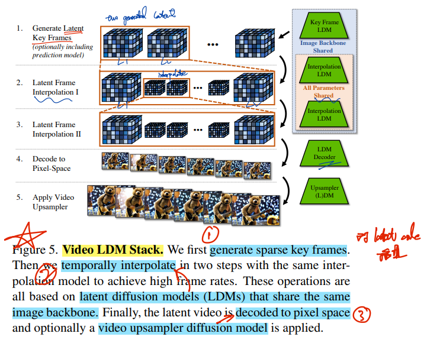
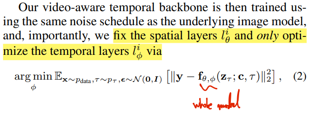
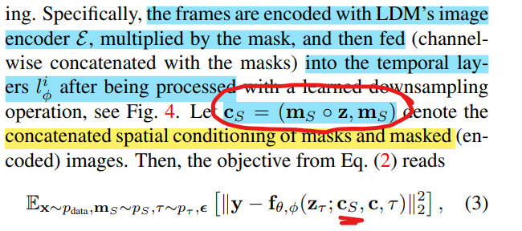

# Video LDM

> paper: [arxiv ](https://arxiv.org/abs/2304.08818) Apr 2023
> official blog: https://research.nvidia.com/labs/toronto-ai/VideoLDM/
> [unofficial implementation](https://github.com/srpkdyy/VideoLDM.git)
> [paper local pdf](./2023_04_CVPR_Align-your-Latents--High-Resolution-Video-Synthesis-with-Latent-Diffusion-Models.pdf)
>
> - Andreas Blattmann >> Stable Diffusion 作者

## **Key-point**

- 视频生成任务
- 应用场景
  - in-the-wild driving data 驾驶视频合成 videos of resolution 512 × 1024 SOTA
  - **text-to-video 合成**(High-resolution 视频合成) text-to-video with resolution up to 1280 × 2048

作者基于 pretrained Latent Diffusion Models (LDMs) 图像生成模型，引入 temporal layer 时序建模，从而让 latent code 在时序上的对齐，实现 High-resolution 视频生成（spatial 高分辨率 & temporal高帧率 FPS）。

> 该模型的训练过程其实就是对同一款预训练的图片LDM（及DM上采样器）的不同微调过程
>
> tips: 此任务需要大量计算资源（A100 80G显存 **11B 参数**）。

- 方法简述

  - 短视频序列生成

    直接用 pretrain LDM ，**增加 temporal layer** 实现 batch noise 生成的 images 的一致性。

  - Long-Term generation

    对于 T 帧的视频，用短视频模型先生成开头的 S 帧，构造了 temporal mask 对剩下 T-S 帧进行掩码让模型去预测

  - Temporal Interpolation 实现 High FPS

    1. generate key frames with large semantic changes only at a relatively low frame rate.
    2. **interpolate between given key frames**

  - 视频 SR：用短视频生成同样的方法，训练 upscaler


**Contributions**

- 将 pretrained Stable Diffusion text2image LDM 改进用于 Video LDM

- 高效的 Video LDM 训练方式，实现 high-resolution, long-term consistent 生成

  实现 text2video model，SOTA 视频生成效果

- temporally fine-tune **super resolution DMs**

- 构造了一个 temporal layers 可用于不同 Image LDM 结构


## **Related Work**

> - ref 29 [Cascaded Diffusion Models for High Fidelity Image Generation](https://arxiv.org/abs/2106.15282)
>
>   pixel-space upsampler DM
>
> - ref65  High-resolution image synthesis with latent diffusion models.
>
>    LDM upsampler
>    
> - DDIM sampler
>
> 这两个模型在文章中多次提及 :walking:

### LDMs

Compared with pixel-space DMs, LDM use a compression model to map the image to **latent space, which lower complexity(smaller memory cost,** parameters count)

### Cascaded DM

[Cascaded Diffusion Models for High Fidelity Image Generation](https://arxiv.org/abs/2106.15282)

### LVG

> [[2206.03429\] Generating Long Videos of Dynamic Scenes](https://arxiv.org/abs/2206.03429) baseline


## **methods**

> - :question: Stale Diffusion `ref65`
> - :question: pixel-space upsampler DMs (cascaded DMs, pixel-space DM) `ref10`
> - :question: DM sampling in DDIM` ref80`
> - :question: 对于训练数据有 GT x 视频帧输入，对于只有 text 的推理怎么处理？
> - :question: conditioned on text？

`Section 3` describe how we video **fine-tune pre-trained image LDMs (and DM upsamplers) for high-resolution video synthesis.**  **turn pre-trained image diffusion models into temporally consistent video generators.**



直接用 stable diffusion 一帧帧生成 batch frames, 生成的结果互不相关。引出文章里面的 temporal finetune.

<video src="https://research.nvidia.com/labs/toronto-ai/VideoLDM/assets/figures/video_ldm_animation.mp4" ></video>

Initially, different samples of a batch synthesized by the model are independent. **After temporal video fine-tuning, the samples are temporally aligned and form coherent videos.**  In practice, we perform alignment in LDM's latent space and obtain videos after applying LDM's decoder.


### pipline



1. 首先生成离散的关键帧；
2. 用 interpolation LDM 进行插值，在关键帧之间进行时序插值，以实现较高的帧率；
   （以上三步均基于LDM模型，且它们共享相同的image backbone，分别进行微调）
3. Decode 将潜向量解码到像素空间
4. （可选）再用一个 LDM ，用视频上采样 DM 得到更高的分辨率


- 改进 temporal layer in U-net block


对于 pretrained-LDM 的 downsample / upsample layers 加入 temporal layer(此图右侧部分绿色的 Conv3D & temporal atten 组成)



> :bulb: By **fixing the Spatial layers from pretrained LDMs**, A crucial advantage of our strategy is that **huge image datasets can be used to pre-train the spatial layers, while the video data, which is often less widely available, ** 解决视频数据少的问题 :star::star::star:


### **temporal fine-tuning of decoder**

> 如何训练 Decoder 实现生成的 frames 在时间上对齐。整体框架中最后映射到 pixel-space 的 Decoder 模块


###  Long-Term Generation

前面框架对短视频有效，对长序列（几分钟的视频）有限。作者把模型当作 prediction model，修改 objective 来增加模型对于长序列的生成效果。

> **masking-conditioning mechanism**

- **训练新的 Interpolation LDM >> prediction model**

  T 帧的序列，让模型先生成开头的 S 帧。对 (T-S) -> T 帧加上 mask 让模型预测。**用 mask 和 masked encoded frames (frame先用 image LDM encode, 乘上 mask) 作为 conditioning**

  

- **inference for generating long videos**

  > 参考 Appendix Page21 Video Generation details

  1. 先生成初始视频帧 8s15帧 >> 1.875fps

     first generate a single frame using the image LDM, then we run the **prediction model, conditioning on the single frame**, to generate a sequence of **key frames**.

  2. extend video frames

     分两步**run the prediction model condition on two context frames** to encode movement 实现 FPS: 1.875->7.5->30 **四倍生成**

- stabilize sampling >> classifier-free diffusion

  


###  High Frame Rates

 interpolate between given key frames. **predict three frames between two given key frames,** thereby training a T → 4T interpolation model

使用 mask 的 conditioning 方式和 [Section Long-Term Generation](#Long-Term Generation) 中一样


### SR

> `ref29` [Cascaded Diffusion Models for High Fidelity Image Generation](https://arxiv.org/abs/2106.15282)

use a DM to further **scale up the Video LDM outputs** by 4×.  **对 VideoLDM 输出结果再用一个新的 DM 做 4x 超分**

- 对于驾驶视频超分用 CascadedDM
- text2video 用 LDM upsampler

> **Q1: 单独对每帧超分，存在不一致问题** :star:
>
> condition 进行了修改 :exclamation:

对 DM 用 [Section Latent Image 2 video generators ](#Latent Image 2 video generators) 方法加上 temporal layer 改造

We follow the mechanism introduced in Sec. 3.1 with spatial layers and temporal layers and similarly video fine-tune the upscaler, **conditioning on a low-resolution sequence of length T and concatenating low-resolution video images frame-by-frame** 

> **Q2：upscaler 只能 operate locally**

conduct all upscaler training efficiently on patches only and later apply the model convolutionally


## Experiment

For driving video synthesis, our Video LDM enables generation of temporally coherent, **multiple minute long videos at resolution 512 x 1024**, achieving state-of-the-art performance.

For text-to-video, we demonstrate synthesis of short videos of several seconds

- Dataset

  - real driving scene (RDS) videos.

    683,060 videos of 8 seconds each at resolution 512 × 1024

  - WebVid-10M

    10.7M video-caption pairs with a total of 52K video hours

- metrics

  - FVD 越低越好
    https://github.com/google-research/google-research/tree/master/frechet_video_distance
  
    从预训练的 I3D 提取特征
  
    
  
  - FID
  
    从 2048 个生成的视频中，随机抽 10k 帧 >> pretrained Inception Model
  
  - Human evaluation
  
  - Inception
  
    用在 UCF101 数据集上训练得到的 C3D
  
  - CLIP-SIM
  
    average CLIP socres of 47840 frames

> [Paper Experiment part](file:///C:/Users/Loki/workspace/LearningJourney_Notes/Tongji_CV_group/2023_CVPR_Align-your-Latents--High-Resolution-Video-Synthesis-with-Latent-Diffusion-Models.pdf#Page6) table result check here


**Limitations**

- 生成的真实性不好
- 11Billion 参数

## **Summary :star2:**

> learn what & how to apply to our task


## Code

### VideoLDMDownBlock

```python
class VideoLDMDownBlock(CrossAttnDownBlock2D):
    def __init__(self, *args, n_frames=8, n_temp_heads=8, **kwargs):
        super().__init__(*args, **kwargs)

        out_channels = kwargs['out_channels']
        num_layers = kwargs['num_layers']
        cross_attn_dim = kwargs.get('cross_attention_dim')

        conv3ds = []
        tempo_attns = []

        for i in range(kwargs['num_layers']):
            conv3ds.append(
                Conv3DLayer(
                    in_dim=out_channels,
                    out_dim=out_channels,
                    n_frames=n_frames,
                )
            )

            tempo_attns.append(
                TemporalAttentionLayer(
                    dim=out_channels,
                    n_frames=n_frames,
                    n_heads=n_temp_heads,
                    kv_dim=cross_attn_dim,
                )
            )

        self.conv3ds = nn.ModuleList(conv3ds)
        self.tempo_attns = nn.ModuleList(tempo_attns)

    def forward(
        self,
        hidden_states: torch.FloatTensor,
        temb: Optional[torch.FloatTensor] = None,
        encoder_hidden_states: Optional[torch.FloatTensor] = None,
        attention_mask: Optional[torch.FloatTensor] = None,
        cross_attention_kwargs: Optional[Dict[str, Any]] = None,
        encoder_attention_mask: Optional[torch.FloatTensor] = None,
    ):
        output_states = ()

        for resnet, conv3d, attn, tempo_attn in zip(self.resnets, self.conv3ds, self.attentions, self.tempo_attns):

            hidden_states = resnet(hidden_states, temb)  # Spatial Layer
            hidden_states = conv3d(hidden_states)
            hidden_states = attn(
                hidden_states,
                encoder_hidden_states=encoder_hidden_states,
                cross_attention_kwargs=cross_attention_kwargs,
            ).sample
            hidden_states = tempo_attn(
                hidden_states,
                encoder_hidden_states,
            )

            output_states += (hidden_states,)

        if self.downsamplers is not None:
            for downsampler in self.downsamplers:
                hidden_states = downsampler(hidden_states)

            output_states += (hidden_states,)

        return hidden_states, output_states
```


#### Conv3d

> [pytorch Step by Step implementation 3D Convolution Neural Network](https://towardsdatascience.com/pytorch-step-by-step-implementation-3d-convolution-neural-network-8bf38c70e8b3)
> [Intuitive understanding of 1D, 2D, and 3D convolutions](https://wandb.ai/ayush-thakur/dl-question-bank/reports/Intuitive-understanding-of-1D-2D-and-3D-convolutions-in-convolutional-neural-networks---VmlldzoxOTk2MDA)


```python
class Conv3DLayer(nn.Module):
    def __init__(self, in_dim, out_dim, n_frames):
        super().__init__()

        self.to_3d = Rearrange('(b t) c h w -> b c t h w', t=n_frames)
        self.to_2d = Rearrange('b c t h w -> (b t) c h w')

        k, p = (3, 1, 1), (1, 0, 0)
        self.block1 = nn.Sequential(
            nn.GroupNorm(32, in_dim),
            nn.SiLU(),
            nn.Conv3d(in_dim, out_dim, kernel_size=k, stride=1, padding=p)
        )
        self.block2 = nn.Sequential(
            nn.GroupNorm(32, out_dim),
            nn.SiLU(),
            nn.Conv3d(out_dim, out_dim, kernel_size=k, stride=1, padding=p)
        )

        self.alpha = nn.Parameter(torch.ones(1))

    def forward(self, x):
        h = self.to_3d(x)

        h = self.block1(h)
        h = self.block2(h)

        h = self.to_2d(h)

        with torch.no_grad():
            self.alpha.clamp_(0, 1)

        out = self.alpha * x + (1 - self.alpha) * h
        return out
```


#### Temporal-Atten

- position_encoding

  取 1-512 序列，log & exp & concat(cos,sin)

```python
class PositionalEncoding(nn.Module):
    def __init__(self, dim, max_pos=512):
        super().__init__()

        pos = torch.arange(max_pos)

        freq = torch.arange(dim//2) / dim
        freq = (freq * torch.tensor(10000).log()).exp()

        x = rearrange(pos, 'L -> L 1') / freq
        x = rearrange(x, 'L d -> L d 1')

        pe = torch.cat((x.sin(), x.cos()), dim=-1)
        self.pe = rearrange(pe, 'L d sc -> L (d sc)')

        self.dummy = nn.Parameter(torch.rand(1))

    def forward(self, length):
        enc = self.pe[:length]
        enc = enc.to(self.dummy.device)
        return enc
```

- TemporalAttentionLayer

```python
class TemporalAttentionLayer(nn.Module):
    def __init__(self, dim, n_frames, n_heads=8, kv_dim=None):
        super().__init__()
        self.n_frames = n_frames
        self.n_heads = n_heads

        self.pos_enc = PositionalEncoding(dim)

        head_dim = dim // n_heads
        proj_dim = head_dim * n_heads
        self.q_proj = nn.Linear(dim, proj_dim, bias=False)

        kv_dim = kv_dim or dim
        self.k_proj = nn.Linear(kv_dim, proj_dim, bias=False)
        self.v_proj = nn.Linear(kv_dim, proj_dim, bias=False)
        self.o_proj = nn.Linear(proj_dim, dim, bias=False)

        self.alpha = nn.Parameter(torch.ones(1))

    def forward(self, q, kv=None, mask=None):
        skip = q

        bt, c, h, w = q.shape
        q = rearrange(q, '(b t) c h w -> b (h w) t c', t=self.n_frames)

        q = q + self.pos_enc(self.n_frames)

        kv = kv[::self.n_frames] if kv is not None else q
        q = self.q_proj(q)
        k = self.k_proj(kv)
        v = self.v_proj(kv)

        q = rearrange(q, 'b hw t (heads d) -> b hw heads t d', heads=self.n_heads)
        k = rearrange(k, 'b s (heads d) -> b heads s d', heads=self.n_heads)
        v = rearrange(v, 'b s (heads d) -> b heads s d', heads=self.n_heads)

        out = F.scaled_dot_product_attention(q, k, v, mask)
        out = rearrange(out, 'b hw heads t d -> b hw t (heads d)')
        out = self.o_proj(out)

        out = rearrange(out, 'b (h w) t c -> (b t) c h w', h=h, w=w)

        with torch.no_grad():
            self.alpha.clamp_(0, 1)

        out = self.alpha * skip + (1 - self.alpha) * out
        return out
```


- **mask模块**

  假设query和key是等长，长度都为n,且在时间上能对应。对于第 t 时刻的 Qt,在做计算的时候，应该只算 $K_1 \to K_{t-1}$ ,而不应该看到 $Kt$ 和 $ Kt$ 之后的东西，因为此时的Kt还没有。

