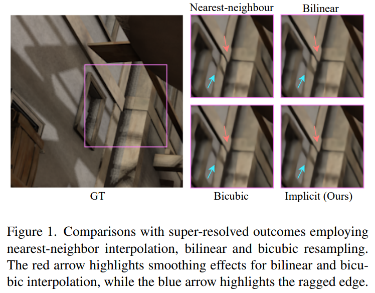

# Enhancing Video Super-Resolution via Implicit Resampling-based Alignment

> "Enhancing Video Super-Resolution via Implicit Resampling-based Alignment" CVPR, 2023 Apr 29
> [paper](http://arxiv.org/abs/2305.00163v2) [code]() [pdf](./2023_04_CVPR_Enhancing-Video-Super-Resolution-via-Implicit-Resampling-based-Alignment.pdf) [note](./2023_04_CVPR_Enhancing-Video-Super-Resolution-via-Implicit-Resampling-based-Alignment_Note.md)
> Authors: Kai Xu, Ziwei Yu, Xin Wang, Michael Bi Mi, Angela Yao

## Key-point

- Task: VSR
- Problems
- :label: Label:

## Contributions

- 发现 optical sample 中 bilinear 存在缺陷，**提出 implicit resample，改进 bilinear 采样方式**

> However, most existing works simply use a default choice of bilinear interpolation for resampling even though bilinear interpolation has a smoothing effect and hinders super-resolution. From these observations, we propose an implicit resampling based alignment. 

- 发现 bilinear 插值会导致高频细节的丢失，用 MLP + window CrossAttn 恢复高频信息

  > We show that bilinear interpolation inherently attenuates high-frequency information while an MLPbased coordinate network can approximate more frequencies. 

## Introduction

对比不同采样方式对细节的影响

## methods

## setting

- Quantitative comparison on REDS4 [23], Vimeo-90K-T [32] and Vid4 [21] dataset for 4× Video SR.

## Experiment

> ablation study 看那个模块有效，总结一下

效果从指标上看，和 RVRT 差距不明显

## Limitations

## Summary :star2:

> learn what

### how to apply to our task

