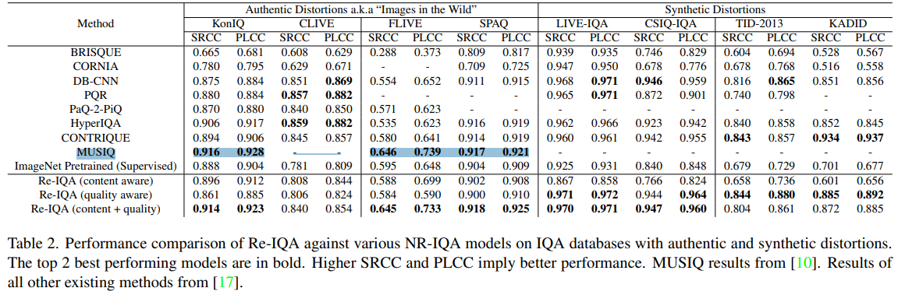

# Re-IQA: Unsupervised Learning for Image Quality Assessment in the Wild

> "Re-IQA: Unsupervised Learning for Image Quality Assessment in the Wild" CVPR, 2023 Apr 2
> [paper](http://arxiv.org/abs/2304.00451v2) [code]() [pdf](./2023_04_CVPR_Re-IQA--Unsupervised-Learning-for-Image-Quality-Assessment-in-the-Wild.pdf) [note](./2023_04_CVPR_Re-IQA--Unsupervised-Learning-for-Image-Quality-Assessment-in-the-Wild_Note.md)
> Authors: Avinab Saha, Sandeep Mishra, Alan C. Bovik

## Key-point

- Task
- Problems
- :label: Label:

## Contributions

## Introduction

## methods

## setting

## Experiment

> ablation study 看那个模块有效，总结一下

## Limitations

## Summary :star2:

> learn what

### how to apply to our task

