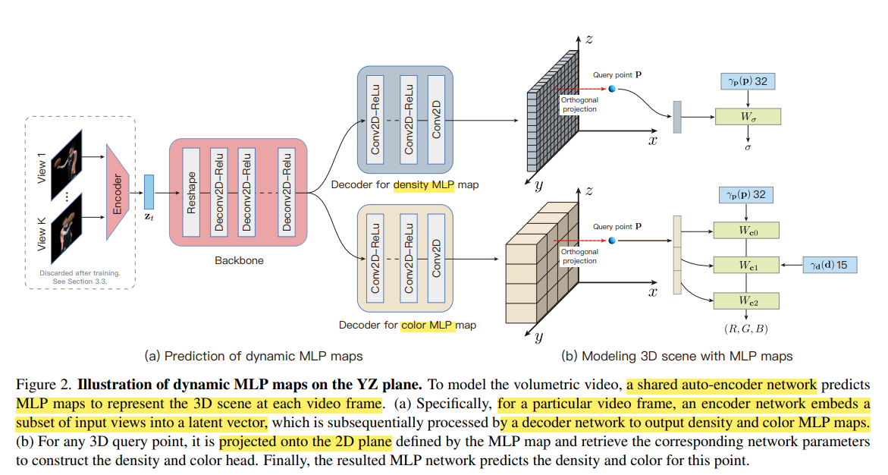

# Representing Volumetric Videos as Dynamic MLP Maps

> "Representing Volumetric Videos as Dynamic MLP Maps" CVPR, 2023 Apr
> Sida Peng∗ Yunzhi Yan∗ Qing Shuai Hujun Bao Xiaowei Zhou†
> [paper](https://arxiv.org/abs/2304.06717) [code](https://github.com/zju3dv/mlp_maps) [website](https://zju3dv.github.io/mlp_maps/) [author blog explanation](https://zhuanlan.zhihu.com/p/622214784)
> [paper local pdf](./2023_04_CVPR_Representing-Volumetric-Videos-as-Dynamic-MLP-Maps.pdf)

## **Key-point**

本文介绍了一种**基于 neural scene representations 的 volumetric  video 表示方式，实现动态场景的自由视角渲染（实时） :key:**

neural scene representations 神经场表示建模体积视频，用神经网络表示3D场景，有渲染速度慢，预测3D volume很容易消耗大量的GPU内存，从而限制了该方法合成高分辨率图像的能力。

**dynamic MLP maps:**  represent volumetric videos with a set of small MLP networks, 这些 MLP 网络的参数存于 2D MLP maps，每个像素存储一个 MLP 参数向量。即用一组小的 MLP maps 来表示视频，而不是用一个大的存储全部 3D 信息，将**信息分解到每个坐标轴**。

> :question: MLP 参数向量

**输入一个 multi-view 视频**，video 每一帧用一个共享的 2D CNN encoder 获取每一帧的 latent code。对于每一帧的 latent code 输入**一个共享的 2D CNN decoder** 获取**多个 MLP maps （对应每个坐标平面）**，用这些 maps 来存储 3D 点的一个维度的信息。之后 3D 目标空间的每个点 query point，去这些 MLP maps 获取信息，最后融合一下去计算 RGB, 密度。

- 用**每一帧共享的一个 2D CNN encoder 和 decoder** 实现每一帧的 temporal consistency

- latent code 输入 2D decoder, 分解到每个坐标轴的 MLP map （分解到 Density 和 Color）。用 2D CNN 计算，避免 3D CNN，实现加速 & 低存储

- 用一个 hash table 存储 MLP maps 的 vector，加速！:star:

  "Instant Neural Graphics Primitives with a Multiresolution Hash Encoding" SIGGRAPH, 2022
  [paper](https://arxiv.org/abs/2201.05989) [code](https://github.com/NVlabs/instant-ngp) [website](https://nvlabs.github.io/instant-ngp/?utm_source=catalyzex.com)

**Contributions**

- A novel representation of volumetric video: `dynamic MLP maps`
- real-time rendering 41.7 fps
- over 100 times faster than `DyNeRF`

## **Related Work**

- Volumetric Videos

  Volumetric video captures a dynamic scene in 3D which **allows users to watch from arbitrary viewpoints** with immerse experience

  Volumetric Video（立体视频）是一种6-DoF自由度的视频，提供给用户transitional和rotational的旋转，即x,y,z和yaw,pitch,roll，后者常见于3-DoF的全景视频。立体视频可以用点云point cloud和3D mesh表示，主流的传输都是基于点云的。

- Neural Volumes

  > [blog explanation](https://blog.csdn.net/soaring_casia/article/details/117664146)

- Instant NGP >> hash table

## **methods**

**输入 & goal**: Given a **multi-view video captured by synchronized and calibrated cameras,** our goal is to produce a volumetric video that takes up low disk storage and supports fast rendering

**Whole pipeline**

- 均匀采样 64 个查询点 along each camera ray

- 每个 3D 查询点，映射到 3 个 2D MLP maps 获取 MLP 网络参数

  实现中将 MLP maps 与坐标系的轴对齐，并将点**正交投影到平面**上。本方法将参数向量分配给投影的查询点，然后将参数向量动态加载到MLP网络中

- 每个 3D 查询点计算 embedding 获取一个高维向量，输入上面的得到的 MLP 网络预测颜色和体密度

### Model 3D scene with MLP maps

**An MLP map** is a 2D grid map with each pixel storing the parameters of an MLP network. 
MLP maps 里面保存 MLP network 的参数。对于3D 空间的一个点 p，去每个 2D 平面的 MLP map 获取对应 MLP network 的参数。这些 MLP 网络构成一个小型 NeRF 网络，输出颜色和体密度。

- embedding process: 将每个 3D 坐标映射到一个高维向量，之后作为 MLP 网络的输入

  见 Section3.1 
  $$
  \gamma_p(p) = \gamma^h_p(p) + \gamma^t_p(p) \\
  \gamma^t_p(p) ~ \text{is tri-plane feature. } \\
  \gamma^h_p(p) \text{is tri-plane feature. } \\
  \gamma_d(d) \text{ is encoded viewing direction(realized as pos-emebedding)}
  $$
  

3D 查询点，通过 encoder 输入哪些坐标来指定指定平面，例如 $(x,y,t; h_{xy})$ ；得到 latent code 用**Decoder 分解到 3个平面下，每个平面都有 Density MLP map 和 Color MLP map**. 

- Density MLP maps 增大，效果好很多。
- 3 Orthogonal MLP maps: 实验发现只映射到一个 MLP 平面效果不好，分解到多个坐标轴平面，信息变化小一些

### Volumetric video as MLP maps

network architecture is implemented as an encoder-decoder, where the encoder **regresses latent codes from camera views** and the decoder produces MLP maps based on latent codes
alternative way to obtain latent codes is pre-defining learnable feature vectors for each video frame as in [5, 37, 43]

### Accelerating 

多个小的 MLP 推理相比 DyNeRF 更快。
To further improve the rendering speed, we introduce **two additional strategies**

- 视频每一帧过完 encoder **把 latent code 存起来**，不存 encoder

- 设置一个 the occupancy volumes 标识位表示哪些 3D 空间没内容，跳过这些 empty space，**减少 3D query point**

  300 frames 的视频这个occupancy volumes 只要 8MB

## **Experiment**

> ablation study 看那个模块有效，总结一下

- Dataset

   ZJU-MoCap [49] and NHR

- Ablation study
  - MLP maps 分辨率越小，渲染损失越多
  - multi MLP maps LPIPS 更小，rendering time 更小
  - 动态 MLP 比只用一个公用的 MLP 效果更好

## **Limitations**

- 工作只在 100-300 frames 的短视频上测试，对于几分钟的长视频没试过

  **long volumetric video** ??

- 用 hashtable 存储 latent code，**当视频长了，存储问题**

- Encoder 输入需要 dense camera views，对于**自由视角的视频还待解决**

## **Summary :star2:**

> learn what & how to apply to our task

- **每帧用一个共享的 encoder 获取 latent code 实现 temporal consistency**

  learning with an encoder network is that it implicitly shares the information across video frames

- 模仿用 volumetric video MLP maps 的方式表示视频，分解到不同坐标平面表示视频？

  本文输入为带 view-point 的帧，2D 视频为自由视角 :question: