# DiFaReli: Diffusion Face Relighting

> "DiFaReli: Diffusion Face Relighting" ICCV, 2023 Apr
> [paper](http://arxiv.org/abs/2304.09479v3) [website](https://diffusion-face-relighting.github.io) [code](https://github.com/diffusion-face-relighting/difareli_code)
> [pdf](./2023_04_ICCV_DiFaReli--Diffusion-Face-Relighting.pdf) [note](2023_04_ICCV_DiFaReli--Diffusion-Face-Relighting_Note.md)
> Authors: Puntawat Ponglertnapakorn, Nontawat Tritrong, Supasorn Suwajanakorn

## Key-point

- Task: single-view face relight

- Problems

  global illumination or cast shadows, has long been a challenge in face relighting

  1. 先前工作 estimating 3D shape, albedo, or a shadow map，出来的有噪声，同时需要大量 GT

     本文 trained solely on 2D images without any light stage data, multi-view images, or lighting ground truth.

- :label: Label: 融入光照物理信息！

1. (DDIM) for decoding a disentangled light encoding along with other encodings related to 3D shape and facial identity inferred from off-the-shelf estimators.

   用 DDIM 去从人脸 3D 信息中把光照特征解耦出来

2. propose a novel **conditioning technique** that eases the modeling of the complex interaction by **using a rendered shading reference to spatially modulate the DDIM**

## Contributions

## Introduction

- "Diffusion Autoencoders: Toward a Meaningful and Decodable Representation" :star:

  [paper](https://arxiv.org/abs/2111.15640)

利用 DDIM 确定性采样的特点（x0 确定地映射到 xt），对图像解耦，用 sematic encoder 去提取 high-level 信息，xT 存储 low-level 信息，通过用学习到的 high-level 特征 zsem 作为 condition 能够实现高质量重建！

> such image encoding yields xT that contains little semantic information about the input image x0 and propose to condition the DDIM also on a learnable latent variable z predicted from a separate image encoder.
>
> By **jointly training the image encoder and the DDIM**, the encoded z now captures meaningful semantics, while the encoded **xT** , inferred by reversing the deterministic generative process of the DDIM, **captures the rest of the information not encoded in z**, such as stochastic variations. 
>
> The resulting **latent code (z, xT )** can also be decoded back to the input image nearperfectly using the same conditional DDIM. 对 high-level 特征 z 编辑得到 $z^`$ ，使用 $(z^`, xT)$ 实现编辑

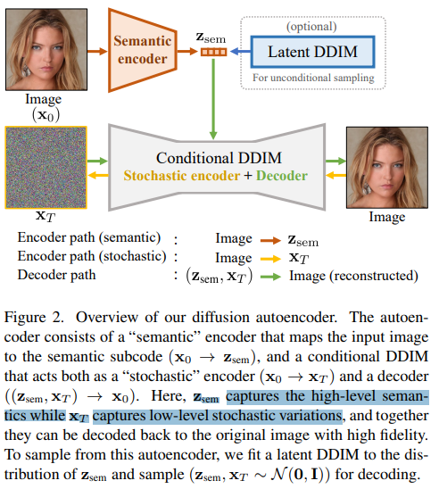

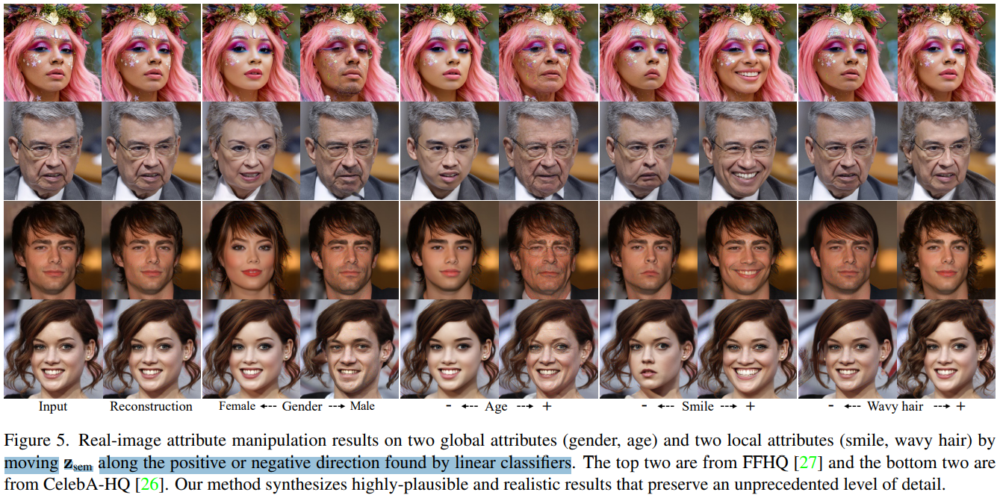

**DDIM**

DDIM uses a non-Markovian inference process. the generative process can be made deterministic, allowing us to deterministically map xT ∼ N (0, I) to x0 and vice versa

### Condition diffusion

主要分为：attention-based mechanisms， adaptive group normalization

- "Diffusion Models Beat GANs on Image Synthesis" NeurIPS, 2021 May :statue_of_liberty:
  [paper](https://arxiv.org/abs/2105.05233) [code](https://github.com/openai/guided-diffusion?utm_source=catalyzex.com)

classifier guidance

## methods

> - Q：数据 GT 怎么得到
>
> - Q：如何 condition
>
> - Q：解耦如何实现？
>
>   use off-the-shelf estimators to encode the input image into encodings of light, shape, camera, face embedding, shadow scalar, and background image

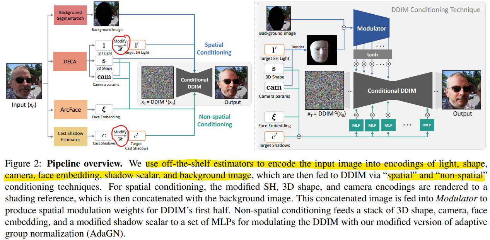

框架参考 DiffAE：利用 DDIM 确定性采样的特点（x0 确定地映射到 xt），对图像解耦，用 sematic encoder 去提取 high-level 特征，xT 作为 low-level 特征，通过用学习到的 high-level 特征 zsem 作为 condition 能够实现高质量重建！

 对 high-level 的 condition 特征分为：spatial conditing 为主要是大致骨架结构 & 背景，也有人物 ID 信息（3D shape）；non-spatial conditing 为人物 ID 细节，描述细节（3D shape + 人脸 embedding + shadow）

1. 用现成的网络去提取亮度特征，人脸细节特征作为 condition
2. 提出 conditioning technique
3. 自重建的方式训练 For training, we use a standard diffusion objective to reconstruct training images :star:
4. relight 编辑：从图像通过 DDIM 确定地得到 zT；对于 condition 的亮度特征进行编辑，**直接拿另一张参考图像用训练网络提取亮度特征，作为目标亮度**

- motivation

  收到 DiffAE 中特征解耦的启发，对亮度特征进行编辑，再重建；问题在于如何解耦出来亮度特征

  

> such image encoding yields xT that contains little semantic information about the input image x0 and propose to condition the DDIM also on a learnable latent variable z predicted from a separate image encoder.
>
> By **jointly training the image encoder and the DDIM**, the encoded z now captures meaningful semantics, while the encoded **xT** , inferred by reversing the deterministic generative process of the DDIM, **captures the rest of the information not encoded in z**, such as stochastic variations. 
>
> The resulting **latent code (z, xT )** can also be decoded back to the input image nearperfectly using the same conditional DDIM. 对 high-level 特征 z 编辑得到 $z^`$ ，使用 $(z^`, xT)$ 实现编辑

### encode: pretrained model

使用多个预训练模型提取特征，作为 DIffAE condition 的高级特征

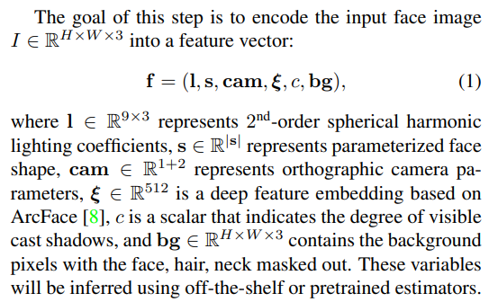

- Light, shape, & camera encodings

  - "DECA: Detailed Expression Capture and Animation" SIGGRAPH, 2021 [code](https://github.com/yfeng95/DECA)

  用于构造人脸 3D 模型，含有亮度信息 :star:

对于目标亮度特征，给一张参考图提取亮度信息，用下面公式得到：

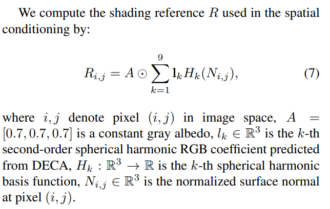

- Identity encoding: ArcFace

- Cast shadow encoding

**This scalar describes the degree of visible cast shadows**, typically caused by a dominant point or directional light source, such as the sun

manually labeled around 1,000 face images with binary flags indicating whether cast shadows are visible. :star: 

1. 方法一 use DiffAE’s pretrained encoder to map each face image to a semantically meaningful latent code z and **train a logistic regression classifier on z** to predict the flag
2. 方法二，直接用 CNN 学

- background

condition the DDIM with an image of the input’s background. The background region is detected using a face segmentation algorithm

### DDIM decoder & Modulator

> **our goals** is to learn a semantically rich latent space that allows smooth interpolation, similar to those learned by GANs, while keeping the reconstruction capability that diffusion models excel

1. DDIM 将 x0 图像加噪到 xT
2. conditioning involves another network called Modulator network, which converts the light, shape, and camera **encodings into spatial modulation weights**
3. 类似 controlNet 预测的是一个权重向量，**区别为不是加过去而是相乘**

- **Q: UNet structure**

UNet 结构参考：

- "Diffusion models beat gans on image synthesis"

a modified UNet built from a stack of residual blocks interleaved with self-attention layers 具体见 Appendix

改进：见下面 conditing decoder 的图

1. res-block 用 condition 预测的权重调制

2. adaptive group normalization

3. **Our Modulator network has the same architecture as the first half of our DDIM’s UNet**

   ControlNet 类似方式

   > The Modulator has the same architecture and hyperparameters as the first half of conditional DDIM but without the non-spatial and spatial conditioning.

### Conditioning decoder

spatial condition 是这里的 mi，特征用 Modulator 得到（ControlNet方式复制一个 UNet encoder）；

Ki 为 non-spatial condition ，特征通过 MLP 得到，t 为 time-embedding

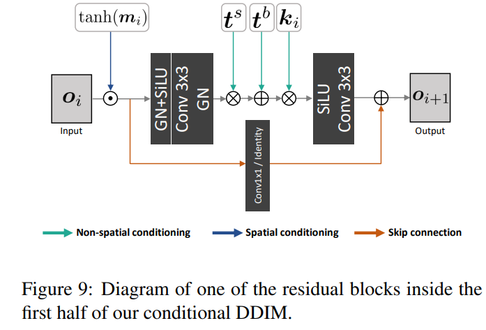

**Spatial conditioning**

构造一个目标光照下的人脸参考图： shading reference R, which shows a shaded face in the shape and pose of the input person under the target lighting

output of each residual block i $o_i \in \mathcal{R}^{H_i \times W_i \times D_i}$ in the **Modulator network by $m_i \in \mathcal{R}^{H_i \times W_i \times D_i}$** 。

**对应元素乘一下更新残差的输出**

**Non-spatial conditioning**

> 结构看 appendix C

先 GroupNorm 完，乘一个加一个 $AdaGN(h, y) = y_s* GroupNorm(h)+y_b,$ 

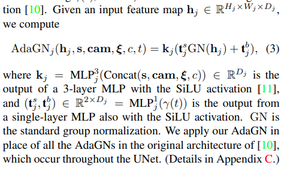

**直接使用 MLP + SiLU 组合去提取特征向量 ok**

一维向量 1x512

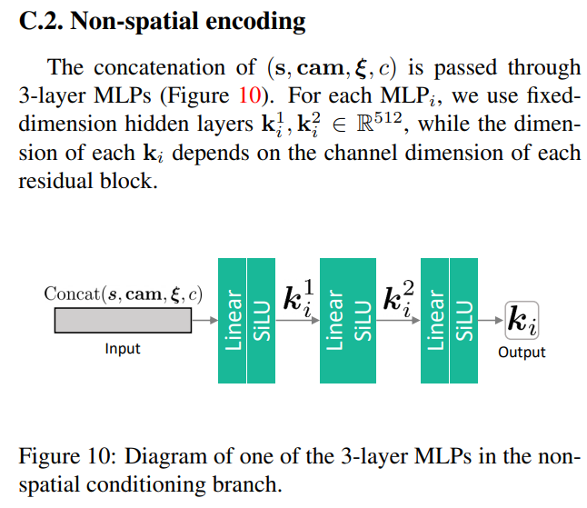

### Training & edit

**jointly train** the DDIM decoder, parameterized as a noise prediction network ϵθ and the Modulator network Mϕ(l, s, cam, bg)  **using standard diffusion training**

- **Q: modulator 如何训练？**

  用 diffusion 训练方式（DiffAE training）一起**自重建训练** :star:

semantic encoder （把预训练模型的特征再转化一下）learns to map an input image x0 to a semantically **meaningful** $z_{sem}$. （代表 high-level 特征）

> Unlike in other conditional DPMs [23, 32, 45] that use spatial conditional variables (e.g., 2D latent maps), our **zsem is a non-spatial vector of dimension d = 512, which resembles the style vector in StyleGAN** 

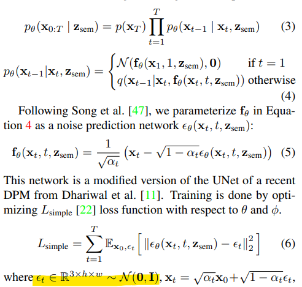

**edit**

标准 diffusion 加噪去噪方式得到 xT

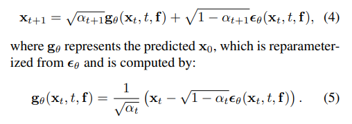

- **Q：测试时候对特征怎么进行编辑不破坏特征？**

  直接**拿一个参考图像**，用**预训练模型 DECA 提取亮度特征** or 手动指定（看一下亮度特征的表示）

> modify the SH light encoding l and the cast shadow flag c to the target l ′ and c ′ , which can be set manually or inferred from a reference lighting image using DECA and our cast shadow estimator

**The reverse process to obtain xT is key** to reproducing high-frequency details from the input image :star:

- Q: 发现当原始图像有极端的亮度，DDIM 重建出来改变了图像的整体亮度，不只是人脸 :star:

  alleviate this issue by **computing the mean pixel difference between each xt** during DDIM’s generative reversal (x0 → xT )

  把这个信息加入到 decoder 中！

## Experiment

> ablation study 看那个模块有效，总结一下

- setting

  - 128×128 resolution. four Nvidia RTX2080Ti around 1 day using batch size 32
  - 256×256 resolution. We used **four Nvidia V100s** for training and one Nvidia RTX2080Ti for testing. The training took **around 8 days** using batch size 20

  分辨率越大训得要更久

**主观效果**

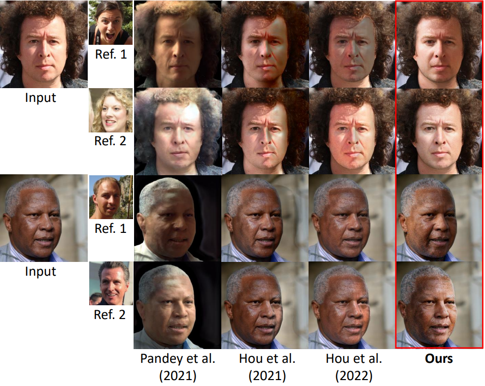

Multi-PIE dataset

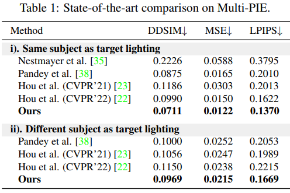

**Ablation Study**

使用 AdaN 方式调制，可以控制阴影强度

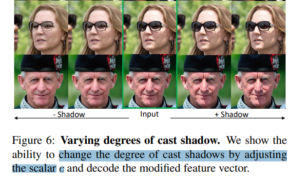

需要背景区域同时输入，也含有含有光照信息 or 人脸信息 （预训练网络只分割出人脸，帽子没考虑）

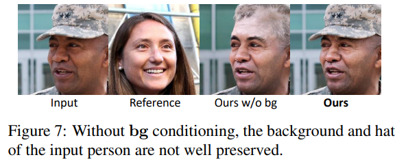

## Limitations

1. 不同光照下只对人脸光照改变，没考虑背景，不搭
2. 预训练模型提取的特征有误差，非阴影区域错误识别为 shdaow；生成出来不是很真实

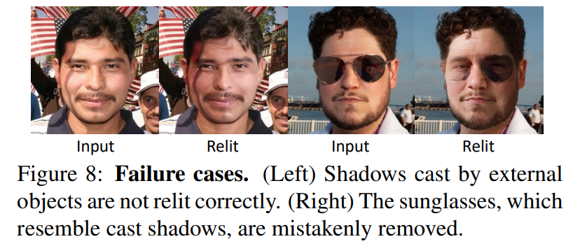

## Summary :star2:

> learn what & how to apply to our task

1. DiffAE + DDIM 可以将图像解耦为 high-level 特征 $z_{sem}$ ，由图像确定地得到的 low-level 特征 zT（DDIM 性质，图像能够唯一映射到 zT），有出色的重建效果

2. 编辑任务，缺少数据时候，可以用特征分解 + 自重建方式训练；在测试时候对特征进行编辑即可（用另一张参考图去用预训练模型提取光照特征，替换掉原图的光照特征）

3. 类似 StyleGAN style-feature, Semantic Encoder 出来的特征 1x512 含有足够多的信息？

   **The reverse process to obtain xT is key** to reproducing high-frequency details from the input image :star: 

   condition 只能起到辅助，需要 xT 保留了很多 low-level 信息，xT 是重建质量的关键！

4. condition 方式：attention-based, AdaIN 方式:star:

   1. 预训练模型提取有效的图像特征 :star:
   2. **用类似 ControlNet 方式（复制一个 UNet 的 encoder ）去预测一个权重，乘到 res-block 的输出上(AdaIN 方式)**
   3. 直接 condat 使用 MLP + SiLU 组合去提取特征向量 ok

   

