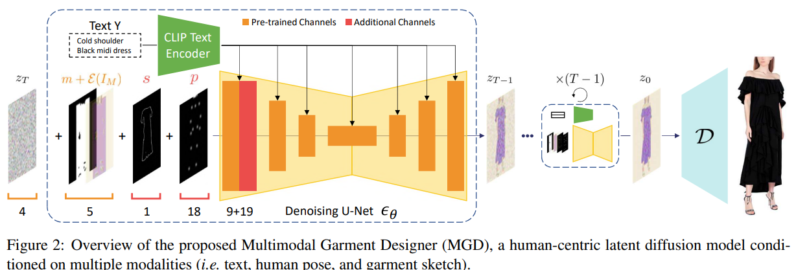
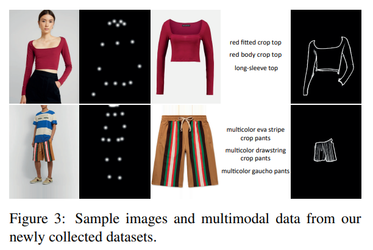
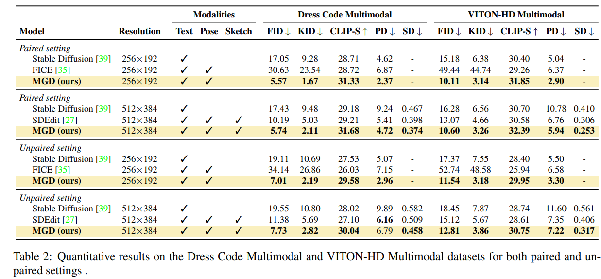
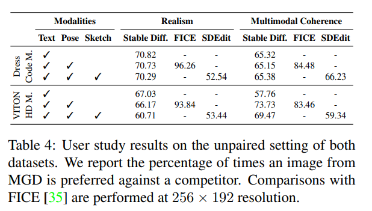

# Multimodal Garment Designer: Human-Centric Latent Diffusion Models for Fashion Image Editing

> "Multimodal Garment Designer: Human-Centric Latent Diffusion Models for Fashion Image Editing" ICCV, 2023 Apr 4
> [paper](http://arxiv.org/abs/2304.02051v2) [code](https://github.com/aimagelab/multimodal-garment-designer) [pdf](./2023_04_ICCV_Multimodal-Garment-Designer--Human-Centric-Latent-Diffusion-Models-for-Fashion-Image-Editing.pdf) [note](./2023_04_ICCV_Multimodal-Garment-Designer--Human-Centric-Latent-Diffusion-Models-for-Fashion-Image-Editing_Note.md)
> Authors: Alberto Baldrati, Davide Morelli, Giuseppe Cartella, Marcella Cornia, Marco Bertini, Rita Cucchiara

## Key-point

- Task: virtual try-on

- Problems

  - 多个模态同时做 try-on

  > Differently from previous works that mainly focused on the **virtual try-on of garments,** we propose the task of multimodal-conditioned fashion image editing, guiding the generation of human-centric fashion images by following multimodal prompts, such as text, human body poses, and garment sketches. 

- :label: Label:

## Contributions

- Diffusion 做 virtual try-on

> We tackle this problem by proposing a new architecture based on latent diffusion models, an approach that has not been used before in the fashion domain. 

- 训练数据集

> we also extend two existing fashion datasets, namely Dress Code and VITON-HD, with multimodal annotations collected in a semi-automatic manner

- SOTA

## Introduction

## methods

### data

> we start from two recent high-resolution fashion datasets introduced for the virtual try-on task, namely Dress Code [30] and VITON-HD [7], and extend them with textual sentences and garment sketches. Both datasets include image pairs with a resolution of 1024 × 768, each composed of a garment image and a reference model wearing the given fashion item.

搞了一个标注的 pipeline

> In this section, we introduce a framework to semi-automatically annotate fashion images with multimodal information

## setting

> In our work, we leverage the Stable Diffusion model [39], a text-to-image implementation of LDMs as a starting point to perform multimodal conditioning for human-centric fashion image editing. 

1 个 A100 训练 15w it

> All models are trained on the original splits of the Dress Code Multimodal and VITONHD Multimodal datasets on a single NVIDIA A100 GPU for 150k steps,

## Experiment

> ablation study 看那个模块有效，总结一下

user-study

## Limitations

## Summary :star2:

> learn what

### how to apply to our task

