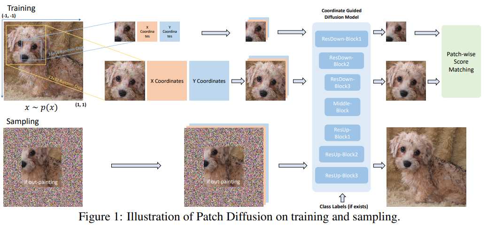
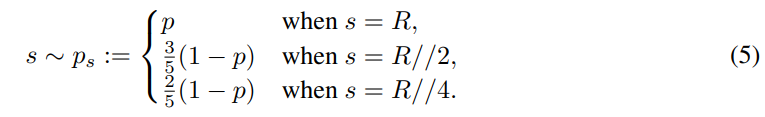
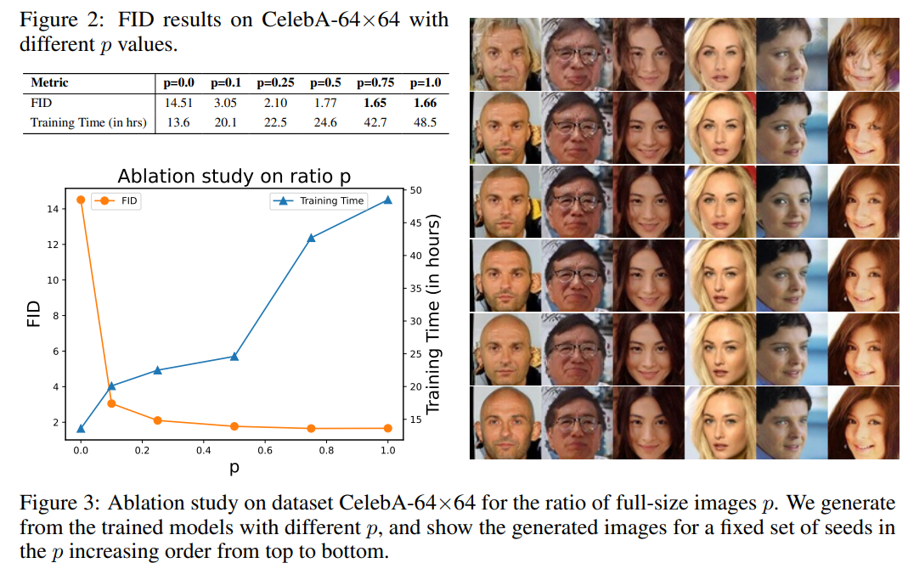
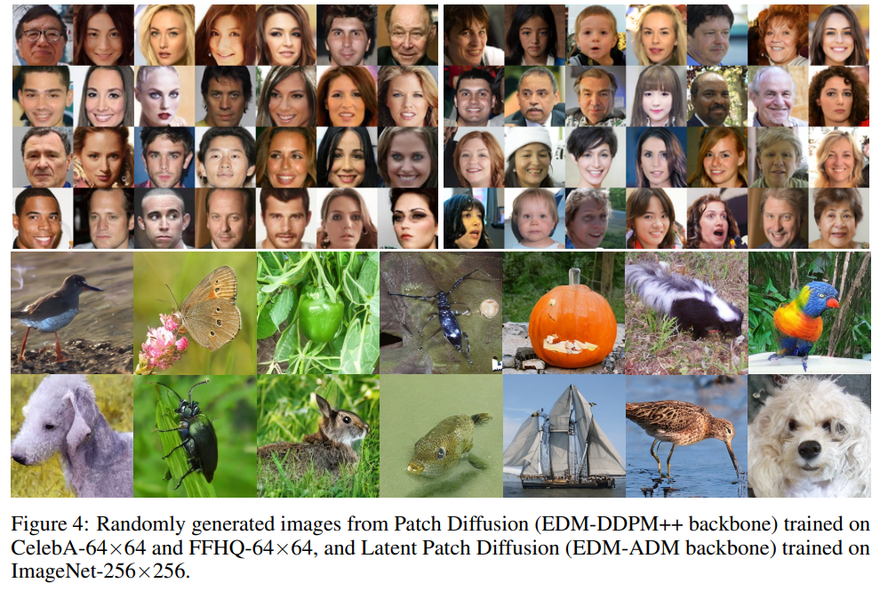
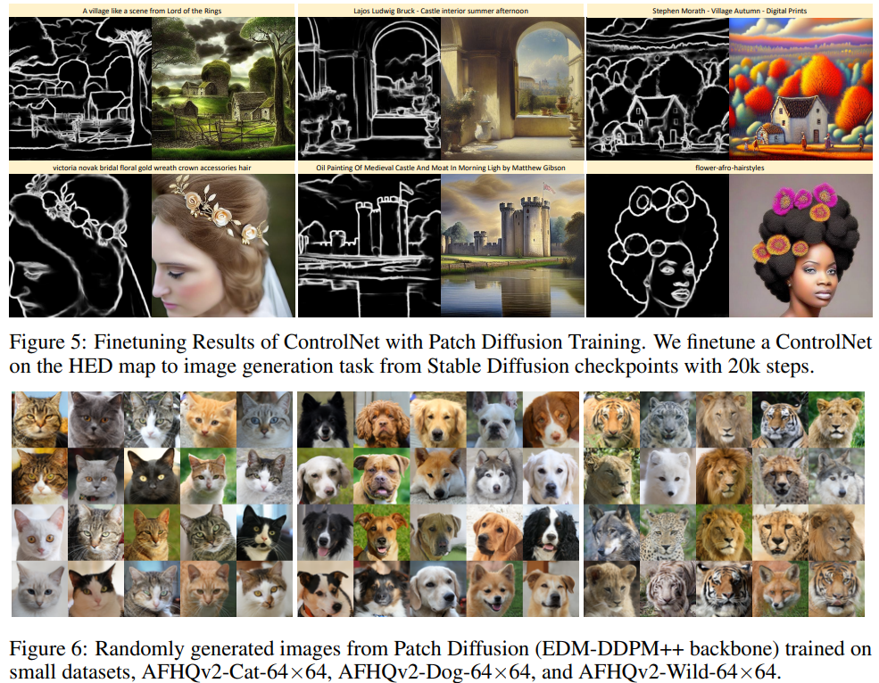
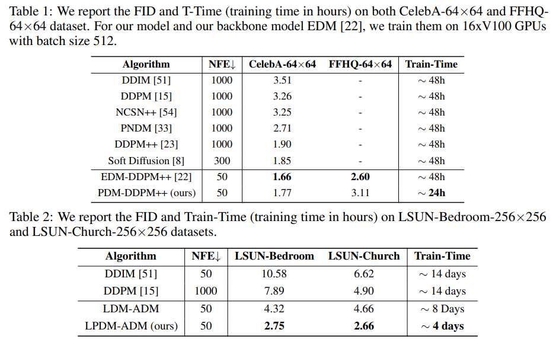
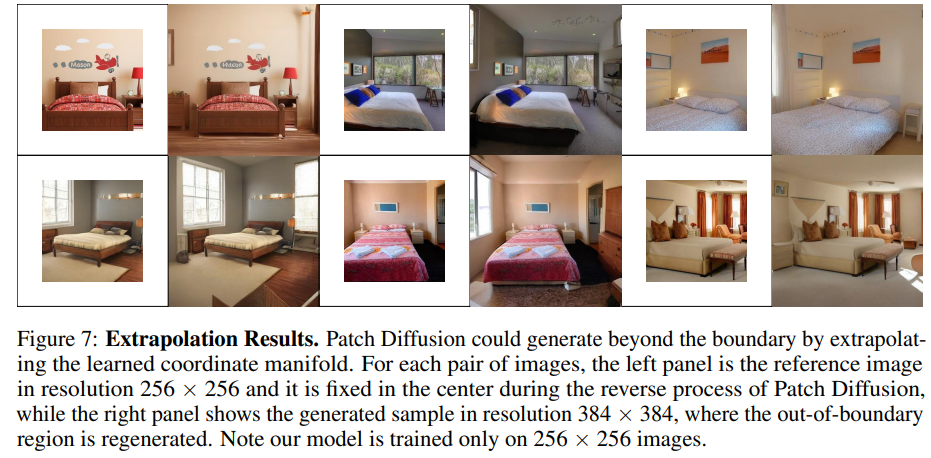

# Patch Diffusion: Faster and More Data-Efficient Training of Diffusion Models

> "Patch Diffusion: Faster and More Data-Efficient Training of Diffusion Models" NIPS, 2023 Apr 25
> [paper](http://arxiv.org/abs/2304.12526v2) [code](https://github.com/Zhendong-Wang/Patch-Diffusion.) [pdf](./2023_04_NIPS_Patch-Diffusion--Faster-and-More-Data-Efficient-Training-of-Diffusion-Models.pdf) [note](./2023_04_NIPS_Patch-Diffusion--Faster-and-More-Data-Efficient-Training-of-Diffusion-Models_Note.md)
> Authors: Zhendong Wang, Yifan Jiang, Huangjie Zheng, Peihao Wang, Pengcheng He, Zhangyang Wang, Weizhu Chen, Mingyuan Zhou

## Key-point

- Task: generic patch-wise training framework
- Problems
- :label: Label:

## Contributions

- 提出 diffusion patch-wise 训练框架，提升 diffusion 训练效率

> We propose Patch Diffusion, a generic **patch-wise training framework**, to significantly **reduce the training time costs while improving data efficiency**, which thus helps democratize diffusion model training to broader users.

- 提出 patch-wise condition score function

> conditional score function at the patch level, where the patch location in the original image is included as additional coordinate channels, while the patch size is randomized and diversified throughout train

- SOTA

> sion, we could achieve ≥ 2× faster training, while maintaining comparable or better generation quality. Patch Diffusion meanwhile improves the performance of diffusion models trained on relatively small datasets, e.g., as few as 5,000 images to train from scratch

## Introduction

### score-based generative model

- "Elucidating the design space of diffusion-based generative models"

### Resource-efficient training in generative models

- mode collapse given limited training data

- "COCO-GAN: Generation by Parts via Conditional Coordinating" ICCV, 2019 
  [paper](https://arxiv.org/abs/1904.00284)

## methods

- Q：只用 patch 训练，缺少 global consistency

> However, the challenge now lies in that the score function sθ(x, σt, i, j, s) has only seen local patches and may have not captured the global cross-region dependency between local patches, in other words, the learned scores from nearby patches should form a coherent score map to induce coherent image sampling.

1. random patch size

2. 用少量的 full-size 图像（Trick）

   > in some iterations during training, full-size images are required to be seen

> To resolve this issue, we propose two strategies: 1) random patch sizes and 2) involving a small ratio of full-size images

- Q： Section 4.1 to show the impact of the ratio of full images？

TODO

### patch-size scheduling

设置概率 p 为多少 iteration 比例使用原始 full-resolution image, R 为原始图像分辨率；实验发现 p=0.5 能保持效率 & 生成质量平衡

1. Stochastic: During training, we randomly sample s ∼ ps for each mini-batch with the probability mass function defined in Equation (5)
2. Progressive: We train our conditional score function from small patches to large patches.

> Empirically, we find that p = 0.5 with stochastic scheduling reaches a sweet point in the trade-off between training efficiency and generation quality

### Conditional Coordinates

参考 COCO-GAN 引入坐标，noramlize 左上角 `(-1,-1)`，右下角 `(1,1)`

> We normalize the pixel coordinate values to [−1, 1] with respect to the original image resolution, by setting the upper left corner of the image as (−1, −1) while the bottom right corner as (1, 1).
>
> - "COCO-GAN: Generation by Parts via Conditional Coordinating" ICCV, 2019 
>   [paper](https://arxiv.org/abs/1904.00284)

把坐标当作两个通道，一起输入，denoiser 模型去噪结果计算 loss 的时候忽略掉这两个坐标通道

> As shown in Figure 1, for any image patch xi,j,s, we **extract its i and j pixel coordinates as two additional channels**. For each training batch, we independently randomly crop each data sample with a sampled patch size for the batch and extract its corresponding coordinate channels. We concatenate the two coordinate channels with the original image channels to form the input of our denoiser Dθ

## setting

自己从头训练一个 diffusion

- We adopt the EDM-Sampling strategy with 50 deterministic reverse step

> We implement our Patch Diffusion on top of the current state-of-the-art Unet-based diffusion model EDM-DDPM++ [22] and EDM-ADM [22].

- 16 张 V100 with a batch size of 512 for a duration of 200 million images.

> We train all models on 16 Nvidia V100 GPUs with a batch size of 512 for a duration of 200 million images.

- Datset

> CelebA (∼200k images) [34], FFHQ (70k images) [20], LSUN (∼200k images) [63], and ImageNet (∼1.2 million images) [9] as our large datasets, and AFHQv2-Cat/Dog/Wild (∼5k images in each of them) [7] as our small datasets.

- Metrics
  - FID( Fréchet Inception Distance)
  - For the **sampling time**, we use the number of function evaluations (NFE) as a measure.

模型在 0.2b 个图像上训练确保收敛。。

> Unless specified otherwise, all models are trained with a duration of 200 million images to ensure convergence

## Experiment

> ablation study 看那个模块有效，总结一下

### Ablation: Impact of full-size images. :star:

训练时候用多少比例 full-size 图像，同时要实现降低一些训练时间 :star:

> We first study the main effect of p, **the ratio of full-size images during training**, regarding the quality of generated examples and the training cost. 

分析：CelebA 这种一张图就是个单个内容，取**patch 太小不包含完整物体内容，很影响质量**，FID 差距很大的！！！:star:

1. patch 超级小，FID 超级辣鸡，但还是有一部分合理输出

> 16 × 16 and 32 × 32 image patches, without the knowledge of how the full-size images look like. The FID is reasonably unsatisfactory while we still observe some coherently sampled images,

- 对于 patch 可能存在**单个 patch 包含物体不完整，生成很拉的情况**：用完整图像训练一下，FID 能提升很多；全部用完整图像训练效率贼低，
- p=0.5 效果还可以，要用一张图 FID & 训练时间的表说明一下:+1:

### Large-scale Dataset

SD 用这个训练方式，能够节省大量训练时间

> We also combine our method with the Latent Diffusion [45] framework to achieve dramatic reduction in training time cost for high-resolution image synthesis, such as LSUN-Bedroom/Church-256×256 [63] and ImageNet-256×256 [9]

CFG=1.3

> Following the classifier-free diffusion guidance (CFG) [14], during training, we r**andomly drop 10% of the given class labels,** and during **sampling, we use strength 1.3 for applying CFG, cfg=1.3.**

- **在大的数据集上**，EDM-DDPM++ 和 SD 使用 patch 训练的效果

- finetune ControlNet
- 在小数据集，上训练的效果

- 在大小数据集上，生成质量 FID & 训练时间

- inpaint 实验

## Limitations

## Summary :star2:

> learn what

### how to apply to our task

- 对于 patch 可能存在**单个 patch 包含物体不完整，生成很拉的情况**：用完整图像训练一下，FID 能提升很多；
- p=0.5 效果还可以，要用一张图 FID & 训练时间的表说明一下:+1:
  - 一个模型训练时间控制在 50h。。。<= 3 days!! 这个实验做了 20 天。。。**要尽快写论文，有很多实验要做。。。**

