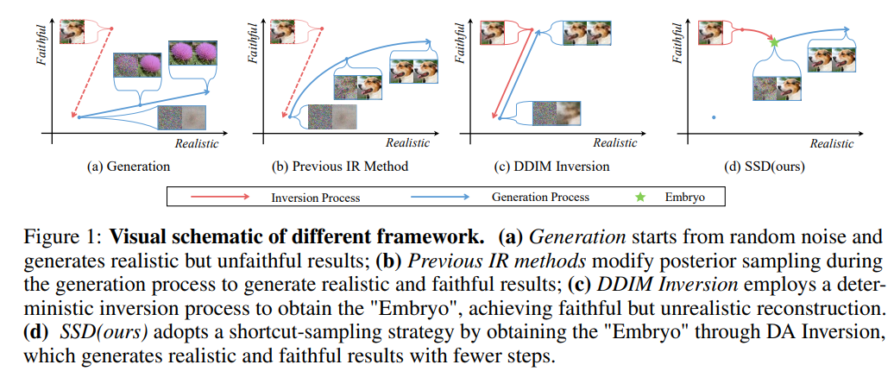
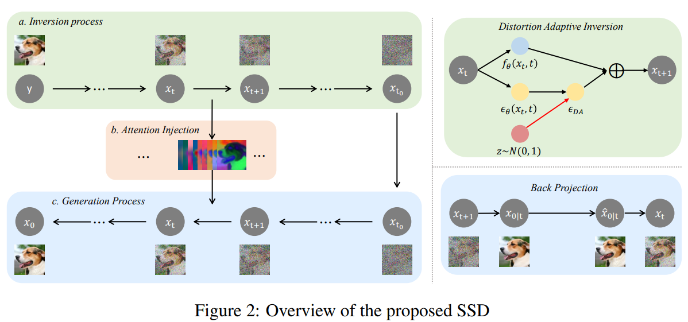

# Accelerating Diffusion Models for Inverse Problems through Shortcut Sampling

> "Accelerating Diffusion Models for Inverse Problems through Shortcut Sampling" Arxiv, 2023 May
> [paper](http://arxiv.org/abs/2305.16965v1) [code](https://github.com/GongyeLiu/SSD) 
> [pdf](./2023_05_Arxiv_Accelerating-Diffusion-Models-for-Inverse-Problems-through-Shortcut-Sampling.pdf)
> Authors: Gongye Liu, Haoze Sun, Jiayi Li, Fei Yin, Yujiu Yang

## Key-point

- Task: Image Restoration(SR, colorization, deblur), Diffusion 加速
- Problems
- :label: Label:

Instead of initiating from random noise, the key concept of SSD is to find the "Embryo",

1. "shortcut" path in forward pass: Distortion Adaptive Inversion (DA Inversion)
2. apply back projection and attention injection as additional consistency constraints

## Contributions

## Introduction

## methods

## Experiment

> ablation study 看那个模块有效，总结一下

## Limitations

## Summary :star2:

> learn what & how to apply to our task

