# Exploiting Diffusion Prior for Real-World Image Super-Resolution

> "Exploiting Diffusion Prior for Real-World Image Super-Resolution" IJCV, 2023 May->**2024 Jun,** **StableSR**
> [paper](https://arxiv.org/abs/2305.07015) [web](https://iceclear.github.io/projects/stablesr/?utm_source=catalyzex.com) [code](https://github.com/IceClear/StableSR) [pdf](./2023_05_IJCV_Exploiting-Diffusion-Prior-for-Real-World-Image-Super-Resolution.pdf) [note](./2023_05_Arxiv_Exploiting-Diffusion-Prior-for-Real-World-Image-Super-Resolution_Note.md) 
>Authors: [Jianyi Wang](https://arxiv.org/search/cs?searchtype=author&query=Wang,+J), [Zongsheng Yue](https://arxiv.org/search/cs?searchtype=author&query=Yue,+Z), [Shangchen Zhou](https://arxiv.org/search/cs?searchtype=author&query=Zhou,+S), [Kelvin C.K. Chan](https://arxiv.org/search/cs?searchtype=author&query=Chan,+K+C), [Chen Change Loy](https://arxiv.org/search/cs?searchtype=author&query=Loy,+C+C)

## **Key-point**

- Task: blind img SR
- Problems
  - 纹理真实 vs 可信度的调整

- :label: Label: 

## **Contributions**

- 实现一个参数控制 纹理一致性 vs 可信度

> To remedy the loss of fidelity caused by the in herent stochasticity of diffusion models, we employ a controllable feature wrapping module that allows users to balance quality and fidelity by simply adjust ing a scalar value during the inference process.

- Patch 不一致问题 ，提出 aggregation sampling

> Moreover, we develop a progressive aggregation sampling strategy to overcome the fixed-size constraints of pretrained diffusion models, enabling adaptation to resolutions of any size

- SOTA

## **Related Work**

- DIP, SinGAN

- "Exploiting Deep Generative Prior for Versatile Image Restoration and Manipulation" ECCV oral&PAMI, 2020 Mar, DGP(Deep Generative Prior) :statue_of_liberty:
  [paper](https://arxiv.org/abs/2003.13659) [video](https://www.youtube.com/watch?v=p7ToqtwfVko) :+1: 

  > DGP exploits the image prior of an off-the-shelf GAN for various image restoration and manipulation. DGP effective way to **exploit the image prior captured by a generative adversarial network (GAN)** trained on large-scale natural images.
  > we allow the **generator to be fine-tuned on-the-fly** in a progressive manner.
  >
  > GAN-inversion 由于 model capacity 等限制，只能修复大致的 latent code 但生成效果并不好；**类似 Bring Old Photo 论文，GT 和 GAN 生成的数据分布类似，但还有距离**
  >
  > 1. 因为要**对 generator finetune**，使用 MSR + perceptual loss 会 wipe out image prior 损害先验信息，生成的效果不行。
  > 2. **用 discriminator loss 来表示和 GT 分布的距离。**直接 finetune 整个 encoder 会导致 `information lingering artifact`（上色区域和物体不一致）, 分析因为深层的 encoder 没处理好 low-level 细节，就去 align high-level 的颜色
  >
  > 提出 Progressive Reconstruction 一种 finetune 策略 >> 由浅到深依次解冻 encoder 去 finetune
  >
  > - Experiment
  >
  >   `BigGAN` on ImageNet 用于 finetune。Colorization, inpainting, SR
  >
  >   Remove most adversarial perturbation (adversarial defense)
  >
  >   映射到 latent space 来进行修改，除了修复也可以加 random noise 实现 jittering、Image Morphing(融合两幅图像，类似插值)

Image SR 需要 high image fidelity, 直接用 diffusion ，会有生成随机性的影响

1. 用 LR 作为条件 finetune diffusion >> 使得 diffusion 特征损坏
2. assumes knowing the image degradations a priori 直接去噪 >> 预先不知道 degradation 类型

## **methods**   

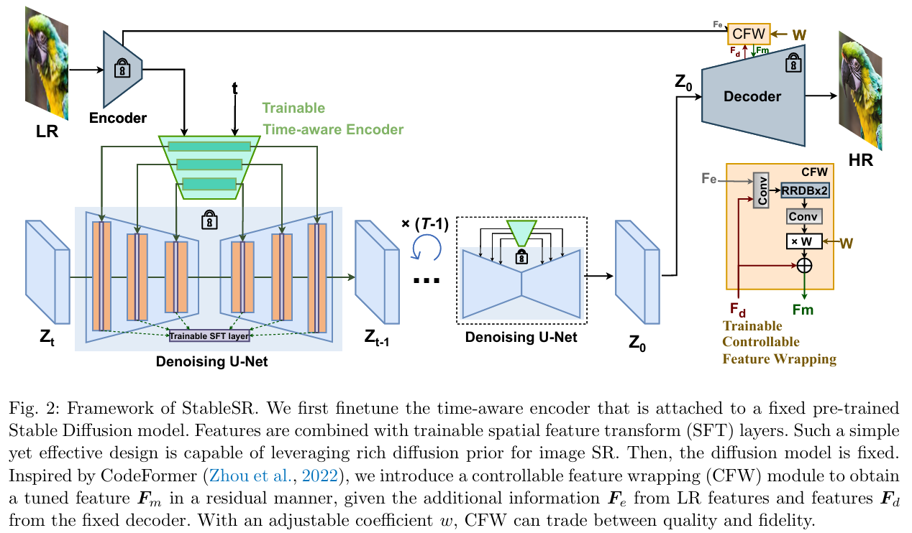

搞了一个类似 Controlnet 的模块进行控制

> We first finetune the time-aware encoder that is attached to a fixed pre-trained Stable Diffusion model. 

搞了一个新的 LR Encoder 用于调制 Diffusion 的特征，想把 Diffusion 作为 Prior 用起来

> Features are combined with trainable spatial feature transform (SFT) layers. Such a simple yet effective design is capable of leveraging rich diffusion prior for image SR. 

### SFT layer 

用一个 encoder 对 LR 提取特征，来去调制 Diffusion 的中间特征

> To more accurately guide the generation process, we adopt an additional encoder to extract multi-scale features {F n} N n=1 from the degraded LR image features

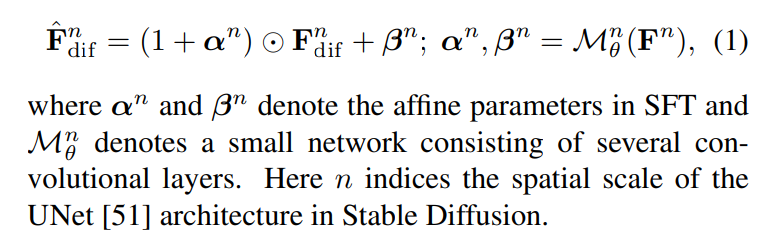

a) 比较 SFT 调制（加了 LR Encoder 特征）前后的特征相似度，看 controlnet 加上 timestep 还是有点用的

b）可视化了一下各个去噪步数的中间特征，在 SNR 5e-2 附近效果还可以

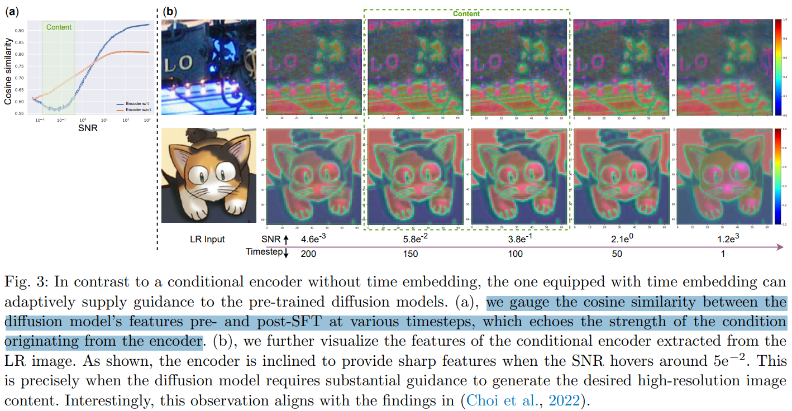

### Color Correction

Patch 存在色差，实际上还有纹理不一致，动画没暴露出来；用 LR 图像 RGB 每个通道得均值和方差，归一化一下。。。

> In particular, if we let x denote the LR input and yˆ represent the generated HR image, the color-corrected output, y, is calculated as follows:

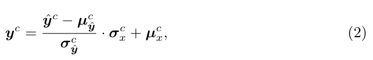

效果不好，**用 Wavelet 转到频域再做一下**，就是很常见的 color correction。。。每次把 LR 加个模糊核 -> residual 就是高频，循环5次得到低频

> Though pixel color correction via channel matching can improve color fidelity, we notice that it may suffer from limited color correction ability due to the lack of pixel-wise controllability
>
> The main reason is that it only introduces global statistics, i.e., channel-wise mean and variance of the input for color correction, ignoring pixel-wise semantics. Besides adopting color correction in the pixel domain, we further propose waveletbased color correction for better visual performance in some cases.
>
> Wavelet color correction directly introduces the low-frequency part from the input since the color information belongs to the low-frequency components, while the degradations are mostly high-frequency components. In this way, we can improve the color fidelity of the results without perceptibly affecting the generated quality. 

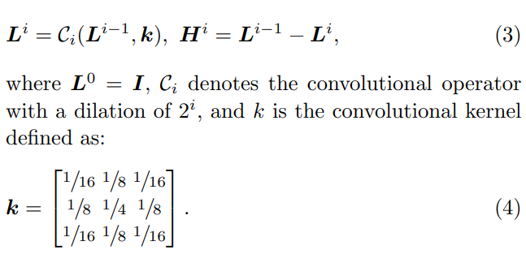

### Aggregation Sampling

传统 CNN 网络分 patch 每个在 RGB 合起来就好了，diffusion 有随机性，在 RGB 合起来效果烂

> A common workaround involves splitting the larger image into several overlapping smaller patches and processing each one individually. While this strategy often yields good results for conventional CNN-based SR methods, it is not directly applicable in the diffusion paradigm. 
>
> - "Mixture of diffusers for scene composition and high resolution image generation"

先把 LR 过 VAE 得到特征，**对 VAE 特征分 overlapping 的 64x64 patch**；

> Inspired by AB. Jimenez [4], we apply a progressive ´ patch aggregation sampling algorithm to handle images of arbitrary resolutions. **Specifically, we begin by encoding the low-resolution image into a latent feature map, which is then subdivided into multiple overlapping small patches**, each with a resolution of 64 × 64 - matching the training resolution.

- Q：overlap 区域咋合起来？ :star:

每一个 patch 的 overlap 区域根据 gaussian filter map 获取权重？？

> To integrate overlapping patches, **a weight map wΩn ∈ Rh×w whose entries follow up a Gaussian filter in Ωn** and 0 elsewhere is generated for each patch FΩn . Overlapping pixels are then weighted in accordance with their respective Gaussian weight maps. 
>
> In particular, we follow Jim´enez (Jim´enez, 2023) to define a padding function f(·) that expands any patch of size 64 × 64 to the resolution of h × w by filling zeros outside the region Ωn. 

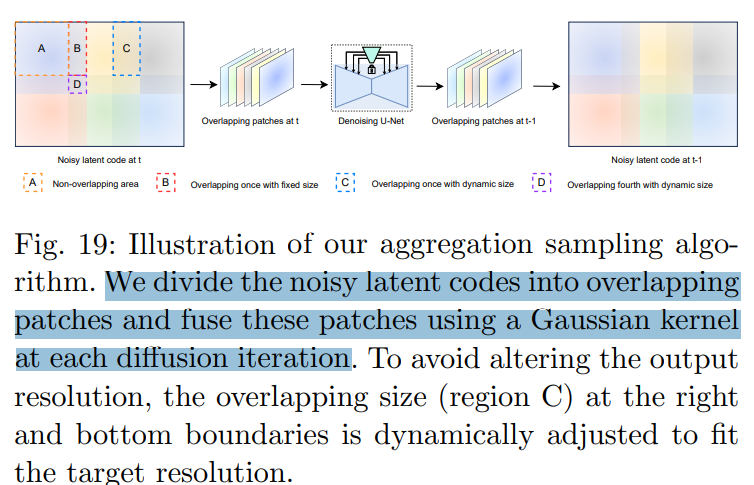

- Q：RealSR 怎么处理 patch 之间不一致性？

  对整张 LR 计算 VAE 特征（整图的特征）；**在 VAE 特征 chop 为重叠的 64x64 patch 特征** $F_{\Omega i}$ (拿 512x512 训练，VAE x8 scale，zt 大小 64x64)；去噪一步的 $F_{\Omega i}$，padding 到 hxw 大小；搞一个 weight map $W_{\Omega i}$ 作为权重，对所有 patch 的 zT 特征加权平均，合成整张图的 zT；

> For each patch FΩn , we generate a weight map wΩn ∈ Rh×w whose entries follow up a Gaussian filter in Ωn and 0 elsewhere.
>
> we define a padding function f(·) that expands any patch of size 64×64 to the resolution of h×w by filling zeros outside the region Ω.

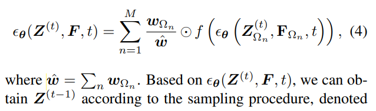

效果

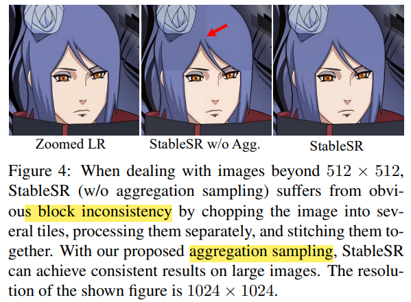

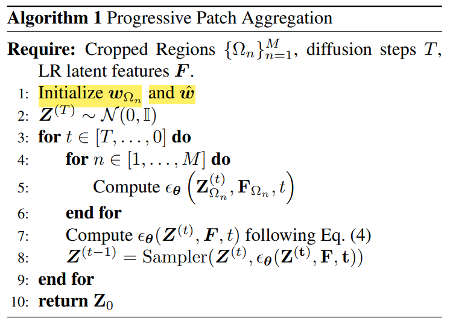

## Setting

- Stable Diffusion 2.1-base

  - DDPM sampling [26] with 200 timesteps
  - SFT layers are inserted in each residual block of Stable Diffusion
  - finetune the diffusion model of StableSR for 117 epochs with a batch size of 192, and the prompt is fixed as null

  - 没用文本

- LR is 128 × 128，HR is 512 × 512 **（x4 SR）**

  - DA: Real-ESRGAN, rescale 短边为 128 & center crop
  - 使用的 VAE Patch Fusion 策略，支持在 LR=1024x1024 图像推理

  > Note that for StableSR, the inputs are first upsampled to the same size as the outputs before inference

- 训练，8 * V100

  > The training process is conducted on 512 × 512 resolution with 8 NVIDIA Tesla 32G-V100 GPUs.

## Experiment

- 任意分辨率结果，一致性看起来很 ok

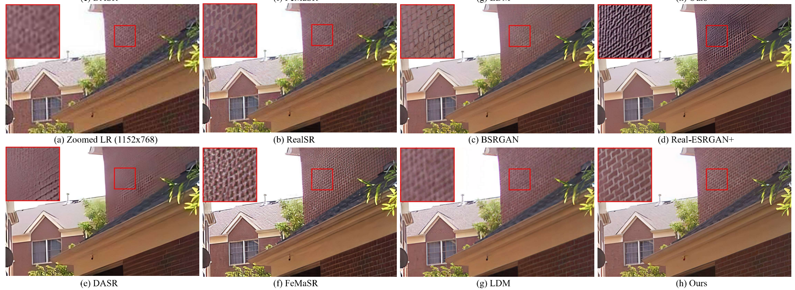

看猫的胡子细节都变了。。。

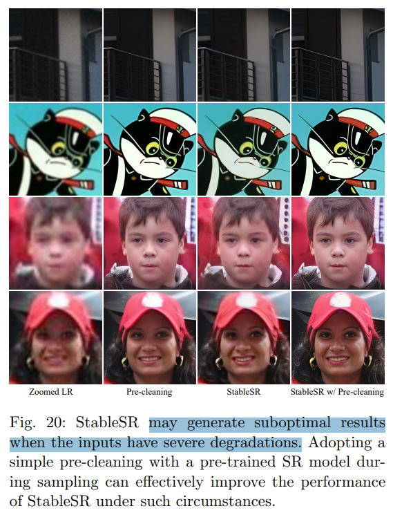

## summary

- Q：StableSR 怎么处理 patch 之间不一致性？

  对整张 LR 计算 VAE 特征（整图的特征）；**在 VAE 特征 chop 为重叠的 64x64 patch 特征** $F_{\Omega i}$ (拿 512x512 训练，VAE x8 scale，zt 大小 64x64)；去噪一步的 $F_{\Omega i}$，padding 到 hxw 大小；搞一个 weight map $W_{\Omega i}$ 作为权重，对所有 patch 的 zT 特征加权平均，合成整张图的 zT；