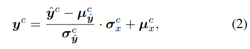

# Exploiting Diffusion Prior for Real-World Image Super-Resolution

> "Exploiting Diffusion Prior for Real-World Image Super-Resolution" Arxiv, 2023 May, **StableSR**
> [paper](https://arxiv.org/abs/2305.07015) [website](https://iceclear.github.io/projects/stablesr/?utm_source=catalyzex.com) [code](https://github.com/IceClear/StableSR) [pdf](./2023_05_Arxiv_Exploiting-Diffusion-Prior-for-Real-World-Image-Super-Resolution.pdf) [note](./2023_05_Arxiv_Exploiting-Diffusion-Prior-for-Real-World-Image-Super-Resolution_Note.md)
>
> [Jianyi Wang](https://arxiv.org/search/cs?searchtype=author&query=Wang,+J), [Zongsheng Yue](https://arxiv.org/search/cs?searchtype=author&query=Yue,+Z), [Shangchen Zhou](https://arxiv.org/search/cs?searchtype=author&query=Zhou,+S), [Kelvin C.K. Chan](https://arxiv.org/search/cs?searchtype=author&query=Chan,+K+C), [Chen Change Loy](https://arxiv.org/search/cs?searchtype=author&query=Loy,+C+C)

## **Key-point**

## **Contributions**

## **Related Work**

- DIP, SinGAN

- "Exploiting Deep Generative Prior for Versatile Image Restoration and Manipulation" ECCV oral&PAMI, 2020 Mar, DGP(Deep Generative Prior) :statue_of_liberty:
  [paper](https://arxiv.org/abs/2003.13659) [video](https://www.youtube.com/watch?v=p7ToqtwfVko) :+1: 

  > DGP exploits the image prior of an off-the-shelf GAN for various image restoration and manipulation. DGP effective way to **exploit the image prior captured by a generative adversarial network (GAN)** trained on large-scale natural images.
  > we allow the **generator to be fine-tuned on-the-fly** in a progressive manner.
  >
  > GAN-inversion 由于 model capacity 等限制，只能修复大致的 latent code 但生成效果并不好；**类似 Bring Old Photo 论文，GT 和 GAN 生成的数据分布类似，但还有距离**
  >
  > 1. 因为要**对 generator finetune**，使用 MSR + perceptual loss 会 wipe out image prior 损害先验信息，生成的效果不行。
  > 2. **用 discriminator loss 来表示和 GT 分布的距离。**直接 finetune 整个 encoder 会导致 `information lingering artifact`（上色区域和物体不一致）, 分析因为深层的 encoder 没处理好 low-level 细节，就去 align high-level 的颜色
  >
  > 提出 Progressive Reconstruction 一种 finetune 策略 >> 由浅到深依次解冻 encoder 去 finetune
  >
  > - Experiment
  >
  >   `BigGAN` on ImageNet 用于 finetune。Colorization, inpainting, SR
  >
  >   Remove most adversarial perturbation (adversarial defense)
  >
  >   映射到 latent space 来进行修改，除了修复也可以加 random noise 实现 jittering、Image Morphing(融合两幅图像，类似插值)

Image SR 需要 high image fidelity, 直接用 diffusion ，会有生成随机性的影响

1. 用 LR 作为条件 finetune diffusion >> 使得 diffusion 特征损坏
2. assumes knowing the image degradations a priori 直接去噪 >> 预先不知道 degradation 类型

## **methods**   

图像 Encoder Decoder 使用 AutoEncoderKL (SD 里面的 VAE) 提取图像特征

### SFT layer 

用一个 encoder 对 LR 提取特征，来去调制 Diffusion 的中间特征

> To more accurately guide the generation process, we adopt an additional encoder to extract multi-scale features {F n} N n=1 from the degraded LR image features

### Color Correction

### Aggregation Sampling

- "Mixture of diffusers for scene composition and high resolution image generation"

在 latent space 分patch融合，解决分 patch 处理 blocking 问题

> 细节见 Appendix

## Experiment

- Stable Diffusion 2.1-base

- SFT layers are inserted in each residual block of Stable Diffusion

- finetune the diffusion model of StableSR for 117 epochs with a batch size of 192, and the prompt is fixed as null

  没有文本也是可以正常出图的

- 