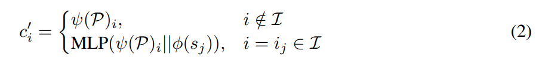
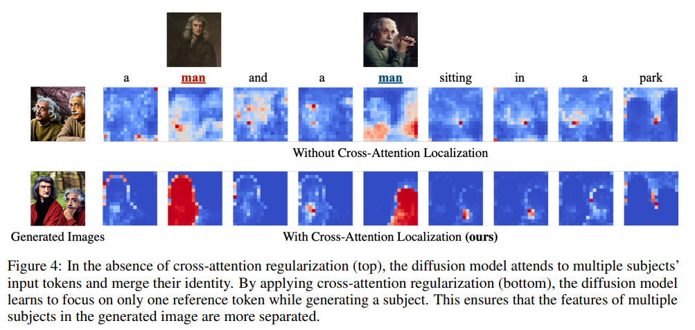
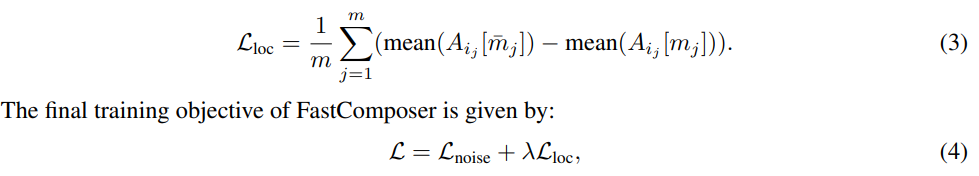
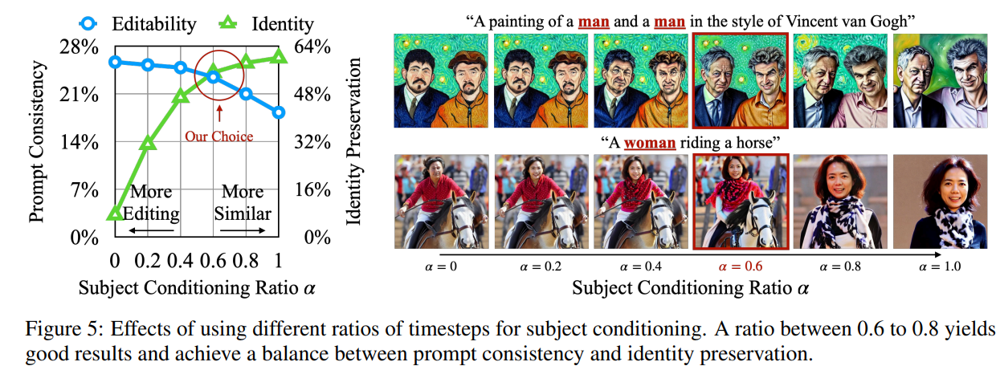
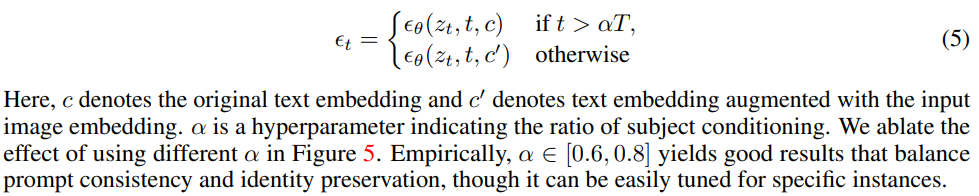
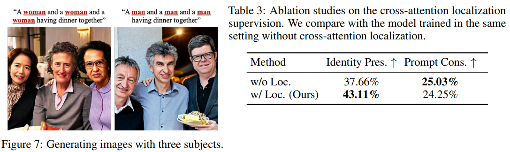

# FastComposer: Tuning-Free Multi-Subject Image Generation with Localized Attention

> "FastComposer: Tuning-Free Multi-Subject Image Generation with Localized Attention" Arxiv, 2023 May 17
> [paper](http://arxiv.org/abs/2305.10431v2) [code](https://github.com/mit-han-lab/fastcomposer.) [pdf](./2023_05_Arxiv_FastComposer--Tuning-Free-Multi-Subject-Image-Generation-with-Localized-Attention.pdf) [note](./2023_05_Arxiv_FastComposer--Tuning-Free-Multi-Subject-Image-Generation-with-Localized-Attention_Note.md)
> Authors: Guangxuan Xiao, Tianwei Yin, William T. Freeman, Frédo Durand, Song Han (MIT)

## Key-point

- Task
- Problems
- :label: Label:

## Contributions

## Introduction

- "Prompt-to-Prompt Image Editing with Cross Attention Control" 
  [code](https://github.com/google/prompt-to-prompt/)

发现 cross attn 决定了 layout


## methods


### use clip image feature augment text fea

对于人物在 text 里面找到对应 token，用 CLIP Image feature 换掉




- Q：看下怎么实现 tune-free?


### Localizing Cross-Attention with Segmentation Masks

- 有工作发现 diffusion 中的 cross-attn map 能够决定最终的 pixel 位置

  > Prior research [12] shows that the cross-attention mechanism within diffusion models governs the layout of generated images. The scores in cross-attention maps represent “the amount of information flows from a text token to a latent pixel.”
  >
  > - "Prompt-to-prompt image editing with cross attention control" ICLR


- Identity Blending 问题（多个人物，没法指定一一人物对应）；**原因分析 -> 先看下 feature map （从不同角度探索一下原因）然后假设一下！！**是因为 cross-attn map 里面单个人物的 token 指向了多个 reference 区域。

> We hypothesize that identity blending arises from the unrestricted cross-attention mechanism, as a single latent pixel can attend to all text tokens. If one subject’s region attends to multiple reference subjects, identity blending will occur.

- 验证假设：可视化 cross-attn map 发现 `man` 确实对应到了多个 reference

> In Figure 4, we confirm our hypothesis by visualizing the average cross-attention map within the U-Net of the diffusion model.
>
> The unregularized model often has two reference subject tokens influencing the same generated person at the same time, causing a mix of features from both subjects.

- 解决方案：对 cross-attn map 使用 seg map 增加一些约束

> We argue that proper cross-attention maps should resemble an instance segmentation of the target image, clearly separating the features related to different subjects
>
> To achieve this, we **add a regularization term to the subject cross-attention maps** during training to encourage focusing on specific instance areas. **Segmentation maps** and cross-attention regularization are only used during training, not at test time



- Q：适用于 latent space?? 

是的，此工作在 SDv1.5 上做的，适用于 VAE 转化到 latent space

> Finally, the VAE decoder D generates the final image by mapping the latent codes back to pixel space xˆ = D(z0).


- Q：怎么约束？:star:

直接认为 cross-attn map 和 segmentation map 接近，**用 seg map 作为 GT cross-attn map**？？效果居然还可以

> We supervise the **cross-attention map Aij** to be close to the segmentation **mask mj of the j-th subject token**,  Aij ≈ mj
>
> We employ a balanced L1 loss to minimize the distance between the cross-attention map and the segmentation mask:



- λ = 0.001


- Q：对 SDv1.5 Unet 中**哪些层的 cross-attn map 约束？**

downsampled cross-attention maps

> we apply the localization loss to the downsampled cross-attention maps, i.e., the middle 5 blocks of the U-Net, which are known to contain more semantic information. 


### Delayed Subject Conditioning



- Q：发现推理的时候所有 timestep 都用，**生成的图像 layout 很垃圾，只有人物了**

> During inference, using the augmented text representation directly often leads to images that closely resemble the subjects while ignoring the textual directives.
>
> 分析
>
> This occurs because the **image layout forms at the early phases of the denoising process**, and premature augmentation from the reference image causes the resulting image to stray from the text instructions.

缓解方案：只对去噪后期的 timestep 使用 CLIP-image fea 替换，来强调细节，一开始还是用原始 text embedding 作为 condition

> Prior methods [10, 30] mitigate this issue by generating an initial latent code and refining it through iterative model finetuning. However, this process is resource-intensive and needs high-end devices for model fine-tuning. Inspired by Style Mixing [18], we propose a simple delayed subject conditioning, which allows for inferenceonly subject conditioning while striking a balance between identity preservation and editability



到去噪接近 0（后期）的一些步数，用 CLIP image 增强的 condition

- Q：确定哪些步数使用原始 text 的超参 $\alpha$ ? 做实验看指标取一个

全部步数使用 CLIP image token 增强的 condition feature ($\alpha=1$)， 出来只有人物了，但一致性稍微好了一些（64%。。。）；如果取后期 60% 步数，人物一致性就更低了。。。**挑出来的图一致性都很拉。。。。**

- 分析：CLIP image embedding 还是有一些一致性的，至少对部分人物很好（挑出来的人物）；**但全部步数都用，layout 不行，说明 cross-attn map 限制区域没到位！** seg map 作为 GT attn map 还是有问题（对其他 token 没有做好？）


## setting

使用 SDv1.5，配的是 `openai/clip-vit-large-patch14`

> To encode the visual inputs, we use OpenAI’s `clip-vit-large-patch14` vision model, which serves as the partner model of the text encoder in SDv1-5


## Experiment

> ablation study 看那个模块有效，总结一下

- seg map 作为 GT cross-attn map loss **至少能确定人物的位置**




## Limitations

- 一致性很拉，人物细节细看完全是不一样的人


## code

### cross-attn score Loss

先看下 `diffusers.models.attention_processor.Attention.get_attention_scores` 实现

> https://vscode.dev/github/mit-han-lab/fastcomposer/blob/mainprocessor.py#L575

- 获取的 attention score 就是 QK 乘积 & Softmax 弄完的 similarity map。后面可视化保存的也是这个 :star:

```python
# Q@(K.T)
attention_scores = torch.baddbmm(
            baddbmm_input,
            query,
            key.transpose(-1, -2),
            beta=beta,
            alpha=self.scale,
        )
del baddbmm_input

# Softmax
if self.upcast_softmax:
attention_scores = attention_scores.float()

attention_probs = attention_scores.softmax(dim=-1)
del attention_scores

attention_probs = attention_probs.to(dtype)
return attention_probs
```


写了一个装饰器，覆写一下 attention_score 方法，保存 attention_scrore 到实例属性中 `self.cross_attention_scores` (内存 id 一样！)

> https://vscode.dev/github/mit-han-lab/fastcomposer/blob/main/fastcomposer/model.py#L440-L448

```python
if self.object_localization:
    self.cross_attention_scores = {}
    self.unet = unet_store_cross_attention_scores(
        self.unet, self.cross_attention_scores, self.localization_layers
    )
    self.object_localization_loss_fn = BalancedL1Loss(
        args.object_localization_threshold,
        args.object_localization_normalize,
    )
```

看下装饰器咋写

> `types.MethodType`本质是一个类，我们**可以通过`types.MethodType(Callable, Object)`的方式将一个可调用的（callable）对象与另一个对象绑定起来**得到一个MethodType对象。
>
> `module.get_attention_scores =types.MethodType(make_new_get_attention_scores_fn(name), module)`

```python
    def make_new_get_attention_scores_fn(name):
        def new_get_attention_scores(module, query, key, attention_mask=None):
            attention_probs = module.old_get_attention_scores(
                query, key, attention_mask
            )
            attention_scores[name] = attention_probs
            return attention_probs

        return new_get_attention_scores

    for name, module in unet.named_modules():
        if isinstance(module, Attention) and "attn2" in name:
            if not any(layer in name for layer in applicable_layers):
                continue
            if isinstance(module.processor, AttnProcessor2_0):
                module.set_processor(AttnProcessor())
            module.old_get_attention_scores = module.get_attention_scores
            module.get_attention_scores = types.MethodType(
                make_new_get_attention_scores_fn(name), module
            )

    return unet
```

> 注意这里保存在 self 的字典里面，要完全删掉，需要按 key 每一个去单独删除
>
> ```python
>     def _clear_cross_attention_scores(self):
>         if hasattr(self, "cross_attention_scores"):
>             keys = list(self.cross_attention_scores.keys())
>             for k in keys:
>                 del self.cross_attention_scores[k]
> 
>         gc.collect()
> ```


- CrossAttn L1 Loss，让 background loss 越小越好，object 相同区域（越大越好）加个负号

```python
class BalancedL1Loss(nn.Module):
    def __init__(self, threshold=1.0, normalize=False):
        super().__init__()
        self.threshold = threshold
        self.normalize = normalize

    def forward(self, object_token_attn_prob, object_segmaps):
        if self.normalize:
            object_token_attn_prob = object_token_attn_prob / (
                object_token_attn_prob.max(dim=2, keepdim=True)[0] + 1e-5
            )
        background_segmaps = 1 - object_segmaps
        background_segmaps_sum = background_segmaps.sum(dim=2) + 1e-5
        object_segmaps_sum = object_segmaps.sum(dim=2) + 1e-5

        background_loss = (object_token_attn_prob * background_segmaps).sum(
            dim=2
        ) / background_segmaps_sum

        object_loss = (object_token_attn_prob * object_segmaps).sum(
            dim=2
        ) / object_segmaps_sum

        return background_loss - object_loss
```


## Summary :star2:

> learn what

- Identity Blending 问题（多个人物，没法指定一一人物对应，先不说一致性，至少别两个人是同一个，还有一个人漏掉）；
  - Motivation，先前有工作**发现 SD 的 cross-attn 中，token 可以对应 map 中的区域！**:star:
  - **原因分析 -> 先看下 feature map （从不同角度探索一下原因）然后假设一下！！**是因为 cross-attn map 里面单个人物的 token 指向了多个 reference 区域。
  - 验证假设：可视化 cross-attn map 发现 `man` 确实对应到了多个 reference
  - 解决方案：对 cross-attn map 使用 seg map 增加一些约束

- **Cross-attn map 使用 seg map 约束，适用于 latent space**；
  此工作在 SDv1.5 上做的，适用于 VAE 转化到 latent space

- Q：确定哪些步数使用原始 text 的超参 $\alpha$ ? 做实验看指标取一个，**说明使用 seg map 作为 GT attn map 还是有问题**

  全部步数使用 CLIP image token 增强的 condition feature ($\alpha=1$)， 出来只有人物了，但一致性稍微好了一些（64%。。。）；如果取后期 60% 步数，人物一致性就更低了。。。

  分析：CLIP image embedding 还是有一些一致性的，至少对部分人物很好（挑出来的人物）；**但全部步数都用，layout 不行，说明 cross-attn map 限制区域没到位！** seg map 作为 GT attn map 还是有问题（对其他 token 没有做好？）


### how to apply to our task

