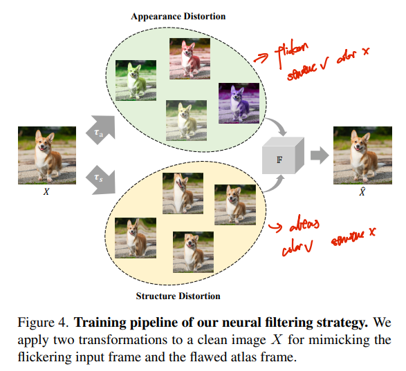
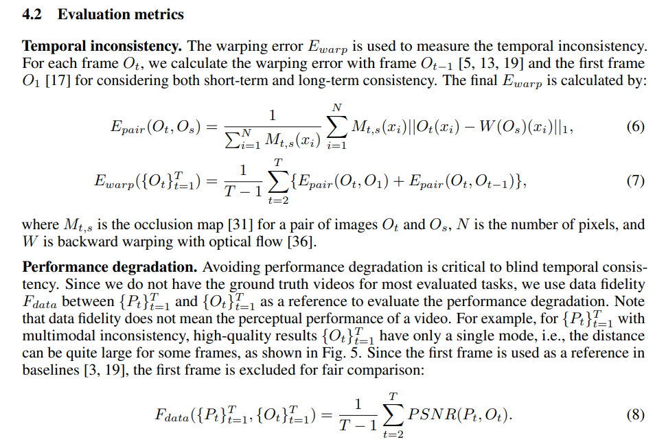

# Blind Video Deflickering by Neural Filtering with a Flawed Atlas

> "Blind Video Deflickering by Neural Filtering with a Flawed Atlas" CVPR, 2023 Mar
> [paper](https://arxiv.org/abs/2303.08120) [code](https://github.com/ChenyangLEI/All-In-One-Deflicker?utm_source=catalyzex.com) [website](https://chenyanglei.github.io/deflicker/)
> [paper local pdf](./2023_05_CVPR_Blind-Video-Deflickering-by-Neural-Filtering-with-a-Flawed-Atlas.pdf)

<video src="https://chenyanglei.github.io/deflicker/static/videos/Betty3.mp4" ></video>

## **Key-point**

> The core of our approach is utilizing **the neural atlas** in cooperation with a neural filtering strategy. 
> **The neural atlas** is a unified representation for all frames in a video that provides temporal consistency guidance but is flawed in many cases. To this end, **a neural network is trained to mimic a filter** to learn the consistent features (e.g., color, brightness) and **avoid introducing the artifacts in the atlas**.

引入 neural atlas 作为时间一致性信息，即**整个视频用一个 atlas 来表示，这里的 atlas 颜色是较为准确**，但可能 structure 扭曲。
针对 atlas 结构信息扭曲的问题，**作者构造了一个 filter 过滤模块 (U-net)，融合原始帧的 structure 信息和 atlas 较好的颜色信息**，输出第 t 帧的**过滤后的信息**。
之后又发现还有 local flickering，使用类似 **recurrent-setup 的方式**，融合过滤后的 t, t-1 帧结果，和之前 t-1 时刻的预测结果得到当前帧结果（代表之前所有的生成结果），实现时用一个轻量 ConvLSTM 。

- Potential application
  能够用于解决 all evaluated types of flickering video：例如 time-lapse / slow-motion 视频，算法处理后的视频（text2video，vid2vid），**老电影/动画**

  novel view synthesis，**old videos artifacts 作者说后续工作要做** :warning:

- 推理只要 3G 显存


**Contributions**

- 引出 blind deflickering 任务，构造了一个闪烁视频数据集
- first blind deflickering approach
  引入 neural  atlas 视频一致性标准到 video flickering 任务
  构造了一个过滤网络，修复 atlas 结果扭曲的缺陷
- 在构造的数据上，性能最优


## **Related Work**

- Task definition
  **Blind deflickering** 不用**视频额外的信息**来指导去闪烁，同时flickering type 不知道 & optical flow 不准确

  这个额外的信息指：例如慢动作视频，之前工作用到光照频率信息；

  Task-specific deflikcering，例如针对 high-speed camera / local contrast correction 特定场景的去闪烁

  

- neural atlas 参考
  "Layered Neural Atlases for Consistent Video Editing" SIGGRAPH, 2021 Sep :star: \ref[26]
  [paper](https://arxiv.org/abs/2109.11418) [website](https://layered-neural-atlases.github.io/) [code](https://github.com/ykasten/layered-neural-atlases)
  

- deflickerring Baseline

  As our approach is the first method for **blind deflickering**, no existing public method can be used

  - `ConvLSTM` 修改了一下，因为是 blind deflickering

    "Learning Blind Video Temporal Consistency" ECCV, 2018 Aug,
    [paper](https://arxiv.org/abs/1808.00449v1)

    we replace the consistent input pair of frames with flickered pair frames & retrain on their data

  - "Blind video temporal consistency"
    [paper](https://dl.acm.org/doi/abs/10.1145/2816795.2818107)

  - "Blind Video Temporal Consistency via Deep Video Prior", NeurIPS 2020, **DVP**
    [paper](https://proceedings.neurips.cc/paper/2020/hash/0c0a7566915f4f24853fc4192689aa7e-Abstract.html) [code](https://github.com/ChenyangLEI/deep-video-prior)


## **methods**

> - how IMLP  work? MLP 的 p 不用像素？
>
>   随机取坐标，输入 MapMLP 得到 UV_map 相对坐标，输入 atlas MLP 得到 RGB 图像
>
> - why use MaskRCNN to have mask?
>
>   help learn atlas better>> 多个物体，用多层 layer atlas，separate human foreground 


### Flawed atlas generation

atlas 生成分为两个模块：Mapping MLP 用于获取相对位置，Atlas MLP 预测该位置的颜色

**Mapping MLP**

$p=(x,y,t)$ 表示位于 $I_t$ 帧画面中，$(x,y)$ 位置的一个像素。将当前帧的每个像素 p 输入 Mapping MLP，获取当前像素，在 atlas 中的相对位置 $(u^p, v^p)$。

理想情况下，同一个物体在多帧画面都可以映射到同一个相对位置。因为闪烁导致的颜色不一致没关系，位置对ok，后面融合一下用一个颜色表示。因此**整个视频用一个共享的 atlas 表示，保证了 temporal consistency**

**Atlas MLP**

用一个 MLP with pos embedding function $\phi$ 来预测 $(u^p, v^p)$ 位置的颜色 $c^p$
$$
(u^p, v^p) = \mathcal{M}(p) \\
c^p = \mathcal{A}(\phi(u^p)，\phi(v^p))
$$
**Training & inference**

用 `"Layered Neural Atlases for Consistent Video Editing" SIGGRAPH, 2021 Sep` 里面的 Loss 训练两个 MLP。

训完


### Neural Filtering

从 atlas 重建出来的帧，扭曲很严重。**因此用一个 filters 过滤模块对 atlas 输出进行调整**
`"Layered Neural Atlases for Consistent Video Editing" SIGGRAPH, 2021 Sep`  分析是因为物体移动太快 or 单层 atlas 不足，要用更多层的 atlas 来表示多个物体。**同时 optical flow 不准确，也有一些 natural changes 例如树阴的正常闪烁**

分析重建的图像结果发现：**atlas 重建的帧信息颜色准确，但 structure 结构扭曲。**因此和原始帧融合一下送入 filter 进行过滤。

> 个人理解：针对 natural changes 的正常闪烁情况，只用 COCO 单张图像训，直觉上感觉无法解决？:question:



**Filters Network training details**

用 MS-COCO dataset 数据，每单张图合成颜色失真 -> $I_t$ 和结构扭曲 -> $A_t$ 的数据对。filter 用一个 U-net 实现, 把 $I_t$ & $A_t$ 通道 concatenate 起来输入 filter 模块，输出过滤结果 $O_t^f$。最后用 L2 loss 约束


### Refinement: local flickering

**由于 atlas 重建出来的帧和原始帧存在 misalignment 的情况，仍然有一些闪烁**。作者用一个local de-flickering network 融合前后帧过滤结果，和前面所有的生成结果融合一下，进一步保证 temporal consistency.

> 这里用到的 $O_{t-1}$ 操作，类似 "ReBotNet: Fast Real-time Video Enhancement" ArXiv, 2023 Mar 视频实时去模糊，里面的 recurrent-setup，就是**用上一帧的输出结果，表示之前所有的生成结果，一起作为当前帧预测的输入，实现 temporal consistency**。

**实现细节** :question:

结合之前一个 timestep 的输出结果$O_{t-1}$,  当前前后两帧的过滤结果 $O^f_{t}, O^f_{t-1}$ ，输入 Conv & Res & ConvLSTM 得到当前 t 帧的总的输出结果 $O_{t}$
$$
L_{local}(O_t, O_{t−1}) = || M_{t,t−1} \cdot (O_t − \hat{O_{t-1}}
)||_1
$$

- $M_{t,t−1}$ occlusion mask
- $\hat{O_{t-1}}$ warping the $O_{t-1}$ with the optical flow from frame t->t-1


## Experiment

> [paper page 6](./2023_05_CVPR_Blind-Video-Deflickering-by-Neural-Filtering-with-a-Flawed-Atlas.pdf#page6)

- Comparison with baseline 
  
  比较的方法：修改了的 `ConvLSTM`, ours； 
  
  - 合成数据：warping error, PSNR。能有准确的 optical flow
  
    Qualitative 看图，Quantitative 看指标
  
  - 真实视频：user-study, preference rate
  
  
  
- Comparisons to blind temporal consistency methods

  3 个 blind temporal consistency methods 需要额外的视频输入，作为参考；而本文方法不需要这个额外信息。

  在多种合成方式的视频上比较 warping error

  

- **Ablation Study**

  - Ours without atlas & neural filtering
  - Ours without local refinement
  - Ours

  

- Comparison with human Expert

  人工用商业软件 [RE:VISION. De:flicker](https://revisionfx.com/products/deflicker/) 去修复，挑了一组图看效果；新手用软件修不好 :dog:


### Dataset

作者说创建的是第一个公开的 blind flickering 数据集

**Real-world data**

> 没有 GT >> 只 evaluation

contain various types of flickering artifacts

- **old_movie，60 * video 存储为 `%05d.jpg` 大多为 350 帧图像，若 fps=25，约为 10-14s的视频。**
- **old_cartoon，21 * video 图像格式存储，大多为 50-100 帧，约为 1 - 4s 视频**
- Time-lapse videos capture a scene for a long time, and the environment illumination usually changes a lot
  - Slow-motion videos can capture high-frequency changes in lighting
  - algorithms processed result

  

**合成 flickering 的视频数据**

> paper 里面没发现这个合成 flickering 的方法的描述，在 Table 2 里面列举了一些 processed video 也许是合成方式？Dehazing, colorization, ...

$I_t = G_t + F_t,$

adding the flickering artifacts $\{F_t\}_{t=1}^T$，is the synthesized flickering artifacts. 用一个 window size 表示多少帧用同一种 flickering


### metrics

- DVP 中提出的 warping error, 越小越好

  > **作为视频 temporal consistency 衡量指标** 
  >
  > - occlusion mask >> 两帧的重合区域？

  

  因为是合成数据，能够从清晰的视频中得到精确的 optical flow

  

- PSNR GT 和处理结果


## Code Implementation

**RAFT optical flow**

> `src/preprocess_optical_flow.py` 

计算视频前后帧的 optical flow，用 `pretrained_weights/raft-things.pth` ，存储到 npy 文件


**IMLP 实现 mapping, atlas MLP**

> `src/models/stage_1/implicit_neural_networks.py`
>
> 对每个视频，单独训两个 MLP

`class IMLP(nn.Module)` 纯 `Linear` 组成的 module

- pre_train_mapping

  随机生成一些坐标，输入 Mapping MLP 输出 uv_map 计算 norm。让 MLP 学习输出坐标？

  ```python
  def pre_train_mapping(model_F_mapping, frames_num, uv_mapping_scale, resx, resy, larger_dim, device,
                        pretrain_iters=100):
      optimizer_mapping = optim.Adam(model_F_mapping.parameters(), lr=0.0001)
      print("pre-training")
      for i in tqdm(range(pretrain_iters)):
          for f in range(frames_num):
              i_s_int = torch.randint(resy, (np.int64(10000), 1))
              j_s_int = torch.randint(resx, (np.int64(10000), 1))
  
              i_s = i_s_int / (larger_dim / 2) - 1
              j_s = j_s_int / (larger_dim / 2) - 1
  
              xyt = torch.cat((j_s, i_s, (f / (frames_num / 2.0) - 1) * torch.ones_like(i_s)),
                              dim=1).to(device)
              uv_temp = model_F_mapping(xyt)
  
              model_F_mapping.zero_grad()
  
              loss = (xyt[:, :2] * uv_mapping_scale - uv_temp).norm(dim=1).mean()
              # print(f"pre-train loss: {loss.item()}")
              loss.backward()
              optimizer_mapping.step()
      return model_F_mapping
  ```

- Loss

  - gradient_loss
    `def get_gradient_loss_single` 输入 xyt 的偏移 dx, dy = 1pixel，输入 mapping, atlas MLP 得到的颜色，与 GT **对应位置颜色计算 rgb loss**

  - rgb loss

    直接预测 RGB 与 GT 计算 L2 loss
    `rgb_loss = (torch.norm(rgb_output_foreground - rgb_current, dim=1) ** 2).mean()`

  - get_optical_flow_loss

  - get_rigidity_loss

  - global_rigidity_loss1

- `positional encoding`

  ```python
  def positionalEncoding_vec(in_tensor, b):
      proj = torch.einsum('ij, k -> ijk', in_tensor, b)  # shape (batch, in_tensor.size(1), freqNum)
      mapped_coords = torch.cat((torch.sin(proj), torch.cos(proj)), dim=1)  # shape (batch, 2*in_tensor.size(1), freqNum)
      output = mapped_coords.transpose(2, 1).contiguous().view(mapped_coords.size(0), -1)
      return output
  ```

- PSNR 计算

  `skimage.metrics.peak_signal_noise_ratio`


**Filters & TransformNet**

- Filters -> U-net 用提前训好的，只推理

- `class ConvLSTM(nn.Module):`

  `src/models/network_local.py`


## Limitations

- 处理的视频比较短 100 frames
- 没给 filters, refinement-network 的训练 code


## **Summary :star2:**

> learn what & how to apply to our task

- 用类似 Nerf Implicit Neural Network 对整个视频得到一个共享的 atlas 表征，来表示视频颜色的一致性特征。之后每帧计算时，直接用当前帧的位置输入 atlas 去查询得到 $A_t$ 
  - 其他方法拿过来用发现效果不好，找到是 atlas structure 不行，但颜色还行的特点，构造了一个 filter 融合原始帧一起处理
  - local flickering 有现成 pipline 可以拿过来用

- **提供的 old_movie, old_cartoon 也有闪烁问题**，可以借鉴这里修复的思路（本文作者也说后需要做 old_film 修复，解决 video consistency 问题）

