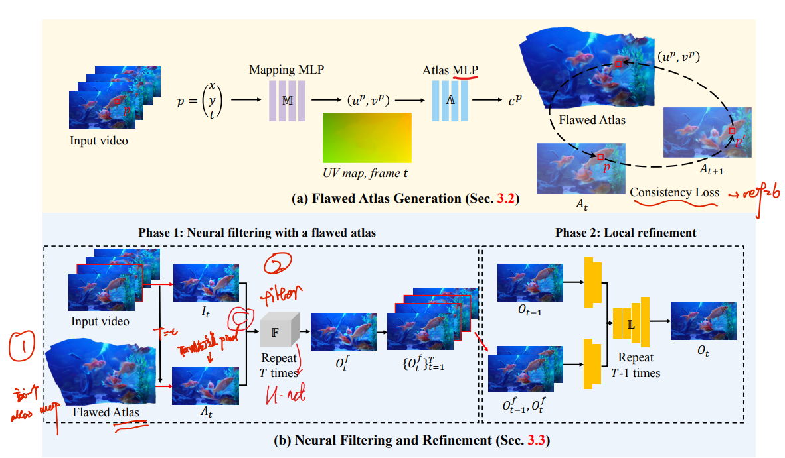

# 2023_05_CVPR_Blind-Video-Deflickering-by-Neural-Filtering-with-a-Flawed-Atlas

> "Blind Video Deflickering by Neural Filtering with a Flawed Atlas" CVPR, 2023 Mar
> [paper](https://arxiv.org/abs/2303.08120) [code](https://github.com/ChenyangLEI/All-In-One-Deflicker?utm_source=catalyzex.com) [website](https://chenyanglei.github.io/deflicker/)
> [paper local pdf](./2023_05_CVPR_Blind-Video-Deflickering-by-Neural-Filtering-with-a-Flawed-Atlas.pdf)

## **Key-point**

The core of our approach is utilizing **the neural atlas** in cooperation with a neural filtering strategy. 
**The neural atlas** is a unified representation for all frames in a video that provides temporal consistency guidance but is flawed in many cases. To this end, **a neural network is trained to mimic a filter** to learn the consistent features (e.g., color, brightness) and **avoid introducing the artifacts in the atlas**.

引入**整个视频共享的单个 atlas 作为时间一致性信息 **，认为 atlas 颜色是较为准确的，但可能 structure 保存不好。作者就构造了一个 filter (U-net) 融合原始帧的 structure 信息和 atlas 较好的颜色信息，输出第 t 帧的过滤后的信息。之后又发现有 local flickering，作者参考已有方法，一个轻量 ConvLSTM 结合过滤后的 t, t-1 帧和之前预测 t-1 时刻的预测结果，融合得到当前帧结果

- 能够用于解决

  flickering video；生成的视频 or 上色等，算法处理后存在 flickering 的问题

**Contributions**

- 引入 atlas 视频一致性标准到 video flickering 任务
- 构造了一个过滤网络，修复 atlas 结果扭曲的缺陷

## **Related Work**

- [deep-video-prior (DVP)](https://github.com/ChenyangLEI/deep-video-prior)
  Blind Video Temporal Consistency via Deep Video Prior

- "Layered Neural Atlases for Consistent Video Editing" SIGGRAPH, 2021 Sep :star:
  [paper](https://arxiv.org/abs/2109.11418) [website](https://layered-neural-atlases.github.io/) [code](https://github.com/ykasten/layered-neural-atlases)

- 

## **methods**

- atlas

  两个 implicit neural network MLP

- filters 对 atlas 输出的结果（颜色准确，structure 失真）和原始帧融合一下

  用 COCO 数据，每单张图构造颜色失真 -> I_t 和结构扭曲 -> A_t 的数据对

  训练一个 U-net, 把 $I_t$ & $A_t$ 通道 concat 起来输入得到 $O_t^f$

- local flickering 调整

  结合 $O_{t-1}, O^f_{t}, O^f_{t-1}$ 过 Conv & Res & ConvLSTM 得到 $O_{t}$

## **Summary :star2:**

> learn what & how to apply to our task

- 用类似 Nerf Implicit Neural Network 对整个视频得到一个共享的 atlas 表征，来表示视频颜色的一致性特征。之后每帧计算时，直接用当前帧的位置输入 atlas 去查询得到 $A_t$ 
  - 其他方法拿过来用发现效果不好，找到是 atlas structure 不行，但颜色还行的特点，构造了一个 filter 融合原始帧一起处理
  - local flickering 有现成 pipline 可以拿过来用

- **提供的 old_movie, old_cartoon 也有闪烁问题**，可以借鉴这里的思路（本文作者也说后需要做 old_film 修复，解决 video consistency 问题）

# Implementation details

> - [ ] why use MaskRCNN to have mask?
>
>   help learn atlas better>> separate human foreground 
>
> - [ ] how IMLP  work?
>
> - [ ] 

## Dataset

- 60 * old_movie，存储为 `%05d.jpg` 大多为 350 帧图像，若 fps=25，约为 10-14s的视频。

- 21* old_cartoon，图像格式存储，大多为 50-100 帧，约为 1 - 4s 视频

- human expert use commercial software for de-flickering

  [RE:VISION. De:flicker](https://revisionfx.com/products/deflicker/)

- 合成 flickering 的视频数据

