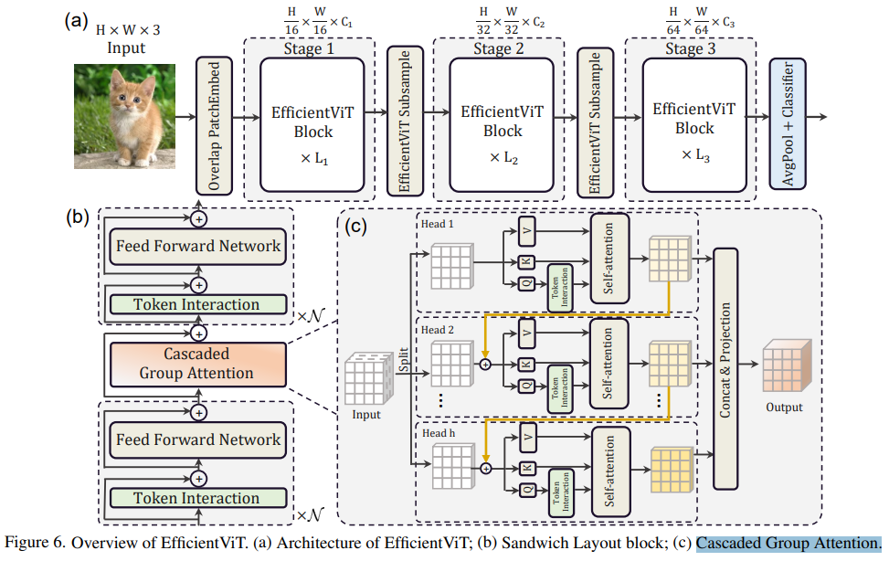

# EfficientViT: Memory Efficient Vision Transformer with Cascaded Group Attention

> "EfficientViT: Memory Efficient Vision Transformer with Cascaded Group Attention" CVPR, 2023 May
> [paper](http://arxiv.org/abs/2305.07027v1) [code](https://github.com/microsoft/Cream/tree/main/EfficientViT.) 
> [pdf](./2023_05_CVPR_EfficientViT--Memory-Efficient-Vision-Transformer-with-Cascaded-Group-Attention.pdf)
> Authors: Xinyu Liu, Houwen Peng, Ningxin Zheng, Yuqing Yang, Han Hu, Yixuan Yuan

## Key-point

- Task
- Problems
- :label: Label:

## Contributions

## Introduction

## methods

explore how to improve the efficiency of vision transformers from three perspectives: memory access, computation redundancy, and parameter usage

1. reducing memory-inefficient layers

   explore the optimal allocation of MHSA and FFN layers in small models with fast inference

   Memory-bound operations is reduced to 44.26% of the total runtime in Swin-T-1.25× that has 20% MHSA layers

2. To explicitly encourage the heads to learn different patterns, we apply an intuitive solution by feeding each head with only a split of the full feature

   类似分组 Conv

3. typical **channel** configuration, that doubles the channel after each stage [44] or use equivalent channels for all blocks [69], may produce substantial **redundancy in last few blocks**

 propose a new attention module named cascaded group attention (CGA) for vision transformers

将特征按通道分为多个 head

## Experiment

> ablation study 看那个模块有效，总结一下

## Limitations

## Summary :star2:

> learn what & how to apply to our task

