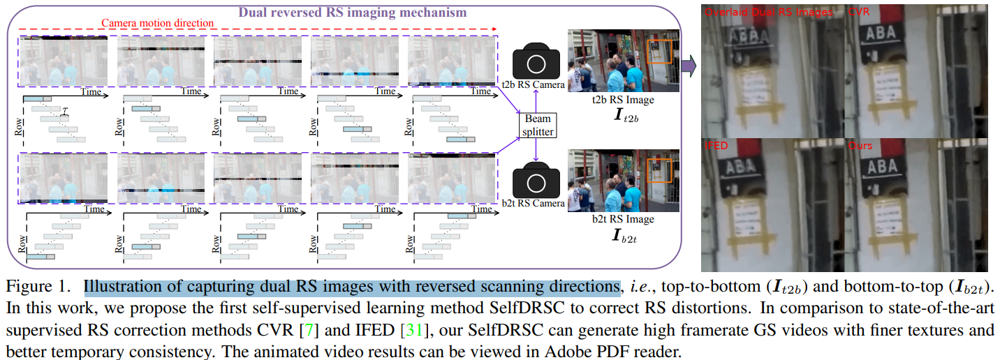

# Self-supervised Learning to Bring Dual Reversed Rolling Shutter Images Alive

> "Self-supervised Learning to Bring Dual Reversed Rolling Shutter Images Alive" ICCV-2023, 2023 May 31
> [paper](http://arxiv.org/abs/2305.19862v3) [code](https://github.com/shangwei5/SelfDRSC) [pdf](./2023_05_ICCV_Self-supervised-Learning-to-Bring-Dual-Reversed-Rolling-Shutter-Images-Alive.pdf) [note](./2023_05_ICCV_Self-supervised-Learning-to-Bring-Dual-Reversed-Rolling-Shutter-Images-Alive_Note.md)
> Authors: Wei Shang, Dongwei Ren, Chaoyu Feng, Xiaotao Wang, Lei Lei, Wangmeng Zuo

## Key-point

- Task: rolling shutter (RS) image2video

- Problems

  - 手机拍摄由于存在光栅旋转机制，导致拍摄出来的图像类似 blur 了一样

    > Modern consumer cameras usually employ the rolling shutter (RS) mechanism, where images are captured by scanning scenes row-by-row, yielding RS distortions for dynamic scenes.

- :label: Label:

## Contributions

## Introduction

## methods

## setting

## Experiment

> ablation study 看那个模块有效，总结一下

## Limitations

## Summary :star2:

> learn what

### how to apply to our task

