# Hierarchical Integration Diffusion Model for Realistic Image Deblurring

> "Hierarchical Integration Diffusion Model for Realistic Image Deblurring" NIPS, 2023 May, `HI-Diff`
> [paper](http://arxiv.org/abs/2305.12966v4) [code](https://github.com/zhengchen1999/HI-Diff) 
> [pdf](./2023_05_NIPS_Hierarchical-Integration-Diffusion-Model-for-Realistic-Image-Deblurring.pdf)
> Authors: Zheng Chen, Yulun Zhang, Ding Liu, Bin Xia, Jinjin Gu, Linghe Kong, Xin Yuan

## Key-point

- Task: image deblur

- Problems

  1. **computation** resource: diffusion model requires a large number of inference iterations

     SD 为了保证 generation quality ，使用的 compression ratio is small (e.g., 8 times)

     因此提出 perform the DM in a highly compacted latent space to generate the prior feature

  2. synthesized by the diffusion model is often **misaligned** with the target results

     fuse the prior into the regression-based model

- :label: Label:

**motivation**

1. 为了减轻计算量 consider applying DMs on the low-dimensional latent space 

   自己训练一个 DDPM

2. regression-based methods in distortion accuracy，把 SD 特征融入自己的主干网络，而不是用 SD 出图，降低 distortion

3. non-uniform blur in real scenarios 数据？

perform **a two-stage training** to realize latent compression and the training of the DM

1. jointly train the LE and Transformer
2. jointly train the DM and Transformer

## Contributions

1. framework
2.  apply the diffusion model in highly compact latent space & propose the hierarchical integration module

## Introduction

- "Removing camera shake from a single photograph" SIGGRAPH, 2006

传统方法，预测照片中导致模糊的模糊核 kernel

### Transformer-based

limited in recovering image details

- "Restormer: Efficient transformer for high-resolution image restoration" CVPR, 2021 Nov, `Restormer` 
  [paper](https://arxiv.org/abs/2111.09881)

UNet 结构不变，每个 block 换为 Transformer block. 两个 Attention，第一个把 MLP 换为 Depth-conv 说是不同通道分别处理，空间HxW上的特征更丰富；第二个相当于做一个 CBAM 时空注意力。

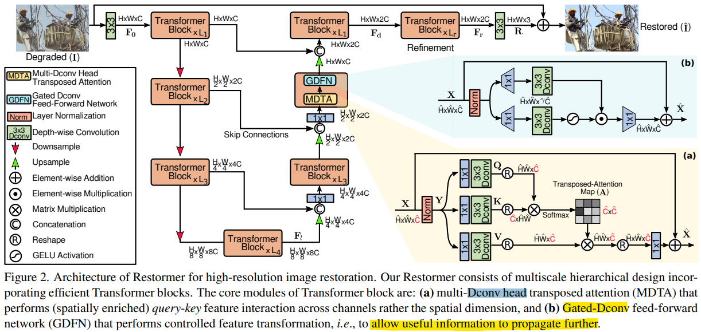

- "Stripformer: Strip transformer for fast image deblurring" ECCV, 2022 Apr, 
  [paper](https://arxiv.org/abs/2204.04627)

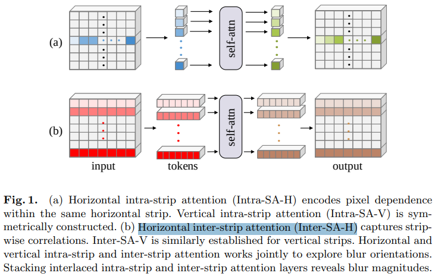

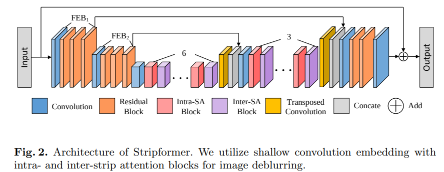

在 pixel-space 竖着 & 横着**逐像素**做 attn. 再竖着 & 横着**逐条**做 attn

### Diffusion

- "Diffusion Models for Image Restoration and Enhancement -- A Comprehensive Survey"
  [paper](https://arxiv.org/abs/2308.09388)

- "Deblurring via stochastic refinement" CVPR, 2021 Dec, `DvSR`
  [paper](https://arxiv.org/abs/2112.02475)

Conditional DPM

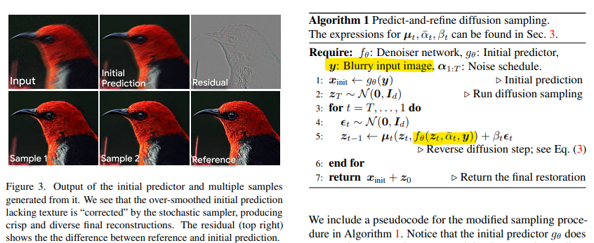

- "Inversion by direct iteration: An alternative to denoising diffusion for image restoration" TMLR, 2023 Mar
  [paper](https://arxiv.org/abs/2303.11435)

## methods

> - Q: LE 如何训练?

使用主干网络 Encoder-Decoder 的主干网络（Restormer），在每个 scale 开头加上 diffusion 的先验特征，当作 KV 融入主干网络（提出的 HIM block）；两阶段训练，stage1 先训练用于 diffusion 的图像编码器 LE Encoder, 不训diffusion 把特征 z 输入主干网络，在图像空间约束；stage2 zT 的编码器不训，训练 condition 的编码器 + diffusion + HIM

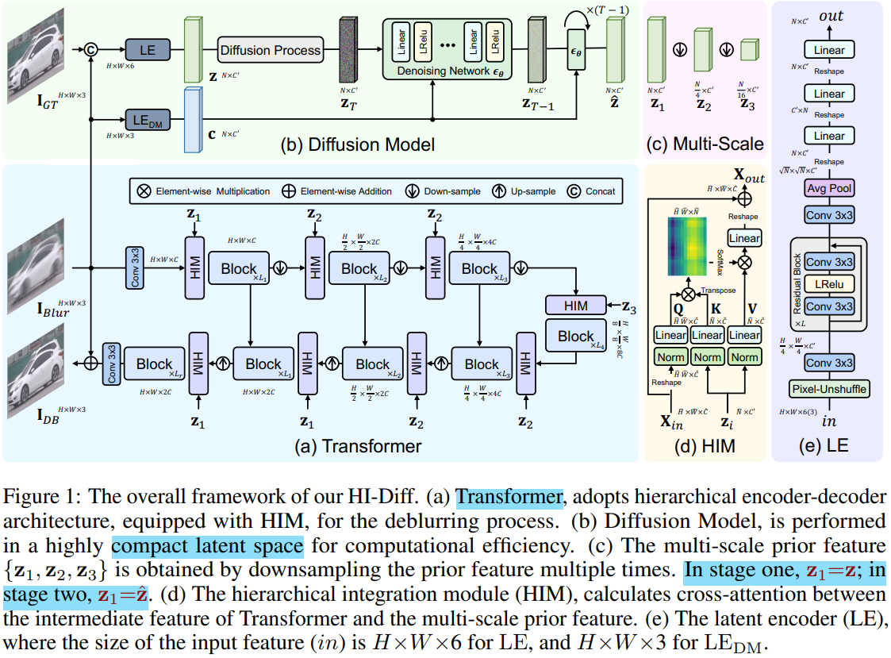

diffusion 是自己训练的 DDPM；因为要在小空间，所以**特征下采样倍数 N=16, C=256** (SD 是 8) ，**去噪步数 T=8** 

> the token number N is 16, and the channel dimension C ′ is 256

主干网络 UNet 设计参考 Restormer，区别是在每个 Transformer Block 加了一个 HIM block

> 4-level encoder-decoder Transformer architecture. From level-1 to level-4, we set the number of Transformer blocks as [3,5,5,6], the number of channels as [48,96,192,384], and the attention heads as [1,2,4,8]
>
> 各个 scale 通道数翻倍就好

### **Latent Encoder**

compression ratio ( H×W N ) is much higher than that applied in previous latent diffusion

### **Hierarchical Integration Module**

For each HIM, cross-attention is computed between the prior and intermediate features for feature fusion

把 $X_{in}$ 当作 Q，后续残差也加的是 $X_{in}$，以主干 UNet 为主体！看框架图中的 b 即可

- **Q：为什么 diffusion 那边要输出多尺度的特征？**

因为要考虑真实退化，只用一个 scale 的 diffusion prior 还不足以很好适应很模糊的情况；& **融入主干网络要多尺度**，所以说要多尺度。

> 1. since the non-uniform blur in real scenarios, the **single-scale prior feature cannot adapt well to complex blurry situations**. >> 只用一个尺度有无实验对比？
> 2. The multiple-scale prior feature adapts to different scale intermediate features for better fusion.
>
> Therefore, we generate the multiple-scale prior feature {z1, z2, z3}

**First Stage Training**

1. LE 图像编码器得到特征 z，先不考虑 diffusion，**直接用 z 作为 z1**, 再下采样得到 z2, z3 多个尺度特征；

   **图像编码器用 GT 和 LQ concatenate 一起输入！**

2. 搭配 HIM 融入主干网络中，直接用网络出去模糊的图像 $I_{DB}$ 

在图像空间做 L1 loss

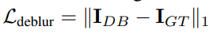

- Q：第一阶段为什么要训练 HIM？

  HIM 作为把 LE 特征融入主干网络的模块，**作者通过 HIM 为桥梁，在图像空间约束 LE Encoder**

### Stage2

> Motivation
>
> a latent diffusion model (DM) is trained to learn to generate the prior feature, that enhances the deblurring process of Transformer through HIM

1. 冻住 LE Encoder， 训练 condition 的 LE_DM encoder 和 diffusion UNet；

   把 LE encoder 得到的特征 z 通过 diffusion 去噪 T 步得到  $\hat{z}, ~z_1=\hat{z}$

2. 同时再训练 HIM，特征进入 diffusion 完整去噪再用

**LE_DM 编码器**

- **Q：为什么要单独再训练一个 LE_DM 编码器？**

  想要用 LQ 提取特征作为 diffusion 去噪的 condition，但 LQ 有噪声，想要用 LE_DM 抑制一些噪声再提取特征，来作为 diffusion 的 condition 特征 $c \in R^{N \times C^`}$

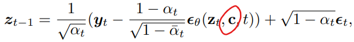

同时，diffusion 需要自己训练，训练方式参考标准流程

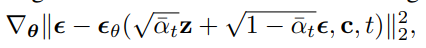

- **Q：上面训练 Diffusion 只是随机去了个 T 去噪了单步，没去噪到底，没法用到主干网络？**

简单粗暴直接把 LE 特征 z 完整加噪 T 步，完整的去噪（自己训练的 diffusion 这里会比 SD 快一些），得到特征再输入主干 UNet

### inference

1. LE Encoder 训练时候使用 GT+LQ 图像作为输入再去得到特征 z；**在测试时候，直接用随机采样的高斯噪声作为 LE 出来的特征 z；**
2. condition 用 LQ 过 LE_DM encoder 得到特征 c；diffusion 去噪输出特征 $\hat{z}=z_1;  z_2,z_3$
3. diffusion 特征通过 HIM （QKV atten）融入主干网络 UNet
4. 主干网络使用全局残差（图像空间）

## Experiment

> ablation study 看那个模块有效，总结一下

### setting

-  synthetic datasets: GoPro, 2103 pairs and HIDE, 2025
- real-world dataset: RealBlur 3,758 training pairs and 980 testing pairs;  and RWBI 3,112 blurry images
- 4 A100 GPU

训练策略

1.  training iterations are 300K， LR 2×10−4 and gradually reduced to 1×10−6 with the cosine annealing

2. progressive learning

   > initial patch size as 128 and the patch size as 60. We progressively update the patch size and batch size pairs to [(1602 ,40),(1922 ,32),(2562 ,16),(3202 ,16),(3842 ,8)] at iterations [20K,40K,60K,80K,100K].

### Ablation

**Effects of Diffusion Prior.**

1.  baseline: vanilla Restormer

2. Row2 使用 diffusion，也意味着同时训练 HIM 这样才能加入 diffusion prior

   discover that using the prior feature generated by the latent diffusion model (DM) yields a 0.28 dB improvement

3. diffusion 和 HIM 分开训练 》》没给主观结果，PSNR 低一些正常

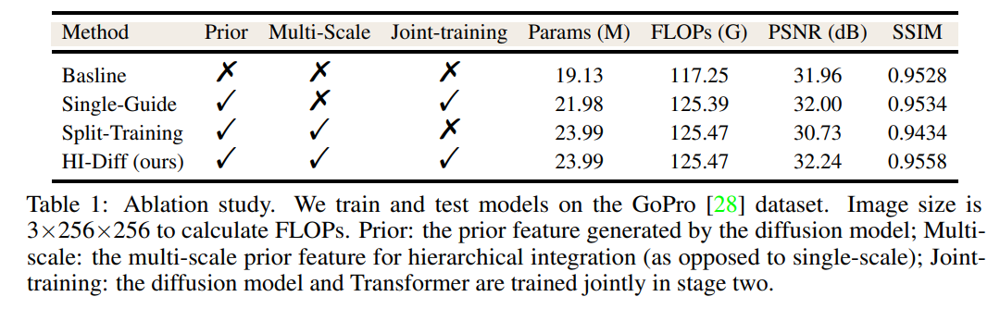

1. Multi-scale 的 diffusion prior 用处不是很大
2. 要用的主干网络和 diffusion 要一起训练才有较大提升，分开性能反而很烂。

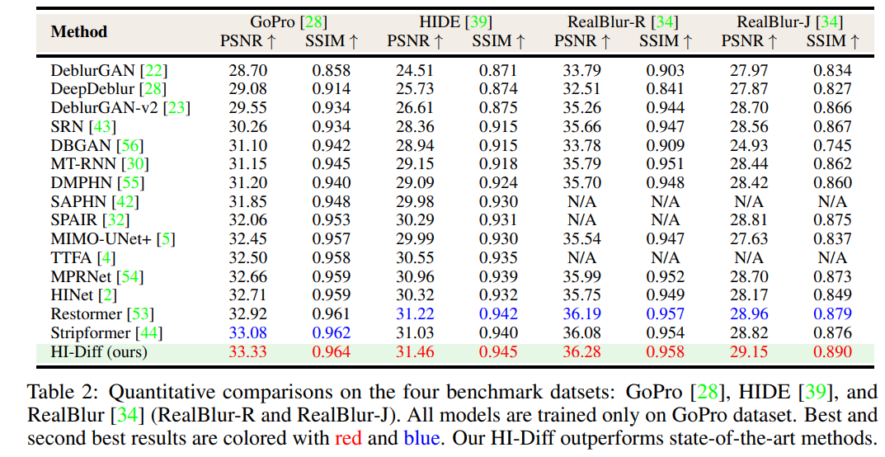

**主观**

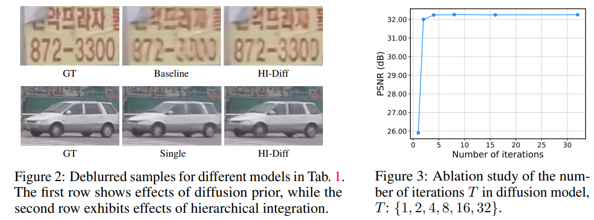

不同 diffusion 直接出图，**收到主干网络影响，出来还是很糊**，训练出来不是很好

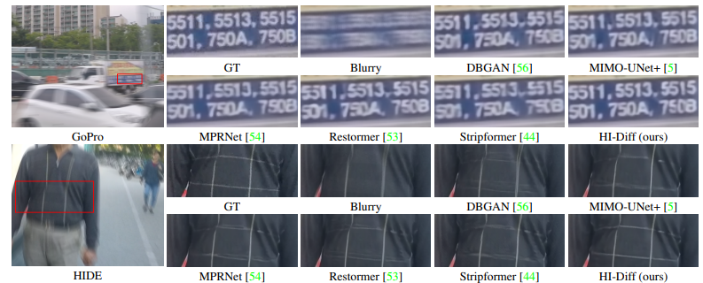

## Limitations

1. 不同 diffusion 直接出图，**收到主干网络影响，出来还是很糊**，训练出来不是很好
2. 没有 >> 只用一个尺度有无实验对比

## Summary :star2:

> learn what & how to apply to our task;
>
> 总结一下文章是要解决什么问题，motivation 是什么；为什么要这么解决！

1. Stable Diffusion 纯生成形式，容易有 artifact；特征空间太大，不好控制？可以自己训练一个 DDPM

2. diffusion 是自己训练的 DDPM；因为要在小空间，所以**特征下采样倍数 N=16, C=256** (SD 是 8) ，**去噪步数 T=8**  能够有效

3. 训练策略：progressive learning 训练 patch_size 在不同阶段逐渐增大

   > initial patch size as 128 and the patch size as 60. We progressively update the patch size and batch size pairs to [(1602 ,40),(1922 ,32),(2562 ,16),(3202 ,16),(3842 ,8)] at iterations [20K,40K,60K,80K,100K].

4. 不同 diffusion 直接出图，**收到主干网络影响，出来还是很糊**，训练出来不是很好

5. diffusion 出图的特征 z0 直接 downsample 作为多个尺度能用
