# Common Diffusion Noise Schedules and Sample Steps are Flawed

> "Common Diffusion Noise Schedules and Sample Steps are Flawed" WACV, 2023 May 15
> [paper](http://arxiv.org/abs/2305.08891v4) [code]() [pdf](./2023_05_WACV_Common-Diffusion-Noise-Schedules-and-Sample-Steps-are-Flawed.pdf) [note](./2023_05_WACV_Common-Diffusion-Noise-Schedules-and-Sample-Steps-are-Flawed_Note.md)
> Authors: Shanchuan Lin, Bingchen Liu, Jiashi Li, Xiao Yang

## Key-point

- Task
- Problems
- :label: Label:

## Contributions

- **发现 Diffusion inference 加噪最后一个 timestep SNR 不为 0，造成 diffusion 训练推理存在不一致。**
- 类似 offset-noise，发现此问题导致 SD 只能生成亮度适中的图像，伪纹理

> We discover that common diffusion noise schedules **do not enforce the last timestep to have zero signal-to-noise ratio (SNR),** and some implementations of diffusion **samplers do not start from the last timestep.** Such designs are flawed and do not reflect the fact that the model is given pure Gaussian noise at inference, **creating a discrepancy between training and inference.**
>
> In Stable Diffusion, it severely limits the model to only generate images with medium brightness and prevents it from generating very bright and dark samples.

- 解决方案
  1. rescale the noise schedule to enforce zero terminal SNR;
  2.  train the model with v prediction
  3. change the sampler to always start from the last timestep
  4. rescale classifier-free guidance to prevent over-exposure.

## Introduction

- Q：diffusion 由于 flawed sample steps 只能生成亮度适中的图像；

  无法生成纯黑 or 纯白图像

> Notably, an open-source implementation, Stable Diffusion [10], has been widely adopted and referenced. However, the model, up to version 2.1 at the time of writing, always generates images with medium brightness.
>
> Moreover, the model fails to generate correct samples when paired with explicit yet simple prompts such as “Solid black color” or “A white background”, etc.
>
> We discover that the **root cause of the issue resides in the noise schedule and the sampling implementation.** 

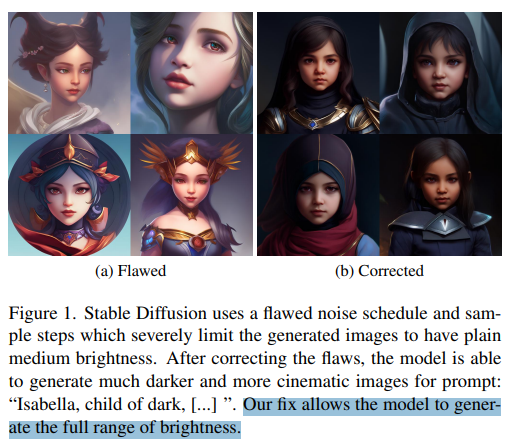

> 

### Diffusion background

加噪，写成一步加噪的形式

> a non-learned, manually-defined variance schedule $\beta_1, \dots$

- 随 t 增大，$\beta_t$ 递增，$\alpha_t = 1-\beta_t$ 递减，$\bar{\alpha}\to 0$

- t 增大到一定程度，x 为纯高斯噪声

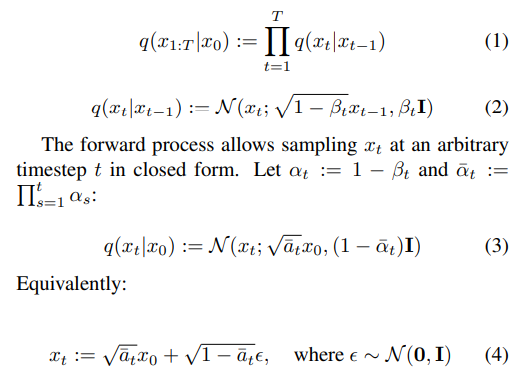

**Signal-to-noise ratio (SNR) 信噪比**，看 eq4 前面一项是 signal，后面一项是 noise

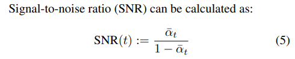

去噪公式，里面 $\tilde{\beta}$ 为预先定好的，只需要让模型预测 $\tilde{\mu}$，公式里面变量只有 $\epsilon$，转去学习 noise 一样的

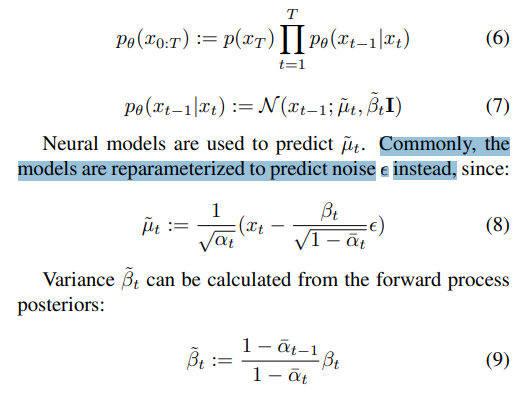

## methods

### Zero Terminal SNR

- Q：训练 timestep=T 不是纯高斯噪声，导致 **noise schedule 在训练与测试时候不一致**；

与测试时候不一致，只能生成亮度适中的图像

> When t = T at training, the input to the model is not completely pure noise. **The leaked signal contains the lowest frequency information,** such as the overall mean of each channel. The model subsequently learns to denoise respecting the mean from the leaked signal.
>
> At inference, pure Gaussian noise is given for sampling instead.

导致图像生成亮度无法生成很暗 or 很亮的图

> The Gaussian noise always has a zero mean, so the model continues to generate samples according to the mean given at t = T, resulting in images with medium brightness. 

应该在训练时候 timestep=T 使用纯高斯噪声，实现 noise schedule 的一致

> In contrast, a noise schedule with zero terminal SNR uses pure noise as input at t = T during training, thus consistent with the inference behavior.
>
> We argue that diffusion noise schedules must enforce zero terminal SNR to completely remove the discrepancy between training and inference. **This also means that we must use variance-preserving formulation since variance exploding formulation [17] cannot truly reach zero terminal SNR.**

把 schedule 公式改一下，eq4 $\sqrt{\bar{a_t}}$ 代表 signal 的含量；保持 $\sqrt{\bar{a_1}}$ 不变，$\sqrt{\bar{a_T}}$ 改成0，其余 timestep 线性 rescale

只需要对 non-cosine schedule 进行修正

> Note that the proposed rescale method is only needed for fixing existing non-cosine schedules. **Cosine schedule** can simply remove the βt clipping to achieve zero terminal SNR.

发现对于 SD 的影响还挺大的

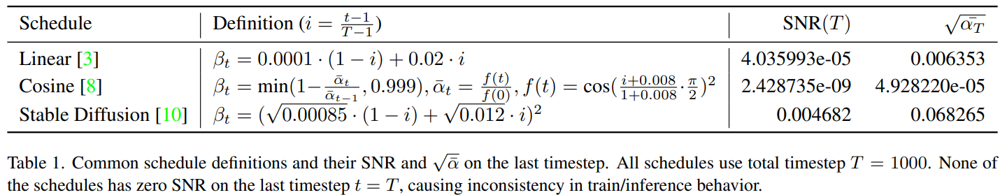

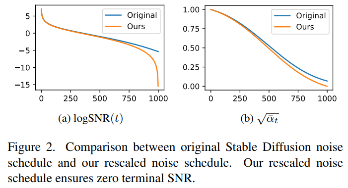

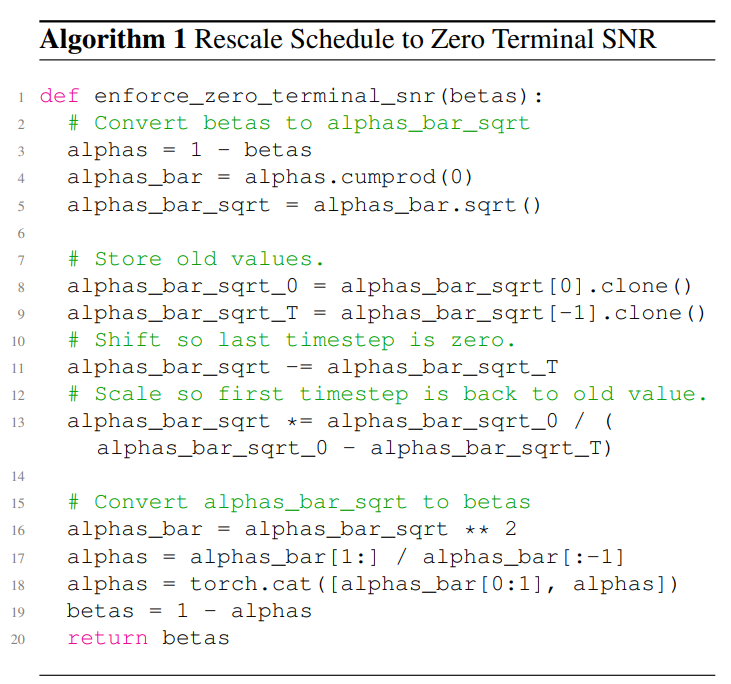

### v-prediction

- Q：当经过调整后 timestep=T SNR=0，预测噪声无法让模型学到东西。。。

> - "Progressive distillation for fast sampling of diffusion models" `v-prediction` 
>
>   https://arxiv.org/pdf/2202.00512

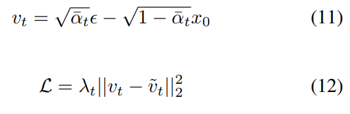

实验发现 v-prediction 效果和 $\epsilon$ Loss 差不多，但  $\epsilon$ Loss 如果 t=T SNR=0，预测纯噪声，模型学不到啥

> We finetune Stable Diffusion model using v loss with λt = 1 and find the visual quality similar to using ϵ loss. We recommend always using v prediction for the model and adjusting λt to achieve different loss weighting if desired.

### sample steps

发现 DDIM, PNDM 推理的 schedule 不是从 timestep=T 开始的

> However, many implementations, including the official DDIM [16] and PNDM [6] implementations, do not properly include the last timestep in the sampling process, as shown in Table 2. 

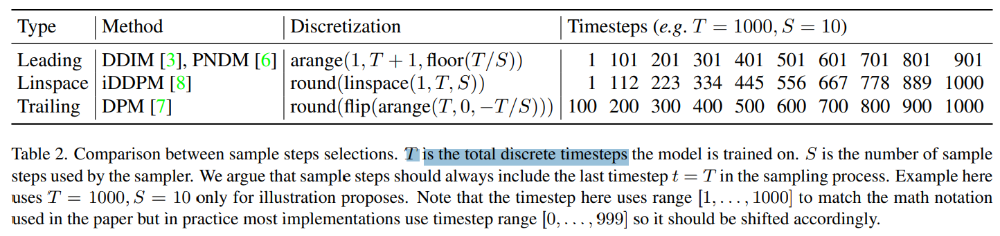

需要保证从 T 开始去噪，保持和训练一致。猜测原因和 zero SNR 一致，初始信息 leak 到训练过程，导致只会生成 medium brightness 图像，无法生成超级暗的图像

> We argue that sample steps should always include the last timestep t = T in the sampling process.
>
> We argue that sampling from the last timestep in conjunction with a noise schedule that enforces zero terminal SNR is crucial. Only this way, when pure Gaussian noise is given to the model at the initial sample step, the model is actually trained to expect such input at inference.

使用 iDDPM

> We consider two additional ways to select sample steps in Table 2. Linspace, proposed in iDDPM [8], includes both the first and the last timestep and then evenly selects intermediate timesteps through linear interpolation. Trailing, proposed in DPM [7], only includes the last timestep and then selects intermediate timesteps with an even interval starting from the end. 

对于去噪步数较少，使用 trailing 方式更有效率，发现 timestep=1 几乎不会改变啥了

> We **find trailing has a more efficient use of the sample steps especially when S is small**. This is because, for most schedules, x1 only differs to x0 by a tiny amount of noise controlled by β1 and the **model does not perform many meaningful changes when sampled at t = 1,** effectively making the sample step at t = 1 useless.

### Rescale Classifier-Free Guidance

发现改动 timestep=T SNR=0 后有了别的问题，使用 CFG 会出现生成图像过曝光的问题

> We find that as the terminal SNR approaches zero, **classifier-free guidance [4] becomes very sensitive and can cause images to be overexposed.**

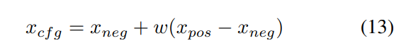

先前工作提出动态设置 CFG 权重 w

> For example, Imagen [11] uses cosine schedule, which has a near zero terminal SNR, and proposes dynamic thresholding to solve the over-exposure problem. However, the approach is designed only for image-space models. Inspired by it, we propose a new way to rescale classifier-free guidance that is applicable to both imagespace and latent-space models

发现是 CFG 后的 $x_{cfg}$ 非常大，导致的过曝

> We find that when w is large, the scale of the resulting xcf g is very big, causing the image over-exposure problem. 

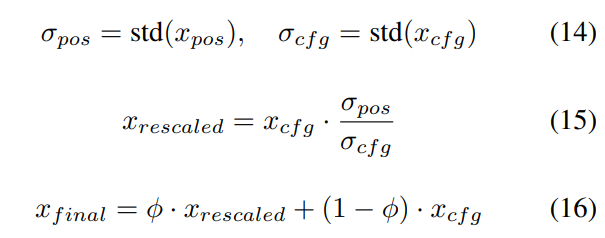

提出在做完 CFG 后再 rescale 一下

- Q：如何验证 $x_{cfg}$ 很大？

> In Equation (14), we compute the standard deviation of xpos, xcf g as σpos, σcf g ∈ R. 

发现在做 CFG 之前调整特征的标准差，出现过度平滑的问题 :star:

>  In Equation (15), we rescale xcf g back to the original standard deviation before applying classifier-free guidance but discover that the generated images are overly plain

做完 CFG 搞一下，再加权一下再削弱一点

> In Equation (16), we introduce a hyperparameter ϕ to control the rescale strength. We empirically find **w = 7.5, ϕ = 0.7 works great.**

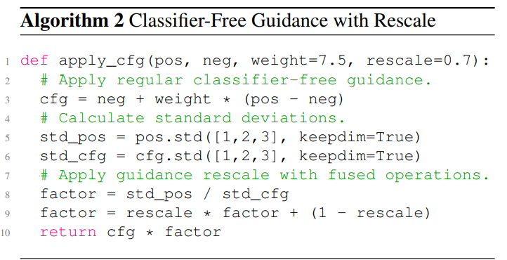

## Implementation

如何保证 SNR=0？避免用 noise 来推到 sampler

> The correct way is to first convert v prediction to x0 in Equation (19), then sample directly with x0 formulation as in Equation (20) (Equation 7 in [3]). This avoids the singularity problem in ϵ formulation

先前 SNR!=0 ，使用下面这个公式存在误差！

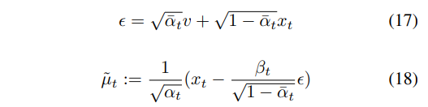

改成用 v-prediction 去预测

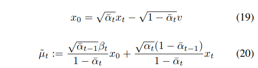

DDIM 的公式

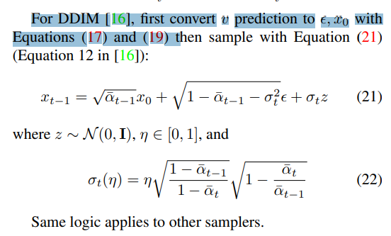

## setting

finetune SD2.1，**1e-4 lr 去微调 5w iteration 可以的**

> We finetune Stable Diffusion 2.1-base model on Laion dataset [14] using our fixes.
>
> We use the same training configurations, i.e. batch size 2048, learning rate 1e-4, ema decay 0.9999, to train our model for 50k iterations.

FID, IS 判断生成图像质量

> We follow the convention to calculate Frechet Inception ´ Distance (FID) [2, 9] and Inception Score (IS) [12]. We randomly select 10k images from COCO 2014 validation dataset [5] and use our models to generate with the corresponding captions. 

## Experiment

> ablation study 看那个模块有效，总结一下

先前无法生成很暗的图像

> Figure 3 shows our method can generate images with a diverse brightness range. Specifically, the model with flawed designs always generates samples with **medium brightness.**

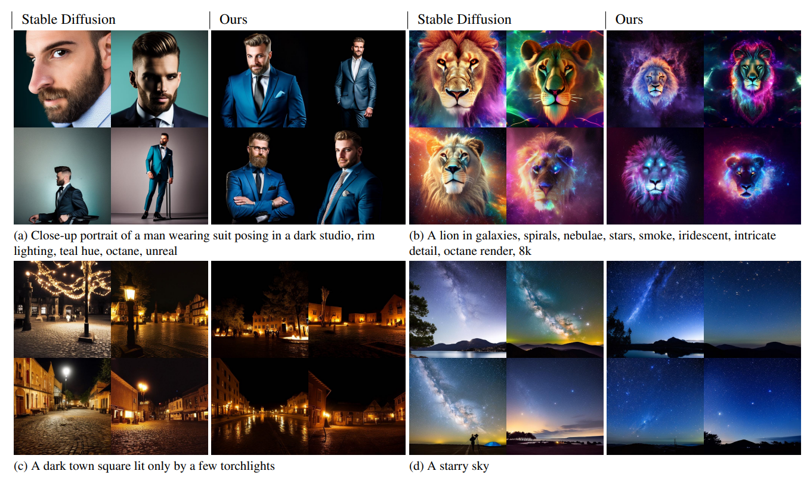

先前无法生成纯黑纯白背景

> It is unable to generate correct images when given explicit prompts, such as “white background” and “Solid black background”, etc.

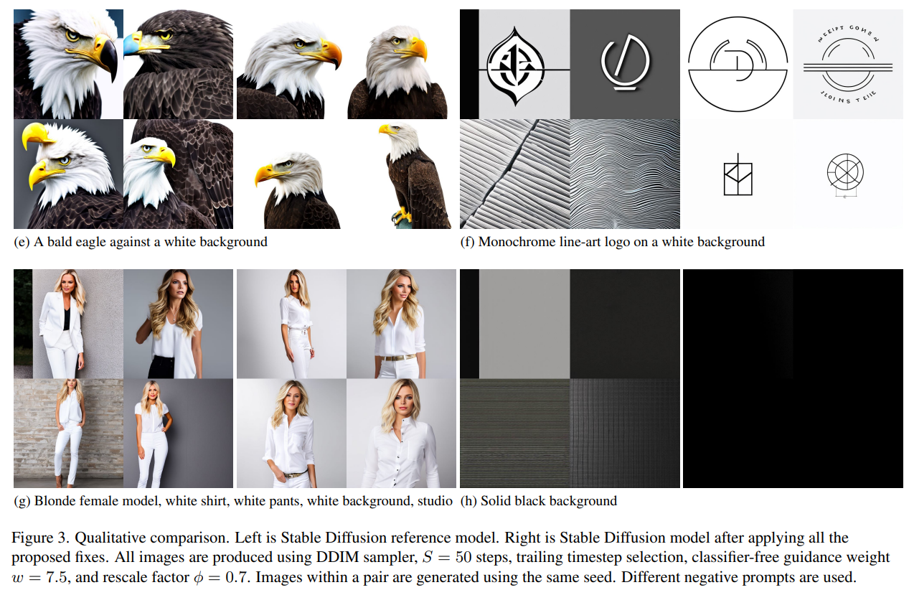

去噪 50 步，FID 降低了 1 可以啊

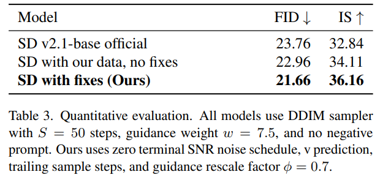

### Ablation

对比哪种 scheduler 更好

infer 去噪步数 S=5 很少时候差距影响很大，S=25 DDIM 效果不如后面两种 scheduler

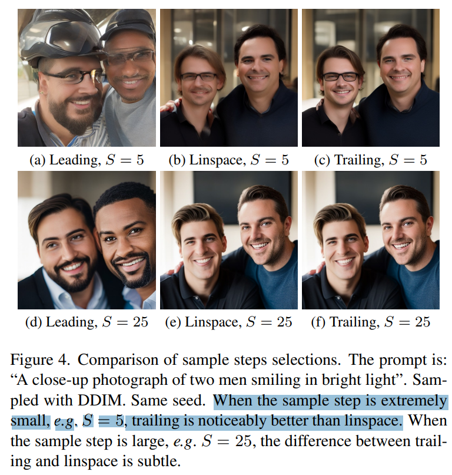

#### Offset Noise?

- Q：和 offset noise 什么关系？

> - "Diffusion with offset noise"'
>
> Offset noise is another technique proposed in [1] to address the **brightness problem in Stable Diffusion.** 

offset noise 增加了一个 noise 偏移，让模型不直接从输入 noise 中获取 mean，去从 prompt 学习

> When using offset noise, the noise at each pixel is no longer iid. since δc shifts the entire channel together. The mean of the noised input is no longer indicative of the mean of the true image. Therefore, the model learns not to respect the mean of its input when predicting the output at all timesteps

offset noise 没有解决本质的训练vs推理不一致的问题，还是有可能出问题，即生成 too bright or too dark

> Offset noise does enable Stable Diffusion model to generate very bright and dark samples but it is incongruent with the theory of the diffusion process and may generate samples with brightness that does not fit the true data distribution, i.e. too bright or too dark. It is a trick that does not address the fundamental issue.

### Zero SNR

t=T SNR=0 理想情况下，**在 t=T 模型会不管输入直接根据 prompt 预测原图，区别出现在 t=T-1**

> At t = T, the model learns to predict the same exact L2 mean of all the data samples regardless of the noise input. In the text-conditional case, the model will predict the L2 mean conditioned on the prompt but invariant to the noise input
>
> Therefore, the first sample step at t = T ideally yields the same exact prediction regardless of noise input. The variation begins on the second sample step.

验证一下，直接对同一个 x0 加不同的高斯噪声，看看去噪各个 step 的预测结果，发现确实 t=T 模型预测都一样；**通过本文方法一次修改后 t=T 的噪声没必要。。。和其余步数割裂开了。。。看几个图的不同敏感程度还是取决于加的噪声**

> This is congruent with our model behavior. Figure 5 shows that our model predicts almost exact results regardless of the noise input at t = T, and the variation begins from the next sample step. In another word, at t = T, the noise input is unnecessary, except we keep it for architectural convenience

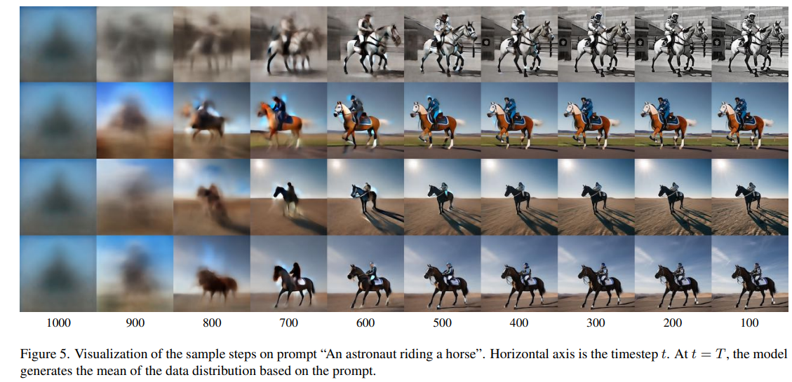

### CFG scale

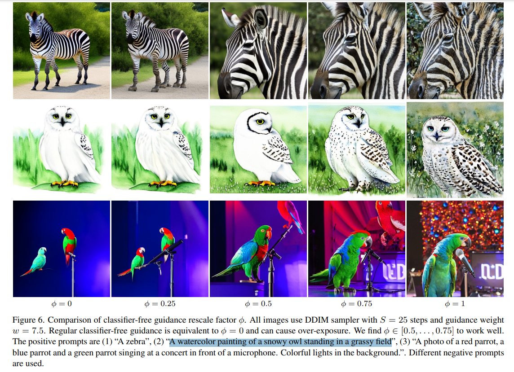

## Limitations

## Summary :star2:

> learn what

- 根据公式定义去 pdb 看 schedule 和 noise 是否和公式完全一致
- offset noise 没有解决本质的训练vs推理不一致的问题，还是有可能出问题，即生成 too bright or too dark。用本文修正训练 vs 推理的问题更好
- 验证一下，直接对同一个 x0 加不同的高斯噪声，看看去噪各个 step 的预测结果，发现确实 t=T 模型预测都一样；**通过本文方法一次修改后 t=T 的噪声没必要。。。和其余步数割裂开了。。。看几个图的不同敏感程度还是取决于加的噪声**

### how to apply to our task

- finetune SD2.1，**1e-4 lr 去微调 5w iteration 可以的**

- Q：如何用到 video2video 任务？

  - SNR=0 有必要调整吗？我们是从 LQ VAE 上加噪得到的，会得到 LQ 的初始低频信息，感觉问题不大？后面验证。

  - 发现在做 CFG 之前调整特征的标准差，出现过度平滑的问题 :star:，会不会是由于 CFG 导致的纹理混乱？？
    - 如何验证？不用 CFG
    - 检查训练测试是否一致？
  - infer 去噪步数 S=5 很少时候差距影响很大，S=25 DDIM 效果不如后面两种 scheduler；换一个 scheduler 看看

- Q：不去微调 SD，怎么搞？分析下 noise 分布为什么会出现黑色伪纹理
  - 在最后一个 timestep 搞一下

