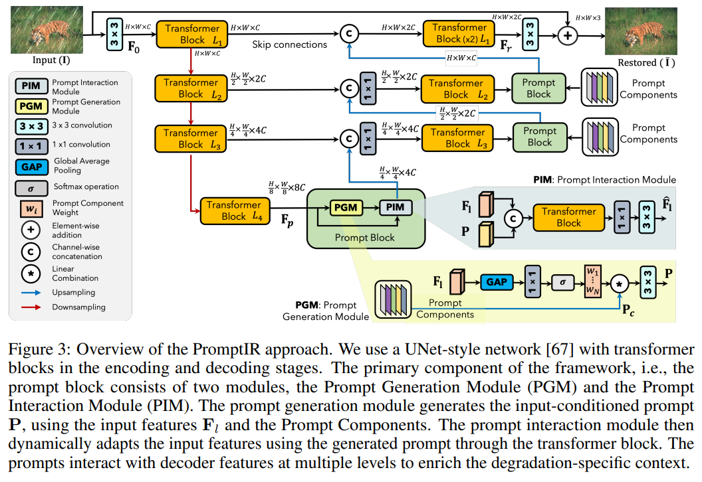

# PromptIR: Prompting for All-in-One Blind Image Restoration

> "PromptIR: Prompting for All-in-One Blind Image Restoration" Arxiv, 2023 Jun 22
> [paper](http://arxiv.org/abs/2306.13090v1) [code](https://github.com/va1shn9v/PromptIR) [pdf](./2023_06_Arxiv_PromptIR--Prompting-for-All-in-One-Blind-Image-Restoration.pdf) [note](./2023_06_Arxiv_PromptIR--Prompting-for-All-in-One-Blind-Image-Restoration_Note.md)
> Authors: Vaishnav Potlapalli, Syed Waqas Zamir, Salman Khan, Fahad Shahbaz Khan

## Key-point

- Task
- Problems
- :label: Label:

## Contributions

## Introduction

## methods

## setting

## Experiment

> ablation study 看那个模块有效，总结一下

## Limitations

## Summary :star2:

> learn what

### how to apply to our task

