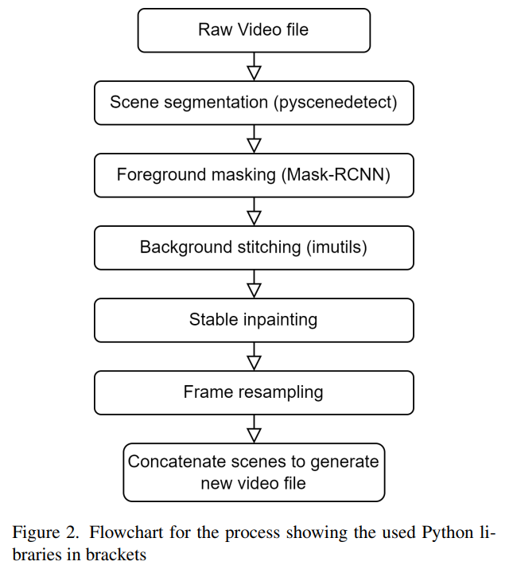

# Stable-Remaster-Bridging-the-Gap-Between-Old-Content-and-New-Displays

> "Stable Remaster: Bridging the Gap Between Old Content and New Displays" Arxiv, 2023 Jun 
> [paper](https://arxiv.org/abs/2306.068[GitHub - naston/StableRemaster: Adjusting aspect ratio of old animated content for new displays.](https://github.com/naston/StableRemaster)03) [code](https://github.com/naston/StableRemaster)
> [paper local pdf](2023_06_Arxiv_Stable-Remaster-Bridging-the-Gap-Between-Old-Content-and-New-Displays.pdf)


## Key-point

**Task: Aspect ratio conversion for animation videos**，宽长比 4:3 的动画片，两边有黑色 bar 不好看，作者想用其他帧的背景信息去填充。先分割出前景，mask 后得到各个帧的背景，做一个整个视频的 total background，做 image stitching，对缺失部分用 stable-diffusion 做生成。

本文类似实验报告，可以看成多个任务组合起来的 pipeline，各个模块用的是现有的 api，不需要训练，只是作者在宽长比 4:3 的老视频做推理。


**Contributions**

## Related Work

- "A content-aware tool for converting videos to narrower aspect ratios" IMX, 2022 Jun
  [paper](https://dl.acm.org/doi/abs/10.1145/3505284.3529970)

- "Imagen Video: High Definition Video Generation with Diffusion Models" Arxiv, 2022 Oct :star: 
  [paper](https://arxiv.org/abs/2210.02303)

  Diffusion in video generation !!!!

- "Object-Ratio-Preserving Video Retargeting Framework Based on Segmentation and Inpainting" WACV, 2023
  [paper](https://openaccess.thecvf.com/content/WACV2023W/WVAQ/html/Jin_Object-Ratio-Preserving_Video_Retargeting_Framework_Based_on_Segmentation_and_Inpainting_WACVW_2023_paper.html)

  > retarget the old video screen ratio to a wider target aspect ratio
  > by using segmentation & inpainting network

- diffusers >> 快速使用 pretrained Stable-diffusion


### Background Collapse & stitch

> [Seam Carving -- 基于内容的图像缩放算法](https://zhuanlan.zhihu.com/p/85136353)
> Seam Carving 算法是下面论文中提出的一种图像缩放算法，它的好处是可以尽可能保持图像中“重要区域”的比例，避免由于直接缩放造成的“失真”。**按区域重要性进行缩放，视觉效果更好，如下图：**
> 
>
> 本文的任务是视频宽长比缩放

- Background Collapse
  involves **identifying and reducing redundant background regions** in images or videos, allowing for the preservation of important foreground elements while resizing or retargeting. 现识别出哪些部分重要
- Background Stitching
  combine parts of images or video frames to create a seamless consistent output
  对于

### video-outpainting

宽长比 9:16 的视频（画面是竖着的，两边为黑色 bar），通过视频画面运动，补出两边黑色 bar 的内容，效果可以参考下面这个论文的图。本文作者用 Stable-diffusion 做 video-outpainting

> "Complete and Temporally Consistent Video Outpainting" CVPR, 2022
> [paper](https://openaccess.thecvf.com/content/CVPR2022W/NTIRE/papers/Dehan_Complete_and_Temporally_Consistent_Video_Outpainting_CVPRW_2022_paper.pdf)


## methods



- scene identification and segmentation

  直接调用 [PySceneDetect](https://github.com/Breakthrough/PySceneDetect)， 文章里面主要讲各个 api 对比 （实验报告类似）

- Foreground Masking

  基于假设：前景为主要物体，背景不变。通过检测前景物体，**mask 掉前景后只用处理背景像素**，之后用这些背景像素去做 image stitching, 生成。

  - bounding box 为最低要求，Mask-RCNN

- Background Stitching

  **create a total background for the scene. (视频所有帧整个的 background)** 减少用 stable-diffusion 进行生成，计算量太大。用 SIFT 特征点匹配得到全局 backgroud 后，输入之后 pipline 判断那些像素需要去生成。

  - SIFT as our method for keypoint detection and description >> image stitching

- Outpaint Region Selection

  用一个 mask 表示哪些区域需要后续 stable diffusion 生成像素

- Stable Diffusion Outpainting

  用上一步的 region mask 输入 stable-diffusion，生成缺失的像素，补充到 total background 里面

  > 作者 2070 的卡，如果不用 background stitching 预处理步骤，只用 stable-diffusion 20min 视频需要 400h （大约16天）生成

- Frame Resampling

  用 background stitching 里面的 affine transformation 的逆变换，去转回原来的视角


## Experiment

- one RTX 2070 SUPER >> 8G 显存

  不用训练，只推理

### Dataset

本文主要做**老视频长宽比调整，**可以理解成多个 task 模型的 pipline，因此不需要 labeled data. 收集宽长比 4:3 的动画，用于验证。

- **gathered videos from the animated television show ’Avatar the Last Airbender**

- Evaluation: manual inspection
anything seems out of place or violates environmental rules set by the animator it would be deemed incorrect.


## Limitations

- Mask RCNN 前景分割不准确
- 生成+拼接的背景有明显分隔，色差


## Code implementation

- MaskRCNN

  ```python
  import torchvision
  
  model = torchvision.models.detection.maskrcnn_resnet50_fpn(weights = "DEFAULT")
  device = 'cuda' if torch.cuda.is_available() else 'cpu'
  model = model.to(device)
  model.eval()
  
  transform = T.ToTensor()
  # frame: np.ndarray
  frame_input = transform(frame).to(device)
  
  with torch.no_grad():
      pred = model([frame_input])
  
  masks = pred[0]["masks"].cpu()
  labels = pred[0]['labels'].cpu()
  scores = pred[0]['scores'].cpu()
  ```

- Image Stitching

  > [blog: SIFT matching python](https://zhuanlan.zhihu.com/p/102272392)
  > [PythonSIFT github](https://github.com/rmislam/PythonSIFT) :+1:
  >
  > `src/frame_stitching.py`

  ```python
  def stitch_images(image1, image2, mask1, mask2, scale=1):
      # Detect features and keypoints using SIFT
      sift = cv2.SIFT_create()
      #display_masked_image(image1,mask1)
      keypoints1, descriptors1 = sift.detectAndCompute(image1, mask1)
      keypoints2, descriptors2 = sift.detectAndCompute(image2, mask2)
      
      # Match the features using FLANN-based matcher
      FLANN_INDEX_KDTREE = 1
      index_params = dict(algorithm=FLANN_INDEX_KDTREE, trees=5)
      search_params = dict(checks=50)
      flann = cv2.FlannBasedMatcher(index_params, search_params)
      matches = flann.knnMatch(descriptors1, descriptors2, k=2)
      
      # Filter good matches using the ratio test
      good_matches = []
      for pair in matches:
          if len(pair) == 2:
              m, n = pair
              if m.distance < 0.5 * n.distance:
                  good_matches.append(m)
  
      if len(good_matches) < 4:  # Minimum number of matches required for homography
          print("Not enough good matches found to stitch the images.")
          print("# of good matches:", len(good_matches))
          return image1, mask1, np.array([[0,0,0],[0,0,0]])
  
      # Extract the matched points
      src_pts = np.float32([keypoints1[m.queryIdx].pt for m in good_matches]).reshape(-1, 1, 2)
      dst_pts = np.float32([keypoints2[m.trainIdx].pt for m in good_matches]).reshape(-1, 1, 2)
      # Compute the Affine Transformation using RANSAC
      M, _ = cv2.estimateAffine2D(src_pts, dst_pts, cv2.RANSAC)
      M_o = np.copy(M)
      x_offset = M[0,2]
      y_offset = M[1,2]
      
      # ...
      warped_image2 = cv2.warpAffine(image2, M, (w, h))
      warped_mask = cv2.warpAffine(mask2,M, (w,h))
      im_sum = np.sum([warped_image2, warped_mask], axis=0)
      
      return im_sum
  ```

- `diffusers.StableDiffusionInpaintPipeline`

  initialize

  ```python
  from diffusers import StableDiffusionInpaintPipeline
  import torch
  
  def get_sd_pipe():
      if torch.cuda.is_available():
          print('Device: CUDA')
          print('-'*30)
          pipe = StableDiffusionInpaintPipeline.from_pretrained(
              "runwayml/stable-diffusion-inpainting",
              revision="fp16",
              torch_dtype=torch.float16,
          )
          device = torch.device('cuda')
      else:
          print('Device: CPU')
          print('-'*30)
          pipe = StableDiffusionInpaintPipeline.from_pretrained("runwayml/stable-diffusion-inpainting",)
          device = torch.device('cpu')
  
      pipe = pipe.to(device)
  
      def dummy(images, **kwargs):
          return images, False
      pipe.safety_checker = dummy
  
      return pipe
  ```

  inference: 对 total background 但张图进行 inpaint

  ```python
  sub_frame = Image.fromarray(sub_frame).convert("RGB")
  sub_mask = Image.fromarray(sub_mask).convert("RGB")
  
  new_sub_frame = pipe(prompt='animated background',image=sub_frame, 
                       mask_image=sub_mask,height=sample_height,width=sample_width).images[0]
  frame[y:(y+sample_height),x:(x+sample_width),:] = np.array(new_sub_frame)
  mask[y:(y+sample_height),x:(x+sample_width)]=0
  ```

  


## Summary :star2:

> learn what & how to apply to our task

- 文章用各个现有模型实现了一个 pipline，找到一个应用场景（4:3 宽长比的老动画）硬套上去。**但各个模块用现有 api 可以学习下**
  - [PySceneDetect](https://github.com/Breakthrough/PySceneDetect) 获取场景分割结果，保存为 MP4
  - [python-imutils](https://github.com/PyImageSearch/imutils) 进行图像 stitching
  - diffusers 库快速搭建 stable-diffusion 的 pipline
- **stable-diffusion 生成效率低，加上一些预处理步骤减少需要生成的像素**
- 了解一下视频宽长比调整（通过补充背景信息的方式来做）的 pipeline