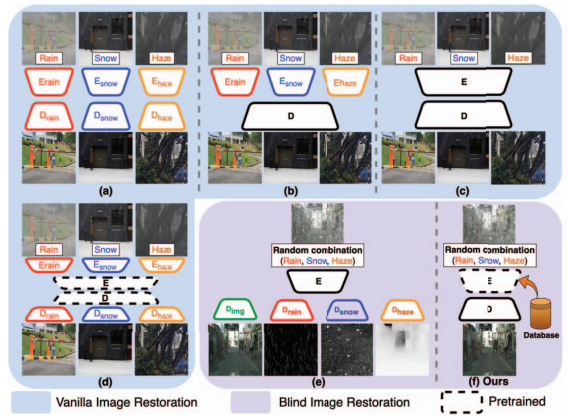
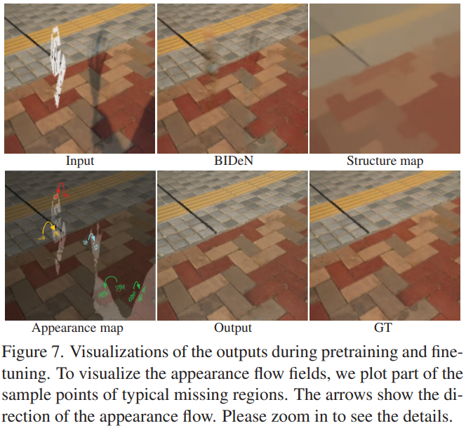

# CPNet

> "Context-Aware Pretraining for Efficient Blind Image Decomposition" CVPR, 2023 Jun, CPNet :warning:
> [paper](https://ieeexplore.ieee.org/document/10204969) [code](https://github.com/Oliiveralien/CPNet)
> [note](./2023_06_CVPR_Context-Aware_Pretraining_for_Efficient_Blind_Image_Decomposition.pdf)

- Blind Restoration frameworks

  简化指定退化的 Encoder，Decoder。harnessing the prior knowledge learned during pretraining **用一套模型应对多种退化**

  

## methods

- 用双分支的好处

  > 双分支另一个分支用 mask，为了避免信息泄露，对于加了 noise 的图 mask而不是对 GT mask

  双分支各个输入的噪声不同，通过这种堆叠噪声的形式，使得模型学习到更多 spatial information

- FIBlock 特征交互模块

  用 channel & spatial 注意力

- FRBlock

  bottleneck 用 Transformer 来融合 Encoder 的浅层特征

- Decoder

  参考 MAE 中的发现，Encoder 得到的特征需要时高度语义的特征，而 **Decoder 对于重建任务用高效&轻量的结构就行，因为只需要重建出 pixel 像素值，是相对冗余且 low-level 的信息**

-  Loss

  - 为了学习 structure，用 ` edge-preserved smooth method` 取消除模型预测结果终的高频纹理部分 $S_{gen}$
    $$
    \mathcal{L}_{\ell_1}=\left\|S_{gen}-S_{gt}\right\|_1.
    $$

  - Conditional learning :star:

    实现多种退化的统一，视为 attribute editing task

    用一个 discriminator 取预测噪声类型

  - new sampling loss 取融合 structure 和 details
    $$
    \mathcal{L}_{sam}=\frac{1}{N}\sum_{(x,y)\in\Omega}\exp\left(-\frac{\mu\left(\Phi_{I_{gt}}^{x,y},\Phi_{I_{in}}^{x+\Delta x,y+\Delta y}\right)}{\alpha\left\|\Phi_{S_{gt}}-\Phi_{S_{gen}}\right\|_{1}+\epsilon}\right)
    $$
    

## Experiment

- appearance

  