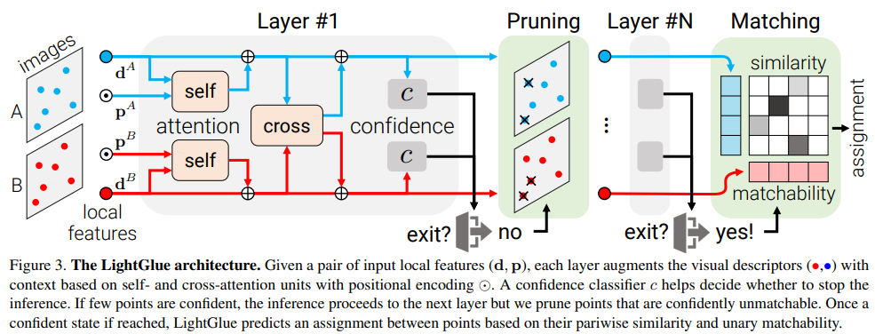
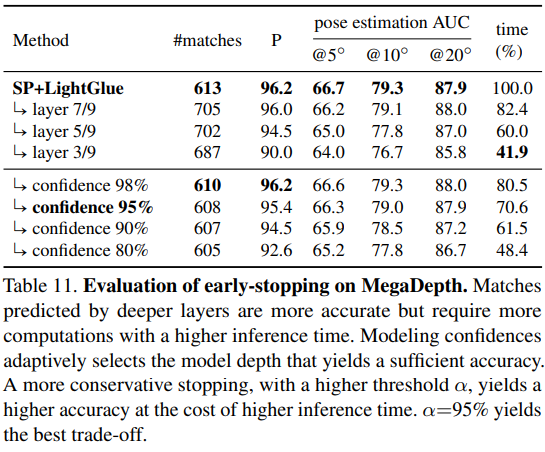

# LightGlue: Local Feature Matching at Light Speed

> "LightGlue: Local Feature Matching at Light Speed" ICCV, 2023 Jun
> [paper](http://arxiv.org/abs/2306.13643v1) [code](https://github.com/cvg/LightGlue) 
> [pdf](./2023_06_ICCV_LightGlue--Local-Feature-Matching-at-Light-Speed.pdf)
> Authors: Philipp Lindenberger, Paul-Edouard Sarlin, Marc Pollefeys

## Key-point

- Task
- Background
- :label: Label:

the inference is much faster on image pairs that are intuitively easy to match

**adaptive stopping mechanism** gives a fine-grained control over the speed vs. accuracy trade-off

## Contributions

## Related Work

## methods

设置多个 layer 去对特征点筛选，每层内部用分类器 C 判断是否继续匹配，有效避免不相似的块继续浪费资源匹配。

n find out early that some points (?) are unmatchable and thus exclude them from subsequent lay

> 同一视频片段内部，差异较小，特征点可以复用，只需学习微小偏移

## Experiment

> ablation study 看那个模块有效，总结一下

- early stopping

## Limitations

## Summary :star2:

> learn what & how to apply to our task

