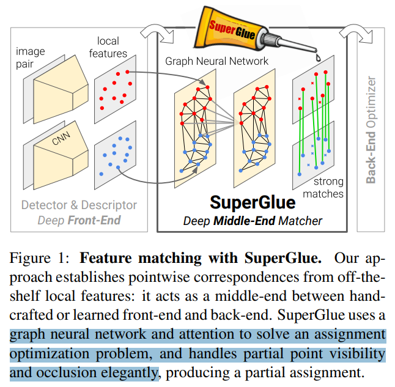

# LightGlue: Local Feature Matching at Light Speed

> "LightGlue: Local Feature Matching at Light Speed" ICCV, 2023 Jun
> [paper](http://arxiv.org/abs/2306.13643v1) [code](https://github.com/cvg/LightGlue) [pdf](./2023_06_ICCV_LightGlue--Local-Feature-Matching-at-Light-Speed.pdf) [note](./2023_06_ICCV_LightGlue--Local-Feature-Matching-at-Light-Speed_Note.md)
> Authors: Philipp Lindenberger, Paul-Edouard Sarlin, Marc Pollefeys

## Key-point

- Task
- Problems
  - 匹配效率低

- :label: Label:

## Contributions

- 根据输入的难度，选择部分网络进行特征优化，**实现加速** （简单的 case 只用1-2 就 ok，难得再多过一些 layer）

>  One key property is that LightGlue is adaptive to the difficulty of the problem: the inference is much faster on image pairs that are intuitively easy to match, for example because of a larger visual overlap or limited appearance change.

- 匹配加速 -> 后续 3D 重建任务加速

> This opens up exciting prospects for deploying deep matchers in latency-sensitive applications like 3D reconstruction.

- 本文效果和 dense matcher LoFTR 差不多，速度提升 8 倍

## Introduction

用于匹配的图像特征影响很大

> The most common approach to image matching **relies on sparse interest points that are matched using high-dimensional representations encoding their local visual appearance.** Reliably describing each point is challenging in conditions that exhibit symmetries, weak texture, or appearance changes due to varying viewpoint and lighting. To reject outliers that arise from occlusion and missing points, such representations should also be discriminative. This yields two conflicting objectives, robustness and uniqueness, that are hard to satisfy.

SuperGlue 使用 Atten 学习匹配，泛化性很好啊

> It leverages the powerful Transformer model [74] to learn to match challenging image pairs from large datasets. This yields robust image matching in both indoor and outdoor environments. 

使用 Attention 推理效率低。。

> however computationally expensive, while the efficiency of image matching is critical for tasks that require a low latency, like tracking, or a high processing volume, like large-scale mapping
>
> Additionally, SuperGlue, as with other Transformer-based models, is notoriously hard to train, requiring computing resources that are inaccessible to many practitioners.

- Q：motivation?

**提速 SuperGlue 推理效率，对模型改进，降低训练成本**

> In this paper, we draw on these insights to design LightGlue, a deep network that is more accurate, more efficient, and easier to train than SuperGlue. 
>
> We distill a recipe to train highperformance deep matchers with limited resources, reaching state-of-the-art accuracy within just a few GPU-days.

本文效果和 dense matcher LoFTR 差不多，速度提升 8 倍。实现推理效率 & 准确性的均衡

> As shown in Figure 1, LightGlue is Pareto-optimal on the efficiency-accuracy trade-off when compared to existing sparse and dense matchers

- Q：如何优化速度？

模仿人类处理的思路，**根据输入的难度，只用部分网络进行特征优化，实现加速** （简单的 case 只用1-2 就 ok，难得再多过一些 layer）

> Unlike previous approaches, LightGlue is adaptive to the difficulty of each image pair, which varies based on the amount of visual overlap, appearance changes, or discriminative information. 
>
> , a behavior that **is reminiscent of** how humans process visual information. 

经过一些 layer 让模型自己去检查是否要继续处理 or 丢掉一些点

> This is achieved by 1) predicting a set of correspondences after each computational blocks, and 2) enabling the model to **introspect them and predict whether further computation is required.** LigthGlue also discards at an early stage points that are not matchable, thus focusing its attention on the covisible area.

支持 plug&play 到 SLAM，对于两个 feature sets 可以预测很强的关联性

> Our experiments show that LightGlue is a plug-and-play replacement to SuperGlue: **it predicts strong matches from two sets of local features**, at a fraction of the run time.

### Deep matchers

- "SuperGlue: Learning Feature Matching with Graph Neural Networks" CVPR, 2019 Nov 26
  [paper](http://arxiv.org/abs/1911.11763v2) [code](https://github.com/magicleap/SuperGluePretrainedNetwork.) [pdf](./2019_11_CVPR_SuperGlue--Learning-Feature-Matching-with-Graph-Neural-Networks.pdf) [note](./2019_11_CVPR_SuperGlue--Learning-Feature-Matching-with-Graph-Neural-Networks_Note.md)
  Authors: Paul-Edouard Sarlin, Daniel DeTone, Tomasz Malisiewicz, Andrew Rabinovich

> The first of its kind, SuperGlue [56] combines the expressive representations of Transformers [74] with optimal transport [48] to solve a partial assignment problem.
>
> It learns powerful priors about scene geometry and camera motion and is thus robust to extreme changes and generalizes well across data domains. 

SuperGlue 随着点数增加，复杂度太高

> Inheriting the limitations of early Transformers, SuperGlue is hard to train and its complexity grows quadratically with the number of keypoints.

LoFTR 搞了一个稠密的 grid 作为参考点，性能好很多，但更加慢了。。。

> Conversely, dense matchers like LoFTR [68] and followups [9, 78] match points distributed on dense grids rather than sparse locations. This boosts the robustness to impressive levels but is generally much slower because it processes many more elements. 
>
> This limits the resolution of the input images and, in turn, the spatial accuracy of the correspondences. While LightGlue operates on sparse inputs, we show that fair tuning and evaluation makes it competitive with dense matchers, for a fraction of the run time
>
> - "LoFTR: Detector-Free Local Feature Matching with Transformers" CVPR, 2021 Apr 1
>   [paper](http://arxiv.org/abs/2104.00680v1) [code]() [pdf](./2021_04_CVPR_LoFTR--Detector-Free-Local-Feature-Matching-with-Transformers.pdf) [note](./2021_04_CVPR_LoFTR--Detector-Free-Local-Feature-Matching-with-Transformers_Note.md)
>   Authors: Jiaming Sun, Zehong Shen, Yuang Wang, Hujun Bao, Xiaowei Zhou

- Q：图像局部特征咋来的？

**local features：关键点位置包含坐标 和 detection confidence；visual descriptor 使用 SIFT 或 SuperPoint 类似的  CNN 提取特征**

> Positions consist of x and y image coordinates as well as a detection confidence c, pi := (x, y, c)i .
>
> Visual descriptors di ∈ R D can be those extracted by a CNN like SuperPoint or traditional descriptors like SIFT

看 SuperGlue 文章里面，使用 （位置，visual descriptor）

> Images A and B have M and N local features, indexed by A := {1, ..., M} and B := {1, ..., N}, respectively.
>
> We design LightGlue to output a set of correspondences M = {(i, j)} ? A × B
>
> Each point is matchable at least once, as it stems from a unique 3D point, and some keypoints are unmatchable, due to occlusion or non-repeatability

- Q：如何对 SuperGlue 加速？

减少点数。。性能垃圾

> Subsequent works make it more efficient by reducing the size of the attention mechanism

根据输入难度，动态调整 "网络大小"

> LightGlue instead brings large improvements for typical operating conditions, like in SLAM, without compromising on performance for any level of difficulty. This is achieved by dynamically **adapting the network size instead of reducing its overall capacity.**

## methods

多层堆叠得网络，每层显示地去对特征进行优化。

> LightGlue is made of a stack of L identical layers that process the two sets jointly. Each layer is composed of self- and cross-attention units that update the representation of each point.

设计了一个提前退出机制，如果当前 layer 的特征足够好就退，后面层没必要过了吧。

> A confidence classifier c helps decide whether to stop the inference. If few points are confident, the inference proceeds to the next layer but we prune points that are confidently unmatchable.

### Adaptive depth and width

> - "Confident Adaptive Language Modeling" NIPS
> - "Depth-Adaptive Transformer" ICLR
> - "BranchyNet: Fast inference via early exiting from deep neural networks" ICPR
> - "Anytime Stereo Image Depth Estimation on Mobile Devices" ICRA
> - "Anytime Dense Prediction with Confidence Adaptivity" ICLR

- Q：如何评估特征足够好？:star:

搞了一个 MLP 预测每个特征点是否可靠？

> We add two mechanisms that avoid unnecessary computations and save inference time
>
> . At the end of each layer, LightGlue infers the confidence of the predicted assignment of each poi

> We observe, as in [62], that the classifier itself is less confident in early layers

exit 未达到的一些点，认为没用，就丢掉，降低点数

> Point pruning: When **the exit criterion is not met**, points that are predicted as both confident and unmatchable are unlikely to aid the matching of other points in subsequent layers. Such points are for example in areas that are clearly not covisible across the images. We therefore discard them at each layer and feed only the remaining points to the next one. This significantly reduces computation, given the quadratic complexity of attention, and does not impact the accuracy

发现可以加速训练

### Comparison with SuperGlue

- Q：和 SuperGlue 很像？

Attention 加了相对位置编码

LightGlue 把相似度和可匹配度分解开，专门搞一个 MLP 去预测匹配度

> SuperGlue predicts an assignment by solving a differentiable optimal transport problem using the Sinkhorn algorithm [66, 48]. It consists in many iterations of row-wise and column-wise normalization, which is expensive in terms of both compute and memory. SuperGlue adds a dustbin to reject unmatchable points
>
> **We found that the dustbin entangles the similarity score of all points and thus yields suboptimal training dynamics**. LightGlue disentangles similarity and matchability, which are much more efficient to predict

LightGlue 网络更轻量，每个 layer 出 confidence 更方便，能判断 exit

> The lighter head of LightGlue makes it possible to predict an assignment at each layer and to supervise it. This speeds up the convergence and enables exiting the inference after any layer, which is key to the efficiency gains of LightGlue

## setting

> Our experiments show that LightGlue is a plug-and-play replacement to SuperGlue

- Q：训练 trick？

exit 机制筛掉一部分 unmatched 点，加速训练

> : While the LightGlue architecture improves the training speed, stability, and accuracy, we found that some details have a large impact too. 

增加 interest points 点数

> Training with more points also does: we use 2k per image instead of 1k.

一个 24G VRAM mixed-precision + gradientCheckpoint 实现 bs=32 :star:

> The batch size matters: we use gradient checkpointing [10] and mixed-precision to fit 32 image pairs on a single GPU with 24GB VRAM

- Q：网络结构？

> Implementation details: LighGlue has L=9 layers. Each attention unit has 4 heads. All representations have dimension d=256. Throughout the paper, run-time numbers labeled as optimized use an efficient implementation of selfattention [14]. More details are given in the Appendix.

## Experiment

> ablation study 看那个模块有效，总结一下

提前 exit 的点标注红色，看起来确实有点用，能实现加速。

?	

效果和 LoFTR 接近了

至少可以加速

展示不同难度的匹配图像，adaptive-width 是动态减少 interest point 点数（初期不可匹配的点）。adaptive depth 减少 layers 数

## Limitations

## Summary :star2:

> learn what & how to apply to our task

- Q：能否借鉴类似只过几层实现提速？减少加噪步数

- Q：分辨率有啥影响嘛，4K 一样快？

