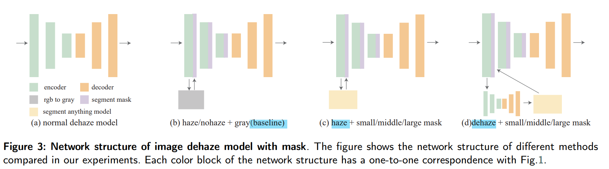

# Let Segment Anything Help Image Dehaze

> "Let Segment Anything Help Image Dehaze." ArXiv (2023)
> [paper](https://arxiv.org/abs/2306.15870)
> [Blog methods brief](https://mp.weixin.qq.com/s/dkF3pMdJIpBaMsdv8V8EjQ)

## Key-point

**Contributions**

- 利用 SAM 大模型（large-scale datasets and large-scale models） 上获得的先验，有去雾能力
- 通过 gray-scale coding & channel expansion ，**提出一个 framework 将 SAM 大模型与 low-level 小数据上训得小模型进行融合**，提升去雾效果

## Related Work

> Image Hazing model

融入 SAM 后的 image hazing model

## methods

没有去雾的图输入 SAM 得到分割结果，经过提出的 grayscale encoding 转为灰度图（越亮代表细节 segments 越多）。将此分割结果，扩展一个 channel 输入到去雾 Encoder。

### grayscale encoding

将 SAM 输出的分割结果，转化为灰度图，用于之后扩展通道到 Encoder上。

作者分析 haze 数据集最多能分割出 130 个物体，目标是将这些序号映射到 0-255 范围 && **约亮代表此处 segments 越多**

### dehaze with SAM

baseline 直接用 haze 图转为灰度图，输入到 encoder 增加的通道中

dehaze + SAM 先去雾（haze+SAM 里面不先处理，haze 图直接输入 SAM），把去雾结果输入到 SAM 中进行分割，在输入到 encoder 增加的通道中

- dehaze model

  > paper Page 11

  U-net, Uformer, Restormer

## Exp

> 不同 haze concentration 烟雾浓度对于分割的影响

现有数据集没有区分烟雾浓度，用 UE5 游戏引擎渲染不同浓度烟雾的场景。

Fig4，发现浓度 0.2下，SAM 还能分割出窗户，效果还可以。detection rate gradually decreased from 100% to 88%

> 不同大小的分割模型对 nohaze, haze 图像分割结果
> [paper Page 8](./2023_June_Let-Segment-Anything-Help-Image-Dehaze.pdf#page8)

非均匀烟雾对 dehaze model 有些困难，单对 SAM large 没影响

> SAM mask 可以加速 dehaze 模型收敛

**Limitations**

## Summary :star2:

> learn what & how to apply to our task