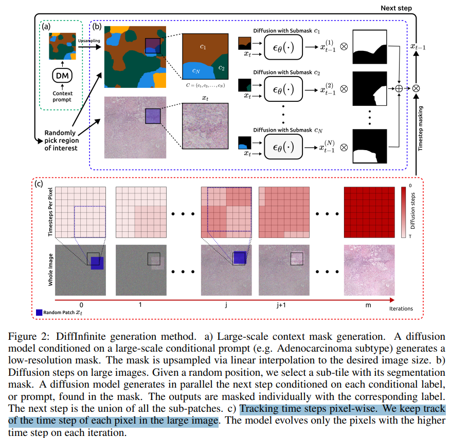

# DiffInfinite: Large Mask-Image Synthesis via Parallel Random Patch Diffusion in Histopathology

> "DiffInfinite: Large Mask-Image Synthesis via Parallel Random Patch Diffusion in Histopathology" NIPS, 2023 Jun 23
> [paper](http://arxiv.org/abs/2306.13384v2) [code](https://github.com/marcoaversa/diffinfinite) [pdf](./2023_06_NIPS_DiffInfinite--Large-Mask-Image-Synthesis-via-Parallel-Random-Patch-Diffusion-in-Histopathology.pdf) [note](./2023_06_NIPS_DiffInfinite--Large-Mask-Image-Synthesis-via-Parallel-Random-Patch-Diffusion-in-Histopathology_Note.md)
> Authors: Marco Aversa, Gabriel Nobis, Miriam Hägele, Kai Standvoss, Mihaela Chirica, Roderick Murray-Smith, Ahmed Alaa, Lukas Ruff, Daniela Ivanova, Wojciech Samek, Frederick Klauschen, Bruno Sanguinetti, Luis Oala

## Key-point

- Task: generates arbitrarily large histological images 病理组织图像生成
- Problems
- :label: Label:

## Contributions

## Introduction

## methods

> Given a random position, we select a sub-tile with its segmentation mask.

overlap 区域的 VAE 特征再次加噪 -> overlap 区域的 pixel 就会有不同 timestep 了

自己搞了一个 VAE 提取特征，假设 VAE 没有损失。。。

> For simplicity, we assume throughout this work the existence of an ideal encoder-decoder pair pΦ, Ψq such that ΨpΦpXqq “ X is the identity on R KD

## setting

## Experiment

> ablation study 看那个模块有效，总结一下

## Limitations

## Summary :star2:

> learn what

### how to apply to our task

- 还是随机生成。。。SR 的结果不要求一致性
- 自己搞了一个 VAE 提取特征，假设 VAE 没有损失。。。
- overlap 区域的 VAE 特征再次加噪 -> overlap 区域的 pixel 就会有不同 timestep 了
