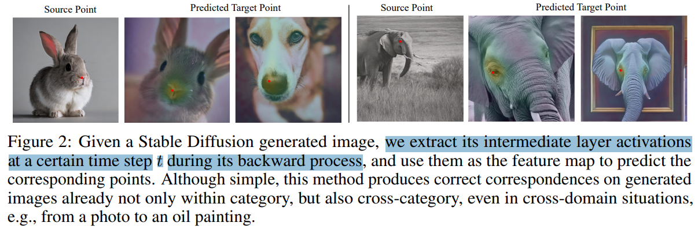
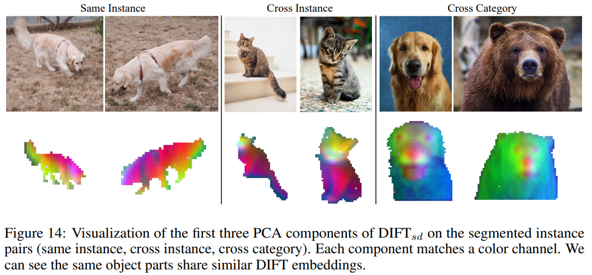

# Emergent Correspondence from Image Diffusion

> "Emergent Correspondence from Image Diffusion" NIPS-2023, 2023 Jun 6
> [paper](http://arxiv.org/abs/2306.03881v2) [code](https://diffusionfeatures.github.io) [pdf](./2023_06_NIPS_Emergent-Correspondence-from-Image-Diffusion.pdf) [note](./2023_06_NIPS_Emergent-Correspondence-from-Image-Diffusion_Note.md)
> Authors: Luming Tang, Menglin Jia, Qianqian Wang, Cheng Perng Phoo, Bharath Hariharan(Cornell University)

## Key-point

- Task: correspondences between images
- Problems
- :label: Label:

## Contributions

- 发现 SD 自带 correspondence 能力

> we show that correspondence emerges in image diffusion models *without any explicit supervision*

- 提出**一种抽取 SD UNet decoder 特征做匹配的简单方式**，对于 match point 做插值提取特征（类似 deformable cnn），计算特征之间距离做匹配

> We propose **a simple strategy to extract this implicit knowledge out of diffusion networks** as image features, namely **DI**ffusion **F**ea**T**ures (**DIFT**), and use them to establish correspondences between real images

- 做了实验验证抽取哪些去噪 timesteps 的特征更有效，**这些 feature 效果和一些手工特征有类似效果**
- SOTA

> Particularly for semantic correspondence, DIFT from Stable Diffusion is able to outperform DINO and OpenCLIP by 19 and 14 accuracy points respectively on the challenging SPair-71k benchmark.

## Introduction

发现人类具有自监督学习关键点匹配的能力，不用特殊训练，看起来方式和自监督很像。因此找一些 self-supervised 方法探索一下，这些方法怎么学习到匹配信息

> However, in this paper, we look to a new class of self-supervised models that has been attracting attention: diffusion-based generative models [32, 79]. 

diffusion 生成图像的学习过程也类似自监督方法，因此从 diffusion 入手，**这个过程中隐式地做出了假设 diffusion 能有关键点匹配能力** :star:

- Q：怎么用 diffusion 得到匹配的关键点？

> We therefore ask, do image diffusion models learn correspondences?
>
> Unfortunately, the U-Net is trained to de-noise, and so has been trained on noisy images. Our strategy for handling this issue is simple but effective: we add noise to the input image (thus simulating the forward diffusion process) before passing it into the U-Net to extract feature maps. 

对输入图像加噪，提取 diffusion feature map 做 cosine similarity 

> We call these feature maps (and through a slight abuse of notation, our approach) DIffusion FeaTures (DIFT). DIFT can then be used to find matching pixel locations in the two images by doing simple nearest neighbor lookup using cosine distance. We find the resulting correspondences are surprisingly robust and accurate (Fig. 1), even across multiple categories and image modalities.

从三个角度评估匹配质量，语义信息、方位信息、时序，看方法部分有解释！

> We evaluate DIFT with two different types of diffusion models, on three groups of visual correspondence tasks including semantic correspondence, geometric correspondence, and temporal correspondence.

## methods

给定一张图 & 图中的一个点，去找另一张图中的对应点

> Given two images I1, I2 and a pixel location p1 in I1, we are interested in finding its corresponding pixel location p2 in I2. Relationships between p1 and p2 could be semantic correspondence (i.e., pixels of different objects that share similar semantic meanings), geometric correspondence (i.e., pixels of the same object captured from different viewpoints), or temporal correspondence (i.e., pixels of the same object in a video that may deform over time).

理想情况得到了图像的 feature map，**去指定的位置点 p 做插值得到那一点的特征**，对这个特征计算距离

在 inference 阶段，**对于两张生成的图像**，发现提取指定去噪步数 t 下的 feature map 能得到一些有意义的匹配点；之后发现对于真实图像就不准了 :cry:

> As illustrated in Fig. 2, this straightforward approach allows us to find correct correspondences between generated images, even when they belong to different categories or domains.

- Q：为什么对真实图像不准？

认为真实图像分布和 UNet 加噪声的特征分布不同

> Replicating this approach for real images is challenging because of the fact that the real image itself does not belong to the training distribution of the U-Net (which was trained on noisy images), 

对真实图像加噪声，实现 feature domain 的匹配，在真实图像上的匹配效果来了！

> Fortunately, we found a simple approximation using the forward diffusion process to be effective enough. Specifically, we first add noise of time step t to the real image (Eq. (2)) to move it to the xt distribution, 
>
> As shown in Figs. 1 and 3, this approach yields surprisingly good correspondences for real images.

- Q：哪一层 UNet 特征、去噪步数 t 得到的特征匹配效果更好？

> Moving forward, a crucial consideration is the selection of the time step t and the network layer from which we extract features

发现去噪初期（T 大）& 网络靠近输入的层数，具有语义（大致内容信息）；后期都是细节 low-level 纹理信息

> Intuitively we find that a larger t and an earlier network layer tend to yield more semantically-aware features, while a smaller t and a later layer focus more on low-level details.

**做 grid search** 找这两个变量的最优解 :star:

> For example, semantic correspondence likely benefits from more semantic-level features, whereas geometric correspondence between two views of the same instance may perform well with low-level features. We therefore use a 2D grid search to determine these two hyper-parameters for each correspondence task. For a comprehensive list of the hyper-parameter values used in this paper, please refer to Appendix C.

###  Semantic Correspondence

对比了两种 image diffusion, SD 和 ADM，两个模型对应符号 $DIFT_{sd}, DIFT_{adm}$

> We extract DIFT from two commonly used, open-sourced image diffusion models: Stable Diffusion 2-1 (SD) [70] and Ablated Diffusion Model (ADM) [17]. **SD is trained on the LAION** [75] whereas **ADM is trained on ImageNet** [15] without labels. We call these two features DIFTsd and DIFTadm respectively.

- Q：发现差别在于数据，如何消除训练数据的影响客观性？ :star:

同时做了使用统一数据的，其他自监督方法，

> OpenCLIP [36] with ViT-H/14 [18] trained on LAION, as well as DINO [10] with ViT-B/8 trained on ImageNet [15] without labels. 

### Ablation on U-Net layer :star:

- Q：search which layer

**只做了 upsample block 提取特征的实验** :warning: 看 appendix C

> The total time step T for both diffusion models (ADM and SD) is 1000. U-Net consists of downsampling blocks, middle blocks and upsampling blocks. **We only extract features from the upsampling blocks.**

> As mentioned in the last paragraph of Sec. 4.2, when extracting features for one single image using DIFT, we use a batch of random noise to get an averaged feature map. The batch size is 8 by default. We shrink it to 4 when encountering GPU memory constraints.

> Compared to the definition of 4 block choices in Appendix C, here we make a more fine-grained sweep over SD’s 15 layers inside U-Net upsampling blocks. The transition from block index n to layer index i is 0/1/2/3 to 3/7/11/14 respectively and both start from 0. We evaluate PCK per point on SPair-71k using DIFTsd with different layer index i. As shown in Fig. 13, the accuracy varies but there are still multiple choices of i that lead to good performance.

**SD Upsample Block 中间几层的特征效果显著**，最小的 scale 没多大用

- Q：text 用啥？

同一用含有 class 标签的一句话，class 标签数据集给的

> Instead, we use a general prompt “a photo of a [class]” where [class] denotes the string of the input images’ category, which is given by the dataset. 

## setting

数据

- SPair-71k，最难的语义匹配数据集，12234 张图像，18个类别
- PF-Willow 900 个图像对，PASCAL VOC 数据的子集
- 14 different splits of CUB (each containing 25 images)

> SPair-71k [55], PF-WILLOW [27] and CUB-200-2011 [89]. SPair-71k is the most challenging semantic correspondence dataset, containing diverse variations in viewpoint and scale with 12,234 image pairs on 18 categories for testing. PF-Willow is a subset of PASCAL VOC dataset [20] with 900 image pairs for testing. For CUB, following [58], we evaluate 14 different splits of CUB (each containing 25 images) and report the average performance across all splits.

发现之前方法对比的 metrics 不统一。。。整理一下

> We observed inconsistencies in PCK measurements across prior literature1

- percentage of correct keypoints (PCK)，给一个距离 & 阈值，在范围内部算 ok

  - PCK per point，数据集中所有的预测点 -> `预测的所有点中 ok 的个数 / 预测所有点的个数`

    > use the total number of correctly-predicted points in the whole dataset (or each category split) divided

  - PCK per image，以单张图像去统计点的 PCK，数据集每张图的 PCK 取平均

> Following prior work, we report the percentage of correct keypoints (PCK). The predicted keypoint is considered to be correct if they lie within α · max(h, w) pixels from the ground-truth keypoint for α ∈ [0, 1]

## Experiment

> ablation study 看那个模块有效，总结一下

SD 使用本文 DIFT 方法做匹配，比 DINO & OpenCLIP 大部分 class 上准，除了 Person、Car 类别上；

SD 做匹配的性能和监督方法的 SOTA 稍微差一点，**但 SD 性能比 ADM 好多了，之后主要探索 SD**

> 使用两个指标整理两个 table

- PCK PerImage 结果

- PCK per point 结果

PL-WILLOW 数据

**Spair71K 可视化一下几个类别的数据，**发现 SD 特征做匹配很强，在同一类别物体、视角变化、物体相同的场景很好

> To get a better understanding of DIFT’s performance, we visualize a few correspondences on SPair-71k using various off-the-shelf features in Fig. 3. We observe that DIFT is able to identify correct correspondences under cluttered scenes, viewpoint changes, and instance-level appearance changes

### Sensitivity to the choice of time step t

> Appendix B includes more discussion on how and why does t affect the nature of correspondence.

- Q：为什么随着加噪步数，PCK 变化很明显，影响匹配效果？

对图像加不同步数的噪声，

1. 加到 500 step 细节都没了但能看出来大致物体（还是有语义的） & 部分物体已经有些扭曲了 （看下面鸭子），再加噪声 steps 物体形状扭曲更大了；
2. 加的太少 < 200 步左右，变化不明显，low-level 特征太多

因此需要找一个 200 - 500 steps 范围的 timestep :star:

> We can see that, with the increase of t, more and more details are removed and only semantic-level features are preserved, and when t becomes too large, even the object structure is distorted. Intuitively, this explains why **we need a small t for correspondences that requires details and a relatively large t for semantic correspondence.**

- Q：SD 做匹配需要增加多少时间成本？

单次和 DINO 差不多；

>  For example, when extracting features for semantic correspondence as in Sec. 5, on one single NVIDIA A6000 GPU, DIFTsd takes 203 ms vs. OpenCLIP’s 231 ms on one single 768×768 image; DIFTadm takes 110 ms vs. DINO’s 154 ms on one single 512×512 image. 

但 SD 有随机性，作者搞了多个 noise 凑一个 batch 去取平均，单个 noise 还需要考虑**性能 loss**

> we actually use a batch of random noise to get an averaged feature map for each image to slightly boost stability and performance

### VAE Encoder?

之前实验都是提取 SD UNet decoder 的特征的！

- Q：除了在 UNet 上，VAE 有没有匹配的能力？

性能下降非常多，但没给结果

> We also evaluated SD’s VAE encoder’s performance on all benchmarks and **found that its performance was lower by an order of magnitude.** So DIFTsd’s correspondence only emerges inside its U-Net and requires diffusion-based training

### SD PCA

- SD feature map 使用 PCA 得到 3 个主分量，分别代表 RGB 不同通道
- 得到物体分割图，去在 PCA feature map 上抠出来，发现能有含义的！！:star:

在匹配角度，SD 抽取的特征效果和一些手工特征的效果接近，能否作为 diffusion 的语义特征？？

## application

### Edit Propagation

原始图先贴个贴纸（edit）有了匹配点后，计算匹配点在两张图中的变换矩阵，把贴纸过一下变换矩阵贴过去；

效果收到匹配效果影响非常大。。。而且只是贴纸盖住

> we can propagate edits in one image to others that share semantic correspondences
>
> To achieve this propagation, we simply compute a homography transformation between the source and target images using only matches found in the regions of the intended edits. By applying this transformation to the source image edits (e.g., an overlaid sticker)

### Sparse feature matching

**挑了几个**认为 "challenge" 的图看看结果，**至少说明部分场景 SD 有能力做 reference 理解**

**Failure Case**

右边那张椅子都不行。。。猜测不同视角物体占据图像的比例 & 姿态差异太大效果会显著降低?

> When the semantic definition of key points is ambiguous, or the appearance/viewpoint change between source and target images is too dramatic

### Video Tracking

> We evaluate DIFT on two challenging **video label propagation tasks**: (1) DAVIS-2017 video instance segmentation benchmark [65]; (2) JHMDB keypoint estimation benchmark [40].

## Code

https://colab.research.google.com/drive/1km6MGafhAvbPOouD3oo64aUXgLlWM6L1?usp=sharing

## Limitations

## Summary :star2:

> learn what & how to apply to our task

- **SD 使用本文 DIFT 方法做匹配，比 DINO & OpenCLIP 大部分 class 上准**，除了 Person、Car 类别上；
  - 使用 SD 做匹配的性能 > ADM diffusion 模型；SD 做匹配的性能和监督方法的 SOTA 稍微差一点
- **Spair71K 可视化一下几个类别的数据，**发现 SD 特征做匹配很强，在同一类别物体、视角变化、物体相同的场景很好
- **SD feature map 使用 PCA 得到 3 个主分量，分别代表 RGB 不同通道**；得到物体分割图，去在 PCA feature map 上抠出来，发现能有含义的！！:star:

- 使用什么时间步的特征？

  1. 加到 500 step 细节都没了但能看出来大致物体（还是有语义的） & 部分物体已经有些扭曲了 （看下面鸭子），再加噪声 steps 物体形状扭曲更大了；
  2. 加的太少 < 200 步左右，变化不明显，low-level 特征太多

  因此需要找一个 200 - 500 steps 范围的 timestep :star:

- Edit propagation，原始图先贴个贴纸（edit）有了匹配点后，计算匹配点在两张图中的变换矩阵，把贴纸过一下变换矩阵贴过去

- **挑了几个**认为 "challenge" 的图看看结果，**至少说明部分场景 SD 有能力做 reference 理解**；右边那张椅子都不行。。。猜测不同视角物体占据图像的比例 & 姿态差异太大效果会显著降低?

  

- **SD Upsample Block 中间几层的特征效果显著**，最小的 scale 没多大用

  
