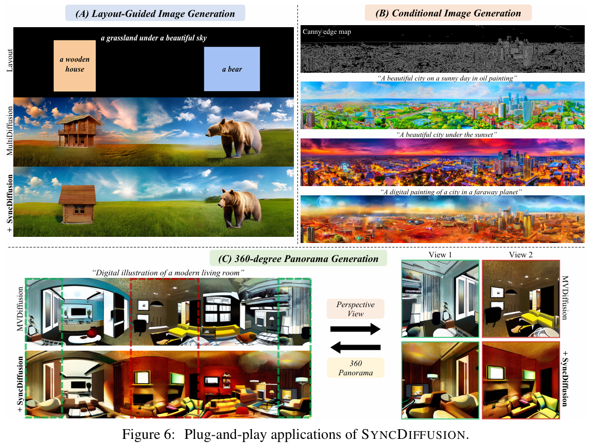

# SyncDiffusion: Coherent Montage via Synchronized Joint Diffusions

> "SyncDiffusion: Coherent Montage via Synchronized Joint Diffusions" NIPS, 2023 Jun 8
> [paper](http://arxiv.org/abs/2306.05178v3) [code](https://syncdiffusion.github.io.) [pdf](./2023_06_NIPS_SyncDiffusion--Coherent-Montage-via-Synchronized-Joint-Diffusions.pdf) [note](./2023_06_NIPS_SyncDiffusion--Coherent-Montage-via-Synchronized-Joint-Diffusions_Note.md)
> Authors: Yuseung Lee, Kunho Kim, Hyunjin Kim, Minhyuk Sung

## Key-point

- Task: 超高分辨率图像生成
- Problems
- :label: Label:

## Contributions

## Introduction

###  Joint Diffusion

> Image diffusion models pretrained on fixed-size images cannot be used directly to produce arbitrary-size images. MultiDiffusion [3] has addressed this limitation by using a multi-window joint diffusion approach.

每个 timestep 融合

> The framework integrates images generated from multiple windows seamlessly by averaging colors or features across the windows at every reverse diffusion step.

类似 RVRT 在 latent space 分 patch，重叠取平均

## methods

### analyze multi-diffusion badcase :mag:

一致性优于 MultiDiffusion

- Q：分析为什么 multi-diffusion 不行？:star:

**先看现象**，物体远景和近景不符合常理的连接了起来

> The left image in Fig. 2 demonstrates that the resulting image often oddly combines various scenes, such as mountains with trees and snow. Also, the blending occasionally fails to merge them in a realistic manner, as shown in the figure where distant objects are connected to closer objects. This incoherence issue in MultiDiffusion arises due to two main reasons. 

**VAE feature 分 patch 取平均对于颜色 or 重叠区域还 ok，否则炸了；**
只受到相邻区域影响更多，**较远距离的 patch** 就炸了；

> This incoherence issue in MultiDiffusion **arises due to two main reasons**. Firstly, the **averaging operation only aligns the colors or features in the overlapped regions** but does not match the content or style of the images. Secondly, it **only enforces adjacent views to influence each other,** and thus global coherence between distant windows cannot be achieved

### LPIPS correct patch feature

不只是 VAE feature 重叠区域取平均，用 perceptual loss 回传修正一下？？

> Similar to MultiDiffusion, our SYNCDIFFUSION module updates the noisy image at every step of the reverse diffusion process. 
>
> In contrast to averaging the colors or latent features in the overlapped regions, however, SYNCDIFFUSION employs the backpropagation of gradients from a perceptual similarity loss computed across the windows to perform the update. The perceptual similarity loss, denoted as L, can utilize any off-the-shelf loss function for perceptual similarity, such as LPIPS [53] and Style Loss [14]. 

- Q：啥是用 perceptual loss 回传修正一下？？

使用 anchor window 0 （第0个 patch 作为基准），去计算当前 patch 和 `window0_patch` 的 perceptual loss

> To facilitate efficient computation, we designate an anchor window with an index of 0. For each view’s noisy color image D(x (i) t ) and the anchor window’s noisy color image D(x (0) t ) (where the decoder D can be treated as an identity function if the given diffusion model operates in image space rather than latent space), one can measure the coherence using the images and conduct gradient descent through x (i) t :

- Q：perceptual loss 对于不同 timestep 会失效？

> Fig. 3 shows examples where the left three images are the intermediate noisy images D(xt) at timestep t = 45 out of a total of 50 timesteps in the DDIM reverse process.

去噪初期，对 noise 去计算 LPIPS 没啥区别，毕竟指标是对 RGB 设计的

> Note that the LPIPS scores among the noisy images are indistinguishable

不在 latent 里面看，转换到 RGB space。**把对应 noise 一步去噪 & 转换为图像**，修正一下 eq13 计算 loss

> Hence, similar to the DDIM reverse process, we utilize the foreseen denoised observation of each noisy data ϕθ(x (i) t , t) in Eq. 10

**看下伪代码，整体流程**

- 保持和 anchor 0 (第 0 个 patch) 在 LPIPS 上接近，用 Loss 方式去修正
- 去噪一步
- 用 multi-diffusion 方式对重叠部分去平均

## setting

- LPIPS loss 的更新步长

> For the gradient descent weight w (Eq. 14), we experiment with various initial values while applying a weight decay with a rate of 0.95. We also set the center window as the anchor window with an index of 0.

- 关注下指标怎么设计 :star:

## Experiment

> ablation study 看那个模块有效，总结一下

user-study

### application

1. 不一致还是有，但比 Multi-Diffusion 好了很多啊
2. 等于直接在 Multi-Diffusion 基础上增加了一个 LPIPS loss ，修正初始 patch 特征的环节

## Limitations

-  it relies on appropriate input prompts to achieve realistic results
- 需要在推理时候计算梯度，修正一下

> gradient descent computation introduces additional computational overhead.

patch 之间间隔感减轻很多，但**Multi-Diffusion纹理不一致还是有（只是过度好了些）**

## Summary :star2:

> learn what

- 不一致还是有，但比 Multi-Diffusion 好了很多啊

- 等于直接在 Multi-Diffusion 基础上增加了一个 LPIPS loss ，修正初始 patch 特征的环节

- patch 之间间隔感减轻很多，但**Multi-Diffusion纹理不一致还是有（只是过度好了些）**

  

### how to apply to our task

