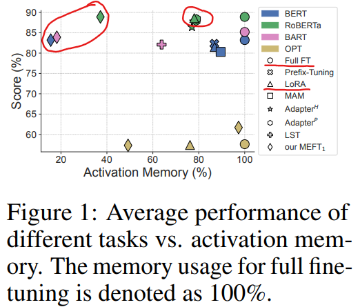
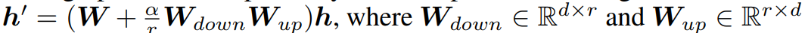
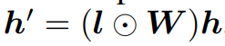
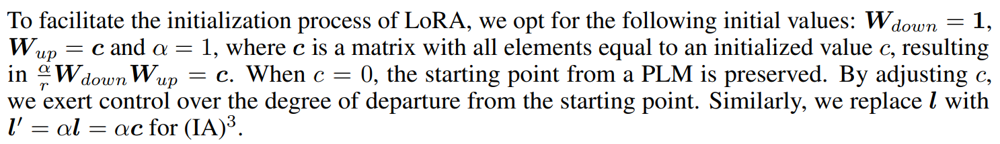
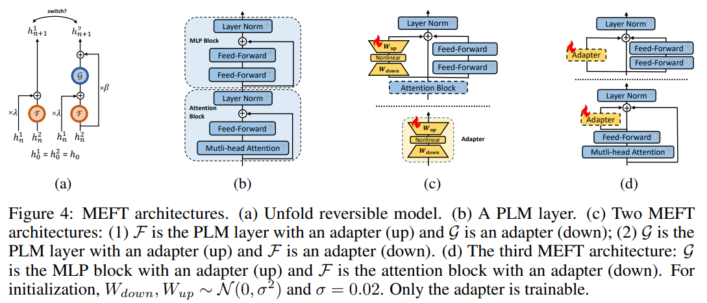

# Make Pre-trained Model Reversible: From Parameter to Memory Efficient Fine-Tuning

> "Make Pre-trained Model Reversible: From Parameter to Memory Efficient Fine-Tuning" NeurIPS, 2023 Jun, `MEFT`
> [paper](http://arxiv.org/abs/2306.00477v4) [code]() 
> [pdf](./2023_06_NeurIPS_Make-Pre-trained-Model-Reversible--From-Parameter-to-Memory-Efficient-Fine-Tuning.pdf)
> Authors: Baohao Liao, Shaomu Tan, Christof Monz

## Key-point

- Task: Parameter-efficient fine-tuning (PEFT) of pre-trained language models (PLMs)

- Problems

   existing PEFT methods are not memory-efficient, because they still require **caching most of the intermediate activations** for the gradient calculation, akin to fine-tuning.

  思路：apply a reversible model & no cache activations

- :label: Label:

提出降低显存的 finetune 方法，比 LoRA 方式显存降低很多

1. first investigate what is a key factor for the success of existing PEFT methods
2. 基于作者的发现，propose memory-efficient fine-tuning (MEFT) that inserts adapters into a PLM

效果：significantly **reduces the activation memory up to 84%** of full fine-tuning with a negligible amount of trainable parameters.

## Contributions

## Introduction

### Initialization is significant

modifying a pre-trained model by adding new parameters, one needs to initialize the new parameters in a way to preserve the starting point from the pretrained model at the beginning of training

- the output from a modified layer, **should be close to original output at the beginning of training.**

 we explore the significance of PEFT’s initialization for two methods, LoRA and (IA)3

**LoRA**

$(IA)^3$

modifies W by multiplying it to a trainable vector $l \in \mathbb{R}^d$. The default initialization of $(IA)^3$  is l = 1

## methods

## Experiment

> ablation study 看那个模块有效，总结一下

## Limitations

## Summary :star2:

> learn what & how to apply to our task

