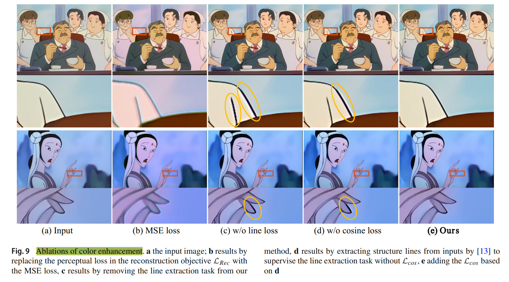

# AddCR: a data-driven cartoon remastering

> "AddCR: a data-driven cartoon remastering" Arxiv, 2023 Jul
> [paper](https://link.springer.com/article/10.1007/s00371-023-02962-3) [code](https://github.com/Ssakura-go/AddCR/tree/master)

**Key-point**

老动画修复：SR, denoise, colorize

- composed of three successive stages, SR: Real-ESRGAN
- multi-task training, 让 U-net 同时进行 denoise & 输出 sketch，让 U-net 在去噪时候保留 sketch 特征

**Contributions**

整合多个 task 用于老动画修复

## **Related Work**

- Deepremaster

- Bring old films back to life

- Bringing Old Photos Back to Life

- **[AnimeColorDeOldify](https://github.com/Dakini/AnimeColorDeOldify)**

- SR

  - **[realcugan-ncnn-vulkan](https://github.com/nihui/realcugan-ncnn-vulkan)**
  - "Real-ESRGAN: Training Real-World Blind Super-Resolution with Pure Synthetic Data"
  - Waifu2x

- colorization

  - "Deep exemplar-based colorization" TOG, 2018
    [paper](https://dl.acm.org/doi/abs/10.1145/3197517.3201365)
  - "Deep Exemplar-based Video Colorization" CVPR, 2019 Jun

- sketches

  [sketchKeras-pytorch](https://github.com/higumax/sketchKeras-pytorch)

- "Toward Fast, Flexible, and Robust Low-Light Image Enhancement" CVPR, 2022
  [paper](https://arxiv.org/abs/2204.10137)

## **methods**

### Denoise

用  U-net 实现去噪。**为了更好保留画面的 structure lines，用 multi-task 的方式训练 U-net**，让模型同时输出去噪结果，线条

勾线图输入 GT 用 [sketchKeras-pytorch](https://github.com/higumax/sketchKeras-pytorch) 得到

### **Super-resolution**

Real-ESRGAN

## **Experiment**

- Color enhancement

  - "Toward Fast, Flexible, and Robust Low-Light Image Enhancement" CVPR, 2022 Apr,
    [paper](https://arxiv.org/abs/2204.10137) [code](https://github.com/vis-opt-group/SCI)

- Ablations of color enhancement

  MSE loss 会产生伪影 >> 加入 sketches loss 能够缓解一些

  

**Limitations**

**Summary :star2:**

> learn what & how to apply to our task