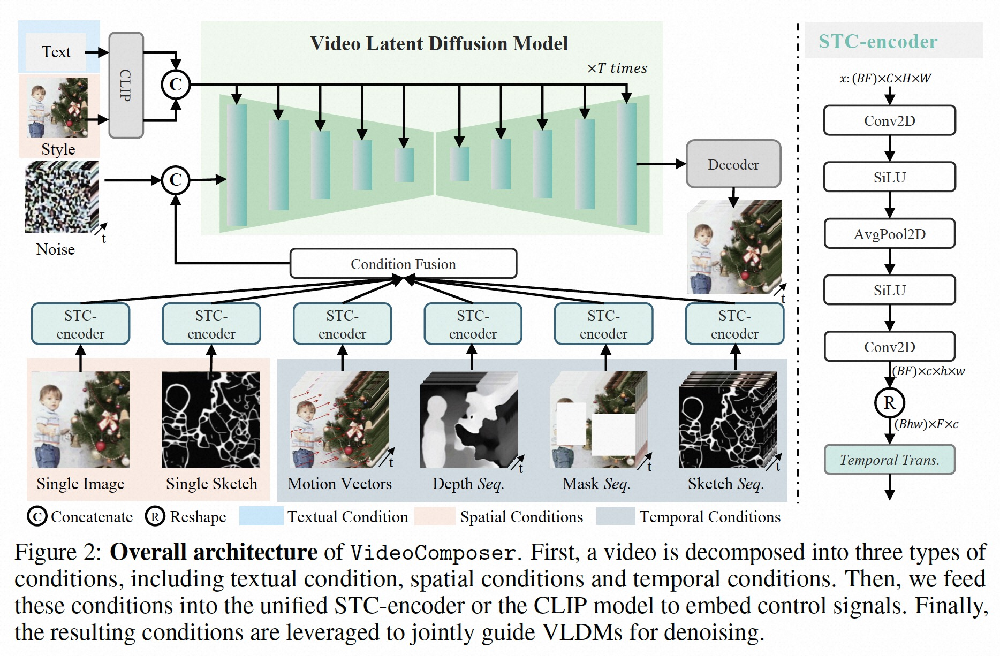

# VideoComposer

> [VideoComposer: Compositional Video Synthesis with Motion Controllability](https://arxiv.org/abs/2306.02018) (May, 2023)
>   
>
> [2023_June_VideoComposer--Compositional-Video-Synthesis-with-Motion-Controllability.pdf](./2023_June_VideoComposer--Compositional-Video-Synthesis-with-Motion-Controllability.pdf)

## **Key-point**

- controllable video synthesis 可控视频生成
- 应用场景
  - 辅助视频内容生成工作；生成视频，辅助教学理解概念

作者提出的 VideoComposer，可选择 3 大类 conditioning 信息的不同组合方式，将 conditions 输入 VideoLDM 实现可控视频生成。可使用 Text,  sketch, depth, image, style, motions_vector, handed_motion, **reference_video** 多种 condition 信息，**以多模态的方式来引导视频生成，并且可以实现 mask video inpainting, video motion transfer, video_translation(基于视频生成视频)**。在实现中，作者用 motion vector 和 STC-encoder 分别提取帧间信息、整合 control signals.

> Most existing methods typically **achieve controllable generation mainly by introducing new conditions**. We **decompose a video into three kinds of representative factors**, i.e., textual condition, spatial conditions and the crucial temporal conditions, and then train a latent diffusion model to recompose the input video conditioned by them.
>
> - use motion vector as temporal guidence to capture the inter-frame dynamics.
> - a unified STC-encoder
>   1. captures the spatio-temporal relations
>   2. serves as an interface that allows for efficient and unified utilization of the control signals

**Contributions**

- 提出一个融合多模态 conditions 信息视频生成的 framework。
- 用 motion vectors 作为 temporal conditions 获取帧间信息，效果好
- 对不同 conditions 融合构造了一个 **unified STC-encoder** 对 condition 信息提取 embedding
- 能够支持 hand-crafted motions 的视频生成，之前工作没做过

## **Related Work**

从 `Image synthesis with diffusion models` , `Video synthesis with diffusion models`, `Motion modeling.` 三个角度描述，其中 optical flow 计算量大，引入计算量更小的 motion vectors.

> - Classifier-Free Diffusion Guidance
>   https://arxiv.org/abs/2207.12598
> - DDIM inference strategy
> - metrics
>   Gedas Bertasius, Heng Wang, and Lorenzo Torresani. Is space-time attention all you need for video understanding? In ICML, volume 2, page 4, 2021.
> - CogVideo  >> text2video with transformer
> - Composer: Creative and controllable image synthesis with composable conditions.

### Make-A-Video

[[2209.14792\] Make-A-Video: Text-to-Video Generation without Text-Video Data](https://arxiv.org/abs/2209.14792)

## **methods**

### Composable conditions & STC

decompose videos into **three distinct types of conditions**, i.e., textual conditions, spatial conditions and crucially temporal conditions.  **3大类 conditioning information**

> **VideoComposer is a generic compositional framework.** :+1: Therefore, more customized conditions can be incorporated into VideoComposer depending on the downstream application and are not limited to the decompositions listed above

- Textual condition
  OpenCLIP
- Spatial condition
  single image; sketches (PiDiNet [ref51]); Style embedding with OpenCLIP
- Temporal conditions
  - Motion vector
  - Depth sequence
  - mask sequence
  - sketches sequence

**STC-Module get conditioning embedding $z_t$ from condition info** 

1. Fuse all conditioning embedding $z_t$ sequences (same shape STC-Module output) by **adding element-wise**
2. For textual and stylistic conditions organized as embedding sequences, **used with cross-attention**\

### Training and inference

**2stage 训练策略**

1. text-to-video generation
2. excel in video synthesis **controlled by the diverse conditions** through compositional training.

**Inference.** :question:

## Experiment

- Dataset

  - WebVid10M
  - LAION-400M
  - MSR-VTT

- metrics

  -  frame consistency

    compute the **average CLIP cosine similarity of two consecutive frames**, serving as a frame consistency

  - motion-control metric

    **measure Euclidean distance of optical flow of each pixel**

### generation with versatile conditions

- Compositional video inpainting
- style/sketch-to-video generation
- depth [FigureA11](./2023_June_VideoComposer--Compositional-Video-Synthesis-with-Motion-Controllability.pdf#page=15)
- motion-transfer [FigureA12](./2023_June_VideoComposer--Compositional-Video-Synthesis-with-Motion-Controllability.pdf#page=16)

###  motion control

 [Figure9](./2023_June_VideoComposer--Compositional-Video-Synthesis-with-Motion-Controllability.pdf#page=9)

- hand-crafted motion

- Video-to-video translation. :+1: :star::star::star:

  static-background removal [Figure7](./2023_June_VideoComposer--Compositional-Video-Synthesis-with-Motion-Controllability.pdf#page=<8>)

- Text2video performance with previous SOTA [TableA3](./2023_June_VideoComposer--Compositional-Video-Synthesis-with-Motion-Controllability.pdf#page=17)

  > [MSR-VTT dataset](https://paperswithcode.com/dataset/msr-vtt)
  >
  >  a large-scale dataset for the open domain video captioning, which consists of **10,000 video clips from 20 categories, and each video clip is annotated with 20 English sentences** by Amazon Mechanical Turks.

  

### Ablation study

-  incorporating STC-encoder augments the frame consistency >> [Figure9](./2023_June_VideoComposer--Compositional-Video-Synthesis-with-Motion-Controllability.pdf#page9)

  without STC-encoder generally adhere to the sketches but **omit certain detailed information**

**Limitations**

- 在有水印的 WebVid10M 视频数据上训练，影响生成效果
- 生成视频 256x256 

## **Summary :star2:**

> how to apply to old films restoration

- video LDM 进行视频生成

- multi-conditions fusion >> reference sketches & depth as condition

- motion vectors 提取帧间动态信息

- **Video2Video reference :+1:**

  作者单独用 motion vectors 作为 condition 进行 video2video，能够去掉视频中静态的物体。

  > 老电影几帧的静态污渍：油墨。
  >
  > motions vectors 区分出 content movement \ noise spark ?
  >
  > - T 帧修复，用 T-x, T+x 帧作为 condition 修复
  > - :question: video2video 生成效果物体还原度不高?
  > - :question: 可编辑性

  
