# Low-Light Image Enhancement with Wavelet-based Diffusion Models

> "Low-Light Image Enhancement with Wavelet-based Diffusion Models" siggraph-asia, 2023 Jun 1, `DiffLL` :star:
> [paper](http://arxiv.org/abs/2306.00306v3) [web](https://dl.acm.org/doi/10.1145/3618373) [code](https://github.com/JianghaiSCU/Diffusion-Low-Light.) [pdf](./2023_06_siggraph-asia_Low-Light-Image-Enhancement-with-Wavelet-based-Diffusion-Models.pdf) [note](./2023_06_siggraph-asia_Low-Light-Image-Enhancement-with-Wavelet-based-Diffusion-Models_Note.md)
> Authors: Hai Jiang, Ao Luo, Songchen Han, Haoqiang Fan, Shuaicheng Liu (Megvii)

## Key-point

- Task: LLE
- Problems
  - incorrect exposure, color distortion, or artifacts to degrade visual quality
- :label: Label:

> Diffusion-based Low-Light image enhancement approach, dubbed DiffLL

## Contributions

- 使用 wavelet transformation 保留高频细节特征，搞到 diffusion 上面做 LLE

  > we present a **wavelet-based** conditional diffusion model (WCDM) that leverages the generative power of diffusion models to produce results with satisfactory perceptual fidelity.

- 设计 wavelet transformation 频域融合模块 HFRM :star:

> we further design a high-frequency restoration module (HFRM) that utilizes the vertical and horizontal details of the image to complement the diagonal information for better fine-grained restoration. 

- 设计训练pipeline 同时 forward & denoise

> We propose a new training strategy that enables WCDM to achieve content consistency during inference by performing both the forward diffusion and the denoising processes in the training phase

- SOTA & 速度比之前 DDIM 方法快了 70 倍！

## Introduction

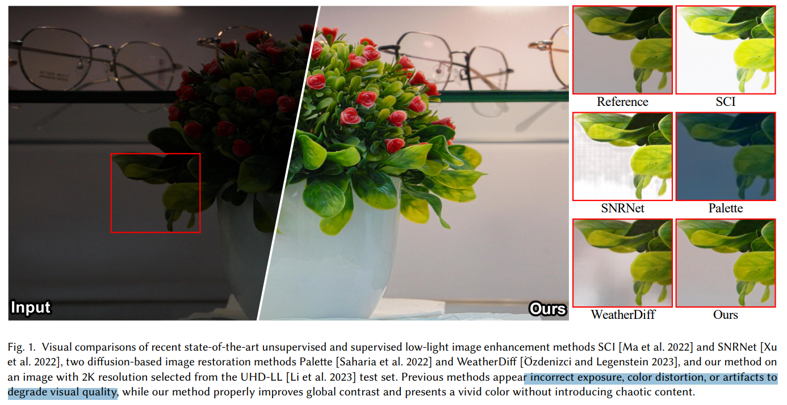

### DWT

- Q：为啥用 wavelet-transformation

> Specifically, we first convert the low-light image into the wavelet domain using 𝐾 times 2D discrete wavelet transformations (2D-DWT), which noticeably reduces the spatial dimension while avoiding information loss,

将特征分解为 K 个频域特征，降低 spatial domain  && 无 information loss !

> Furthermore, the local details contained in the high-frequency coefficients are reconstructed through our welldesigned high-frequency restoration modules (HFRM), where the vertical and horizontal information is utilized to complement the diagonal details for better fine-grained details restoration

**本文使用 Haar 小波变换，将特征分解为低频特征 A，三个不同方向的高频特征 && 特征尺寸减半**

> we use 2D discrete wavelet transformation (2D-DWT) with Haar wavelets

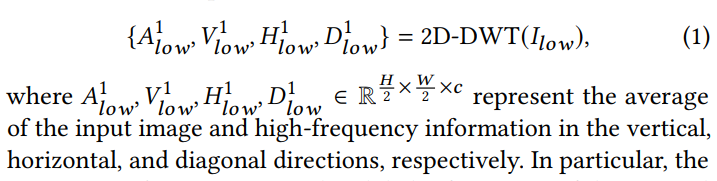

- Q：为什么用 DM 去做低频的恢复，不做高频？

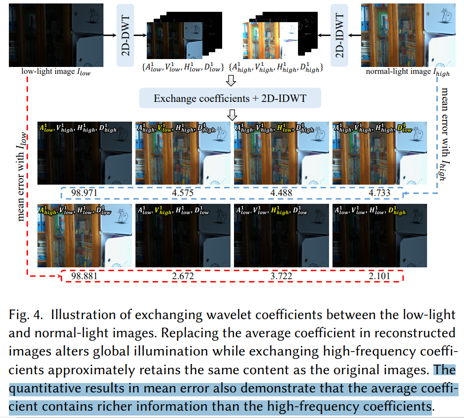

**小波变换几个分量直接换掉，看看效果**，类似 ablation 哈哈多搞一个图

1. **小波变换得到的低频特征 A 对图像整体影响最大！！影响程度去和 LowLight Image 计算 MSE 看！**
2. 高频特征比较稀疏

所以用 DM 去修复最主要的低频特征，剩下的细节用个小模块搞

> As shown in Fig. 4, the images reconstructed by exchanging highfrequency coefficients still have approximately the same content as the original images, whereas the image **reconstructed by replacing the average coefficient changes the global information, resulting in the largest error with the original images.** Therefore, the primary focus on restoring the low-light image in the wavelet domain is to obtain the average coefficient that has natural illumination consistent with its normal-light counterpart. 
>
> For this purpose, we utilize the generative capability of diffusion models to restore the average coefficient, and the remaining three high-frequency coefficients are reconstructed through the proposed HFRM to facilitate local details restoration.

- Q：如何压榨 wavelet 极限，降低显存 & 时间消耗？:star:

对低频特征 A 进一步用 Harr 小波变换分解 K-1 组特征

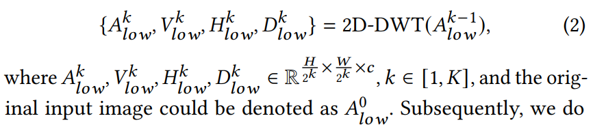

Harr 小波能降低 Spatial 维度，**就把 A0 低频特征，进一步分解 K 次，进一步降低特征尺寸降低消耗！！！！**:star:

> Subsequently, we do diffusion operations on the $A^K_{low}$ to further improve the efficiency, and the high-frequency coefficients {$V^k_{low}$, $HV^k_{low}$, $D^k_{low}$ } are also reconstructed by the HFRM𝑘 .

连续搞 K 次，直接尺度变成原来的 $4^K$ 倍 & 还是无损的 :star:

> In this way, our approach achieves significant decreases in inference time and computational resource consumption of the diffusion model due to 4 𝐾 times reduction in the spatial dimension.

- Q：为什么能这么搞？
  1. 小波变换降低特征空间尺寸，无损
  2. 只做一次的低频分量，**根据 Fig4 MSE 的值猜测含有大约 96%信息，低频信息还是太多了**

## methods

- Q：为什么不用 FFT?

**wavelet-transformation 可以做到 spatial 维度减半，同时不损失信息** :star: ；
而 FFT 如果要尺寸减半，就有损失了。。

> The wavelet transformation can halve the spatial dimensions after each transformation without sacrificing information, while other transformation techniques, such as Fast Fourier Transformation (FFT) and Discrete Cosine Transform (DCT), are unable to achieve this level of reduction and may result in information loss.

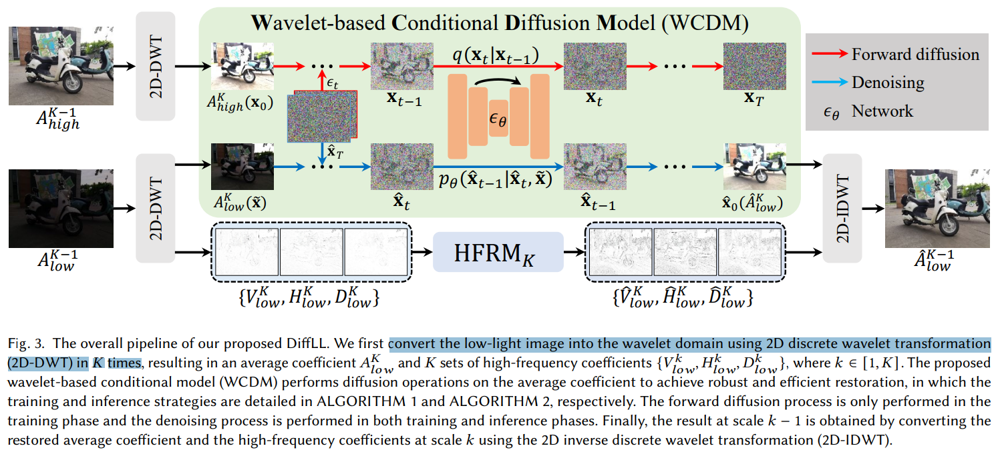

- **2D 离散小波变换，可以把图像转换为 K 组低、高频特征（一个低频 A，3个高频分量 VHD） && 同时降低特征尺寸** && 无信息损失哦

在频域分成低频、高频分别修复

- 低频：Wavelet-based DM 对低频特征 A 进行修复（亮度算低频？？）
- 高频：用提出的 HFRM 搞

- Q：diffusion 如何加速？？

用 Harr 小波转到频域，只处理低频分量！

> To address these problems, we propose a wavelet-based conditional diffusion model (WCDM) that converts the input low-light image 𝐼 𝑙𝑜𝑤 into the wavelet domain and performs the diffusion process on the average coefficient, which considerably reduces the spatial dimension for efficient restoration.

- Q：diffusion 训练时候如何优化频域分量？

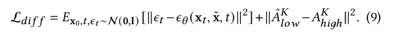

**每一步预测完噪声，转到特征空间**，做频域分量的 MSE Loss

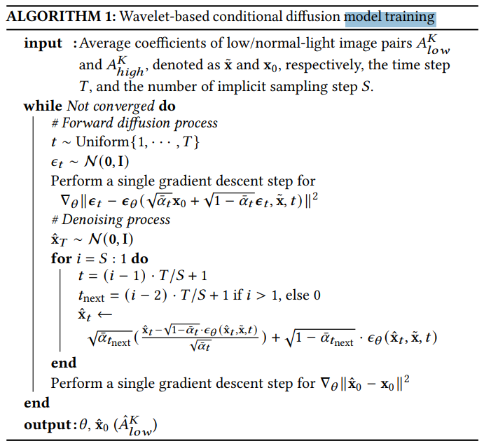

### HFRM

初始 Depth Conv 提取特征

垂直 & 对角高频 + 水平 & 对角高频 cross-attn 

> . As shown in Fig. 5, we first use three depth-wise separable convolutions [Chollet 2017] for the sake of efficiency to extract the features of input coefficients, then two cross-attention layers [Hou et al. 2019] are employed to leverage the information in 𝑉 and 𝐻 to complement the details in 𝐷.

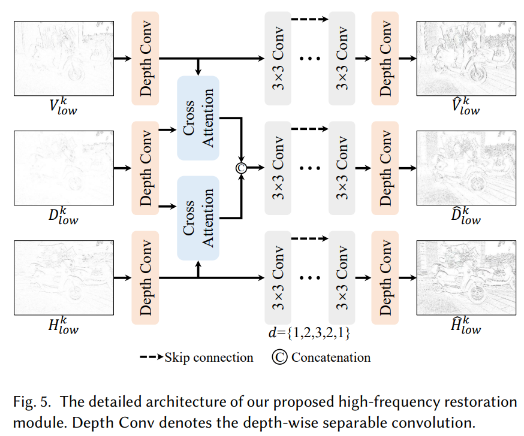

- 使用可变形卷积能降低 artifact？

> By gradually increasing and decreasing the dilation rate 𝑑, the gridding effect can be avoided. :star:

DM 只要处理最小尺度的低频分量 A，然后用 HFRM 修高频逐渐叠上去

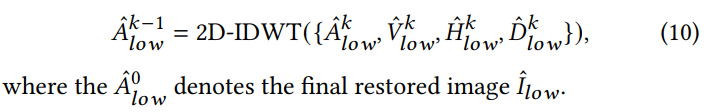

### Loss :star:

原始 loss

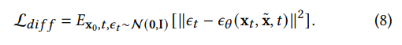

DIffusion Loss + 低频特征 Loss

**Detail Loss + TV Loss** 优化高频特征 :star:

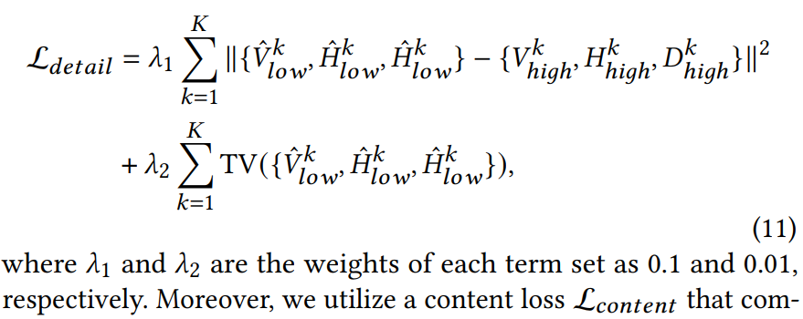

内容一致性 Loss

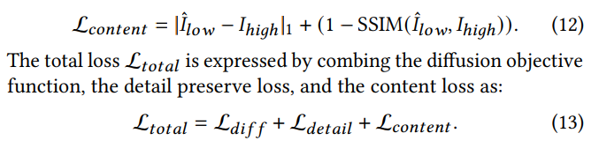

> Moreover, we utilize a content loss L𝑐𝑜𝑛𝑡𝑒𝑛𝑡 that combines L1 loss and SSIM loss [Wang et al. 2004] to minimize the content difference between the restored image ˆ𝐼 𝑙𝑜𝑤 and the reference image 𝐼ℎ𝑖𝑔ℎ

## setting

- 对比 9 个方法
- The proposed network can be converged after being trained for $1 \times 10^5$ iterations on four NVIDIA RTX 2080Ti GPUs

## Experiment

> ablation study 看那个模块有效，总结一下

速度比之前 DDIM 方法快了 70 倍！

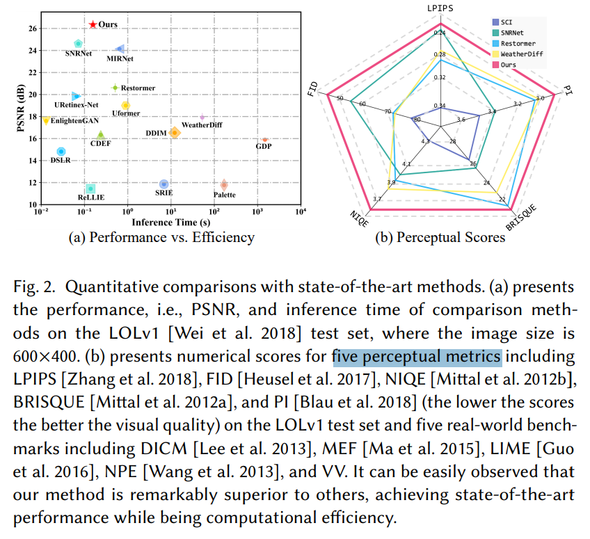

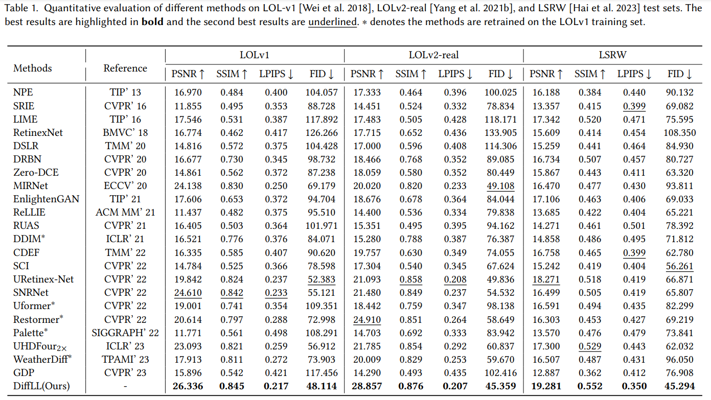

### acceleration

- Q：如何说明显存 & 加速？

不同分辨率，计算 memory & time

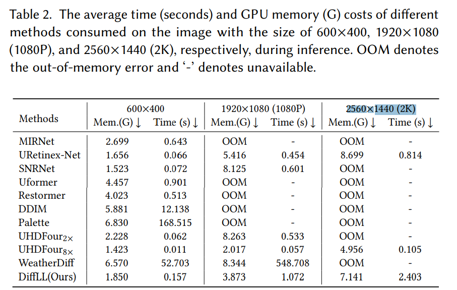

### Low-Light Face Detection

> 加实验

- Q**：如何说明增强的效果有用？ -》》不影响后续任务识别** :star:

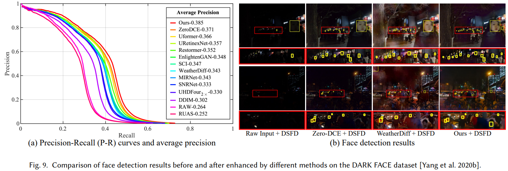

### Ablation

- 𝐾 = 1, leads to overall performance improvements while resulting in the inference time increase.
-  For a trade-off between performance and efficiency, we choose 𝐾 = 2 as the default setting.

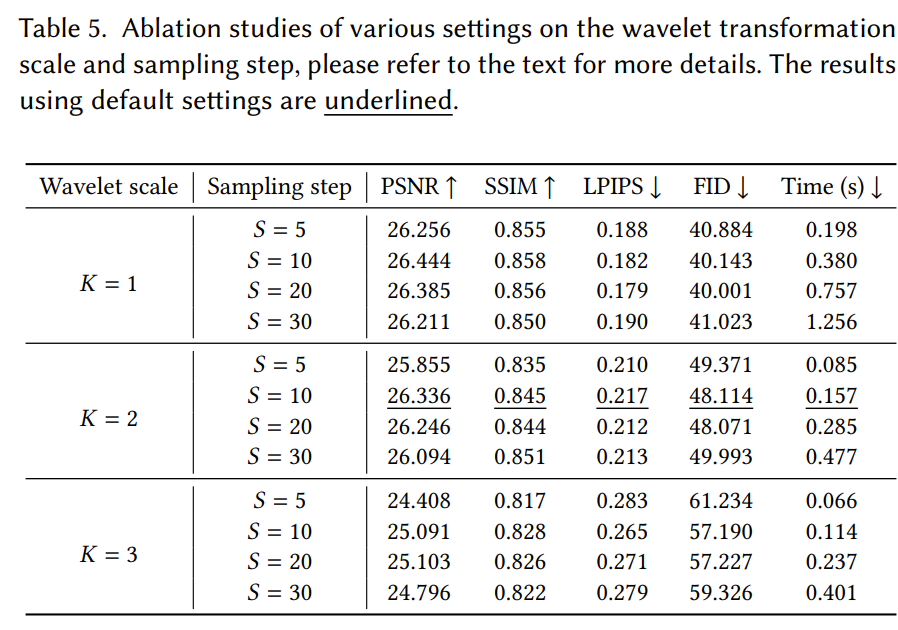

#### **High-frequency Restoration Module**

- **在尺度1 加上频域特征修复，就涨了 2.2dB ！** :star:
- 依靠高频细节提升了 5dB!!!!

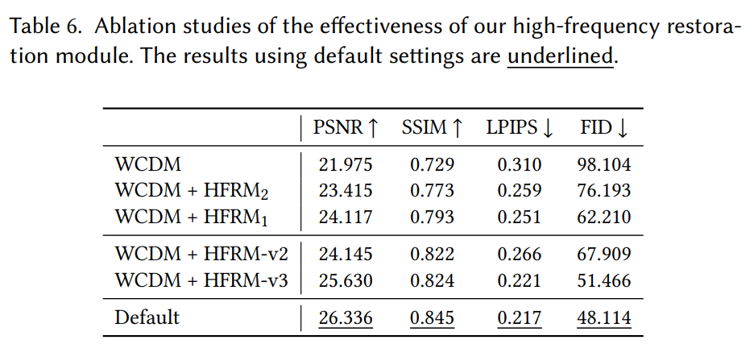

#### Loss

**Loss 做了一系列操作收效的提升不如模型的改动大**

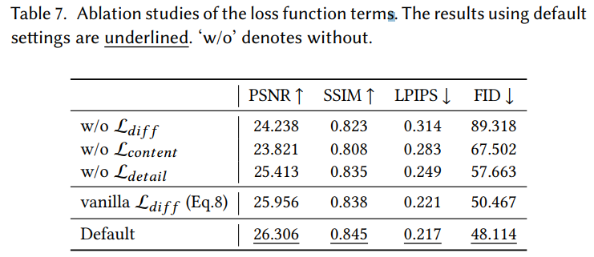

> The detail preserve loss **L𝑑𝑒𝑡𝑎𝑖𝑙 is designed to reconstruct more image details**, thus its removal causes performance degradation. However, such **degradation is not significant relative to removing the content loss**

原始 loss

#### Training Denoise

训练过程中加入 Denoise 融入高频的融合，能提升输出的一致性，降低随机性干扰

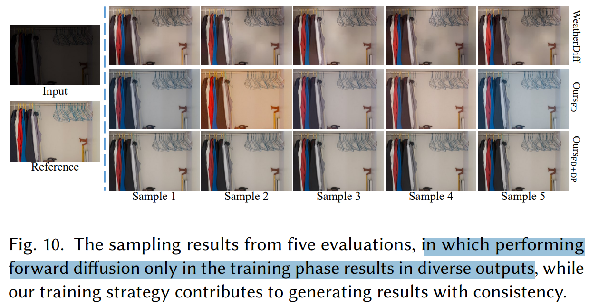

## Limitations

## Summary :star2:

> learn what

### how to apply to our task

- 使用 Haar 小波变换（2D 离散小波变换），将特征**分解为低频特征 A，三个不同方向的高频特征 && 特征尺寸降低 $4^K$ 倍 && 无信息损失**
- 在频域分成低频、高频分别修复
  - 低频：Wavelet-based DM 对低频特征 A 进行修复（亮度算低频？？）
  - 高频：用提出的 HFRM 搞
- diffusion 训练预测完噪声，**转换到特征，去加入图像的 Loss（texture Loss + TV Loss + Content Loss）:star:**

- Q：如何压榨 wavelet 极限，降低显存 & 时间消耗？:star:

对低频特征 A 进一步用 Harr 小波变换分解 K-1 组特征

Harr 小波能降低 Spatial 维度，**就把 A0 低频特征，进一步分解 K 次，进一步降低特征尺寸降低消耗！！！！**:star:

> Subsequently, we do diffusion operations on the $A^K_{low}$ to further improve the efficiency, and the high-frequency coefficients {$V^k_{low}$, $HV^k_{low}$, $D^k_{low}$ } are also reconstructed by the HFRM𝑘 .

- Q：为什么能这么高？
  1. 小波变换降低特征空间尺寸，无损
  2. 只做一次的低频分量，**根据 Fig4 MSE 的值猜测含有大约 96%信息，低频信息还是太多了**

- Q：如何说明显存 & 加速？

不同分辨率，计算 memory & time

