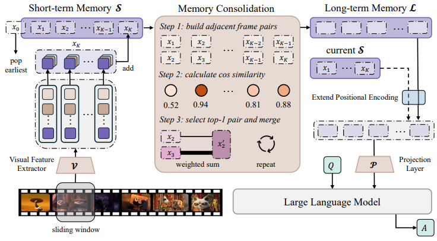
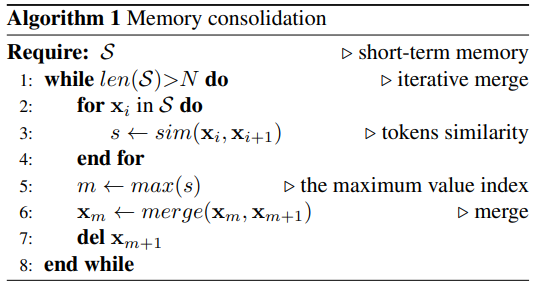
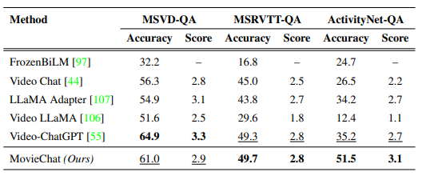

# MovieChat: From Dense Token to Sparse Memory for Long Video Understanding

> "MovieChat: From Dense Token to Sparse Memory for Long Video Understanding" Arxiv, 2023 Jul, **MovieChat**:statue_of_liberty:
> [paper](https://arxiv.org/abs/2307.16449) [code](https://github.com/rese1f/MovieChat)
> [paper local pdf](./2023_07_Arxiv_MovieChat--From-Dense-Token-to-Sparse-Memory-for-Long-Video-Understanding.pdf)
> [blog explanation](https://zhuanlan.zhihu.com/p/651111577)

**Key-point**

- Task: 长视频(10K 帧，fps24 6min)
- Background
- :label: Label:

提出了一个计算友好、不占显存、可以处理超长视频(>10K frames)的VLM，可以有两种推理模式（全视频or断点模式）

**Contributions**

1. 第一个处理 10K + 帧的长视频的视频理解
2. 

## **Related Work**

- 融合 token 去除冗余

  "Token merging: Your vit but faster"

## methods

输入视频 $\mathbf{v}\in\mathbb{Z}^{T\times3\times H\times W}$ 一共 T 帧，vi 为一个 clip 的视频，得到视频片段 feature xi

### Short-term Memory

提取的 clip 特征直接送入队列，FIFO，存 K 个。当队列满，将最早入队的 token 送入 long term

### Long-term

对 short-term memory 中过滤，计算相邻 clip 特征，找到一对最相似的 clip 特征，剔除掉后面一个 clip 的 token。迭代直到短期记忆长度 <= N

### Inference

## Experiment

> ablation study 看那个模块有效，总结一下

效果相比 video-chatGPT 接近or略差，但节省显存

**Limitations**

**Summary :star2:**

> learn what & how to apply to our task

1. 视频理解有冗余

   视频修复存的就要是冗余信息，发现当前帧那部分有很清晰的细节，只存这部分

