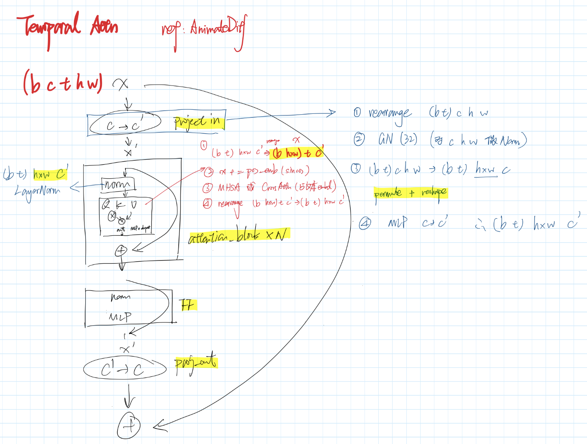
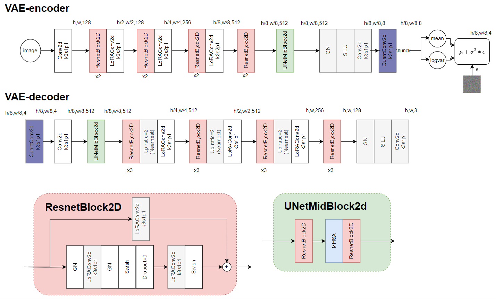

# AnimateDiff: Animate Your Personalized Text-to-Image Diffusion Models without Specific Tuning

> "AnimateDiff: Animate Your Personalized Text-to-Image Diffusion Models without Specific Tuning" CVPR, 2023 Jul
> [paper](http://arxiv.org/abs/2307.04725v1) [code](https://animatediff.github.io/) 
> [pdf](./2023_07_CVPR_AnimateDiff--Animate-Your-Personalized-Text-to-Image-Diffusion-Models-without-Specific-Tuning.pdf)
> Authors: Yuwei Guo, Ceyuan Yang, Anyi Rao, Yaohui Wang, Yu Qiao, Dahua Lin, Bo Dai

## Key-point

- Task
- Problems
- :label: Label:

## Contributions

## Introduction

## methods

Temporal Attention




## Experiment

> ablation study 看那个模块有效，总结一下

## Code

### VAE

> [sd-vae-ft-mse](https://huggingface.co/stabilityai/sd-vae-ft-mse)
>
> The intent was to fine-tune on the **Stable Diffusion training set** (the autoencoder was originally trained on OpenImages) but also **enrich the dataset with images of humans to improve the reconstruction of faces.** 在更多数据上微调，提高重建质量
>
> - Q：VAE Encoder 里面由一个随机噪声没控制住？多帧的这个 noise 不一致
> - Encoder 出来特征范围？

```json
{
  "_class_name": "AutoencoderKL",
  "_diffusers_version": "0.4.2",
  "act_fn": "silu",
  "block_out_channels": [
    128,
    256,
    512,
    512
  ],
  "down_block_types": [
    "DownEncoderBlock2D",
    "DownEncoderBlock2D",
    "DownEncoderBlock2D",
    "DownEncoderBlock2D"
  ],
  "in_channels": 3,
  "latent_channels": 4,
  "layers_per_block": 2,
  "norm_num_groups": 32,
  "out_channels": 3,
  "sample_size": 256,
  "up_block_types": [
    "UpDecoderBlock2D",
    "UpDecoderBlock2D",
    "UpDecoderBlock2D",
    "UpDecoderBlock2D"
  ]
}
//scaling_factor: float = 0.18215
```

**Encoder**

`class DownEncoderBlock2D(nn.Module):`

由若干 `class ResnetBlock2D(nn.Module):` 组成

UNetMidBlock 的 attention 使用 memory-efficient 的`class AttnProcessor2_0:`



**Decoder**


## Limitations

## Summary :star2:

> learn what & how to apply to our task

