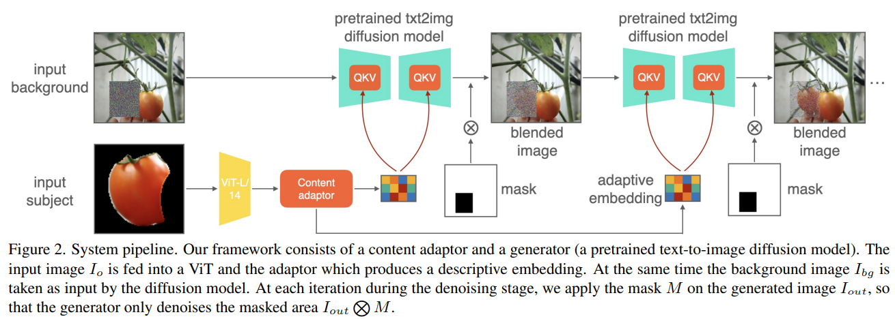

# AnyDoor: Zero-shot Object-level Image Customization

> "AnyDoor: Zero-shot Object-level Image Customization" CVPR, 2023 Jul 18
> [paper](http://arxiv.org/abs/2307.09481v2) [code](https://damo-vilab.github.io/AnyDoor-Page) [pdf](./2023_07_CVPR_AnyDoor--Zero-shot-Object-level-Image-Customization.pdf) [note](./2023_07_CVPR_AnyDoor--Zero-shot-Object-level-Image-Customization_Note.md)
> Authors: Xi Chen, Lianghua Huang, Yu Liu, Yujun Shen, Deli Zhao, Hengshuang Zhao

## Key-point

- Task: object teleport 物体移动, inpaint, virtual try-on, shape editing, and object swapping

- Problems

  每个物体编辑需要训练一个模型？提出用 zero-shot 方式

- :label: Label:

参考一下 data preparation pipeline


## Contributions


## Introduction


- 小结：CLIP-image 方式泛化性&一致性不好；学习 words 对未见过的物体泛化性更好，但没法指定位置，且需要额外训练

提出使用 ID extractor && 高频特征，增强物体细节&一致性；支持其他 condition

> we use an ID extractor to produce discriminative ID tokens and delicately design a frequency-aware detail extractor to get detail maps as a supplement. We inject the ID tokens and the detail maps into a pre-trained text-to-image diffusion model as guidance to generate the desired composition.

### CLIP-image

> they could not generate ID (identity)-consistent contents, especially for untrained categories

- "Paint by Example: Exemplar-based Image Editing with Diffusion Models" CVPR, 2022 Nov
  [paper](http://arxiv.org/abs/2211.13227v1) [code](https://github.com/Fantasy-Studio/Paint-by-Example) [pdf](./2022_11_CVPR_Paint-by-Example--Exemplar-based-Image-Editing-with-Diffusion-Models.pdf) [note](./2022_11_CVPR_Paint-by-Example--Exemplar-based-Image-Editing-with-Diffusion-Models_Note.md)
  Authors: Binxin Yang, Shuyang Gu, Bo Zhang, Ting Zhang, Xuejin Chen, Xiaoyan Sun, Dong Chen, Fang Wen


- "ObjectStitch: Generative Object Compositing" CVPR, 2022 Dec 2
  [paper](http://arxiv.org/abs/2212.00932v2) [code]() [pdf](./2022_12_CVPR_ObjectStitch--Generative-Object-Compositing.pdf) [note](./2022_12_CVPR_ObjectStitch--Generative-Object-Compositing_Note.md)
  Authors: Yizhi Song, Zhifei Zhang, Zhe Lin, Scott Cohen, Brian Price, Jianming Zhang, Soo Ye Kim, Daniel Aliaga

使用 CLIP image embedding 替换 text-embedding，传入预训练的 diffusion；发现只有部分目标物体的情况， MLP 微调 CLIP image embedding 可行，能够学习到类似的纹理



 CLIP image condition 图像经过 DA，选择物体 boundingbox 旋转


### train learnable word

> are able to conduct generations for the new concepts but could not be specified for a location of a given scene. 

- "An image is worth one word: Personalizing text-to-image generation using textual inversion" ICLR, 2022 Aug
  [paper](https://arxiv.org/pdf/2208.01618)
  Authors: Rinon Gal, Daniel Cohen-Or


### collage 贴图

- "Controllable Image Generation via Collage Representations" Arxiv, 2023 Apr
  [paper](https://arxiv.org/pdf/2304.13722)

贴图方式引入图像 condition，但看 show 出来的图像貌似并不好


- "Collage diffusion" :star:
  [paper](https://arxiv.org/abs/2303.00262)


- "High-fidelity Person-centric Subject-to-Image Synthesis" CVPR, 2023 Nov
  [paper](https://arxiv.org/pdf/2311.10329)

**使用一个 Text DM 用文本确定图像框架**，再使用一个 SDM 去同时引入 text-image 特征；分为 3个 stage，先用 TDM 确定框架输出 xT，特征用 TDM 和 SDM 过一下， **更新特征图，最后用 SDM 再增强一下**


- "Magic Fixup: Streamlining Photo Editing by Watching Dynamic Videos"
  [paper](https://arxiv.org/pdf/2403.13044)

cross-attention 方式，目标图像先粗糙的编辑一下（cut&paste+DA）


## methods

- Q：提取到的细节特征如何注入 SD？

用 ID tokens 替换掉 text-embedding

> In this work, we replace the text embedding c as our ID tokens, which are injected into each UNet layer via crossattention

controlnet 得到的特征与 UNet decoder 特征对应尺度特征 concat

> For the detail maps, we concatenate them with UNet decoder features at each resolution. 


- **Q：CLIP image embedding 特征细节保留的不是很好咋办？**

> However, as CLIP is trained with textimage pairs with coarse descriptions, it could only embed semantic-level information but struggles to give discriminative representations that preserve the object identity

1. Background removal: 手动交互指定 or SAM
2. Self-supervised representation：DINOv2

发现 Self-supervised representation 方式学习细节特征更好，

> In this work, we find the self-supervised models show a strong ability to preserve more discriminative features. Pretrained on large-scale datasets, self-supervised models are naturally equipped with the instance-retrieval ability and could project the object into an augmentation-invariant feature space.

**使用预训练的 DINOv2 提供细节特征**，DINOv2 有全局 和 patch 的特征，发现 concat 起来过可学习的 MLP，可以与 UNet 特征空间对齐 :star:

> choose the currently strongest self-supervised model DINOv2 [36] as the backbone of our ID extractor, which encodes image as a global token T1×1536 g , and patch tokens T256×1536 p . We concatenate the two types of tokens to preserve more information.
>
> We concatenate the two types of tokens to preserve more information. We find that using a single linear layer as a projector could align these tokens to the embedding space of the pre-trained text-to-image UNet. The projected tokens T 257×1024 ID are noted as our ID tokens.


### high-freq

- **Q：DINOv2 保存的细节有提升，但是基于 16x16 的patch 提取的特征，细节还是不行？**

使用贴图方式 :star:

- Q：加上图像又太一致了，放入 scene 不是很真实

> With this collage, we observe a significant improvement in the generation fidelity, but the generated results are too similar to the given target which lacks diversity.

**贴图的时候使用高频特征**，而不是放图像，避免生成图像不搭的情况

> Facing this problem, we explore setting an information bottleneck to prevent the collage from giving too many appearance constraints. Specifically, we design a high-frequency map to represent the object, which could maintain the fine details yet allow versatile local variants like the gesture, lighting, orientation, etc.

需要给一张 scene image 背景图，提取高频特征贴图进去，输入 controlnet


- Q：高频特征如何提取？

high-freq filter 使用 Sobel 算子提取边缘 & erode 边缘


### shape-control

We use a shape mask to indicate the object’s gestures. To simulate the user input, we downsample the ground truth masks with different ratios and apply random dilation/erosion to remove the details. 


### Data


- Q：普通的 DA 效果不好？

>  As alternatives, previous works [47, 56] leverage single images and apply augmentations like rotation, flip, and elastic transforms. However, these naive augmentations could not well represent the realistic variants of the poses and views.

用视频的多帧，里面用对应 mask 提取**不同姿态的物体**

> we utilize video datasets to capture different frames containing the same object.
>
>  For a video, we pick two frames and take the masks for the foreground object. Then, we remove the background for one image and crop it around the mask as the target object

- Q：这个 mask 用的数据集里的？对于自己的数据不好得到啊。。。


视频数据集


### Trick： ATS

Adaptive timestep sampling

- Q: However, it is observed that the initial denoising steps mainly focus on generating the overall structure, the pose, and the view, and the later steps cover the fine details like the texture and colors.

视频数据有更丰富的姿态变化，对去噪早期步数多用视频数据训练下

> Thus, for the video data, we increase the possibility by 50% of sampling early denoising steps (500-1000) during training to better learn the appearance changes. For images, we increase 50% probabilities of the late steps (0-500) to learn how to cover the fine details.


## setting


## Experiment

> ablation study 看那个模块有效，总结一下

只是跟 PaintByExample 比较了下，没有跟其他 collage 方式比较！


### Ablation

1. DNIO or CLIP 特征很重要，作为图像物体生成的基本盘；细节不一致的问题要再用高频特征约束一下
2. **发现训练早期多用视频中多姿态物体训练，能够增强生成物体的细节一致性，缓解色偏的问题**
3. Q：细节一致性还是不足，例如文字扭曲了


### ID extractor

> Qualitative analysis of using different backbones for the ID extractor

**对比 DINO, CLIP 提取物体特征**

1. DINO 特征对于物体细节的特征比 CLIP 特征更优秀，但 DINO 特征要处理下才能好：用分割图提取物体再去提取特征才能得到接近原始物体的结果
2. CLIP 特征有点离谱，可能是背景干扰很大


## Code

### Dataset

多个数据集的 dataset 放在一起用

```python
```


## Limitations

- 细节一致性还是不足，例如文字扭曲了

  没有给原始物体图像，扭曲


## Summary :star2:

> learn what & how to apply to our task

- **使用预训练的 DINOv2 提供细节特征**，DINOv2 有全局 和 patch 的特征，发现 concat 起来过可学习的 MLP，可以与 UNet 特征空间对齐 :star:
- **贴图的时候使用高频特征**，而不是放图像，避免生成图像不搭的情况
- 各个 trick，**细节一致性还是不足，例如文字扭曲了**
  1. DNIO or CLIP 特征很重要，作为图像物体生成的基本盘，不加物体直接不一样；细节不一致的问题要再用高频特征约束一下
  2. **发现训练早期多用视频中多姿态物体训练，能够增强生成物体的细节一致性，缓解色偏的问题**
- **对比 DINO, CLIP 提取物体特征**
  1. DINO 特征对于物体细节的特征比 CLIP 特征更优秀，但 DINO 特征要处理下才能好：用分割图提取物体再去提取特征才能得到接近原始物体的结果
  2. CLIP 特征有点离谱，可能是背景干扰很大

