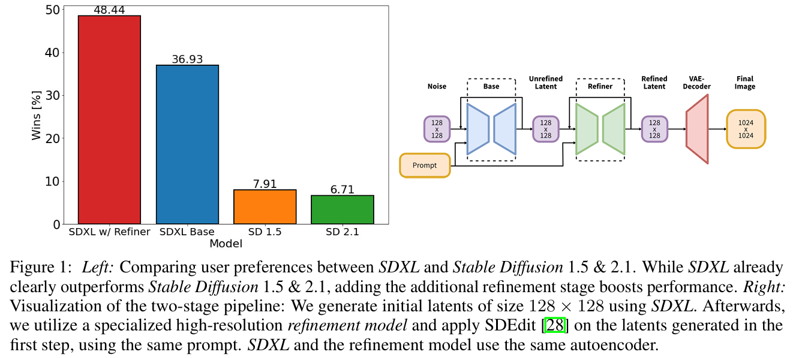
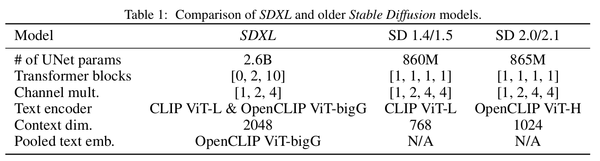
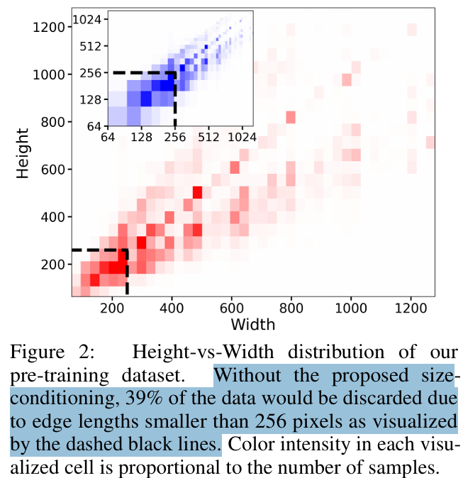
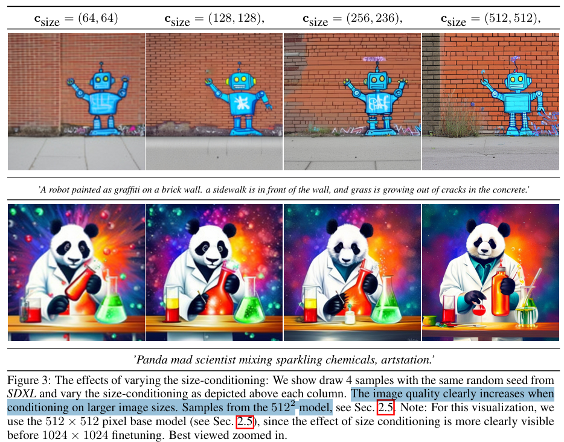
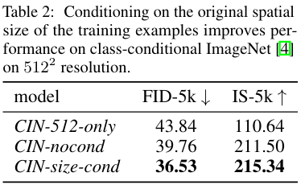
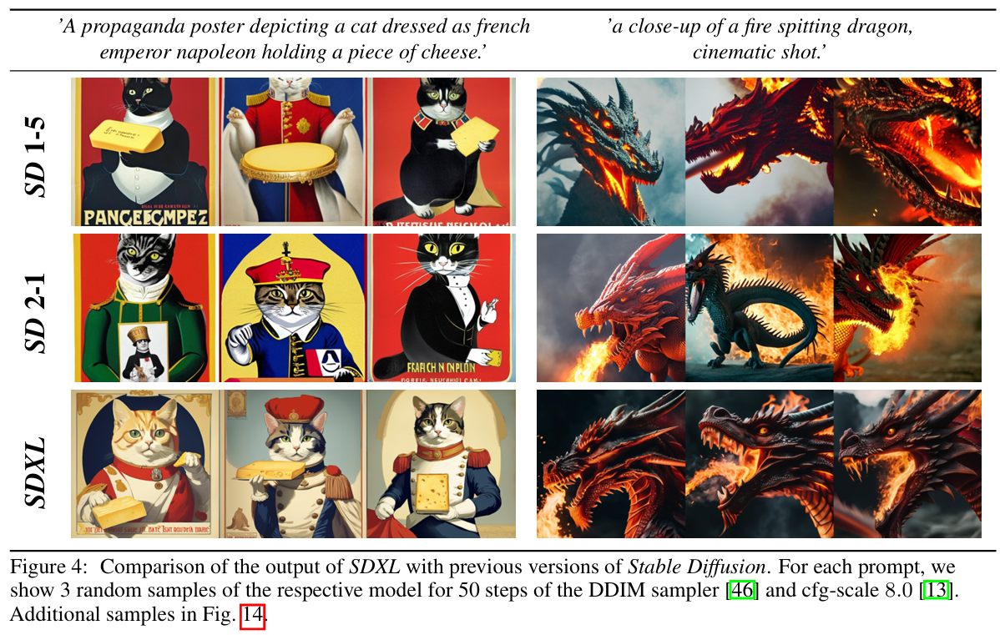
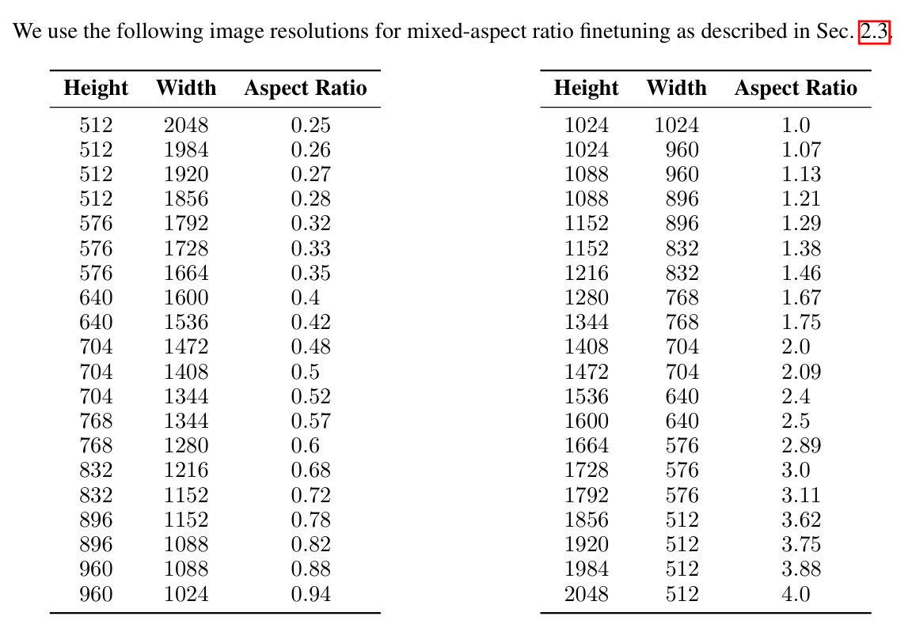
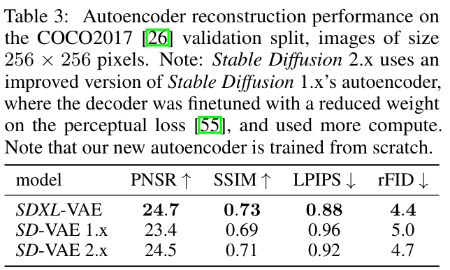
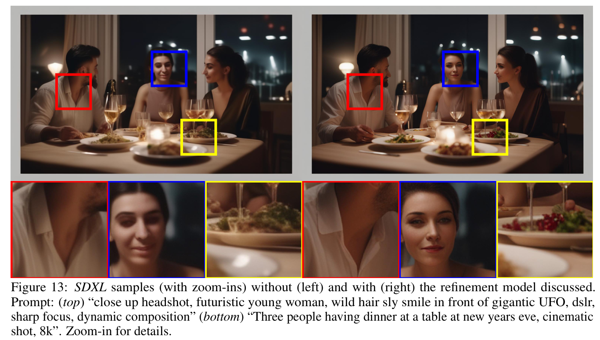
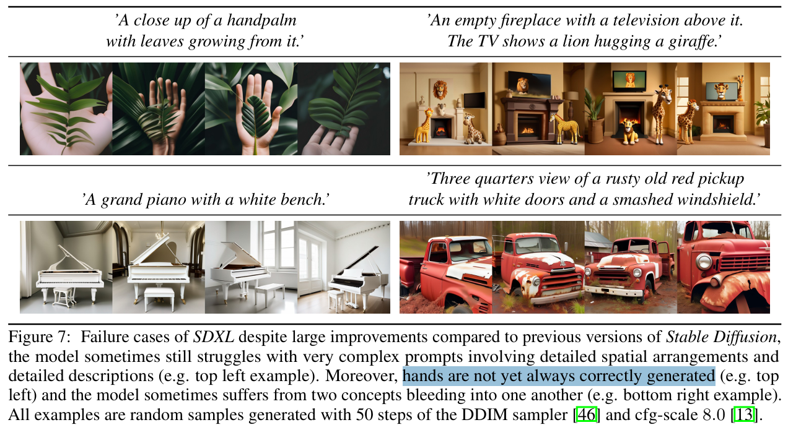

# SDXL: Improving Latent Diffusion Models for High-Resolution Image Synthesis

> "SDXL: Improving Latent Diffusion Models for High-Resolution Image Synthesis" ICLR, 2023 Jul 4
> [paper](http://arxiv.org/abs/2307.01952v1) [code](https://github.com/Stability-AI/generative-models) [pdf](./2023_07_ICLR_SDXL--Improving-Latent-Diffusion-Models-for-High-Resolution-Image-Synthesis.pdf) [note](./2023_07_ICLR_SDXL--Improving-Latent-Diffusion-Models-for-High-Resolution-Image-Synthesis_Note.md)
> Authors: Dustin Podell, Zion English, Kyle Lacey, Andreas Blattmann, Tim Dockhorn, Jonas Müller, Joe Penna, Robin Rombach

## Key-point

- Task: Improving Stable Diffusion
- Problems
- :label: Label:

## Contributions

- 相比 SD 有更多参数量，UNet 中增加 attention blocks, Text Cross-Attn Context Length 增加（使用优化的文本编码器）

> Compared to previous versions of Stable Diffusion, SDXL leverages a three times larger UNet backbone: The increase of model parameters is mainly due to more attention blocks and a larger cross-attention context as SDXL uses a second text encoder. 

- 支持任意分辨率

> We design multiple novel conditioning schemes and train SDXL on multiple aspect ratios. 

- 提出 refinement model 对第一阶段的 latent 进行优化

> We also introduce a refinement model which is used to improve the visual f idelity of samples generated by SDXL using a post-hoc image-to-image technique.

## Introduction

- "SDEdit: Guided Image Synthesis and Editing with Stochastic Differential Equations" Arxiv, 2021 Aug 2
  [paper](http://arxiv.org/abs/2108.01073v2) [code](https://github.com/ermongroup/SDEdit) [pdf](./2021_08_Arxiv_SDEdit--Guided-Image-Synthesis-and-Editing-with-Stochastic-Differential-Equations.pdf) [note](./2021_08_Arxiv_SDEdit--Guided-Image-Synthesis-and-Editing-with-Stochastic-Differential-Equations_Note.md)
  Authors: Chenlin Meng, Yutong He, Yang Song, Jiaming Song, Jiajun Wu, Jun-Yan Zhu, Stefano Ermon

## methods

先生成 128x128 的 latent （VAE-f8 对应 **1024x1024**）；用一个 Refiner 模型去优化 latent，使用 SDEdit 方式修正 latent。Prompt 使用同一个；

> We generate initial latents of size 128 × 128 using SDXL. Afterwards, we utilize a specialized high-resolution refinement model and apply SDEdit [28] on the latents generated in the f irst step, using the same prompt.
>
> - "SDEdit: Guided Image Synthesis and Editing with Stochastic Differential Equations" Arxiv, 2021 Aug 2
>   [paper](http://arxiv.org/abs/2108.01073v2) [code](https://github.com/ermongroup/SDEdit) [pdf](./2021_08_Arxiv_SDEdit--Guided-Image-Synthesis-and-Editing-with-Stochastic-Differential-Equations.pdf) [note](./2021_08_Arxiv_SDEdit--Guided-Image-Synthesis-and-Editing-with-Stochastic-Differential-Equations_Note.md)
>   Authors: Chenlin Meng, Yutong He, Yang Song, Jiaming Song, Jiajun Wu, Jun-Yan Zhu, Stefano Ermon

注意这里直接 **Text2Image 所以直接从 noise 开始后面过 VAE**

### 优化 SDx.x

参考后续对于 UNet 结构的改进

> - "Simple diffusion: End-to-end diffusion for high resolution images" ICML, 2023 Jan 26
>   [paper](http://arxiv.org/abs/2301.11093v2) [code]() [pdf](./2023_01_Arxiv_Simple-diffusion--End-to-end-diffusion-for-high-resolution-images.pdf) [note](./2023_01_Arxiv_Simple-diffusion--End-to-end-diffusion-for-high-resolution-images_Note.md)
>   Authors: Emiel Hoogeboom, Jonathan Heek, Tim Salimans

优化 Transformer block

> In particular, and in contrast to the original Stable Diffusion architecture, we use a heterogeneous distribution of transformer blocks within the UNet

 初始 scale 不做 attn，加速。最小的 scale 增加 attn 块数

> For efficiency reasons, we omit the transformer block at the highest feature level, use 2 and 10 blocks at the lower levels, and remove the lowest level (8× downsampling) in the UNet altogether —see Tab. 1 for a comparison between the architectures of Stable Diffusion 1.x & 2.x and SDXL.

- UNet 参数量从 0.8B -> 2.6B，**在最小一层 scale 上 block 数量增加到 10 个**
- Prompt 长度增加到 2048

- 使用**另一个优化的 text encoder** 把特征 concat 到一起

> Weopt for a more powerful pre-trained text encoder that we use for text conditioning. Specifically, we use OpenCLIP ViT-bigG [19] in combination with CLIP ViT-L [34], where we concatenate the penultimate text encoder outputs along the channel-axis [1].

- cross-attention 增加 condition，使用 OpenCLIP pooled Text embedding

**Text Encoder 的参数量就要 817M 和原来 UNet 差不多大了**

> The text encoders have a total size of 817M parameters

### condition on image size

SDv1.5 训练时候把所有分辨率 < 512 的都扔掉 or resize。**导致训练数据减少，泛化性烂**

> The two mainapproaches to tackle this problem are ei ther to discard all training images below a certain minimal resolution (for example, Stable Diffu sion 1.4/1.5 discarded all images with any size below 512 pixels), or, alternatively, upscale im ages that are too small. 

- 可视化一下训练数据中图像的大小，看下分布，**发现有 39% 的数据会被丢掉 ** :star:

> We visualize such effects in Fig. 2 for the dataset on which SDXL was pretrained. For this particular choice of data, discarding all samples below our pretraining resolution of 2562 pixels would lead to a significant 39% of discarded data.

- resize 较小的图像，会**引入 upscale 的 artifact，导致生成较模糊的图像**

> The second method, on the other hand, usually introduces upscaling artifacts which may leak into the final model outputs, causing, for example, blurry samples.

**提出将图像 height, width 同样作为 condition**；

> Instead, we propose to condition the UNet model on the original image resolution, which is trivially available during training. In particular, we provide the original (i.e., before any rescaling) height and width of the images as an additional conditioning to the model csize = (horiginal,woriginal).

使用 `Fourier feature encoding` 获取特征，**concat 到 timestep 里面**

> Each component is independently embedded using a Fourier feature encoding, and these encodings are concatenated into a single vector that we feed into the model by adding it to the timestep embedding [5].

**发现引入分辨率作为 condition，随着尺寸的增加，效果确实好多了**

- Q：从指标上看看 condition 图像尺寸有没有用？

1. 发现如果什么都不做，把原始所有数据用起来，主观效果就能提升
2. **增加 分辨率 condition 信息，主观效果进一步升高了 :star:**

> For the first model (CIN-512-only) we discard all training examples with at least one edge smaller than 512 pixels what results in a train dataset of only 70k im ages. For CIN-nocond we use all training examples but without size conditioning. This additional conditioning is only used for CIN-size-cond. After training we generate 5k samples with 50 DDIM steps [46] and (classifier-free) guidance scale of 5 [13] for every model and compute IS [42] and FID [12] (against the full val

### cropped head

发现 SDv1.5 生成图像会把头砍一半

推断原因，**训练数据是随机 cropped 的**

> The first two rows of Fig. 4 illustrate a typical failure mode of previous SD models: Synthesized objects can be cropped, such as the cut-off head of the cat in the left examples for SD 1-5 and SD 2-1. An intuitive explanation for this behavior is the use of random cropping during training of the model

解决：把 cropped 区域 bbox 提取特征加入 timestep 作为 condition，**类似 image size condition**

>  To fixthis problem, we propose another simple yet effective conditioning method: During dataloading, we uniformly sample crop coordinates ctop and cleft (integers specifying the amount of pixels cropped from the top-left corner along the height and width axes, respectively) and feed them into the model as conditioning parameters via Fourier feature embeddings, similar to the size conditioning described above.

### Multi-Aspect Training

很多真实图像是 16:9 的，直接生成 512x512 or 1024x1024 的就不合理

> Real-world datasets include images of widely varying sizes and aspect-ratios (c.f. fig. 2) While the common output resolutions for text-to-image models are square images of 512×512 or 1024×1024 pixels, we argue that this is a rather unnatural choice, given the widespread distribution and use of landscape (e.g., 16:9) or portrait format screens.

直接用多尺度数据训练，搞成 64 的倍数就可以了

> we finetune our model to handle multiple aspect-ratios simultaneously: We follow common practice [31] and partition the data into buckets of different aspect ratios, where we keep the pixel count as close to 10242 pixels as possibly, varying height and width accordingly in multiples of 64. 

finetune 时候使用的长宽比

###  Improved Autoencoder

> While the bulk of the semantic composition is done by the LDM [38], we can improve local, high-frequency details in gener ated images by improving the autoencoder.

重新训练一个 VAE，增加 batch_size & 滑动平均

> To this end, we train the same autoencoder archi tecture used for the original Stable Diffusion at a larger batch-size (256 vs 9) and additionally track the weights with an exponential moving average.

### 小结

- 优化了 UNet 结构
- 从头训练 60w iteration，256 × 256 pixels and a batch-size of 2048；训练数据增加 crop & 分辨率信息，作为 condition

> First, we pretrain a base model (see Tab. 1) on an internal dataset whose height- and width-distribution is visualized in Fig. 2 for 600000 optimization steps at a resolution of 256 × 256 pixels and a batch-size of 2048,

- finetune 20w iteration，512 × 512 pixel images

> We continue training on 512 × 512 pixel images for another 200000 optimization steps, and finally utilize multi-aspect training

最后微调时候使用 1024x1024 数据，**加 offset-noise**

> finally utilize multi-aspect training (Sec. 2.3) in combination with an offset-noise [11, 25] level of 0.05 to train the model on different aspect ratios (Sec. 2.3, App. I) of ∼ 1024×1024 pixel area
>
> - "Common Diffusion Noise Schedules and Sample Steps are Flawed."

## setting

## Experiment

> ablation study 看那个模块有效，总结一下

### refinement model

## Limitations

生成复杂结构（手）失效，多个细节内容会相互混淆（文本还是不行）

## Summary :star2:

> learn what

- 学习下如何从头训练 & 优化 SDv1.5

### how to apply to our task

