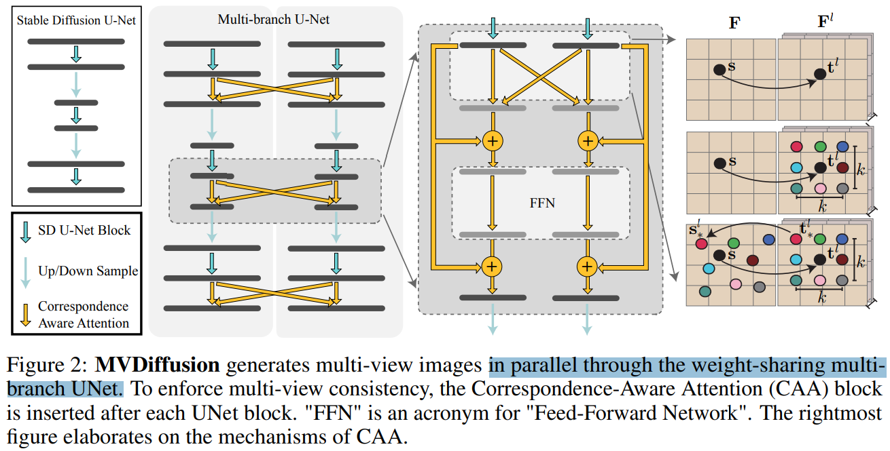
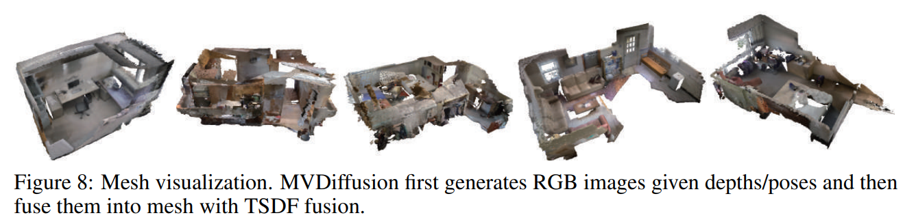

# MVDiffusion: Enabling Holistic Multi-view Image Generation with Correspondence-Aware Diffusion

> "MVDiffusion: Enabling Holistic Multi-view Image Generation with Correspondence-Aware Diffusion" NIPS-spotlight, 2023 Jul 3
> [paper](http://arxiv.org/abs/2307.01097v7) [code](https://github.com/Tangshitao/MVDiffusion) [pdf](./2023_07_NIPS_MVDiffusion--Enabling-Holistic-Multi-view-Image-Generation-with-Correspondence-Aware-Diffusion.pdf) [note](./2023_07_NIPS_MVDiffusion--Enabling-Holistic-Multi-view-Image-Generation-with-Correspondence-Aware-Diffusion_Note.md)
> Authors: Shitao Tang, Fuyang Zhang, Jiacheng Chen, Peng Wang, Yasutaka Furukawa

## Key-point

- Task
- Problems
- :label: Label:

## Contributions

## Introduction

## methods

Weight-sharing Unet 实现多个 View 的融合！

## setting

## Experiment

> ablation study 看那个模块有效，总结一下

## Limitations

## Summary :star2:

> learn what

### how to apply to our task

