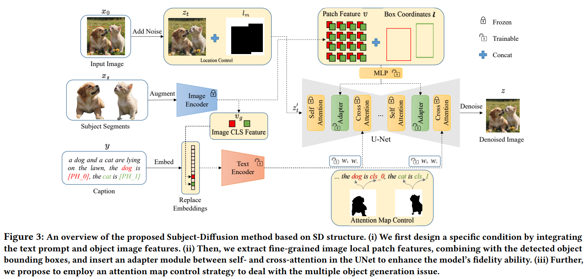

# Subject-Diffusion:Open Domain Personalized Text-to-Image Generation without Test-time Fine-tuning

> "Subject-Diffusion:Open Domain Personalized Text-to-Image Generation without Test-time Fine-tuning" SIGGRAPH, 2023 Jul 21
> [paper](http://arxiv.org/abs/2307.11410v2) [code](https://github.com/OPPO-Mente-Lab/Subject-Diffusion) [web](https://oppo-mente-lab.github.io/subject_diffusion/) [pdf](./2023_07_SIGGRAPH_Subject-Diffusion-Open-Domain-Personalized-Text-to-Image-Generation-without-Test-time-Fine-tuning.pdf) [note](./2023_07_SIGGRAPH_Subject-Diffusion-Open-Domain-Personalized-Text-to-Image-Generation-without-Test-time-Fine-tuning_Note.md)
> Authors: Jian Ma, Junhao Liang, Chen Chen, Haonan Lu (OPPO-AI)

## Key-point

- Task: referenced-based Image Generation
- Problems
- :label: Label:

## Contributions

## Introduction

- "GLIGEN: Open-Set Grounded Text-to-Image Generation" CVPR, 2023 Jan 17
  [paper](http://arxiv.org/abs/2301.07093v2) [code]() [pdf](./2023_01_CVPR_GLIGEN--Open-Set-Grounded-Text-to-Image-Generation.pdf) [note](./2023_01_CVPR_GLIGEN--Open-Set-Grounded-Text-to-Image-Generation_Note.md)
  Authors: Yuheng Li, Haotian Liu, Qingyang Wu, Fangzhou Mu, Jianwei Yang, Jianfeng Gao, Chunyuan Li, Yong Jae Lee

指定位置信息


### CLIP

> "An Image is Worth 16x16 Words: Transformers for Image Recognition at Scale" ICLR, 2020 Oct 22
> [paper](http://arxiv.org/abs/2010.11929v2) [code]() [pdf](./2020_10_ICLR_An-Image-is-Worth-16x16-Words--Transformers-for-Image-Recognition-at-Scale.pdf) [note](./2020_10_ICLR_An-Image-is-Worth-16x16-Words--Transformers-for-Image-Recognition-at-Scale_Note.md)
> Authors: Alexey Dosovitskiy, Lucas Beyer, Alexander Kolesnikov, Dirk Weissenborn, Xiaohua Zhai, Thomas Unterthiner, Mostafa Dehghani, Matthias Minderer, Georg Heigold, Sylvain Gelly, Jakob Uszkoreit, Neil Houlsby

- Q：CLIP image encoder 结构？

有两种

- ResNet-50

> We consider two different architectures for the image encoder. For the first, we use ResNet-50 (He et al., 2016a) as the base architecture for the image encoder due to its widespread adoption and proven performance. We make several modifications to the original version using the **ResNetD improvements** from He et al. (2019) and the **antialiased rect-2 blur pooling** from Zhang (2019). We also replace the global average pooling layer with an **attention pooling mechanism**.
>
> The attention pooling is implemented as a single layer of “transformer-style” multi-head QKV attention where the query is conditioned on the global average-pooled representation of the image.

- ViT

> For the second architecture, we experiment with the recently introduced Vision Transformer (ViT) (Dosovitskiy et al., 2020). We closely follow their implementation with only the minor modification of **adding an additional layer normalization to the combined patch and position embeddings before the transformer** and use a slightly different initialization scheme


- Q：版本？

ResNet 训了 5 个版本

> We train a series of 5 ResNets and 3 Vision Transformers. For the ResNets we train a ResNet-50, a ResNet-101, and then 3 more which follow EfficientNet-style model scaling and use approximately 4x, 16x, and 64x the compute of a ResNet-50. They are denoted as RN50x4, RN50x16, and RN50x64 respectively.
>
>  For the Vision Transformers we train a ViT-B/32, a ViT-B/16, and a ViT-L/14. We train all models for 32 epochs. We use the Adam optimizer (Kingma & Ba, 2014) with decoupled weight decay regularization (Loshchilov & Hutter, 2017) applied to all weights that are not gains or biases, and decay the learning rate using a cosine schedule (Loshchilov & Hutter, 2016)

- Q：训练？

能上的节省显存的都上了。。

ViT 最大模型训练 12 天，还训练了一个 336x336 输入的模型。

> The largest ResNet model, RN50x64, took 18 days to train on 592 V100 GPUs **while the largest Vision Transformer took 12 days on 256 V100 GPUs.** For the ViT-L/14 we also pre-train at a higher 336 pixel resolution for one additional epoch to boost performance similar to FixRes (Touvron et al., 2019). We denote this model as ViT-L/14@336px. Unless otherwise specified, all results reported in this paper as “CLIP” use this model which we found to perform best

CLIP-ViT

> We include three models **trained on 224- by-224 pixel images:** ViT-B/32, ViT-B/16, ViT-L/14, and the ViT-L/14 model **fine-tuned on 336-by-336 pixel** input images.

ViT 模型命名

>  ViT-L/16 means the “Large” variant with 16 16 input patch size.


- Q：Vit patch14，huge 和 large 配置？

`ViT-H-14`

```json
{
    "embed_dim": 1024,
    "vision_cfg": {
        "image_size": 224,
        "layers": 32,
        "width": 1280,
        "head_width": 80,
        "patch_size": 14
    },
    "text_cfg": {
        "context_length": 77,
        "vocab_size": 49408,
        "width": 1024,
        "heads": 16,
        "layers": 24
    }
}
```

`ViT-L-14`

```json
{
    "embed_dim": 768,
    "vision_cfg": {
        "image_size": 224,
        "layers": 24,
        "width": 1024,
        "patch_size": 14
    },
    "text_cfg": {
        "context_length": 77,
        "vocab_size": 49408,
        "width": 768,
        "heads": 12,
        "layers": 12
    }
}
```


#### `open_clip` 实现

- Q：`VisionTransformer` 的 CLS 和 patch token 是啥？

> `open_clip.transformers.VisionTransformer`

先看下 ViT CLIP 前向，先转为 **patch 特征**

```python
x = self.conv1(x)  # shape = [*, width, grid, grid]
x = x.reshape(x.shape[0], x.shape[1], -1)  # shape = [*, width, grid ** 2]
x = x.permute(0, 2, 1)  # shape = [*, grid ** 2, width]
```

有一个可学习的 CLS token，concat 到一起，加上 `position_embedding` 也是可学习参数

```
        # class embeddings and positional embeddings
        x = torch.cat(
            [self.class_embedding.to(x.dtype) + torch.zeros(x.shape[0], 1, x.shape[-1], dtype=x.dtype, device=x.device),
             x], dim=1)  # shape = [*, grid ** 2 + 1, width]
        x = x + self.positional_embedding.to(x.dtype)
```

dropout + LayerNorm

```python
# a patch_dropout of 0. would mean it is disabled and this function would do nothing but return what was passed in
x = self.patch_dropout(x)
x = self.ln_pre(x)
```

过 Transformer 了！结构看 ViT Config

> `open_clip\model_configs\ViT-L-14.json`；`"embed_dim": 768, "width": 1024, ` 这里的 width 是 Transformer hidden_state 通道数
>
>  `open_clip\model_configs\ViT-H-14.json` ；`"embed_dim": 1024, "width": 1280, "layers": 32,`

```python
        x = x.permute(1, 0, 2)  # NLD -> LND
        x = self.transformer(x)
        x = x.permute(1, 0, 2)  # LND -> NLD
```

ViT-L-14 不做 atten_pool！**直接把 transformer 出来的特征切开为 CLS 和 Patch Token** ，对 Patch Token 做下 LayerNorm

```python
        if self.attn_pool is not None:  # False
            x = self.attn_pool(x)
            x = self.ln_post(x)
            pooled, tokens = self._global_pool(x)
        else:
            pooled, tokens = self._global_pool(x)  # CLS token 和 Patch token
            pooled = self.ln_post(pooled)
```

看下实现

```python
    def _global_pool(self, x: torch.Tensor) -> Tuple[torch.Tensor, torch.Tensor]:
        if self.global_average_pool:  # False
            return x.mean(dim=1), x
        else:
            return x[:, 0], x[:, 1:]
```

最后把 `CLS token` **过一个没有 bias 的 MLP**（和一个可学习参数 `self.proj` 相乘来实现），调整通道 `C=1024 -> C=768` 

```python
        #self.proj = nn.Parameter(scale * torch.randn(width, output_dim))
        if self.proj is not None:
            pooled = pooled @ self.proj

        if self.output_tokens:
            return pooled, tokens
```

这个时候 patch token 特征还是 C=1024!


- Q：本文 code 里面**可以设置训练 CLIP**

>  `open_clip\model_configs\ViT-H-14.json` ；`"embed_dim": 1024, "width": 1280, "layers": 32,`

训练最后两层 Transformer & 最后 CLS token 出来的 MLP, LayerNorm

```python
        if self.hparams.train_clip_visual:
            params = []
            for name, module in self.model_clip.named_parameters():
                if "visual" in name and ("30" in name or "31" in name):
                    params.append(module)
                    module.requires_grad_(True)
                elif name == "visual.proj" or "visual.ln_post" in name:
                    params.append(module)
                    module.requires_grad_(True)
                else:
                    module.requires_grad_(False)
            model_params.append({'params': iter(params)})
```


#### `transformers` 实现

先调整范围 [0,1]；bilinear resize；norm 好

```python
vision_outputs = self.vision_model(
            pixel_values=pixel_values,
            output_attentions=output_attentions,
            output_hidden_states=output_hidden_states,
            return_dict=return_dict,
        )
image_embeds = vision_outputs[1]  # CLS token
image_embeds = self.visual_projection(image_embeds)  # no-bias MLP
```

先看最后：Transformer 输出的特征，通过一个 no bias 的 MLP 调整通道数 $C=1024 \to 768$

```python
self.visual_projection = nn.Linear(self.vision_embed_dim, self.projection_dim, bias=False)
```


- Q：需求，这里 CLIP transformer 返回的 `vision_outputs`里面把 patch token 找出来！

transformer 出来的特征把第一个 patch 切出来为 CLS；后面是 patch token

看下实现

> `transformers/models/clip/modeling_clip.py ` Line170

```python
class CLIPVisionTransformer(nn.Module):
    def __init__(self, config: CLIPVisionConfig):
        super().__init__()
        self.config = config
        embed_dim = config.hidden_size

        self.embeddings = CLIPVisionEmbeddings(config)  # Conv2D, 加 CLS token，加 position embed
        self.pre_layrnorm = nn.LayerNorm(embed_dim, eps=config.layer_norm_eps)
        self.encoder = CLIPEncoder(config)
        self.post_layernorm = nn.LayerNorm(embed_dim, eps=config.layer_norm_eps)
```

看下 forward

```python
    @add_start_docstrings_to_model_forward(CLIP_VISION_INPUTS_DOCSTRING)
    @replace_return_docstrings(output_type=BaseModelOutputWithPooling, config_class=CLIPVisionConfig)
    def forward(
        self,
        pixel_values: Optional[torch.FloatTensor] = None,
        output_attentions: Optional[bool] = None,
        output_hidden_states: Optional[bool] = None,
        return_dict: Optional[bool] = None,
    ) -> Union[Tuple, BaseModelOutputWithPooling]:
        r"""
        Returns:

        """
        output_attentions = output_attentions if output_attentions is not None else self.config.output_attentions
        output_hidden_states = (
            output_hidden_states if output_hidden_states is not None else self.config.output_hidden_states
        )
        return_dict = return_dict if return_dict is not None else self.config.use_return_dict

        if pixel_values is None:
            raise ValueError("You have to specify pixel_values")
		
       	# Conv2D, 加 CLS token，加 position embed
        hidden_states = self.embeddings(pixel_values)
        hidden_states = self.pre_layrnorm(hidden_states)
		
        # transformer
        encoder_outputs = self.encoder(
            inputs_embeds=hidden_states,
            output_attentions=output_attentions,
            output_hidden_states=output_hidden_states,
            return_dict=return_dict,
        )
		
        last_hidden_state = encoder_outputs[0]  # transformer output feature
        # cut CLS & patch token
        pooled_output = last_hidden_state[:, 0, :]
        pooled_output = self.post_layernorm(pooled_output)

        if not return_dict:
            return (last_hidden_state, pooled_output) + encoder_outputs[1:]

        return BaseModelOutputWithPooling(
            last_hidden_state=last_hidden_state,
            pooler_output=pooled_output,
            hidden_states=encoder_outputs.hidden_states,
            attentions=encoder_outputs.attentions,
        )
```


看下 transformer blocks Forward

> `transformers/models/clip/modeling_clip.py`  Line628

返回 3 个特征 `[hidden_states, encoder_states, all_attentions]`，**这里取 `last_hidden_state = encoder_outputs[0]` 已经是 transformer block 的输出特征了**；其他两个是每一层的特征和 cross-attn map 先不用管

```python
        output_attentions = output_attentions if output_attentions is not None else self.config.output_attentions
        output_hidden_states = (
            output_hidden_states if output_hidden_states is not None else self.config.output_hidden_states
        )
        return_dict = return_dict if return_dict is not None else self.config.use_return_dict

        encoder_states = () if output_hidden_states else None
        all_attentions = () if output_attentions else None

        hidden_states = inputs_embeds
        for idx, encoder_layer in enumerate(self.layers):
            if output_hidden_states:
                encoder_states = encoder_states + (hidden_states,)
            if self.gradient_checkpointing and self.training:

                def create_custom_forward(module):
                    def custom_forward(*inputs):
                        return module(*inputs, output_attentions)

                    return custom_forward

                layer_outputs = torch.utils.checkpoint.checkpoint(
                    create_custom_forward(encoder_layer),
                    hidden_states,
                    attention_mask,
                    causal_attention_mask,
                )
            else:
                layer_outputs = encoder_layer(
                    hidden_states,
                    attention_mask,
                    causal_attention_mask,
                    output_attentions=output_attentions,
                )

            hidden_states = layer_outputs[0]

            if output_attentions:
                all_attentions = all_attentions + (layer_outputs[1],)

        if output_hidden_states:
            encoder_states = encoder_states + (hidden_states,)

        if not return_dict:
            return tuple(v for v in [hidden_states, encoder_states, all_attentions] if v is not None)
        return BaseModelOutput(
            last_hidden_state=hidden_states, hidden_states=encoder_states, attentions=all_attentions
        )

```


## methods

### training data generation


### Subject-Diffusion



- Q：Patch Image Feature 怎么加 BoxCoordinates？？

看后面 SE-refine 的地方


#### Dense image and object location control

只用 text 去控制主体内容很难，提出用 dense CLIP Image feature

> Generating personalized images in an open domain while ensuring the fidelity of the subject image with only textual input poses a significant challenge.

> we propose to incorporate dense image features as an important input condition, similar to the textual input condition, similar to the textual input condition.


与任务相关，只想要物体主体，**不想要背景信息！因此把物体抠出来，去过 CLIP**

> To ensure that the model focuses solely on the subject information of the image and disregards the background information, we feed the segmented subject image into the CLIP  image encoder to obtain 256-length patch feature tokens


使用 Fourier-transformed coordinate 处理下物体的 bbox，和 CLIP-image feature CONCAT 起来

>  to prevent confusion when generating multiple subjects, we fuse the corresponding image embedding with the **Fourier-transformed coordinate position information of the subject.**

> Subsequently, we feed the fused information into the UNet framework for learning. In each Transformer block, we introduce a new learn

- Q：Adapter 是啥，怎么使用 CLIP+坐标信息？

$L_a$ 为前面一层 self-attn 输出，$\gamma$ 为 zero-initialized scalar, $h^e$ 为 cocat 起来过 MLP 的输出（CLIP+位置） ，输入 self-attn 模块


> In each Transformer block, we introduce a new learnable adapter layer between the self-attention layer and the cross-attention layer

- 𝑣 the visual 256 patch feature tokens of an image
- 𝑙 the coordinate position


Trick: 训练 Adapter，Cross-Attn 的 KeyValue layer

> In the process of training the UNet model, we selectively activate the key and value layers of the cross-attention layers and the adapter layers while freezing the remaining layers.

- Q：多个物体？

一起 concat

> For multiple subjects, we overlay the binary images of each subject and then concatenate them onto the latent feature.

```python
import open_clip
self.model_clip, _, self.preprocess = open_clip.create_model_and_transforms(
            "ViT-H-14", pretrained="/public_data/ma/models/ViT-H-14.pt")
```


#### Cross-attn map loss

在 token 角度先把 text & image-feature 融合，重新训练 TextEncoder；之后在 Cross-Attn map 上做 loss

> Then, in contrast to approaches [Ma et al. 2023b,a; Shi et al. 2023; Xiao et al. 2023], we choose to fuse text and image information before the text encoder. We conduct extensive experiments, showing that **fusing text and image information before the text encoder and then retraining the entire text encoder has stronger self-consistency than fusing them later**.


### SE-refine(groundingNet)

> https://vscode.dev/github/OPPO-Mente-Lab/Subject-Diffusion/blob/main/train.py#L176

用 Vit-h-16 的 patch token $16 * 16= 256$ 个 patch 特征（每个特征C=1024）

> To ensure that the model focuses solely on the subject information of the image and disregards the back ground information, we feed the segmented subject image into the CLIP [Radford et al. 2021] image encoder to obtain 256-length patch feature tokens. Furthermore, to prevent confusion when gen erating multiple subjects, we fuse the corresponding image em bedding with the Fourier-transformed coordinate position infor mation of the subject. 

- Q：如何传入 UNet?

在 Cross Text Attn 和 self-attn 之间加了一个假的 Cross-attn

把 Patch+bbox 特征 先过一层 MLP 调整通道和 hidden_state 一致，然后**把 Patch+bbox 特征 和 hidden_state concat 起来做 self-attn**

>  Subsequently, we feed the fused informa tion into the UNet framework for learning, similar to GLIGEN [Li et al. 2023b].
>
> In each Transformer block, we introduce a new learn able adapter layer between the self-attention layer and the cross attention layer, which takes the fused information as input and is defined as $L𝑎 := L𝑎 + 𝛽 ·𝑡𝑎𝑛ℎ(𝛾) ·𝑆([L𝑎,ℎ𝑒])$
>
> $ℎ𝑒 = 𝑀𝐿𝑃([𝑣,𝐹𝑜𝑢𝑟𝑖𝑒𝑟(𝑙)])$

训练 Trick，只训练 cross-attn 和加入的 adapter

> In the process of training the UNet model, we selectively activate the key and value layers of the cross-attention layers and the adapter layers while freezing the remaining layers. This approach is adopted to enable the model to focus more on learning the adapter layer

在输入 Unet 的 zT 和 mask concatenate起来 

>  we overlay the binary images of each subject and then concatenate them onto the latent feature.


#### 实现

这里的 SD 看起来是用构造的数据集，重新训练的

```python
self.model_clip, _, self.preprocess = open_clip.create_model_and_transforms(
            "ViT-H-14", pretrained="/public_data/ma/models/ViT-H-14.pt")
```

设置 ViT `output_tokens=True`，返回最后两层之前的特征，就是没有经过 LayerNorm & Project 的特征作为 token，**整个模型输出的为 `cls token`**，可选择输出 patch token；

CLS token C=1024, Patch Token C=1280 :star:

> 细节 CLIP 代码看前面 introduction 笔记
>
>  `open_clip\model_configs\ViT-H-14.json` ；`"embed_dim": 1024, "width": 1280, "layers": 32,`


CLS Token 需要再经过 2x MLP + 残差

```python
    def encode_images_test(self, images, bboxes, device):
        image_tensor = []
        for image in images:
            image_tensor.append(self.preprocess(image).unsqueeze(0).to(device))
        image_embeddings_cls, image_embeddings = self.model_clip.to(
            device).half().encode_image(torch.cat(image_tensor).half())
        image_embeddings_cls = self.mlp.half()(image_embeddings_cls)  # CLS token -> 2xMLP + residual
        image_token_idx_mask = torch.ones(
            1, 2, 1, 1, dtype=bool, device=device)
        return image_embeddings_cls, self.proj(image_embeddings.unsqueeze(0), image_token_idx_mask, bboxes.half())
```

MLP 结构

```python
# self.mlp = MLP(1024, 1024, 1024, use_residual=False)
class MLP(nn.Module):
    def __init__(self, in_dim, out_dim, hidden_dim, use_residual=True):
        super().__init__()
        if use_residual:
            assert in_dim == out_dim
        self.layernorm = nn.LayerNorm(in_dim)
        self.fc1 = nn.Linear(in_dim, hidden_dim)
        self.fc2 = nn.Linear(hidden_dim, out_dim)
        self.use_residual = use_residual
        self.act_fn = nn.GELU()

    def forward(self, x):
        residual = x
        x = self.layernorm(x)
        x = self.fc1(x)
        x = self.act_fn(x)
        x = self.fc2(x)
        if self.use_residual:
            x = x + residual
        return x

```


bbox 先计算 FourierEmbedder 弄成一个 C=64 的特征，之后 **bbox 特征和 Patch Token C=1280 Concat 到一起过 2 层 MLP**，
**弄成一个 和 CLS token C=1024 一样通道数的特征**

> https://vscode.dev/github/OPPO-Mente-Lab/Subject-Diffusion/blob/main/modules.py#L44

```python
# self.proj = GroundingNet(1280, 1024, 1024)
class GroundingNet(nn.Module):
    def __init__(self,
                 input_dim: int,
                 output_dim: int,
                 hidden_dim: int,
                 fourier_freqs=8,
                 num_token=256,
                 use_bbox=True
                 ):
        super(GroundingNet, self).__init__()
        self.fourier_embedder = FourierEmbedder(num_freqs=fourier_freqs)
        self.position_dim = fourier_freqs*2*4
        self.linears_image = MLP(
            in_dim=input_dim + self.position_dim, out_dim=output_dim, hidden_dim=hidden_dim, use_residual=False)
        self.null_image_feature = torch.nn.Parameter(
            torch.zeros([1, 1, num_token, input_dim]))
        self.null_position_feature = torch.nn.Parameter(
            torch.zeros([1, 1, num_token, self.position_dim]))
        self.use_bbox = use_bbox

    def forward(self, image_embeddings, image_token_idx_mask, bboxes):
        bsz, num_of_objects, _, dim = image_embeddings.size()
        image_embeddings = image_embeddings*image_token_idx_mask + \
            (~image_token_idx_mask)*self.null_image_feature
        xyxy_embedding = self.fourier_embedder(
            bboxes).unsqueeze(-2)  # B*N*4 --> B*N*C
        if not self.use_bbox:
            image_token_idx_mask = image_token_idx_mask.sum(
                1, keepdim=True) > 1
        xyxy_embedding = xyxy_embedding*image_token_idx_mask + \
            (~image_token_idx_mask)*self.null_position_feature
        xyxy_embedding = xyxy_embedding.reshape(bsz, -1, self.position_dim)
        image_embeddings = image_embeddings.reshape(bsz, -1, dim)
        objs_image = self.linears_image(
            torch.cat([image_embeddings, xyxy_embedding], dim=-1))
        return objs_image
```

- Q：bbox 咋设置？

> https://vscode.dev/github/OPPO-Mente-Lab/Subject-Diffusion/blob/main/custom_dataset.py#L277

看下 Dataset 里面怎么返回出来的，**归一化到了 0-1！:star:**

```python
y, x = torch.where(mask == 0)
bbox = (x.min(), y.min(), x.max(), y.max())  # matrix id range in 0 -> 512 maybe?
bboxes[len(kept_masks)] = torch.tensor([bbox])/512  # normalize to [0,1]
```


- Q：咋用这个特征？

```python
objects = image_embeddings
noise_pred = self.unet(torch.cat([noisy_latents.half(), input_mask.half(
        )*latents_c.half()], 1), timesteps, encoder_hidden_states, objs=objects.half()).sample
```

在 Cross Text Attn 和 self-attn 之间加了一个假的 Cross-attn

把 Patch+bbox 特征 先过一层 MLP 调整通道和 hidden_state 一致，然后**把 Patch+bbox 特征 和 hidden_state concat 起来做 self-attn**

```python
        ####################################################################################
        # identity mapping in the beginning
        hidden_states = self.fuser(hidden_states, objs)
        ####################################################################################

```

结构

```python
class GatedSelfAttentionDense(nn.Module):
    def __init__(self, query_dim, context_dim,  n_heads, d_head):
        super().__init__()

        # we need a linear projection since we need cat visual feature and obj feature
        self.linear = nn.Linear(context_dim, query_dim)

        # self.attn = CustomSelfAttention(query_dim=query_dim, heads=n_heads, dim_head=d_head)
        self.attn = Attention(
            query_dim=query_dim,
            heads=n_heads,
            dim_head=d_head,
            cross_attention_dim=None,
        )  # is a self-attention
        self.ff = FeedForward(query_dim)

        self.norm1 = nn.LayerNorm(query_dim)
        self.norm2 = nn.LayerNorm(query_dim)

        self.register_parameter('alpha_attn', nn.Parameter(torch.tensor(0.)))
        self.register_parameter('alpha_dense', nn.Parameter(torch.tensor(0.)))

        # this can be useful: we can externally change magnitude of tanh(alpha)
        # for example, when it is set to 0, then the entire model is same as original one
        self.scale = 1

    def forward(self, x, objs):

        N_visual = x.shape[1]
        objs = self.linear(objs)

        x = x + self.scale*torch.tanh(self.alpha_attn) * self.attn(
            self.norm1(torch.cat([x, objs], dim=1)))[:, 0:N_visual, :]
        x = x + self.scale * \
            torch.tanh(self.alpha_dense) * self.ff(self.norm2(x))

        return x

```


## setting

- For image alignment, we calculate the CLIP visual similarity (CLIP-I) and DINO [Caron et al. 2021] similarity between the generated images and the target concept images.

- text alignment, we calculate the CLIP text-image similarity


## Experiment

> ablation study 看那个模块有效，总结一下

- Q：为什么叫 zero-shot??

先前方法每次测试都要训练一遍 Lora

> However, our method and similar ones do not require any test-time finetuning and can generate personalized images in a zero-shot manner, making them more efficient and user-friendly


- 用 CLIP 图像特征，主体一致性还是很垃圾啊


单个物体生成

- DINO 指标高很多，但也偏主观了


生成 2 个 物体


人体生成


- 不加 box-coordinates 居然好了。。。但多个物体又不行了

  SD 生成单个物体能力还可以，但多个就很垃圾

- Attention map loss 进行控制，是否使用差距不明显


## Limitations

## Summary :star2:

> learn what

### how to apply to our task

- 不加 box-coordinates 居然好了。。。但多个物体又不行了

  SD 生成单个物体能力还可以，但多个就很垃圾

- Attention map loss 进行控制，是否使用差距不明显

- 用 CLIP 图像特征，主体一致性还是很垃圾啊
