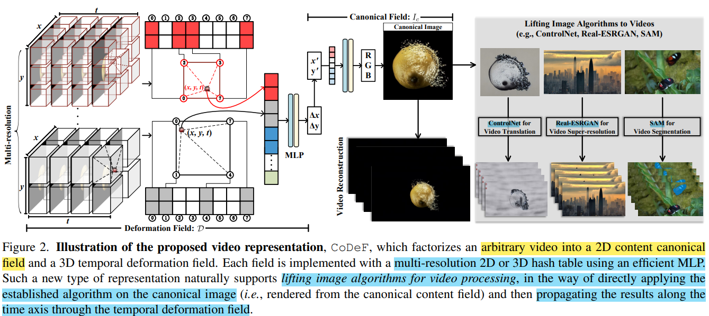

# CoDeF: Content Deformation Fields for Temporally Consistent Video Processing

> "CoDeF: Content Deformation Fields for Temporally Consistent Video Processing" Arxiv, 2023 Aug :star:
> [paper](https://arxiv.org/abs/2308.07926) [code](https://github.com/qiuyu96/codef) [website](https://qiuyu96.github.io/CoDeF/) 
> [paper local pdf](./2023_08_Arxiv_CoDeF--Content-Deformation-Fields-for-Temporally-Consistent-Video-Processing.pdf)

## Key-point

**Contributions**

## Related Work

- hash encoding

  "Instant Neural Graphics Primitives with a Multiresolution Hash Encoding" SIGGRAPH, 2022 Jan
  [paper](https://arxiv.org/abs/2201.05989) [code](https://github.com/NVlabs/instant-ngp) [website](https://nvlabs.github.io/instant-ngp/?utm_source=catalyzex.com)
  
- "Text2LIVE: Text-Driven Layered Image and Video Editing" ECCV Oral, 2022 Apr :star:
  [paper](https://arxiv.org/abs/2204.02491) [website](https://text2live.github.io/?utm_source=catalyzex.com)

  > strong baseline
  > introduces the application of CLIP [37] models for video editing by modifying an optimized atlas

- Text2Image applied on video :star:

- Text2Video

  

  

## methods

> - :question: 如何加入文本信息 text prompt
> - 试一版只修改 prompt 实现修复
> - 每一帧用 SAM 获取 mask

propose representing a video V using a flattened canonical image Ic and a deformation field D

提出一种新的视频表征，类似 Neural atlas 但效果更好。将视频分解伪 canonical image 和 各帧的形变空间，之后可以对 canonical image 编辑，然后用形变空间的信息 propagate 到其余帧。

> effectively model and reconstruct both the canonical content and the temporal deformation for an arbitrary video

### Annealed 3D Hash Encoding for Deformation

3D hash deformation fitting harm temporal consistency

### Flow-guided Consistency Loss

further enhance the smoothness of deformation

用 RAFT 获取前后向光流

## Experiment

> ablation study 看那个模块有效，总结一下

## Limitations

- 目前需要对逐个场景优化

  尝试 feed-forward implicit field techniques

  > "pixelNeRF: Neural Radiance Fields from One or Few Images" CVPR, 2020 Dec
  > [paper](https://arxiv.org/abs/2012.02190) [code](https://github.com/sxyu/pixel-nerf?utm_source=catalyzex.com)

- extreme change in viewpoint

  3D priors 缓解场景大幅变换的情况

  > "Instruct-nerf2nerf: Editing 3d scenes with instructions." ICCV, 2023 Mar
  > [paper](https://arxiv.org/abs/2303.12789) [website](https://www.catalyzex.com/redirect?url=https://instruct-nerf2nerf.github.io)

- large non-rigid deformations remains a concern

  > "HyperNeRF: A Higher-Dimensional Representation for Topologically Varying Neural Radiance Fields" SIGGRAPH, 2021 Jun
  > [paper](https://arxiv.org/abs/2106.13228) [website](https://hypernerf.github.io/?utm_source=catalyzex.com)

  

## Summary :star2:

> learn what & how to apply to our task