# DiffBIR

> "DiffBIR: Towards Blind Image Restoration with Generative Diffusion Prior" Arxiv, 2023 Aug
> [paper](https://arxiv.org/abs/2308.15070) [code](https://github.com/xpixelgroup/diffbir) [website](https://0x3f3f3f3fun.github.io/projects/diffbir/)
> [pdf](./2023_08_Arxiv_DiffBIR--Towards-Blind-Image-Restoration-with-Generative-Diffusion-Prior.pdf)

## Key-point

- Task: Blind Image Restoration
- Background
- :label: Label: Stable-Diffusion

> - [x] 为什么要用加入额外的先验
>
>   图像修复需要生成一些内容，借助 Stable Diffusion 进一步提升生成能力
>
>   使用 SwinIR 初步修复后，the lost local textures and coarse/fine details are still absent, 使用 Stable Diffusion 取弥补丢失的信息
>
> - [x] 为什么用 stable diffusion
>
>   powerful generative prior

使用预训练的 Stable Diffusion 模型处理盲图修复任务。设计了一个两阶段模型

1. Stage1 使用 SwinIR 预修复：在各种混合退化的数据上训练，提升 real-world degradation 的泛化性，得到初步修复的结果

2. Stage2 利用 Stable Diffusion 的生成能力，提升修复图像的细节；

   类似 ControlNet 方式去训练一个 Encoder，保持 Stable Diffusion 冻住，来保持 StableDiffusion 的生成能力

3. 提出一个 controllable module `LAControlNet` >> balance quality and fidelity by introducing the latent image guidance

在盲图超分，人脸修复任务 SOTA


## Contributions

1. 提出 DiffBIR 一个统一框架，整合先前模块的优势
   1. 拓展了生成退化图像的退化模型，生成的退化图像更接近真实退化
   2. 使用 Stable-Diffusion 作为先验，提升模型的生成能力
   3. 提出 2 阶段模型保证生成结果 realness, fidelity
2. 提出一个 controllable module `LAControlNet` 来利用 Stable-Diffusion 的先验信息，保证输出可信度、真实度


## Introduction

The ultimate goal of BIR is to realize realistic image reconstruction on general images with general degradations.


BIR(Blind Image Restoration) 分为三大类, blind image super-resolution (BSR), zero-shot image restoration (ZIR) and blind face restoration (BFR)

### BSR(Blind SR)

- "Blind Image Super-Resolution: A Survey and Beyond"
  [paper](https://arxiv.org/abs/2107.03055)
- "Designing a practical degradation model for deep blind image super-resolution" ICCV, 2021Mar, **BSRGAN**
  [paper](https://arxiv.org/abs/2103.14006)
- "Real-esrgan: Training real-world blind super-resolution with pure synthetic data" ICCV, 2021 July, **Real-esrgan**
  [paper](https://arxiv.org/abs/2107.10833) [code](https://github.com/xinntao/Real-ESRGAN)

BSR 主要针对 real-world super-resolution problems，使用合成退化数据 & 使用 adversarial loss，虽然能实现大致的修复，但无法生成细节。分辨率局限，SR 设定局限于 x4/x8 和 BIR 需求不完全匹配


### ZIR(zero-shot IR)

- DDRM

- DDNM

- "Generative Diffusion Prior for Unified Image Restoration and Enhancement" CVPR, 2023 Apr
  [paper](https://arxiv.org/abs/2304.01247) [website](https://generativediffusionprior.github.io/)

  参考 colorization loss

使用 diffusion 作为额外的先验信息，生成能力比 GAN-base 方法更好。需要预先假定的退化类型，但对于unknown degradation效果不好。


### BFR(Face Restoration)

- "Vqfr: Blind face restoration with vector-quantized dictionary and parallel decode" ECCV, 2022 May, VQFR
  [paper](https://arxiv.org/pdf/2205.06803.pdf)

- "Towards Robust Blind Face Restoration with Codebook Lookup Transformer" NeurIPS, 2022 Jun, CodeFormer :statue_of_liberty:
  [paper](https://arxiv.org/abs/2206.11253) [code](https://github.com/sczhou/CodeFormer) [website](https://shangchenzhou.com/projects/CodeFormer/)

- DifFace

  "DifFace: Blind Face Restoration with Diffused Error Contraction"
  [code](https://github.com/zsyOAOA/DifFace)

  > 可以做 old photo enhancement

针对人脸修复，图像空间更小，可以使用 VQGAN；但只属于 BIR 的一个子任务

> 小结：目前 BIR 方法无法处理一般的图像（不同分辨率、退化类型）情况，并且修复的真实性不好

1. 使用扩展的退化数据 degradation model，更接近真实数据中的退化

2. 用 well-trained Stable Diffusion 作为 Generation Module **提升修复过程中的生成能力**，生成新的纹理

   提出 LAControlNet 针对修复任务使用 Stable Diffusion 的先验信息

3. 使用 2-stage 模型实现真实性、可信

   Stage1 使用  SwinIR 作为 Image Restoration Module


### SwimIR

> "SwinIR: Image Restoration Using Swin Transformer"
> [paper](https://arxiv.org/abs/2108.10257) [code](https://github.com/JingyunLiang/SwinIR)
> [blog](https://zhuanlan.zhihu.com/p/558789076)

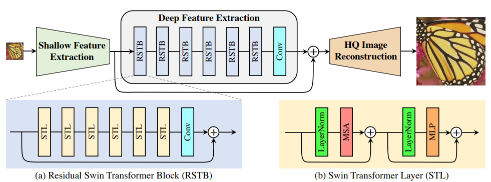

Shallow Feature Extraction 使用1层 3x3 Conv；HQ Image Reconstruction 针对SR任务用 sub-pixel Conv, 对 Denoise 任务用一层普通 Conv

Loss Function 对 SR 任务参照先前方法只用 L1 loss $\mathcal{L}=\|I_{RHQ}-I_{HQ}\|_1,$；针对 Denoise 使用 Charbonnier loss $\mathcal{L}=\sqrt{\|I_{RHQ}-I_{HQ}\|^2+\epsilon^2}, ~where ~\epsilon=10^{-3}$


### Diffusion Process

> 参考 [DDNM paper 中的总结](https://arxiv.org/pdf/2212.00490.pdf)
>
> - 具体每一步推到参考
>
>   "Understanding Diffusion Models: A Unified Perspective" Arxiv, 2022 Aug [paper](https://arxiv.org/abs/2208.11970)

DDPM **原先用于图像重建任务**，定义 T 步的前向加噪和 T 步的反向去噪过程，forward process 逐步添加随机噪声，去噪过程从噪声中逐步恢复数据

1. 加噪 T 步，每步加一个符合高斯正态分布的噪声
   $$
   q(\mathbf{x}_{t}|\mathbf{x}_{t-1})=\mathcal{N}(\mathbf{x}_{t};\sqrt{1-\beta_{t}}\mathbf{x}_{t-1},\beta_{t}\mathbf{I})\quad i.e.\,\quad\mathbf{x}_{t}=\sqrt{1-\beta_{t}}\mathbf{x}_{t-1}+\sqrt{\beta_{t}}\boldsymbol{\epsilon},\quad\boldsymbol{\epsilon}\sim\mathcal{N}(0,\mathbf{I}) \\
   
   \mu = \sqrt{1-\beta_{t}},~ \sigma=\beta_t
   $$
   预先确定每一步的 $\beta_t$ 即噪声表，使得加噪过程是确定的，可以直接从干净图像 $x_0$ 一步加噪得到 $x_t$
   $$
   q(\mathbf{x}_t|\mathbf{x}_0)=\mathcal{N}(\mathbf{x}_t;\sqrt{\bar{\alpha}_t}\mathbf{x}_0,(1-\bar{\alpha}_t)\mathbf{I})\quad\text{with}\quad\alpha_t=1-\beta_t,\quad\bar{\alpha}_t=\prod\limits_{i=0}^t\alpha_i. \\
   x_t=\sqrt{\bar{\alpha}_t}\boldsymbol{x}_0+\sqrt{1-\bar{\alpha}_t}\boldsymbol{\epsilon}_0
   $$

2. **每一步的反向去噪过程**，目标从 $x_t$ 恢复出 $x_{t-1}$

   根据从 Bayes 公式推出，
   $$
   p(\mathbf{x}_{t-1}|\mathbf{x}_t,\mathbf{x}_0)=q(\mathbf{x}_t|\mathbf{x}_{t-1})\frac{q(\mathbf{x}_{t-1}|\mathbf{x}_0)}{q(\mathbf{x}_t|\mathbf{x}_0)}=\mathcal{N}(\mathbf{x}_{t-1};\boldsymbol{\mu}_t(\mathbf{x}_t,\mathbf{x}_0),\sigma_t^2\mathbf{I})\\
   $$
   参考 [paper](https://arxiv.org/abs/2208.11970) Page 12（细节暂时忽略），推导出均值和方差。
   $$
   \mu_q(\boldsymbol{x}_t,\boldsymbol{x}_0)=\frac{\sqrt{\alpha_t}(1-\bar{\alpha}_{t-1})\boldsymbol{x}_t+\sqrt{\bar{\alpha}_{t-1}}(1-\alpha_t)\boldsymbol{x}_0}{1-\bar{\alpha}_t}
   \\
   \sigma_{t}^{2}=\frac{1-\bar{\alpha}_{t-1}}{1-\bar{\alpha}_{t}}\beta_{t}\\
   $$
   其中在去噪过程中 $x_0$ 的真值无法得到，因此从前向一步加噪公式推出 $x_0 = (x_t -\sqrt{1-\bar{\alpha}_t}\boldsymbol{\epsilon}_0)/\sqrt{\bar{\alpha}_t}$， 使用模型 （Time-Condition U-Net）去预测 $\hat{x_0} \to x_t$ 的噪声 $\boldsymbol{\epsilon}_0=\mathcal{Z}_\boldsymbol{\theta}(\mathbf{x}_t,t)$。均值的公式因此可化简为
   $$
   \boldsymbol{\mu}_{t}(\mathbf{x}_{t},\mathbf{x}_{0})=\frac{1}{\sqrt{\alpha_{t}}}\left(\mathbf{x}_{t}-\boldsymbol{\epsilon_0}\frac{1-\alpha_{t}}{\sqrt{1-\bar{\alpha}_{t}}}\right)\\
   $$
   之后带入上述 $p(\mathbf{x}_{t-1}|\mathbf{x}_t,\mathbf{x}_0)$ 公式，求出 $x_{t-1}$

   > 训练时，从数据集随机取一个干净图像 $x_0$，随机采样一个 $\epsilon_0 \sim\mathcal{N}(0,\mathbf{I})$，随机取一个时间步 t
   > $$
   > x_t=\sqrt{\bar{\alpha}_t}\boldsymbol{x}_0+\sqrt{1-\bar{\alpha}_t}\boldsymbol{\epsilon}_0\\
   > \text{Model predict: } \boldsymbol{\epsilon}^{\prime}_0=\mathcal{Z}_\boldsymbol{\theta}(\mathbf{x}_t,t)\\
   > 
   > minmize~\nabla_{\boldsymbol{\theta}}||\boldsymbol{\epsilon}-\mathcal{Z}_{\boldsymbol{\theta}}(\sqrt{\bar{\alpha}_t}\mathbf{x}_0+\boldsymbol{\epsilon}\sqrt{1-\bar{\alpha}_t},t)||_2^2.
   > $$

3. 迭代从 $x_t \to x_{t-1} \to \cdots \to x_0$


###  Guide Diffusion

关注在 Stable Diffusion 中如何使用 Degraded Image 引导修复

- "Zero-Shot Image Restoration Using Denoising Diffusion Null-Space Model" 2022 Dec
  [paper](https://arxiv.org/pdf/2212.00490.pdf)

  使用 Range-Null Space 构造图像与退化变换 A 之间的关系，Null-Space 不好处理就用 diffusion 预测。用下面的公式实现使用退化图像作为引导信息
  $$
  \mathbf{x}\equiv\mathbf{A}^{\dagger}\mathbf{A}\mathbf{x}+(\mathbf{I}-\mathbf{A}^{\dagger}\mathbf{A})\mathbf{x}.\\
  y=Ax\\
  \therefore~x=A^{+}y + (I-A^{+}A)\hat{x_0}
  $$
  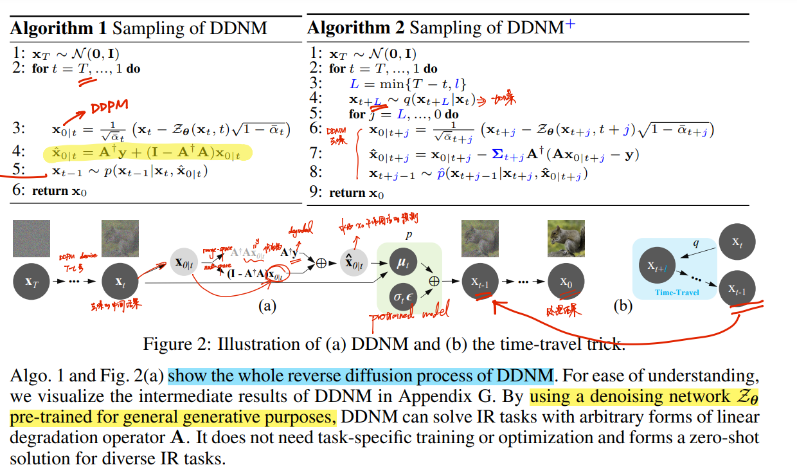

- "Generative diffusion prior for unified image restoration and enhancement"
  [paper](https://arxiv.org/abs/2304.01247) [website](https://generativediffusionprior.github.io/)
  

  去噪的每一步，去预测对应的退化模型，加到逐步去噪的图像上得到每步退化的图像，用真实退化 y 去监督

- "SDEdit: Guided Image Synthesis and Editing with Stochastic Differential Equations" 2021 Aug
  [paper](https://arxiv.org/abs/2108.01073) :baby:

  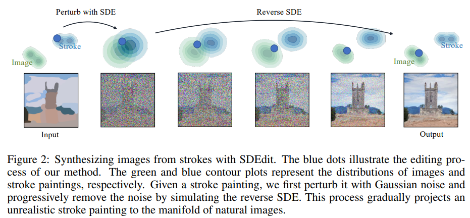

  based on a diffusion model generative prior. **perturb image gudiance with Gaussian noise** and progressively remove the noise by simulating the reverse SDE

  对引导图像加 noise 扰动, SDE 方式优化

- "RePaint: Inpainting using Denoising Diffusion Probabilistic Models" CVPR, 2022 Jan :statue_of_liberty:
  [paper](https://arxiv.org/abs/2201.09865)

  Usage of Image Prior: 

- "Imagic: Text-Based Real Image Editing with Diffusion Models" CVPR, 2022 Oct
  [paper](https://arxiv.org/abs/2210.09276) [website](https://imagic-editing.github.io/)
  

  utilize the text embedding layer of the diffusion model to perform semantic manipulations

  优化 prompt 去生成，**将图像信息都存入优化的 prompt 中**，最后只输入 noise

- "Inpaint Anything: Segment Anything Meets Image Inpainting" Arxiv, 2023 Apr
  [paper](https://arxiv.org/pdf/2304.06790.pdf)

  directly employ a powerful AIGC model of Stable Diffusion [11] to generate the desired content in the hole based on text-prompting


## methods

> - [ ] 如果使用 Stable Diffusion 的特征，特征分布不一致问题如何解决？已经是特征的情况下，不使用 VAE 存在问题？
> - [ ] Stable Diffusion 如何用图像做 condition ?
> - [ ] spaced DDPM sampling

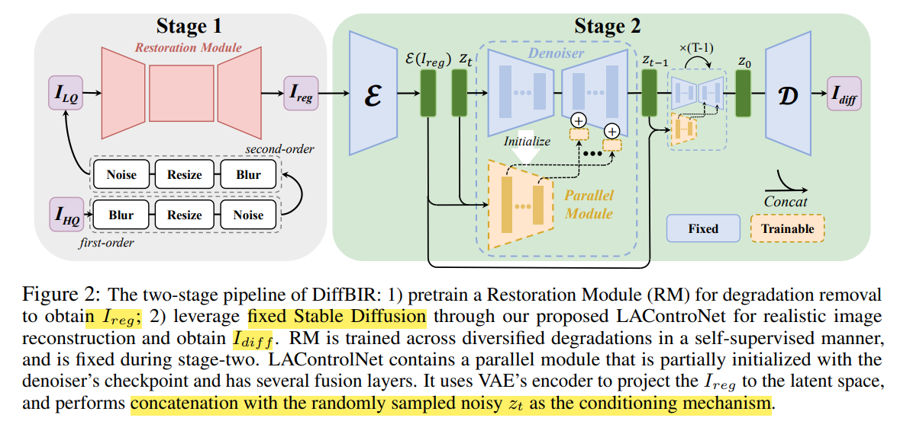

Stage 1 使用 SwinIR 模型，先在文章中构造的合成数据上 pretrain，实现多类型退化修复，得到初步修复的图像 $I_{reg}$。
Stage 2 将图像通过 VAE 映射到 Stable Diffusion 特征空间，用 LAControlNet 融入先验


### Degradation Model

> Appendix A

考虑 diversified degradation and high-order degradation 两类退化

- diversified degradation

  1. blur:  isotropic Gaussian and anisotropic Gaussian kernels
  2. resize: area resize, bilinear interpolation and bicubic resize
  3. noise: additive Gaussian/Poisson/JPEG compression noise

- high-order degradation 参考 Real-ESRGAN

  repeats the classical degradation model: blur-resize-noise process twice

当前任务只考虑 image restoration 对于**退化图像保持同样分辨率**


### Restoration Module (RM)

> pixel unshuffle 参考[paper](https://arxiv.org/pdf/1609.05158.pdf)

对 SwinIR 结构略微调整，将 LQ 图像用 `pixel unshuffle` 降采样 8 倍，之后用 3x3 卷积提取 shallow 特征，Transformer 处理，使得图像修复在低维空间做，类似 Latent Diffusion Model. 最后上采样3次，每次用 nearest 插值 & 1xConv & 1xLeakyRelu. 

使用 L2 pixel Loss 
$$
I_{reg}=\text{SwinIR}(I_{LQ}),\mathcal{L}_{reg}=||I_{reg}-I_{HQ}||_2^2,
$$


### LDM Prior

- Motivation

  使用 RM 修复的初步结果，细节区域太过平滑，真实性差很多。
  
  > over-smoothed and still far from the distribution of high-quality natural images.


将高斯噪声 $z_t$ 和 VAE 输出图像特征  $\mathcal{\epsilon}(I_{reg})$ 直接 concatenate 过 zero-initialized 1x1 conv，作为复制 Encoder 的输入，将对应残差的特征，过 1x1 Conv 加到 Decoder 对应位置

1. 只对 U-net 残差部分进行调整；此种方式能够避免在小数据集上过拟合，同时获取到 Stable Diffusion 的高质量生成特征。

2. 使用 VAE 作为桥梁，将 condition image 映射到 LDM 同样的 feature space，**节省外部特征与 LDM 特征的 feature alignment 特征对齐的问题**

   ControlNet 要从头训 encoder 来实现特征对齐

3. **消融实验发现直接用 ControlNet 方式做图像修复，存在严重的颜色偏差** :star:

- 对比 ControlNet

  ControlNet 也同样对残差部分进行处理，只用 condition 作为输入，并且 condition 的特征是重新去训练得到的，存在特征分布不一致问题；
  DiffBIR 区别在于这个 condition 通过 VAE 先提取特征（实现特征分布对齐），然后和噪声 zt concat 再过 1x1 zero-conv 缩减通道数；

  ControlNet 和 DiffBIR 将 condition 特征融入 Decoder 的方式类似，都是先过 zero-conv 再加入到 Decoder 原先残差对应位置

  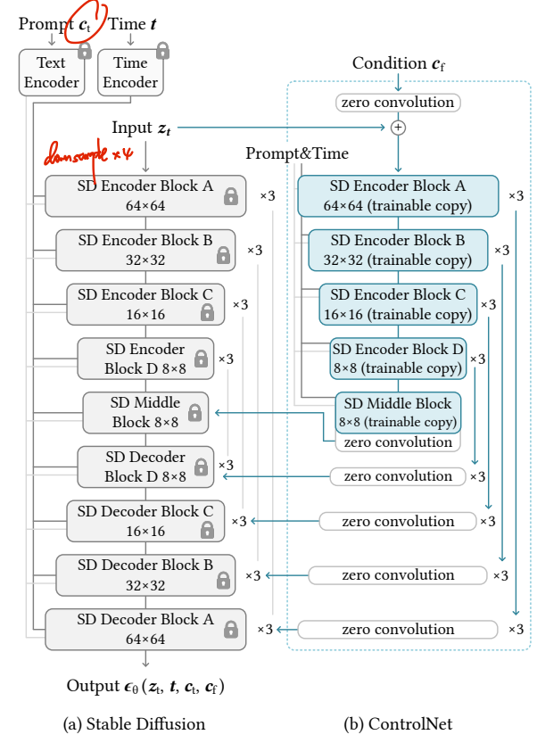

- 和 ControlNet 的差异

  ControlNet 将 512x512 大小的 condition 图像，通过 4层卷积（stride2x2）调整到和 stable diffusion 特征一样尺寸

  > 4 × 4 kernels and 2 × 2 strides (activated by ReLU, using 16, 32, 64, 128,) 之后再过 ControlNet Encoder

  DiffBIR 使**用 `Stable Diffusion` 的 VAE 将 condition 图像转化为 feature**，然后将 feature 和噪声 $z_t$ concat 输入同样参数初始化的 Encoder（初始特征通道数加倍了，用第一层 zero-conv 调整通道数和原来一致）

  


### Trade-off

设置权值 s，调整生成结果的真实度、可信度（更接近退化图像，但有噪声）之间的 trade-off。SwinIR 修复结果通过 VAE 的特征  $\epsilon(I_{reg})$ 和 diffusion 在 T 步预测的 $z^{\prime}_0$ ，将通过 Latent-based Loss 实现特征与 Latent feature 的对齐 :star:

设置一个 **Loss 梯度的权值 s** 来指导去噪过程的采样
$$
\mathcal{D}_{latent}(x,I_{reg})=\mathcal{L}(\tilde{z}_0,\mathcal{E}(I_{reg}))=\sum_j\frac{1}{C_jH_jW_j}||\tilde{z}_0-\mathcal{E}(I_{reg}))||_2^2.
$$
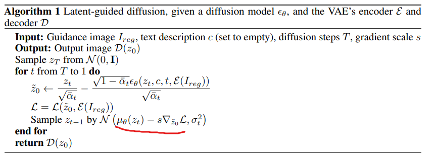


## Experiment

>  ablation study 看那个模块有效，总结一下

- setting

  ImageNet 512x512, 8xA100

  1.  train the restoration module with a **batch size of 96 for 150k iterations**

  2. Stable Diffusion 2.1-base Finetune 25K

     用 spaced DDPM sampling with 50 timestep

  3. 分辨率问题：能够处理任意大于 512x512 的图像

     **For images with sides < 512, we first upsample them with the short side enlarged to 512, and then resize them back**

- metrics

  > "MANIQA: Multi-dimension Attention Network for No-Reference Image Quality Assessment" [code]((https://github.com/IIGROUP/MANIQA#maniqa-multi-dimension-attention-network-for-no-reference-image-quality-assessment))

  - PSNR,SSIM, LPIPS
  - no-reference IQA metrics: MANIQA, NIQE
  - BFR: IDS, FID


### Exp

- real-world 4x upsampling

  DiffBIR 能够生成具有真实细节的图像，其他方法都 over-smooth

  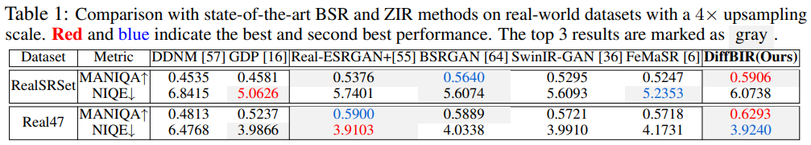

  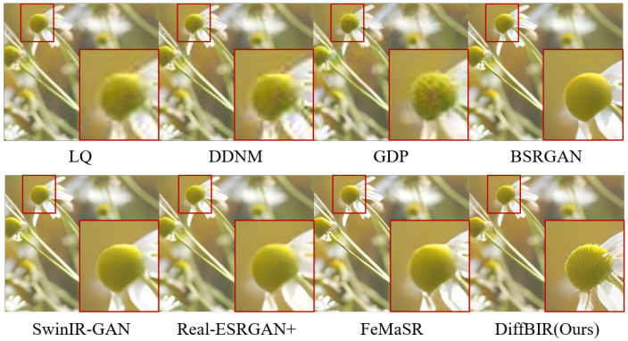

- BFR 合成 & 真实数据

  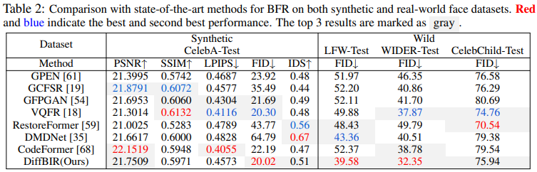

  在合成人脸数据上，CodeFormer 仍表现更好


### Ablation Study

1. 去除预处理 Stage1 模块 Restoration Module (RM)，直接 finetune Stable Diffusion

   不预先处理，在真实数据上效果会降；

   1. 会把 **noise 作为额外语义信息，生成多余的细节**，因此 RM 能够提升结果的可信度 fidelity；
   2. 不用 RM 直接 Finetune Stable Diffusion 噪声无法完全去除

   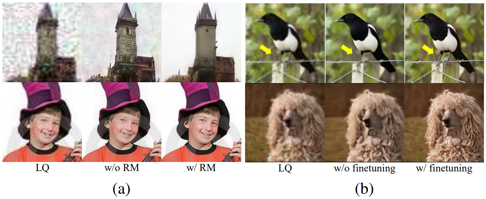

   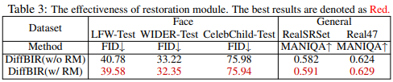

2. 是否微调 StableDiffusion

   用下面两个使用退化图像引导方法，生成图像不够真实。说明**退化图像特征和 stable diffusion 特征有差距，退化图像特征无法直接和 LDM latent space 融合.** 所以**对于 Image Restoration 需要finetune Stable Diffusion** 

   > - "Zero-Shot Image Restoration Using Denoising Diffusion Null-Space Model" 2022 Dec
   >   [paper](https://arxiv.org/pdf/2212.00490.pdf)
   > - "Generative diffusion prior for unified image restoration and enhancement"
   >   [paper](https://arxiv.org/abs/2304.01247) [website](https://generativediffusionprior.github.io/)

#### `LAControlNet` 控制模块:star:

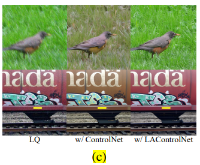

StableDiffusion 将 `512x512` 图像转为 latent code `64x64` (尺寸/8)；ControNet 需要同样尺寸的 conditions 特征，因此用一个小网络去（4层卷积，2x2 stride）将 conditions 图像从 512 × 512 转化为 64 × 64 feature space. 

在这个消融实验中，`w/ ControlNet`


**平衡 quality 和 fidelity**

larger gradient scale s tends to produce a high-fidelity smooth result which is close to Ireg

根据实验验证，使用 s=200

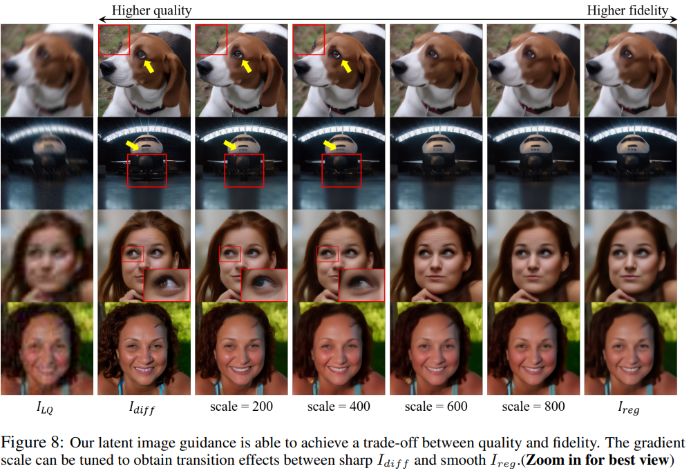


## Code

> pad为64的倍数，因为 U-net ENcoder 13层特征，要逐步下采样3次 64 -> 32 > 16 > 8，如果不能整除除不尽

- inference

  [Only Stage2 Model (Refine Details)](https://github.com/xpixelgroup/diffbir#only-stage2-model-refine-details)

  ```sh
  # inference
      CUDA_DEVICE_ORDER="PCI_BUS_ID" CUDA_VISIBLE_DEVICES="1" python inference.py \
          --input /home/ps/Desktop/xrj/video_understanding/VHS_restoration_journey/release_model/e2fgvi_hq_VHS_restoration_train_e2fgvi_hq_old_vhse2fgvi_old_movie_stdan_fusion_redisual_dense/validation_result/${evaluate_name}  \
          --config configs/model/cldm.yaml \
          --ckpt /home/ps/Desktop/xrj/video_understanding/DiffBIR/weights/diffbir_general_full_v1 \
          --steps 50 \
          --sr_scale 1 \
          --color_fix_type wavelet \
          --output /home/ps/Desktop/xrj/video_understanding/DiffBIR/data/results/${evaluate_name} \
          --disable_preprocess_model \
          --seed 24
  

- train Stage2

  https://github.com/xpixelgroup/diffbir#train-stage2-model

---

- 输入图像

  输入图像 if 短边 < 512， rescale 最短边>> 512 (bicubic)

  0-pad 到每边能被 64 整除

  `PIL.Image` 灰度值读入 0-255 `[1, 512, 960, 3]` >> `n h w c` >> `n c h w`

  > 输入图像 resize 多少？
  >
  > DiffBIR 在512x512 上训练的， See Section4.1
  > The training process is conducted on 512 × 512 resolution with 8 NVIDIA A100 GPU
  >
  > Our DiffBIR is able to handle images with arbitrary sizes larger than 512 × 512. **For images with sides < 512**, we first upsample them with the short side enlarged to 512, and then resize them back.

- diffusion setting ?

  ```yaml
  sampler: default ddpm, step 50
  strength: 1 # ?
  color_fix_type: wavelet  # ["wavelet", "adain", "none"] ??
  ```

  - preprocess_model>>`model.preprocess_model`

  

### Stable-Diff

> [Stable-Diffusion Code](https://zhuanlan.zhihu.com/p/613337342)


#### **ConditionEncoder**

将 0-1 像素范围图像 转为 -1，1 输入，先 rescale 到最短边为 512（bicubic） `[1, 3, 512, 960]->[[1, 4, 64, 120]]`

latent code 维度: `shape = (n_samples, 4, height // 8, width // 8)`

```
cond = {
        "c_latent": [model.apply_condition_encoder(control)],
        "c_crossattn": [model.get_learned_conditioning([""] * n_samples)]
    }
```

- 图像的 VAE 特征

```python
self.cond_encoder = nn.Sequential(OrderedDict([
            ("encoder", copy.deepcopy(self.first_stage_model.encoder)), # cond_encoder.encoder
            ("quant_conv", copy.deepcopy(self.first_stage_model.quant_conv)) # cond_encoder.quant_conv
        ]))
```

- Conditioning: **Prompt 用空串**，输出 prompt 的特征 `[1, 77, 1024]`

  > `ldm/modules/encoders/modules.py` 可以复用，存下来读特征

  `class FrozenOpenCLIPEmbedder(AbstractEncoder):`

#### `SpacedSampler`

> "Diffusion Models Beat GANs on Image Synthesis"
> [paper](https://arxiv.org/abs/2105.05233)
> `space_timesteps()` [code](https://github.com/openai/guided-diffusion/blob/22e0df8183507e13a7813f8d38d51b072ca1e67c/guided_diffusion/respace.py#L7)

`make_schedule()`: Stable Diffusion 使用 1000 timesteps，等间隔采样 beta

```
# 1000 -> 50 timesteps
{0, 20, 41, 61, 82, 102, 122, 143, 163, 183, 204, 224, 245, 265, 285, 306, 326, 347, 367, 387, 408, 428, 449, 469, 489, 510, 530, 550, 571, 591, 612, 632, 652, 673, 693, 714, 734, 754, 775, 795, 816, 836, 856, 877, 897, 917, 938, 958, 979, 999}
```


`sapced_sampling()` >> `p_sample_spaced()` index 为 N=50 timestep的第几步，t 为原先 1000 步的第几步

> `x_T.shape=(b,4, h/8 == 64, w/8==120)` 随机采样的高斯噪声

`model_variance` 将 $q(x_{t-1} | x_t,x_0)\sim \mathcal{N}(\mu,\sigma^2)$ 的 $\sigma^2$ (对应 `self.posterior_variance`) (50,) 大小的向量，expand 到 $z_t $ 一样尺寸；


预测噪声 $\epsilon_t$

> DiffBIR U-net 模块的[code](https://github.com/XPixelGroup/DiffBIR/blob/26ba8222165b72a1dc42cc86e4538630e45be025/model/spaced_sampler.py#L319) >>`ControlLDM.apply_model()` [code](https://github.com/XPixelGroup/DiffBIR/blob/26ba8222165b72a1dc42cc86e4538630e45be025/model/cldm.py#L343)

`predict_noise(x, t, c,)` x 为高斯噪声，t 为50步对应1k步中的步数，`cond` 为 `dict_keys(['c_latent', 'c_crossattn'])` ，其中 `c_latent` 为输入退化图像 AutoEncoder 提取的特征，`c_crossattn` 为空串对应的 embedding

1. `x = torch.cat((x, hint), dim=1)` >> `[1, 8, 64, 120]` Channel=8，原先StableDiffusion 的U-net第一层从 ch=4->320

   输入 `h = module(h, emb, context)`

   ```python
   # input block >> U-net encoder
   (0): Conv2d(8, 320, kernel_size=(3, 3), stride=(1, 1), padding=(1, 1))
   ```

   U-net Encoder 每个计算出 skip-connect 的特征，过 zero_conv(1x1 卷积不改变通道数，要和 U-net `self.input_blocks` 成对出现，获取 U-net 各个stage 不一样的 channel)

2. ```python
   control = self.control_model(
                   x=x_noisy, hint=torch.cat(cond['c_latent'], 1),
                   timesteps=t, context=cond_txt
               )
   control = [c * scale for c, scale in zip(control, self.control_scales)]  # scale 写死在代码里=1
   # control 为 ControlNet Encoder 提取残差的特征
   eps = diffusion_model(x=x_noisy, timesteps=t, context=cond_txt, control=control, only_mid_control=self.only_mid_control)
   ```

3. 将平行 Encoder 提取出来各个 skip-connect 特征，通过 `diffusion_model` >> `class ControlledUnetModel(UNetModel):` 这里的 `UNetModel` 为原先使用的 U-net

   > [code](https://github.com/XPixelGroup/DiffBIR/blob/26ba8222165b72a1dc42cc86e4538630e45be025/model/cldm.py#L25)

   


### LAControlNet

> [config](https://github.com/XPixelGroup/DiffBIR/blob/7bd5675823c157b9afdd479b59a2bf0a8954ce11/configs/model/cldm.yaml#L24)

[zero-conv](https://github.com/XPixelGroup/DiffBIR/blob/7bd5675823c157b9afdd479b59a2bf0a8954ce11/ldm/modules/diffusionmodules/util.py#L177) 初始化 Conv 权重和 bias 为 0；

```python
def zero_module(module):
    """
    Zero out the parameters of a module and return it.
    """
    for p in module.parameters():
        p.detach().zero_()
    return module
```

`Tensor.detach()` **Returns a new Tensor**, detached from the current graph. `Tensor.zero_()` fill self tensor with zeros.


### Trick

- Frozen Module

  ```
  def frozen_module(module: nn.Module) -> None:
      module.eval()
      module.train = disabled_train
      for p in module.parameters():
          p.requires_grad = False
  ```

- Load state dict

  `utils/common.py`


### Q&A

- `open-clip-torch` [How to load a model from the local path](https://github.com/mlfoundations/open_clip/issues/671)

  ```
  model, _, _ = open_clip.create_model_and_transforms('ViT-H-14', pretrained='/lpath/to/local/open_clip_pytorch_model.bin')
  ```


## **Limitations**

## **Summary :star2:**

> learn what & how to apply to our task