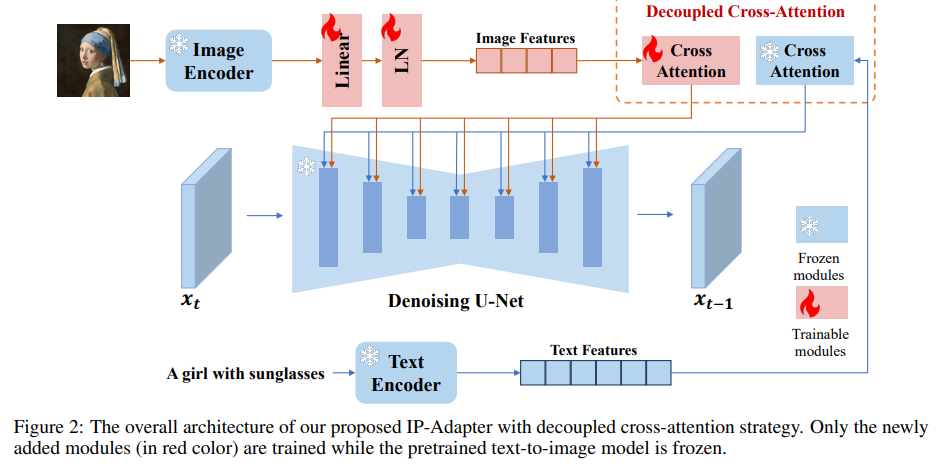

# IP-Adapter: Text Compatible Image Prompt Adapter for Text-to-Image Diffusion Models

> "IP-Adapter: Text Compatible Image Prompt Adapter for Text-to-Image Diffusion Models" Arxiv, 2023 Aug
> [paper](http://arxiv.org/abs/2308.06721v1) [code](https://ip-adapter.github.io) 
> [pdf](./2023_08_Arxiv_IP-Adapter--Text-Compatible-Image-Prompt-Adapter-for-Text-to-Image-Diffusion-Models.pdf) [note](./2023_08_Arxiv_IP-Adapter--Text-Compatible-Image-Prompt-Adapter-for-Text-to-Image-Diffusion-Models_Note.md)
> Authors: Hu Ye, Jun Zhang, Sibo Liu, Xiao Han, Wei Yang

## Key-point

- Task
- Problems
- :label: Label:

## Contributions

## Introduction

- "Uni-controlnet: All-in-one control to text-to-image diffusion models" NIPS, 2023 May 
  [paper](https://arxiv.org/abs/2305.16322) [code](https://github.com/ShihaoZhaoZSH/Uni-ControlNet)

## methods

ControlNet 的同期工作

> T2I-adapter [11] employs a simple and lightweight adapter to achieve fine-grained control in the color and structure of the generated images.

## Experiment

> ablation study 看那个模块有效，总结一下

## Limitations

## Summary :star2:

> learn what & how to apply to our task

