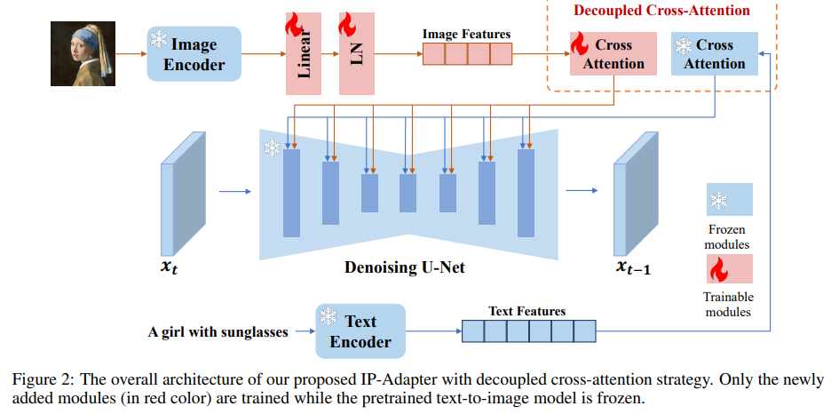
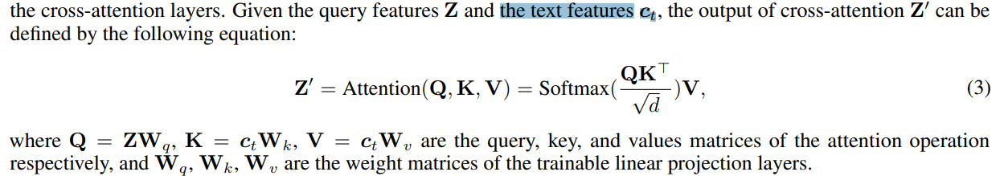

# IP-Adapter: Text Compatible Image Prompt Adapter for Text-to-Image Diffusion Models

> "IP-Adapter: Text Compatible Image Prompt Adapter for Text-to-Image Diffusion Models" Arxiv, 2023 Aug
> [paper](http://arxiv.org/abs/2308.06721v1) [code](https://ip-adapter.github.io) [pdf](./2023_08_Arxiv_IP-Adapter--Text-Compatible-Image-Prompt-Adapter-for-Text-to-Image-Diffusion-Models.pdf) [note](./2023_08_Arxiv_IP-Adapter--Text-Compatible-Image-Prompt-Adapter-for-Text-to-Image-Diffusion-Models_Note.md)
> Authors: Hu Ye, Jun Zhang, Sibo Liu, Xiao Han, Wei Yang (TencentAI)

## Key-point

- Task
- Problems
- :label: Label:

## Contributions

## Introduction

- "Uni-controlnet: All-in-one control to text-to-image diffusion models" NIPS, 2023 May 
  [paper](https://arxiv.org/abs/2305.16322) [code](https://github.com/ShihaoZhaoZSH/Uni-ControlNet)

## methods

ControlNet 的同期工作

> T2I-adapter [11] employs a simple and lightweight adapter to achieve fine-grained control in the color and structure of the generated images.

### Image Encoder

使用 CLIP image CLS token

> Following most of the methods, we use a pretrained CLIP image encoder model to extract image features from the image prompt. 
>
> The CLIP model is a multimodal model trained by contrastive learning on a large dataset containing image-text pairs. We utilize **the global image embedding from the CLIP image encoder, which is well-aligned with image captions** and can represent the rich content and style of the image.

加一层 MLP+LayerNorm 调整通道数和文本一样

> To effectively decompose the global image embedding, we use a small trainable projection network to project the image embedding into a sequence of features with length N (we use N = 4 in this study), the dimension of the image features is the same as the dimension of the text features in the pretrained diffusion model. The projection network we used in this study consists of a linear layer and a Layer Normalization [41].

### Decoupled Cross-Attention

- Q：文本特征怎么和图像特征一起用？

之前工作图像特征没有很好用起来

> As mentioned in previous sections, current adapters struggle to match the performance of fine-tuned image prompt models or the models trained from scratch. The major reason is that the image features cannot be effectively embedded in the pretrained model.
>
> Most methods simply feed concatenated features into the frozen cross-attention layers, preventing the diffusion model from capturing fine-grained features from the image prompt.

> To address this issue, we present a decoupled cross-attention strategy, in which the image features are embedded by **newly added cross-attention layers.** 

原始 Text Cross-Attn

发现直接把 Image Feature 和 Text feature concat 起来效率很低

> A straightforward method to insert image features is to concatenate image features and text features and then feed them into the cross-attention layers. However, we found this approach to be **insufficiently effective.** 

重新在 Text Cross-Attn 模块后面加了一个 Image Cross Attn 模块，

> Instead, we propose a decoupled cross-attention mechanism where the cross-attention layers for text features and image features are separate. To be specific, we add a new cross-attention layer for each cross-attention layer in the original UNet model to insert image features.

**注意这里 Image Cross-Attn 的输入 Query 和 Text Cross-Attn 的输入 Query 是一样的！** :star:

>  It should be noted that we use the same query for image cross-attention as for text cross-attention

因为只训练新加的一个 Cross-Attn 因此只需要训练 Wk, Wv

## Experiment

> ablation study 看那个模块有效，总结一下

## Limitations

## Summary :star2:

> learn what & how to apply to our task

- Q：测试一下使用 CLIP Image  CLS token vs PatchToken
- 测试一下 Decoupled Cross-Attention 和分开有什么区别
- 加 Global Frame 的文本
  - 新加的 Clip image embed 后面试试看 Decoupled Cross-Attn，对文本做下 Cross
