# Pixel-Aware Stable Diffusion for Realistic Image Super-resolution and Personalized Stylization

> "Pixel-Aware Stable Diffusion for Realistic Image Super-resolution and Personalized Stylization" CVPR, 2023 Aug
> [paper](http://arxiv.org/abs/2308.14469v2) [code](https://github.com/yangxy/PASD) 
> [pdf](./2023_08_Arxiv_Pixel-Aware-Stable-Diffusion-for-Realistic-Image-Super-resolution-and-Personalized-Stylization.pdf)
> Authors: Tao Yang, Peiran Ren, Xuansong Xie, Lei Zhang

## Key-point

- Task: Real-ISR
- Problems
  1. existing methods along this line either **fail to keep faithful pixel-wise image structures** 
  2. or resort to **extra skipped connections to reproduce details, which requires additional training** in image space and **limits their extension to other related tasks** in latent space such as image stylization
- :label: Label:

propose a pixel-aware stable diffusion (PASD) network to achieve robust Real-ISR as well as personalized stylization.
while a degradation removal module is used to extract degradation insensitive features


## Contributions

1. degradation removal module is used to extract degradation insensitive features

2. a pixel-aware cross attention module

3. simply replacing the base diffusion model with a personalized one

   视频画风编辑


## Introduction

 resorted to a skipped connection to pass pixel-level details for image restoration

- "UniControl: A Unified Diffusion Model for Controllable Visual Generation In the Wild"
  [paper](https://arxiv.org/pdf/2305.11147.pdf)


## methods

> - classifier free guidance?
> - PASD can provide pixel-level guidance?

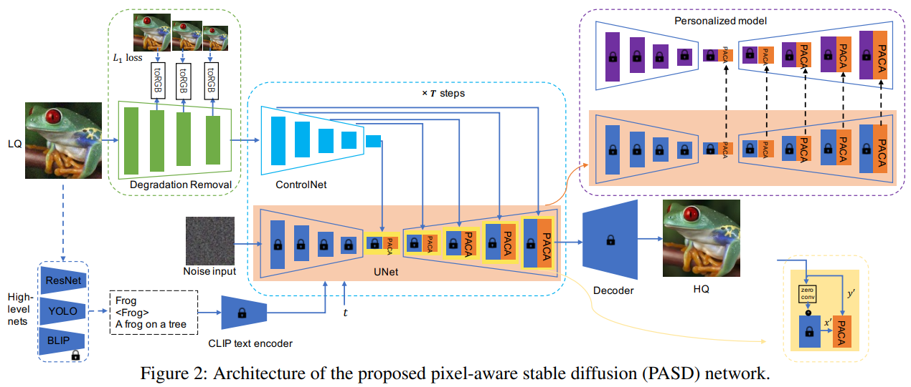

PASD has three main modules: **a degradation removal module** to extract degradation insensitive low-level control features, a **high-level information extraction module** to extract semantic control features, and a **pixel-aware cross-attention (PACA) module** to perform pixel-level guidance for diffusion


### Degradation Removal Module

- motivation

  employ a degradation removal module to reduce the impact of degradations and **extract “clean” features from the LQ image**

  subsequent diffusion module could focus on recovering realistic image details, **alleviating diffusion models' burden** of distinguishing image degradations.

these features can be used to approximate the HQ image at the corresponding scale as close as possible

**employing a convolution layer "toRGB"** to turn every single-scale feature maps into the HQ RGB image space.
And apply an **L1 loss on each resolution scale** to force the reconstruction at that scale to be close to the pyramid decomposition of the HQ image

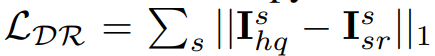


### PACA

- Motivation

  simply adding the feature maps from the two networks may fail to pass pixel-level precise information, leading to structure inconsistency between the input LQ and output HQ images

  StableSR 在外部处理 residual，引入了额外的训练模块


用 Transformer 处理 diffusion 当前层输出的特征和 condition 特征

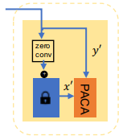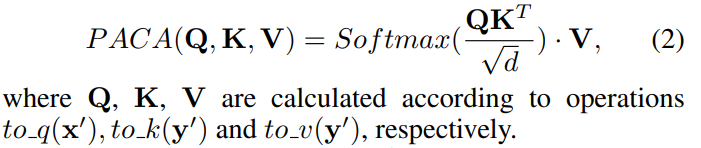


### High-Level Information

- Motivation

  `StableSR` employ the null-text prompt, it has been demonstrated in StableDiffusion that content-related captions could improve the synthesis result

pre-trained ResNet (He et al. 2016), YOLO (Redmon et al. 2016) and BLIP (Li et al. 2023) networks to extract image classification, object detection and image caption information from the LQ input

**The classifier-free guidance**

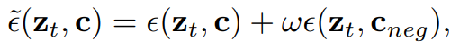

The unconditional ϵ-prediction ϵ(zt, cneg) can be achieved with negative prompts. In practice, we empirically combine words like “noisy”, “blurry”, “low resolution”, etc.

The negative prompts play a key role to trade off mode coverage and sample quality during inference.


### Personalized Stylization

replace the base model of our PASD network with a personalized model during inference


## Code

> 使用 Accelerate 实现 fp16 训练，DDP 训练 [blog](https://zhuanlan.zhihu.com/p/462453622)


### **Dataloader**

> [RealESRGAN Degradation class](https://github.com/yangxy/PASD/blob/19d2a876ee710f9014cc37a029bc7ccde921ed24/dataloader/realesrgan.py#L53)
>
> 使用 WebDataset 加速数据读取

`conditioning_pixel_values` 使用退化后的图像，`pixel_values` 使用未退化的图像

```python
            example["pixel_values"] = self.img_preproc(image)
            if self.control_type is not None:
                if self.control_type == 'realisr':
                    GT_image_t, LR_image_t = self.degradation.degrade_process(np.asarray(image)/255., resize_bak=self.resize_bak)
                    example["conditioning_pixel_values"] = LR_image_t.squeeze(0)
                    example["pixel_values"] = GT_image_t.squeeze(0) * 2.0 - 1.0
                elif self.control_type == 'grayscale':
                    image = np.asarray(image.convert('L').convert('RGB'))/255.
                    example["conditioning_pixel_values"] = torch.from_numpy(image).permute(2,0,1)
                else:
                    raise NotImplementedError
```


### `training forward`

干净图像通过 VAE 提取特征 `latents`; `batch["input_ids"]` 为事前处理好的 captions , `batch['conditioning_pixel_values']` 为退化后的输入图像

```python
# Convert images to latent space
pixel_values = batch["pixel_values"].to(accelerator.device, dtype=weight_dtype)
latents = vae.encode(pixel_values).latent_dist.sample()
latents = latents * vae.config.scaling_factor
```

随机取一个时间步 t，对于diffusion $z_t$ 使用 `latents` 加噪 t 步得到；训练时 latent 用 GT，测试时候用输入

```python
# Sample noise that we'll add to the latents
noise = torch.randn_like(latents)
bsz = latents.shape[0]
# Sample a random timestep for each image
timesteps = torch.randint(0, noise_scheduler.config.num_train_timesteps, (bsz,), device=latents.device)
timesteps = timesteps.long()

# Add noise to the latents according to the noise magnitude at each timestep
# (this is the forward diffusion process)
noisy_latents = noise_scheduler.add_noise(latents, noise, timesteps)  # z_t
```


### Degradation Removal

> [code](https://github.com/yangxy/PASD/blob/19d2a876ee710f9014cc37a029bc7ccde921ed24/models/pasd_light/controlnet.py#L106)

**Framework 左上角绿色的 Encoder，训练一个 Encoder 代替 VAE Encoder**

输入 512x512，为了和 StableDiffusion 中 VAE encoder 输出特征匹配（`512x512 -> 64x64`） ，训一个含有4个 scale 的卷积模块，每个 scale 再通过 Conv2d 认为得到 RGB 对应的图像，存入`controlnet_cond_mid`，与 GT 的插值图像做 L1 Loss；

Encoder 的输出特征 `controlnet_cond` 与经过一层 Conv 的高斯噪声 `Conv2d(sample)` 相加作为 ControlNet  输入

> 需要微调 ControlNet

```python
if isinstance(controlnet_cond_mid, list):
    for values in controlnet_cond_mid:
    	loss += F.l1_loss(F.interpolate(pixel_values, size=values.shape[-2:], mode='bilinear').float(), values.float(), reduction="mean")
else:
	loss += F.l1_loss(pixel_values.float(), controlnet_cond_mid.float(), reduction="mean")
```


1. `toRGB` 就是每个 scale 的特征再过一层 Conv2d 转为 3 通道
2. 去噪模块中可以在 Conv 之前使用 BasicSR 中的 RRDB 模块（可选）


### ControlNet

`ControlNet` 提取 `down_block_additional_residual` 和 `mid_block_additional_residual` Encoder 和 bottleneck 的特征。输入 `class UNet2DConditionModel`

```python
# unet encoder: 将 unet 的 encoder 特征和controlnet 对应的特征相加（residual 先加一下）
if is_controlnet:
    new_down_block_res_samples = ()

    for down_block_res_sample, down_block_additional_residual in zip(
    down_block_res_samples, down_block_additional_residuals
    ):
        down_block_res_sample = down_block_res_sample + down_block_additional_residual
        new_down_block_res_samples = new_down_block_res_samples + (down_block_res_sample,)

    down_block_res_samples = new_down_block_res_samples

# 4. mid
if is_controlnet:
	sample = sample + mid_block_additional_residual
	
# 5.up
# ... 每个 block 中
# 逆序取出特征
down_block_additional_residual = down_block_additional_residuals[-len(upsample_block.resnets) :]
down_block_additional_residuals = down_block_additional_residuals[: -len(upsample_block.resnets)]

# if we have not reached the final block and need to forward the
# upsample size, we do it here
if not is_final_block and forward_upsample_size:
    upsample_size = down_block_res_samples[-1].shape[2:]

if hasattr(upsample_block, "has_cross_attention") and upsample_block.has_cross_attention:
    sample = upsample_block(
        hidden_states=sample,
        temb=emb,
        res_hidden_states_tuple=res_samples,
        encoder_hidden_states=encoder_hidden_states,
        pixelwise_hidden_states=down_block_additional_residual,
        cross_attention_kwargs=cross_attention_kwargs,
        upsample_size=upsample_size,
        attention_mask=attention_mask,
        encoder_attention_mask=encoder_attention_mask,
    )
```


`def get_up_block()` 中获取 decoder block；`CrossAttnUpBlock2D` 含有 `has_cross_attention` 参数的模块，有 PACA 模块

```
up_block_types: Tuple[str] = ("UpBlock2D", "CrossAttnUpBlock2D", "CrossAttnUpBlock2D", "CrossAttnUpBlock2D"),
```

> [`CrossAttnUpBlock2D`](https://github.com/yangxy/PASD/blob/19d2a876ee710f9014cc37a029bc7ccde921ed24/models/pasd_light/unet_2d_blocks.py#L2145)

`res_samples`为 unet encoder 特征 + `controlnet` 的残差 ，作为图中蓝色的输入；
`pixelwise_hidden_states` 为 `controlnet` 的残差，作为图中的 $y^\prime$；
`encoder_hidden_states` 为 caption 的特征；
`hidden_states` 为当前 decoder 层的输入


### PACA 模块

就是 Transformer QKV 加权融合


1. `hidden_states = torch.cat([hidden_states, res_hidden_states], dim=1)`
2. 使用 conv2d 转化为 QKV
3. 用 hidden_states 和 encoder_hidden_states 文本特征做 cross-attn
4. 用 hidden_states 和 pixelwise_hidden_states (ControlNet 特征) 做 cross-attn
5. upsample，使用 bilinear + conv

```python
        # 2. Cross-Attention
        if self.attn2 is not None:
            norm_hidden_states = (
                self.norm2(hidden_states, timestep) if self.use_ada_layer_norm else self.norm2(hidden_states)
            )

            attn_output = self.attn2(
                norm_hidden_states,
                encoder_hidden_states=encoder_hidden_states,
                attention_mask=encoder_attention_mask,
                **cross_attention_kwargs,
            )
            hidden_states = attn_output + hidden_states

        # 2+. pixelwise-Attention
        if self.attn2_plus is not None:
            norm_hidden_states = (
                self.norm2_plus(hidden_states, timestep) if self.use_ada_layer_norm else self.norm2_plus(hidden_states)
            )

            #batch, channel, height, width = encoder_pixelwise_hidden_states.shape
            #encoder_pixelwise_hidden_states = encoder_pixelwise_hidden_states.permute(0, 2, 3, 1).reshape(batch, height * width, channel)
            #print(norm_hidden_states.shape, pixelwise_hidden_state.shape)
            attn_output = self.attn2_plus(
                norm_hidden_states,
                encoder_hidden_states=pixelwise_hidden_state,
                attention_mask=pixelwise_attention_mask,
                **cross_attention_kwargs,
            )
            hidden_states = attn_output + hidden_states
```


## Experiment

> ablation study 看那个模块有效，总结一下

### setup

adopt the Adam optimizer to train PASD with a batch size of 4. The learning rate is fixed as 5 × 10−5 . The model is updated for 500K iterations with 8 NVIDIA Tesla 32G-V100 GPU

employ degradation pipeline of Real-ESRGAN to synthesize LQ-HQ training pairs.


**Loss**

随机采样一个高斯噪声 $z_t$，和时间步 t

freeze all the parameters in SD, and only train the newly added modules, including degradation removal module

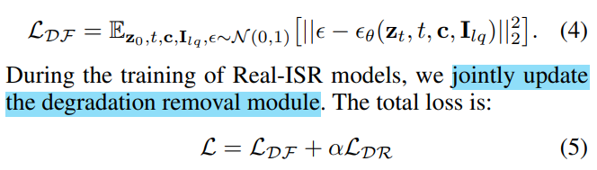


- Dataset

  RealISR Task: evaluate our approach on both synthetic and real-world datasets

  1. synthetic

     DIV2K validation set & Real-ESRGAN

  2. real-world test dataset

     RealSR, DRealSR

  personalized stylization: first 100 face images from FFHQ as well as the first 100 images from Flicker2K

  

- metrics

  FID, LPIPS, DISTS, MUSIQ, CLIP-FID

  The PSNR and SSIM indices (evaluated on the Y channel in YCbCr space) are also reported for reference only because they are not suitable to evaluate generative models.

  user-study

  

- Real ISR SOTA comparison

  two categories of Real-ISR

  1. GAN-based methods

     BSRGAN, Real-ESRGAN, SwinIR-GAN, LDL,  FeMaSR

  2. diffusion-based models

     LDM, SD upscaler, StableSR


### Real-ISR

- lower PSNR/SSIM indices; perform better than GAN-based methods in most perception metrics：

in term of fidelity measures PSNR/SSIM, the diffusion-based methods are not advantageous over GANbased methods. This is because diffusion models have higher generative capability and hence may synthesize more perceptually realistic but less “faithful” details

-  achieves the best MUSIQ scores

  is a no-reference image quality assessment index

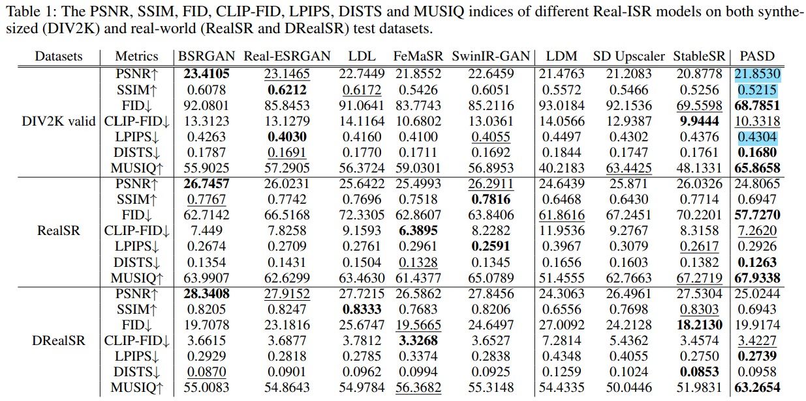

> 在评估 diffusion 改进效果时候，要看其他感知指标 & 主观效果；只看 PSNR，SSIM，LPIPS 从表格来看都不是最好的

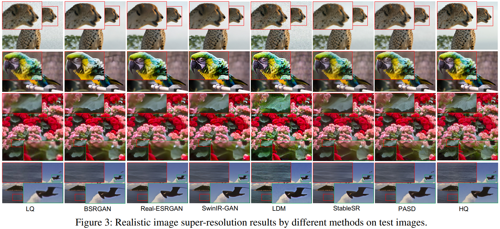

**User-study**

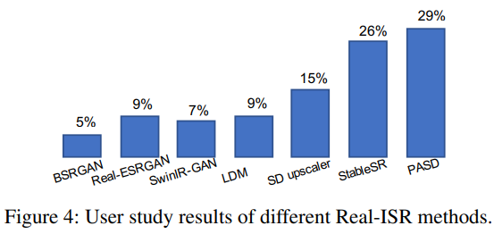


### Stylization

1. CartoonGAN, AnimeGAN, DCT-Net

2. diffusion based

   InstructPix2Pix, SD img2img, ControlNet

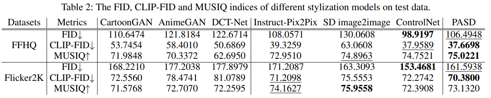


PASD 替换不同 Stylization base model

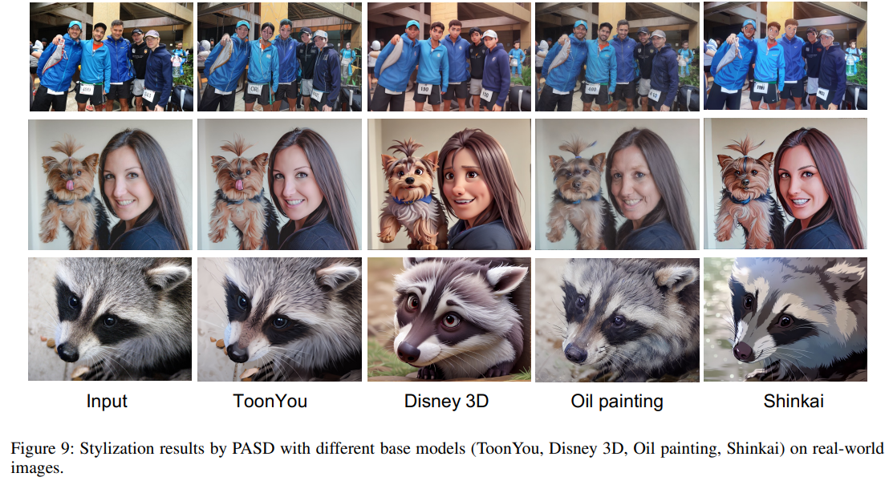


### Colorization

DeOldify, BigColor, CT2, DDColor.

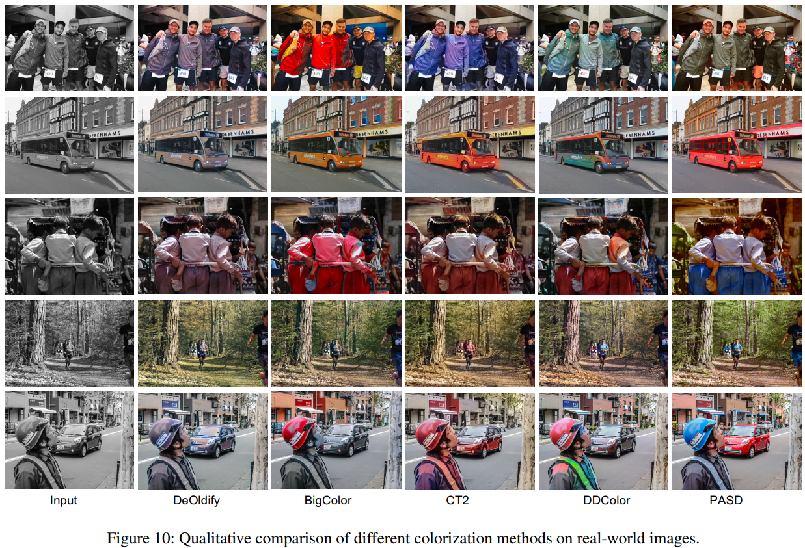


### Ablation Study

1. Importance of PACA

   features y extracted from ControlNet are simply added to features x, **inconsistent colors and structures**

2. Role of degradation removal module

   remove the “toRGB” modules as well as the pyramid LDR loss

   需要先去噪

3. Role of high-level information

   replacing both high-level information and negative prompt with null-text prompt results in dirty outputs with less realistic details

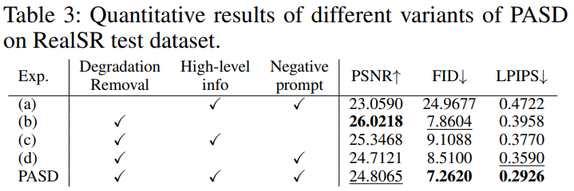


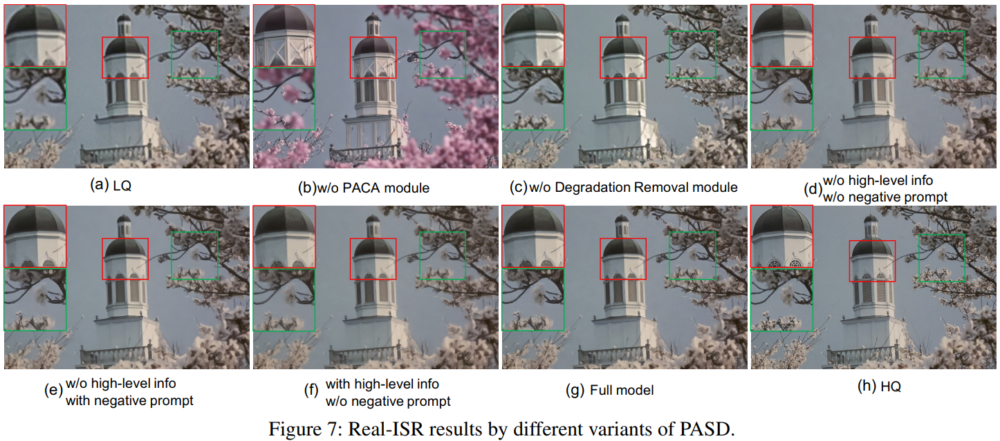


## Limitations

1. 风格化后一致性存在问题，图像文字扭曲

   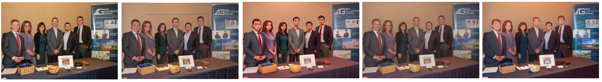

   目标文字等内容保持不变，对于不希望改变的内容，提取关键点，设计选择性融合


## Summary :star2:

> learn what & how to apply to our task

1. 在评估 diffusion 改进效果时候，要看其他感知指标 & 主观效果；只看 PSNR，SSIM，LPIPS 从表格来看都不是最好的
2. ControlNet 特征直接相加，存在生成内容不一致问题；简单使用 QKV 加权融合有效
3. Real ISR 等真实数据，需要设计预修复网络，直接用 diffusion 生成有伪影

