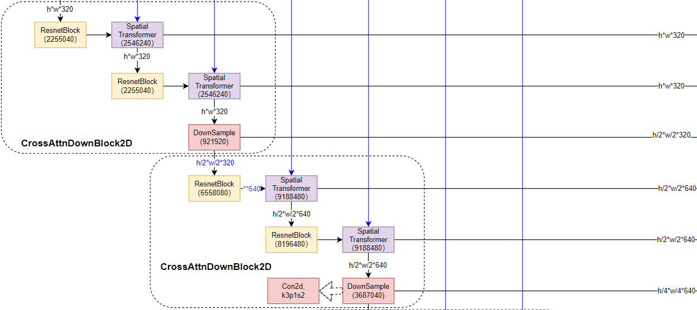
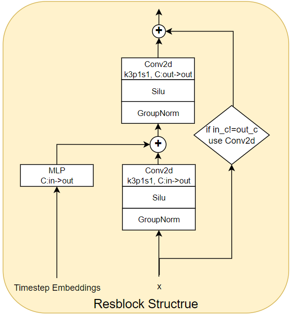
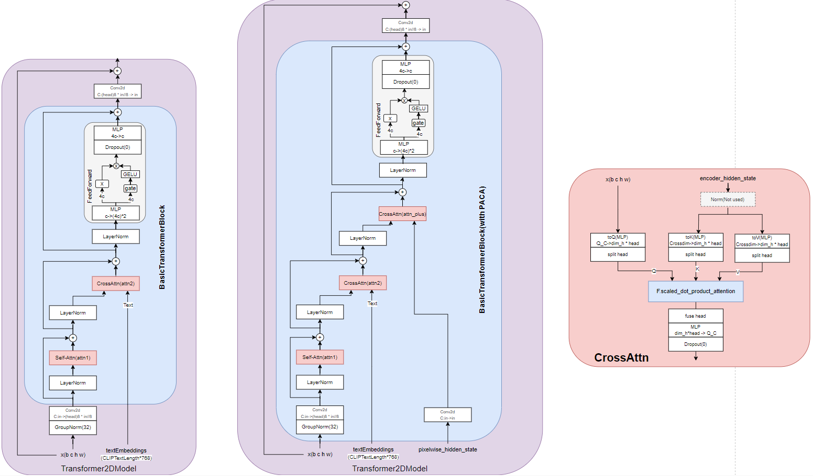

# Pixel-Aware Stable Diffusion for Realistic Image Super-resolution and Personalized Stylization

> "Pixel-Aware Stable Diffusion for Realistic Image Super-resolution and Personalized Stylization" CVPR, 2023 Aug
> [paper](http://arxiv.org/abs/2308.14469v2) [code](https://github.com/yangxy/PASD) 
> [pdf](./2023_08_Arxiv_Pixel-Aware-Stable-Diffusion-for-Realistic-Image-Super-resolution-and-Personalized-Stylization.pdf)
> Authors: Tao Yang, Peiran Ren, Xuansong Xie, Lei Zhang

## Key-point

- Task: Real-ISR
- Problems
  1. existing methods along this line either **fail to keep faithful pixel-wise image structures** 
  2. or resort to **extra skipped connections to reproduce details, which requires additional training** in image space and **limits their extension to other related tasks** in latent space such as image stylization
- :label: Label:

propose a pixel-aware stable diffusion (PASD) network to achieve robust Real-ISR as well as personalized stylization.
while a degradation removal module is used to extract degradation insensitive features


## Contributions

1. degradation removal module is used to extract degradation insensitive features

2. a pixel-aware cross attention module

3. simply replacing the base diffusion model with a personalized one

   视频画风编辑


## Introduction

 resorted to a skipped connection to pass pixel-level details for image restoration

- "UniControl: A Unified Diffusion Model for Controllable Visual Generation In the Wild"
  [paper](https://arxiv.org/pdf/2305.11147.pdf)


## methods

> - classifier free guidance?
> - PASD can provide pixel-level guidance?


PASD has three main modules: **a degradation removal module** to extract degradation insensitive low-level control features, a **high-level information extraction module** to extract semantic control features, and a **pixel-aware cross-attention (PACA) module** to perform pixel-level guidance for diffusion


### Degradation Removal Module

- motivation

  employ a degradation removal module to reduce the impact of degradations and **extract “clean” features from the LQ image**

  subsequent diffusion module could focus on recovering realistic image details, **alleviating diffusion models' burden** of distinguishing image degradations.

these features can be used to approximate the HQ image at the corresponding scale as close as possible

**employing a convolution layer "toRGB"** to turn every single-scale feature maps into the HQ RGB image space.
And apply an **L1 loss on each resolution scale** to force the reconstruction at that scale to be close to the pyramid decomposition of the HQ image


### PACA

- Motivation

  simply adding the feature maps from the two networks may fail to pass pixel-level precise information, leading to structure inconsistency between the input LQ and output HQ images

  StableSR 在外部处理 residual，引入了额外的训练模块


用 Transformer 处理 diffusion 当前层输出的特征和 condition 特征


### High-Level Information

- Motivation

  `StableSR` employ the null-text prompt, it has been demonstrated in StableDiffusion that content-related captions could improve the synthesis result

pre-trained ResNet (He et al. 2016), YOLO (Redmon et al. 2016) and BLIP (Li et al. 2023) networks to extract image classification, object detection and image caption information from the LQ input

**The classifier-free guidance**


The unconditional ϵ-prediction ϵ(zt, cneg) can be achieved with negative prompts. In practice, we empirically combine words like “noisy”, “blurry”, “low resolution”, etc.

The negative prompts play a key role to trade off mode coverage and sample quality during inference.


### Personalized Stylization

replace the base model of our PASD network with a personalized model during inference


## Code

> 使用 Accelerate 实现 fp16 训练，DDP 训练 [blog](https://zhuanlan.zhihu.com/p/462453622)


### **Dataloader**

> [RealESRGAN Degradation class](https://github.com/yangxy/PASD/blob/19d2a876ee710f9014cc37a029bc7ccde921ed24/dataloader/realesrgan.py#L53)
>
> 使用 WebDataset 加速数据读取

`conditioning_pixel_values` 使用退化后的图像，`pixel_values` 使用未退化的图像

```python
            example["pixel_values"] = self.img_preproc(image)
            if self.control_type is not None:
                if self.control_type == 'realisr':
                    GT_image_t, LR_image_t = self.degradation.degrade_process(np.asarray(image)/255., resize_bak=self.resize_bak)
                    example["conditioning_pixel_values"] = LR_image_t.squeeze(0)
                    example["pixel_values"] = GT_image_t.squeeze(0) * 2.0 - 1.0
                elif self.control_type == 'grayscale':
                    image = np.asarray(image.convert('L').convert('RGB'))/255.
                    example["conditioning_pixel_values"] = torch.from_numpy(image).permute(2,0,1)
                else:
                    raise NotImplementedError
```


### `training forward`

干净图像通过 VAE 提取特征 `latents`; `batch["input_ids"]` 为事前处理好的 captions , `batch['conditioning_pixel_values']` 为退化后的输入图像

```python
# Convert images to latent space
pixel_values = batch["pixel_values"].to(accelerator.device, dtype=weight_dtype)
latents = vae.encode(pixel_values).latent_dist.sample()
latents = latents * vae.config.scaling_factor
```

随机取一个时间步 t，对于diffusion $z_t$ 使用 `latents` 加噪 t 步得到；训练时 latent 用 GT，测试时候用输入

```python
# Sample noise that we'll add to the latents
noise = torch.randn_like(latents)
bsz = latents.shape[0]
# Sample a random timestep for each image
timesteps = torch.randint(0, noise_scheduler.config.num_train_timesteps, (bsz,), device=latents.device)
timesteps = timesteps.long()

# Add noise to the latents according to the noise magnitude at each timestep
# (this is the forward diffusion process)
noisy_latents = noise_scheduler.add_noise(latents, noise, timesteps)  # z_t
```


### SD Pipeline

> [doc](https://huggingface.co/docs/diffusers/api/pipelines/controlnet)
> [code in PASD model](https://github.com/yangxy/PASD/blob/19d2a876ee710f9014cc37a029bc7ccde921ed24/pipelines/pipeline_pasd.py#L796)

对 prompt 提取 embedding `(b 77 768)`

准备图像，多小都 resize 到（2*b, 3, 768, 768）


**图像提取特征** `prepare_latents` [code](https://github.com/yangxy/PASD/blob/19d2a876ee710f9014cc37a029bc7ccde921ed24/pipelines/pipeline_pasd.py#L701)

> VAE Encode `site-packages/diffusers/models/autoencoder_kl.py:252`
>
> fp16 要处理一下！`if dtype==torch.float16: self.vae.quant_conv.half()`

```
init_latents = self.vae.encode(image*2.0-1.0).latent_dist.sample(generator)
init_latents = self.vae.config.scaling_factor * init_latents  # 0.18215 * x

# def encode 
h = self.encoder(x)
moments = self.quant_conv(h)
posterior = DiagonalGaussianDistribution(moments)
```

VAE 输入要压缩到 `[-1, 1]`，`[1, 3, 768, 768]` encode 到 `[1, 8==2*4, 96, 96]`，再过一层 `quant_conv `1x1 卷积，得到 c=4 特征，chunk 为均值、方差；

`init_latents` 取为

```
    def sample(self, generator: Optional[torch.Generator] = None) -> torch.FloatTensor:
        # make sure sample is on the same device as the parameters and has same dtype
        sample = randn_tensor(
            self.mean.shape, generator=generator, device=self.parameters.device, dtype=self.parameters.dtype
        )
        x = self.mean + self.std * sample
        return x
```


`UniPCMultistepScheduler`

```
tensor([999, 949, 899, 849, 799, 749, 699, 649, 599, 549, 500, 450, 400, 350,
        300, 250, 200, 150, 100,  50], device='cuda:0')
```

1. DDPM 方式加噪到 xt , T 取上面 steps 第0 个timestep
2. Noise_level 概念，继续加噪 `args.added_noise_level=400` 步，实现**可控加噪**

**相当于加噪了 1k + noise_level 步**

```
self.scheduler.set_timesteps(args.num_inference_steps, device=device)
timesteps = self.scheduler.timesteps[0:]
latent_timestep = timesteps[:1].repeat(batch_size * 1)  # 999 what if <999"?
shape = init_latents.shape
noise = randn_tensor(shape, generator=generator, device=device, dtype=dtype)
init_latents = self.scheduler.add_noise(init_latents, noise, latent_timestep)

added_latent_timestep = torch.LongTensor([args.added_noise_level]).repeat(batch_size * 1).to(self.device)
added_noise = randn_tensor(shape, generator=generator, device=device, dtype=dtype)
init_latents = self.scheduler.add_noise(init_latents, added_noise, added_latent_timestep)
latents = init_latents

# scale the initial noise by the standard deviation required by the scheduler
latents = latents * self.scheduler.init_noise_sigma
```


#### **ControlNet**

- 输入：图像加噪得到的 noise， prompt 特征，原始 RGB 图像

将加噪的 latent，为了进行 classifier free guidance 将batchsize x2, 作为 controlNet image_embdding 输入 `([2, 4, 96, 96])`; prompt 特征 `([2, 77, 768])`

>  adopt the tiled vae method proposed by [multidiffusion-upscaler-for-automatic1111](https://github.com/pkuliyi2015/multidiffusion-upscaler-for-automatic1111) to save GPU memory.
>
> `tile_size, tile_overlap = (args.latent_tiled_size, args.latent_tiled_overlap) if args is not None else (256, 8)`
>
> 当 hxw 大于 320x320 才需要（针对输入尺寸大于 2560 ^2 的图像），否则正常去噪

```python
rgbs, down_block_res_samples, mid_block_res_sample = self.controlnet(...)  
# RGB, UNet 各个残差, [1280, 12, 12]
```


#### Degradation Removal

> [code](https://github.com/yangxy/PASD/blob/19d2a876ee710f9014cc37a029bc7ccde921ed24/models/pasd/controlnet.py#L782)

Degradation Removal 在了 ControlNet 里面，刚开始提取 condition image 特征部分

输入 768x768，训一个含有4个 scale 的卷积模块，每个 scale 再通过 Conv2d 认为得到 RGB 对应的图像，存入`controlnet_cond_mid`，与 GT 的插值图像做 L1 Loss；

UNet 对于的输入 latent_noise `[2, 320, 96, 96]` 用一个卷积将 C=4 -> 320；Condition 特征为 `[2, 320, 96, 96]`

Encoder 的输出特征 `controlnet_cond` 与经过一层 Conv 的高斯噪声 `Conv2d(sample)` 相加作为 ControlNet  输入

> 需要微调 ControlNet

```python
if isinstance(controlnet_cond_mid, list):
    for values in controlnet_cond_mid:
    	loss += F.l1_loss(F.interpolate(pixel_values, size=values.shape[-2:], mode='bilinear').float(), values.float(), reduction="mean")
else:
	loss += F.l1_loss(pixel_values.float(), controlnet_cond_mid.float(), reduction="mean")
```


1. `toRGB` 就是每个 scale 的特征再过一层 Conv2d 转为 3 通道
2. 去噪模块中可以在 Conv 之前使用 BasicSR 中的 RRDB 模块（可选）


#### UNet

> [framework_pdf](./docs\2023_08_Arxiv_Pixel-Aware-Stable-Diffusion-for-Realistic-Image-Super-resolution-and-Personalized-Stylization_Note/StableDiffusion_framework.drawio.pdf)

**SD UNet 大致结构**

UNet 分为 4 个scale 和 1 个 `bottleneck layer`，通道数分别为 `(320, 640, 1280, 1280)`，

```json
  "block_out_channels": [
    320,
    640,
    1280,
    1280
  ],
  "center_input_sample": false,
  "cross_attention_dim": 768,
  "down_block_types": [
    "CrossAttnDownBlock2D",
    "CrossAttnDownBlock2D",
    "CrossAttnDownBlock2D",
    "DownBlock2D"
  ],
  "downsample_padding": 1,
  "flip_sin_to_cos": true,
  "freq_shift": 0,
  "in_channels": 4,
  "layers_per_block": 2,
  "mid_block_scale_factor": 1,
  "norm_eps": 1e-05,
  "norm_num_groups": 32,
  "out_channels": 4,
  "sample_size": 64,
  "up_block_types": [
    "UpBlock2D",
    "CrossAttnUpBlock2D",
    "CrossAttnUpBlock2D",
    "CrossAttnUpBlock2D"
  ]
```

SD Unet 结构


下面过一遍`forward` 流程

**预处理 sample, timestep-embedding 和 condition**

将 `timestep: int` 得到 `channel=320` 的 timestep embedding `emb`;

若有其他 condition 分别得到 `aug_emb` 和 timestep embedding 相加

```
emb = emb + aug_emb if aug_emb is not None else emb
```

`sample` 即 $z_t$，`channel=4`，先经过一层卷积(k3p1) 调整到 SD 第一个 scale `channel=320`；

```python
# 2. pre-process
sample = self.conv_in(sample)
```


#### **`UNet downblocks`**

> [code](https://github.com/yangxy/PASD/blob/19d2a876ee710f9014cc37a029bc7ccde921ed24/models/pasd_light/unet_2d_condition.py#L924)

`forward` 先依次过 `downblocks`，**每个 downblock 模块作为一个 scale。**

各个 scale 用于 decoder 的残差存入 `down_block_res_samples`

```python
        down_block_res_samples = (sample,)
        for downsample_block in self.down_blocks:
            if hasattr(downsample_block, "has_cross_attention") and downsample_block.has_cross_attention:
                # For t2i-adapter CrossAttnDownBlock2D
                additional_residuals = {}
                if is_adapter and len(down_block_additional_residuals) > 0:
                    additional_residuals["additional_residuals"] = down_block_additional_residuals.pop(0)

                sample, res_samples = downsample_block(
                    hidden_states=sample,
                    temb=emb,  # timestep
                    encoder_hidden_states=encoder_hidden_states,
                    attention_mask=attention_mask,
                    cross_attention_kwargs=cross_attention_kwargs,
                    encoder_attention_mask=encoder_attention_mask,
                    **additional_residuals,
                )
            else:
                sample, res_samples = downsample_block(hidden_states=sample, temb=emb)

                if is_adapter and len(down_block_additional_residuals) > 0:
                    sample += down_block_additional_residuals.pop(0)

            down_block_res_samples += res_samples
```

:warning: tips

1. 每个 scale 里面的 `layers_per_block=2`
2. 注意如果使用 `t2i-adapter CrossAttnDownBlock2D` ，有一个`additional_residuals` 参数传入，会在 `CrossAttnDownBlock2D` 里面用到

具体看**每个 scale 为哪些模块**

```
  "down_block_types": [
    "CrossAttnDownBlock2D",
    "CrossAttnDownBlock2D",
    "CrossAttnDownBlock2D",
    "DownBlock2D"
  ],
```


##### `CrossAttnDownBlock2D`

> [code](https://github.com/yangxy/PASD/blob/19d2a876ee710f9014cc37a029bc7ccde921ed24/models/pasd_light/unet_2d_blocks.py#L920)

`CrossAttnDownBlock2D` 由 2 层`(ResBlock, TransformerBlock)` 组成



**`class ResnetBlock2D(nn.Module):`**

在每个 scale 开始，融合 timestep，调整通道数 :star:



> SiLU activation [doc](https://pytorch.org/docs/stable/generated/torch.nn.SiLU.html) 
>
> `torch.nn.SiLU()`相比 relu 在 0 点更平滑
> $$
> relu(x) = max(0,x)\\
> silu(x) = x* sigmoid(x) = \frac{x}{1+e^{-x}}
> $$
> 

**`class Transformer2DModel(ModelMixin, ConfigMixin):`**

> [code](https://github.com/yangxy/PASD/blob/19d2a876ee710f9014cc37a029bc7ccde921ed24/models/pasd_light/transformer_2d.py#L44)



主要模块`class BasicTransformerBlock(nn.Module):` （PASD 改进加了 PACA 模块）

forward 参数： `hidden_states` 为 UNet 当前特征，`encoder_hidden_states` 为 text embedding，`pixelwise_hidden_state` 为改进的 PACA 模块中来自 ControlNet 的特征

FeedForward 使用 GELU 作为激活函数

> [doc](https://pytorch.org/docs/stable/generated/torch.nn.GELU.html#torch.nn.GELU)

```python
class GELU(nn.Module):
    r"""
    GELU activation function with tanh approximation support with `approximate="tanh"`.
    """

    def __init__(self, dim_in: int, dim_out: int, approximate: str = "none"):
        super().__init__()
        self.proj = nn.Linear(dim_in, dim_out)
        self.approximate = approximate

    def gelu(self, gate):
        if gate.device.type != "mps":
            return F.gelu(gate, approximate=self.approximate)
        # mps: gelu is not implemented for float16
        return F.gelu(gate.to(dtype=torch.float32), approximate=self.approximate).to(dtype=gate.dtype)

    def forward(self, hidden_states):
        hidden_states = self.proj(hidden_states)
        hidden_states = self.gelu(hidden_states)
        return hidden_states
```

##### `DownBlock2D`

由 2 层 Resblock2D 组成，不加 downsample；


#### `UNet midblocks`

`class UNetMidBlock2DCrossAttn(nn.Module):` 由 `ResBlock, TransformerBlock, ResBlock` 组成


注意，当使用 ControlNet 方式时，**SD UNet 和 ControlNet 输出的 Encoder 和 BottleNeck 的残差相加一下，再作为残差加入 SD UNet Decoder** :star:

`SDUNet Encoder` 提取的残差存于 `down_block_res_samples`；
`ControlNet ` 的 Encoder 提取 `down_block_additional_residual` 和 bottleneck 特征为 `mid_block_additional_residual` 

```python
        if is_controlnet:
            new_down_block_res_samples = ()

            for down_block_res_sample, down_block_additional_residual in zip(
                down_block_res_samples, down_block_additional_residuals
            ):
                down_block_res_sample = down_block_res_sample + down_block_additional_residual
                new_down_block_res_samples = new_down_block_res_samples + (down_block_res_sample,)

            down_block_res_samples = new_down_block_res_samples

        # 4. mid
        if self.mid_block is not None:
            sample = self.mid_block(
                sample,
                emb,
                encoder_hidden_states=encoder_hidden_states,
                attention_mask=attention_mask,
                cross_attention_kwargs=cross_attention_kwargs,
                encoder_attention_mask=encoder_attention_mask,
            )
            # To support T2I-Adapter-XL
            if (
                is_adapter
                and len(down_block_additional_residuals) > 0
                and sample.shape == down_block_additional_residuals[0].shape
            ):
                sample += down_block_additional_residuals.pop(0)

        if is_controlnet:
            sample = sample + mid_block_additional_residual

```


#### `UNet Upblocks`

由以下模块组成

```
  "up_block_types": [
    "UpBlock2D",
    "CrossAttnUpBlock2D",
    "CrossAttnUpBlock2D",
    "CrossAttnUpBlock2D"
  ]
```


forward 流程

```python
        # 5. up
        for i, upsample_block in enumerate(self.up_blocks):
            is_final_block = i == len(self.up_blocks) - 1
		   
        	# 5.1 extract encoder's residuals
            res_samples = down_block_res_samples[-len(upsample_block.resnets):]  # residuals, `len(upsample_block.resnets)` denotes layerNum(residualNum) in each scale
            down_block_res_samples = down_block_res_samples[: -len(upsample_block.resnets)]

            down_block_additional_residual = down_block_additional_residuals[-len(upsample_block.resnets):]
            down_block_additional_residuals = down_block_additional_residuals[: -len(upsample_block.resnets)]

            # if we have not reached the final block and need to forward the
            # upsample size, we do it here
            if not is_final_block and forward_upsample_size:
                upsample_size = down_block_res_samples[-1].shape[2:]  # next scale's size

            if hasattr(upsample_block, "has_cross_attention") and upsample_block.has_cross_attention:
                sample = upsample_block(
                    hidden_states=sample,
                    temb=emb,
                    res_hidden_states_tuple=res_samples,  # SDUNet_Encoder_residual + ControlNet_residual
                    encoder_hidden_states=encoder_hidden_states,
                    pixelwise_hidden_states=down_block_additional_residual,  # ControlNet residual
                    cross_attention_kwargs=cross_attention_kwargs,
                    upsample_size=upsample_size,
                    attention_mask=attention_mask,
                    encoder_attention_mask=encoder_attention_mask,
                )
            else:
                sample = upsample_block(
                    hidden_states=sample, temb=emb, res_hidden_states_tuple=res_samples, upsample_size=upsample_size, #pixelwise_hidden_states=down_block_additional_residual,
                )
```


##### `UpBlock2D`

由两个 `ResnetBlock2D` 组成，每个 ResnetBlock 输入 `torch.cat([hidden_states, res_hidden_states]` **把残差和当前特征 concat 并调整通道为当前 scale 的通道数** :star:

模型定义代码，其中 `prev_output_channel` 为上一个 scale 的通道数 ， `in_channels` 为输入残差的通道数，`out_channels` 为当前 scale 的通道数；

**Decoder 中当前 scale 都有 3 层，最后一层的残差通道数是下个 scale 的通道数！**`res_skip_channels = in_channels if (i == num_layers - 1) else out_channels`:star:

```python
        for i in range(num_layers):
            res_skip_channels = in_channels if (i == num_layers - 1) else out_channels  # residual's channel
            resnet_in_channels = prev_output_channel if i == 0 else out_channels

            resnets.append(
                ResnetBlock2D(
                    in_channels=resnet_in_channels + res_skip_channels,  # 输入残差的通道数 torch.cat([hidden_states, res_hidden_states], dim=1)
                    out_channels=out_channels,  # 当前 scale 通道数
                    temb_channels=temb_channels,
                    eps=resnet_eps,
                    groups=resnet_groups,
                    dropout=dropout,
                    time_embedding_norm=resnet_time_scale_shift,
                    non_linearity=resnet_act_fn,
                    output_scale_factor=output_scale_factor,
                    pre_norm=resnet_pre_norm,
                )
            )

        self.resnets = nn.ModuleList(resnets)
```

**forward**

```
sample = upsample_block(
                    hidden_states=sample, temb=emb, res_hidden_states_tuple=res_samples, upsample_size=upsample_size, #pixelwise_hidden_states=down_block_additional_residual,
                )
```

输入的`res_samples` 为 `(SD_UNet_encoder residual + ControlNet_residual)` 相加后的 residuals；

每个 ResnetBlock 输入 `torch.cat([hidden_states, res_hidden_states]` **把残差和当前特征 concat 并调整通道为当前 scale 的通道数** :star:

```python
    def forward(self, hidden_states, res_hidden_states_tuple, temb=None, upsample_size=None):
        for resnet in self.resnets:
            # pop res hidden states
            res_hidden_states = res_hidden_states_tuple[-1]
            res_hidden_states_tuple = res_hidden_states_tuple[:-1]
            hidden_states = torch.cat([hidden_states, res_hidden_states], dim=1)  # !!

            hidden_states = resnet(hidden_states, temb)

        if self.upsamplers is not None:
            for upsampler in self.upsamplers:
                hidden_states = upsampler(hidden_states, upsample_size)  # nearest(scale=2)+Conv

        return hidden_states
```


##### [`CrossAttnUpBlock2D`](https://github.com/yangxy/PASD/blob/19d2a876ee710f9014cc37a029bc7ccde921ed24/models/pasd_light/unet_2d_blocks.py#L2145)

`res_samples`为 unet encoder 特征 + `controlnet` 的残差 ，作为图中蓝色的输入；
`pixelwise_hidden_states` 为 `controlnet` 的残差，作为图中的 $y^\prime$；
`encoder_hidden_states` 为 caption 的特征；
`hidden_states` 为当前 decoder 层的输入


Transformer Block 中先做 self-attn （noise 特征，在 controlnet 里面是图像）, 再做 cross-attn (文本)

> E:/Anaconda/envs/sklearn/Lib/site-packages/diffusers/models/attention.py:213
>
> 有 `self.fuser = GatedSelfAttentionDense(...)` 没有用，对 x+= attn * nn.Parameter 来实现类似 gated convolution 操作
>
> - 每个 attention 出来不是 normalize 的，所以需要在每个 attn 和 FFN 之前都进行一次 norm


原始 ControlNet


### PACA 模块

> [code](https://github.com/yangxy/PASD/blob/19d2a876ee710f9014cc37a029bc7ccde921ed24/models/pasd_light/attention.py#L249)

就是 Transformer QKV 加权融合，在 UNet transformeblock 里面加了一个 cross-attn


1. `hidden_states = torch.cat([hidden_states, res_hidden_states], dim=1)`
2. 使用 conv2d 转化为 QKV
3. 用 hidden_states 和 encoder_hidden_states 文本特征做 cross-attn
4. 用 hidden_states 和 pixelwise_hidden_states (ControlNet 特征) 做 cross-attn
5. upsample，使用 bilinear + conv

```python
        # 2. Cross-Attention
        if self.attn2 is not None:
            norm_hidden_states = (
                self.norm2(hidden_states, timestep) if self.use_ada_layer_norm else self.norm2(hidden_states)
            )

            attn_output = self.attn2(
                norm_hidden_states,
                encoder_hidden_states=encoder_hidden_states,
                attention_mask=encoder_attention_mask,
                **cross_attention_kwargs,
            )
            hidden_states = attn_output + hidden_states

        # 2+. pixelwise-Attention
        if self.attn2_plus is not None:
            norm_hidden_states = (
                self.norm2_plus(hidden_states, timestep) if self.use_ada_layer_norm else self.norm2_plus(hidden_states)
            )

            #batch, channel, height, width = encoder_pixelwise_hidden_states.shape
            #encoder_pixelwise_hidden_states = encoder_pixelwise_hidden_states.permute(0, 2, 3, 1).reshape(batch, height * width, channel)
            #print(norm_hidden_states.shape, pixelwise_hidden_state.shape)
            attn_output = self.attn2_plus(
                norm_hidden_states,
                encoder_hidden_states=pixelwise_hidden_state,
                attention_mask=pixelwise_attention_mask,
                **cross_attention_kwargs,
            )
            hidden_states = attn_output + hidden_states
```


### Tiled VAE

> [code](https://github.com/yangxy/PASD/blob/19d2a876ee710f9014cc37a029bc7ccde921ed24/pipelines/pipeline_pasd.py#L196) >> 参考 [UI](https://github.com/pkuliyi2015/multidiffusion-upscaler-for-automatic1111#%F0%9F%94%A5-tiled-vae) :star:

用于降低 VAE Encoder 与 Decoder 前向的显存。对于 Encoder，先拆开再 Encode ；Decoder 先拆开 decode 再拼起来；

**重合的地方不取平均，直接用最新的 tile  的结果**

> `self.pad = 11 if is_decoder else 32`; `encoder_tile_size = 1024, decoder_tile_size = 256,`

```python
result = torch.zeros((N, tile.shape[1], height * 8 if is_decoder else height // 8, width * 8 if is_decoder else width // 8), device=device, requires_grad=False)
```


### Pipeline

> [`__call__` ](https://github.com/yangxy/PASD/blob/19d2a876ee710f9014cc37a029bc7ccde921ed24/pipelines/pipeline_pasd.py#L796)


## Experiment

> ablation study 看那个模块有效，总结一下

### setup

训练策略：对 HQ 图像通过 VAE 得到 z0 特征。随机采样一个时间步，对 z0 加噪到 zt。给定 condition 包含时间步 t，LQ 图像，文本，让模型去预测 zt 到 z0 的噪声。


adopt the Adam optimizer to train PASD with a batch size of 4. The learning rate is fixed as 5 × 10−5 . The model is updated for 500K iterations with 8 NVIDIA Tesla 32G-V100 GPU

employ degradation pipeline of Real-ESRGAN to synthesize LQ-HQ training pairs.

 freeze all the parameters in SD, and only train the newly added modules, including degradation removal module

we randomly replace 50% of the text prompts with null-text prompts


**Loss**

freeze all the parameters in SD, and only train the newly added modules, including degradation removal module


- Dataset

  RealISR Task: evaluate our approach on both synthetic and real-world datasets

  1. synthetic

     DIV2K validation set & Real-ESRGAN

  2. real-world test dataset

     RealSR, DRealSR

  personalized stylization: first 100 face images from FFHQ as well as the first 100 images from Flicker2K

  

- metrics

  FID, LPIPS, DISTS, MUSIQ, CLIP-FID

  The PSNR and SSIM indices (evaluated on the Y channel in YCbCr space) are also reported for reference only because they are not suitable to evaluate generative models.

  user-study

  

- Real ISR SOTA comparison

  two categories of Real-ISR

  1. GAN-based methods

     BSRGAN, Real-ESRGAN, SwinIR-GAN, LDL,  FeMaSR

  2. diffusion-based models

     LDM, SD upscaler, StableSR


### Real-ISR

- lower PSNR/SSIM indices; perform better than GAN-based methods in most perception metrics：

in term of fidelity measures PSNR/SSIM, the diffusion-based methods are not advantageous over GANbased methods. This is because diffusion models have higher generative capability and hence may synthesize more perceptually realistic but less “faithful” details

-  achieves the best MUSIQ scores

  is a no-reference image quality assessment index


> 在评估 diffusion 改进效果时候，要看其他感知指标 & 主观效果；只看 PSNR，SSIM，LPIPS 从表格来看都不是最好的


**User-study**


### Stylization

1. CartoonGAN, AnimeGAN, DCT-Net

2. diffusion based

   InstructPix2Pix, SD img2img, ControlNet


PASD 替换不同 Stylization base model


### Colorization

DeOldify, BigColor, CT2, DDColor.


### Ablation Study

1. Importance of PACA

   features y extracted from ControlNet are simply added to features x, **inconsistent colors and structures**

2. Role of degradation removal module

   remove the “toRGB” modules as well as the pyramid LDR loss

   需要先去噪

3. Role of high-level information

   replacing both high-level information and negative prompt with null-text prompt results in dirty outputs with less realistic details


## Limitations

1. 风格化后一致性存在问题，图像文字扭曲

   

   目标文字等内容保持不变，对于不希望改变的内容，提取关键点，设计选择性融合


## Summary :star2:

> learn what & how to apply to our task

1. 在评估 diffusion 改进效果时候，要看其他感知指标 & 主观效果；只看 PSNR，SSIM，LPIPS 从表格来看都不是最好的
2. ControlNet 特征直接相加，存在生成内容不一致问题；简单使用 QKV 加权融合有效
3. Real ISR 等真实数据，需要设计预修复网络，直接用 diffusion 生成有伪影

