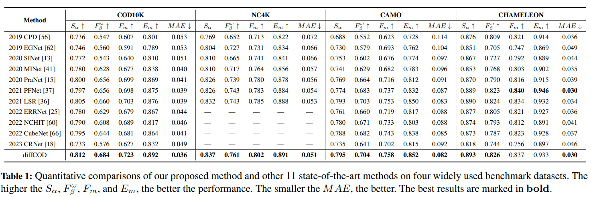

# Diffusion Model for Camouflaged Object Detection

> "Diffusion Model for Camouflaged Object Detection" ECAI, 2023 Aug
> [paper](http://arxiv.org/abs/2308.00303v2) [code](https://github.com/ZNan-Chen/diffCOD) 
> [pdf](./2023_08_ECAI_Diffusion-Model-for-Camouflaged-Object-Detection.pdf)
> Authors: Zhennan Chen, Rongrong Gao, Tian-Zhu Xiang, Fan Lin

## Key-point

- Task: Camouflaged object detection

- Problems

- :label: Label:

- Motivation

  powerful noise-to-image denoising capability of denoising diffusion models

## Contributions

## Introduction

## methods

framework

### Feature Fusion (FF)

使用 PVTv2 backbone 提取的多尺度特征，融合一下 Feature Fusion 

 each branch uses two convolution operations with 3×3 kernel for feature enhancement, and finally the three branches are coalesced by a single convolution

PVTv2 映入多尺度特征作为 attn 输入

### IAM

IAM 模块等于做了两次 attention 然后化简了一下公式；在消融实验中验证了很有用，diffusion 做 cross-attn 引入输入效果会好一些

- Motivation

  **introduce texture and location information** of the original features in the noise prediction process, we employ a cross-attention-based IA

## Experiment

> ablation study 看那个模块有效，总结一下

Sa 提升了 0.1 

IAM，FF 模块有点用，预训练 ViT 提取纹理特征也能提点

## Limitations

## Summary :star2:

> learn what & how to apply to our task

1. 在消融实验中验证了很有用，diffusion 做 cross-attn 引入输入效果会好一些

   引入输入的 **texture** 和 mask **相对于原图的位置信息**

