# Sparse Sampling Transformer with Uncertainty-Driven Ranking for Unified Removal of Raindrops and Rain Streaks

> "Sparse Sampling Transformer with Uncertainty-Driven Ranking for Unified Removal of Raindrops and Rain Streaks" ICCV, 2023 Aug, `UDR-S2Former`
> [paper](http://arxiv.org/abs/2308.14153v1) [code](https://github.com/Owen718/UDR-S2Former_deraining) [supp](https://openaccess.thecvf.com/content/ICCV2023/supplemental/Chen_Sparse_Sampling_Transformer_ICCV_2023_supplemental.pdf)
> [pdf](./2023_08_ICCV_Sparse-Sampling-Transformer-with-Uncertainty-Driven-Ranking-for-Unified-Removal-of-Raindrops-and-Rain-Streaks.pdf) [supp-pdf](./2023_08_ICCV_Sparse-Sampling-Transformer-with-Uncertainty-Driven-Ranking-for-Unified-Removal-of-Raindrops-and-Rain-Streaks_supp.pdf)
> Authors: Sixiang Chen, Tian Ye, Jinbin Bai, Erkang Chen, Jun Shi, Lei Zhu

## Key-point

- Task: image deraining
- Problems
  1. rain streaks and raindrops have diverse shapes, sizes, and locations
  2. window attention can lead to incomplete degradation coverage, causing the breakdown of degradation relationships for unified rain degradation removal

- :label: Label:


application of the **uncertainty-driven ranking strategy** can facilitate the network to attend to degradation features and **understand the reconstruction process**


## Contributions

1.  uncertainty-driven sparse sampling transformer 关注噪声区域之间的关系

   window-atten 割裂了较大区域退化，多个窗口之间的关系被割裂

2. ranking strategy in the uncertainty map 利用 uncertainty map 让模型关注退化区域

3. local reconstruction 用 uncertainty map 重建


## Introduction

- "Removing Raindrops and Rain Streaks in One Go" CVPR 2021
  [paper](https://openaccess.thecvf.com/content/CVPR2021/html/Quan_Removing_Raindrops_and_Rain_Streaks_in_One_Go_CVPR_2021_paper.html)

requires using expensive and inflexible NAS to select an optimal architecture


### uncertainty modeling

- "What Uncertainties Do We Need in Bayesian Deep Learning for Computer Vision?" NIPS, 2017 Mar 
  [paper](https://arxiv.org/abs/1703.04977)

Uncertainty可分为偶然不确定性和认知不确定性

1.  Aleatoric Uncertainty **偶然不确定性**可以认为是有数据造成的

   数据中内在的不确定性，比如 深度传感器内在的误差，图像中的噪声。

2. Epistemic Uncertainty **认知不确定性**可认为是由于模型还学得不好造成的不确定性

   参数的不确定性 也被叫做 model uncertainty

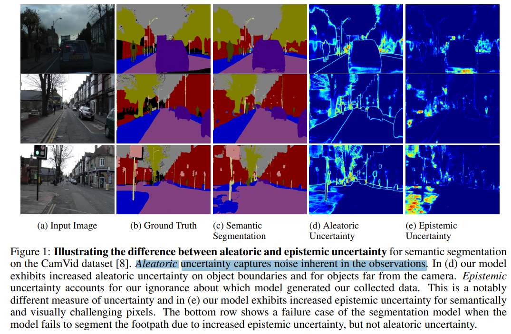


- "Rectifying Pseudo Label Learning via Uncertainty Estimation for Domain Adaptive Semantic Segmentation" IJCV, 2020 Mar 
  [paper](https://arxiv.org/pdf/2003.03773.pdf) [blog](https://zhuanlan.zhihu.com/p/130220572)


- "Uncertainty-driven loss for single image super-resolution" NIPS, 2021 
  [blog](https://blog.csdn.net/u014546828/article/details/125289245) [paper](https://neurips.cc/media/neurips-2021/Slides/28304_H8hmaRK.pdf) [code](https://github.com/QianNing0/UDL?tab=readme-ov-file)

将 uncertainty map 融入 image SR 任务

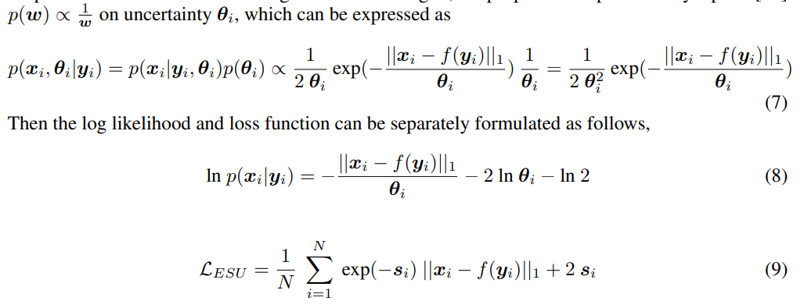

 estimating uncertainty (EU) Loss in SISR 缺点

> a pixel with a large variance will be penalized after the division and has less impact on the overall loss function

但在 SISR 任务中，方差较大的区域是一些细节 or 边缘，反而权重被降低了，导致效果更差。

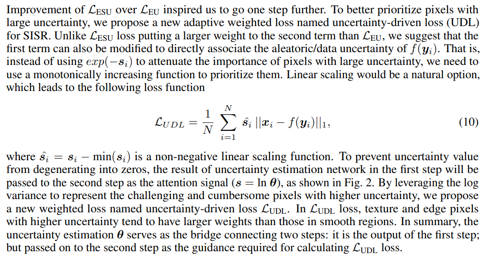


## methods

> - uncertainty map 如何计算
> - 如何用到视频

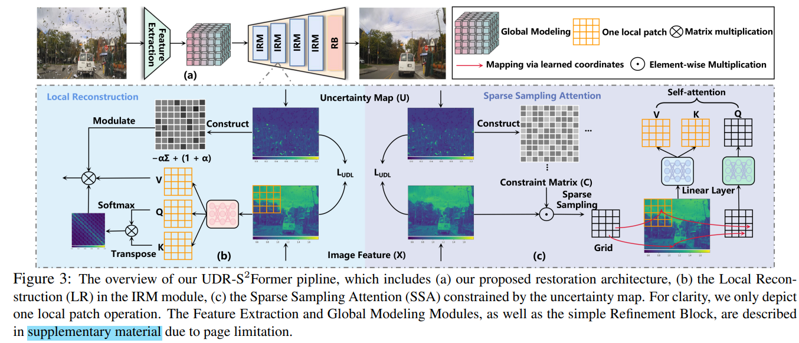

- 对退化类型分类
  - Rain streak: 线条状雨水（大雨），认为直接相加
  - Raindrops: 雨珠，指定区域遮盖

framework output two variables, the uncertainty map and the expected rain-free image


### 计算 uncertainty map 

> contention that by fully leveraging the properties of this uncertainty map, we can more effectively model the relationships of degradation and drive the network for the understanding of degradation restoration

- Motivation

  如果 uncertainty map 很好地关注到了噪声区域，利用这个 map 可以让模型更好理解是修复任务

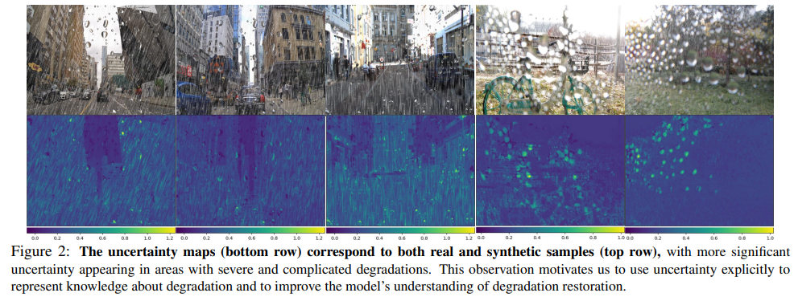


参考下面工作，using a simple Conv-ELU to generate the uncertainty map for the place where uncertainty is required. 并且 Loss 参考下面的工作，缓解训练不稳定问题（variance =0 在除数上）

> "Uncertainty-driven loss for single image super-resolution" NIPS, 2021 
> [blog](https://blog.csdn.net/u014546828/article/details/125289245) [paper](https://neurips.cc/media/neurips-2021/Slides/28304_H8hmaRK.pdf)

```python
self.var_conv3 = nn.Sequential(*[nn.Conv2d(dim[3],dim[3],3,1,1), nn.ELU(),nn.Conv2d(dim[3],out_cahnnels,3,1,1), nn.ELU()])
```

**优化**

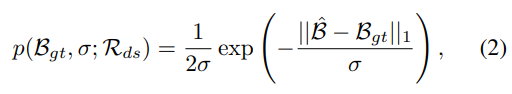

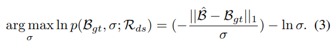

> Without being limited to a loss function, we aim to employ the ranking strategy to explicitly utilize estimated uncertainty

```python
s = torch.exp(-var_list[0])  # 1/(e^var)
sr_ = torch.mul(y_list[0] ,s)
hr_ = torch.mul(y, s)
loss_uncertarinty0 =  self.loss_l1(sr_,hr_) + 2* torch.mean(var_list[0])
```

各个尺度的 uncertainty map loss 相加

```python
loss_uncertarinty = (loss_uncertarinty0 + loss_uncertarinty1 + loss_uncertarinty2 + loss_uncertarinty3 + loss_uncertarinty4)/ 5.0
loss = (loss_f + 0.2*loss_per + loss_uncertarinty)
```


### Feature Extraction

> [conv-block code](https://github.com/Owen718/UDR-S2Former_deraining/blob/93c50a8fee98c7c1a1a45cde7f64e0064f239fa6/base_net_snow.py#L214)

对图像先用 simple conv block 提取特征

> 参考此工作，把 channel dim 翻倍，more discriminative features.
>
> - "Simple baselines for image restoration" ECCV, 2022

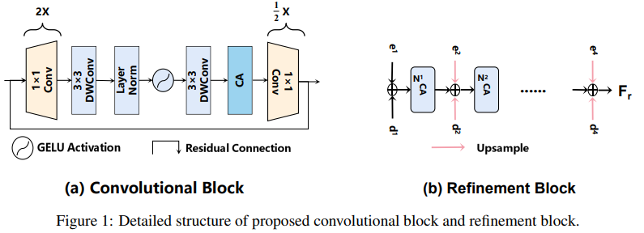

```python
self.conv = nn.Sequential(
    # pw
    nn.Conv2d(inp, hidden_dim, 1, 1, 0 ),  # double channel, hidden_dim = round(inp * expand_ratio)

    nn.Conv2d(hidden_dim, hidden_dim, 3, stride, 1,dilation=1, groups=hidden_dim),
    LayerNorm(hidden_dim, 'BiasFree'),
    nn.GELU(),
    nn.Conv2d(hidden_dim, hidden_dim, 3, stride, 1,dilation=1, groups=hidden_dim),

    ChannelAttention(hidden_dim,4,dynamic=dynamic),  # SE

    nn.Conv2d(hidden_dim, oup, 1, 1, 0),
)
```


### BottleNeck Transformer

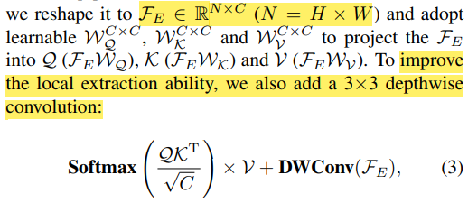


**IRM 模块**

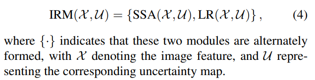


### SSA & LR

Sparse Sampling Attention (SSA)

- Motivation

  噪声区域（水珠）较大的情况，用 window-based attn 可能整个窗口都是噪声，没法关联到附近区域，限制修复能力


**通过坐标来关联各个噪声区域**，希望把退化区域和能提供信息的区域关联起来；预测当前 patch 可以关联到的 patch

>  learn to match the degraded coordinates of other regions in the whole image, and map them to the same image；
>
> transform the **original coordinates of the feature map** to sampling location for each patch

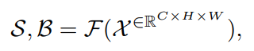

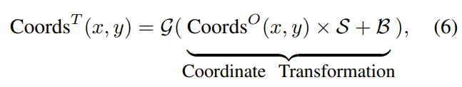

特征图中每个 patch 都关联到了一个 patch

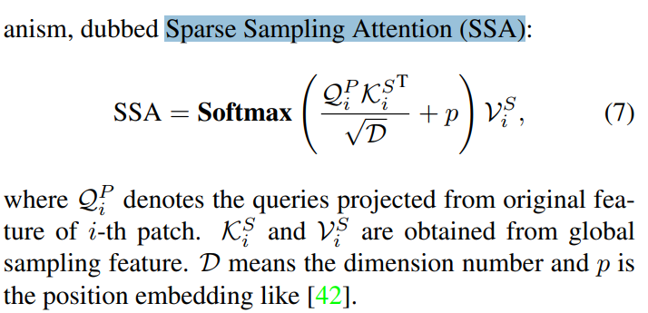


融入 uncertainty map，先转化为 矩阵

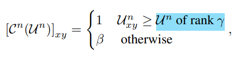

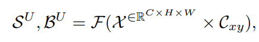


### Local Reconstruction

对 Map U 分 patch ，互相相乘（余弦相似度）作为 CR；

对 **CR 二值化**：对每一行排序，关联度很大的设为 1，关联度不大的置 0

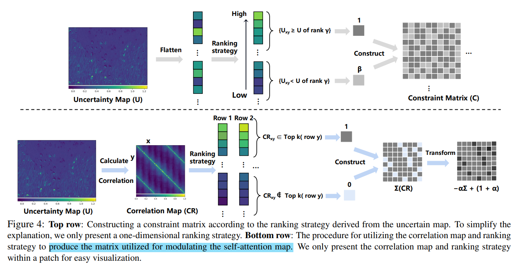

？？

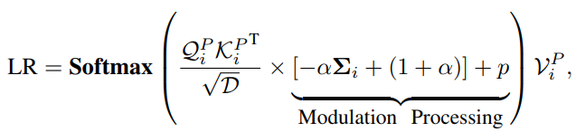


### Loss Function

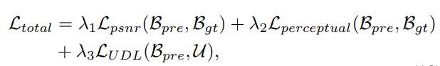

$L_{UDL}$ 代表 uncertainty loss，参考下文

> "Uncertainty-driven loss for single image super-resolution" NIPS, 2021 
> [blog](https://blog.csdn.net/u014546828/article/details/125289245) [paper](https://neurips.cc/media/neurips-2021/Slides/28304_H8hmaRK.pdf) [code](https://github.com/QianNing0/UDL?tab=readme-ov-file)


## Experiment

> ablation study 看那个模块有效，总结一下


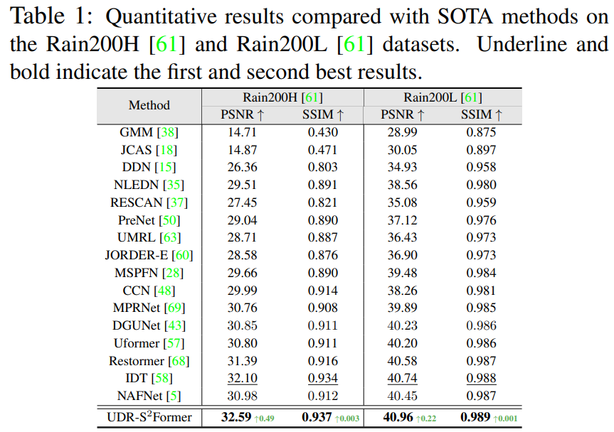

主观结果

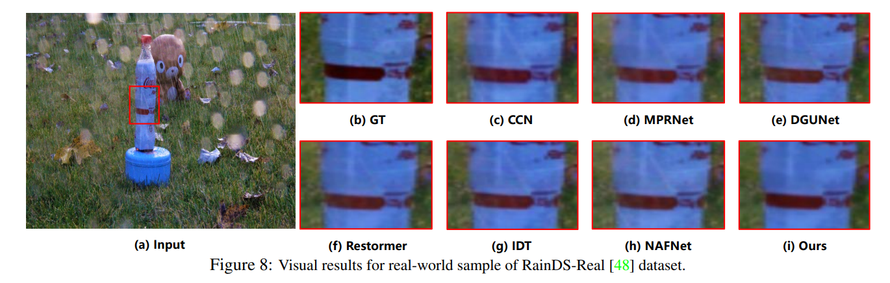

Uncertainty 可以针对退化区域细化处理


### Ablation

SSA 和 LR 中的超参

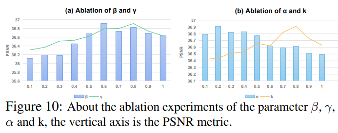


 **Convolutional Block**

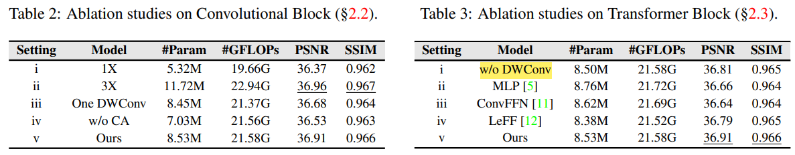


**Computation Time Comparison**

> `torch.cuda.synchronize()` API function to obtain accurate feed-forward runing times

比较不同 patch-size 下是否会 OOM


## Code

> [model forward](https://github.com/Owen718/UDR-S2Former_deraining/blob/93c50a8fee98c7c1a1a45cde7f64e0064f239fa6/UDR_S2Former.py#L851)

将输入先用 bicubic 按 3 个降采样倍数，得到 3 张图 `x1,x2,x3`

**计算 uncertainty map**

分别过 Encoder，BottleNeck(Attn), Decode。最后一个特征 `inp_dec_level3` 直接过 Conv2d 作为输出图，输入到 `self.var_conv3`得到 uncertainty map

```
out3 = self.out3(inp_dec_level3)+ x3  # decode as image
var3 = self.var_conv3(inp_dec_level3)
```

模型定义

```
self.var_conv3 = nn.Sequential(*[nn.Conv2d(dim[3],dim[3],3,1,1), nn.ELU(),nn.Conv2d(dim[3],out_cahnnels,3,1,1), nn.ELU()])
```


## Limitations


## Summary :star2:

> learn what & how to apply to our task

