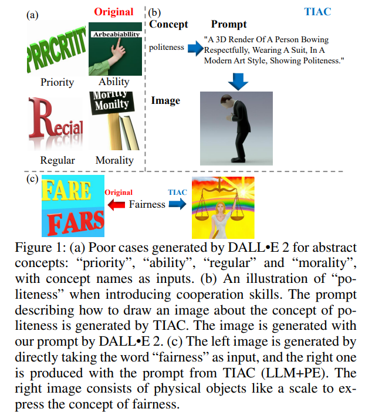
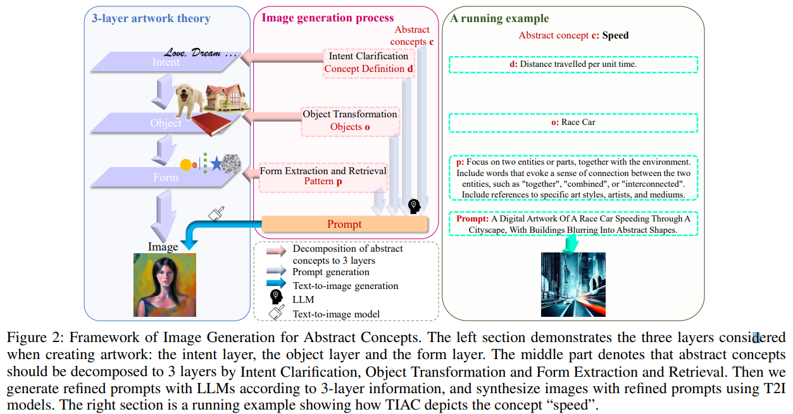

# Text-to-Image Generation for Abstract Concepts

> "Text-to-Image Generation for Abstract Concepts" AAAI, 2023 Sep
> [paper](http://arxiv.org/abs/2309.14623v2) [code]() 
> [pdf](./2023_09_AAAI_Text-to-Image-Generation-for-Abstract-Concepts.pdf)
> Authors: Jiayi Liao, Xu Chen, Qiang Fu, Lun Du, Xiangnan He, Xiang Wang, Shi Han, Dongmei Zhang

## Key-point

- Task: 针对抽象概念的 text2image

- Problems

  LLM 针对抽象概念出图的结果很烂

  

- :label: Label:

将抽象概念分等级（Intent Clarification, Object Transformation and Form Extraction and Retrieval）得到对应优化的 prompt 输入 LLM

## Contributions

## Introduction

## methods

## Experiment

> ablation study 看那个模块有效，总结一下

We construct two datasets based on abstract concepts in WordNet with different scales. The small-scale one contains 57 abstract concepts and the large-scale one contains 3,400 abstract concepts.

use GPT-3.5 (Brown et al. 2020) (text-davanci-003) as the LLM in our framework, and Stable Diffusion v2 (Rombach et al. 2022) (v2-inference and checkpoint of 512-baseema) as the T2I model

## Limitations

## Summary :star2:

> learn what & how to apply to our task

