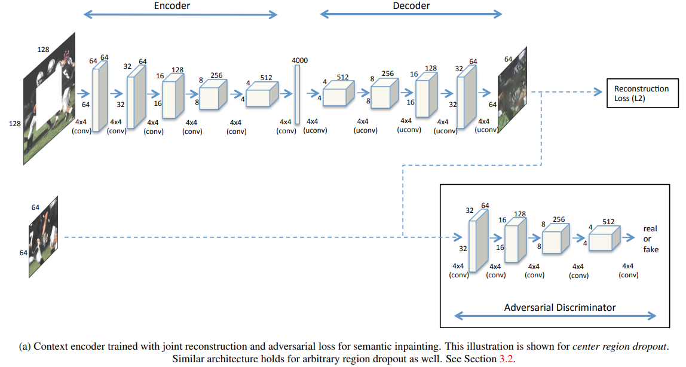
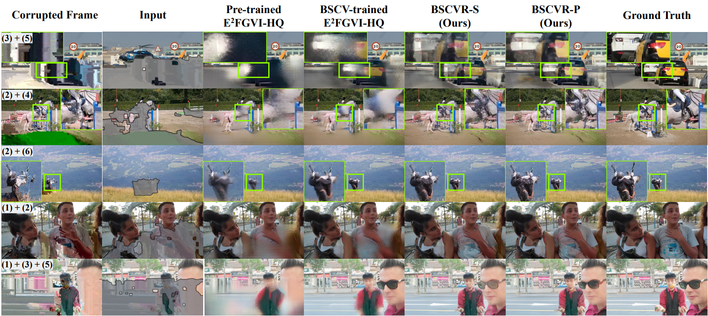

# Bitstream-Corrupted Video Recovery

> "Bitstream-Corrupted Video Recovery: A Novel Benchmark Dataset and Method" NeurIPS  Dataset and Benchamrk Track, 2023 Sep :statue_of_liberty:
> [paper](https://arxiv.org/abs/2309.13890) [code](https://github.com/LIUTIGHE/BSCV-Dataset)
> [pdf](./2023_09_Arxiv_Bitstream-corrupted-Video-Recovery.pdf)

## **Key-point**

- Task: bitstream-corrupted video(BSCV) recovery

- Background

  先前工作依赖于 manual-designed error masks, 无法应用于电视等 VHS 真实退化

- :label: Label:

1. 提出第一个 BSCV（Bitstream-Corrupted Video） benchmark 对视频比特流进行退化，构建了第一个数据集 28k 个clips；从视频编解码角度做退化，效果相比 inpainting 固定的 mask 更接近真实视频。
2. mask掉的区域仍有可用信息，因此构造了一个特征融合模块取融合 mask掉的信息

> 虽然是合成数据集，但是效果很惊艳，和真实 VHS 退化很接近。
>
> 之前不知道如何做这个数据，关注一下

## **Contributions**

1. BSCV, the first large-scale dataset used for bitstream-corrupted video recovery in the real world

   > The provided videos are **decoded from real corrupted bitstreams**, which are generated by our three-parameter bitstream corruption model.
   > contains over 28,000 challenging corrupted video clips

2. propose **a plug-and-play module** to flexibly embed in existing video inpainting frameworks

   对于损坏区域提取特征，对当前序列的特征进行增强

3. BSCV 数据上测试现有 video inpainting 方法，reveal the limitation of existing video inpainting algorithms and point out the future direction

## **Related Work**

- 通过编解码角度处理，对于长时序的视频仍存在 loss

- VFI 插值换掉损坏的帧，较大运动效果不好

  > "Video error concealment using deep neural networks"

- Video inpainting
  人工设置的 mask

- 数据集构建

  **packet loss**， 模仿的 error types 参考 

  "Impact of packet loss on 4K UHD video for portable devices"
  [paper](https://link.springer.com/article/10.1007/s11042-019-07996-1) [pdf](./2019_07_Impact-of-packet-loss-on-4K-UHD-video-for-portable-devices.pdf)

### VR :wrench:

#### feature alignment

- "Video enhancement with task-oriented flow"

- dynamic upsampling filter

  "Deep video super-resolution network using dynamic upsampling filters without explicit motion compensation."

- deformable conv

  "Tdan: Temporally-deformable alignment network for video super-resolution"

  STDAN

#### Feature fusion

- one-stage direct fusion
  - "Progressive fusion video super-resolution network via exploiting non-local spatio-temporal correlations." ICCV, 2019
  - "Edvr: Video restoration with enhanced deformable convolutional networks" CVPRw, 2019
- multi-stage progressive fusion
  - "Progressive fusion video super-resolution network via exploiting non-local spatio-temporal correlations." ICCV, 2019

### Video error concealment :question:

a commonly-used post-processing technique at the decoder side, aims to recover the error regions in decoded videos

corruption caused by realistic packet loss 

- "A spatial-focal error concealment scheme for corrupted focal stack video" DCC,2023
  [paper](https://ieeexplore.ieee.org/document/10125525) [pdf](./2023_DCC_A_Spatial-Focal_Error_Concealment_Scheme_for_Corrupted_Focal_Stack_Video.pdf)
- "Bi-sequential video error concealment method using adaptive homography-based registration" CSVT, 2020

### Video Inpainting

远古时期做法 patch matching or pixel diffusion problem

- "Dlformer: Discrete latent transformer for video inpainting"

patch-based method

- FuseFormer

Flow-guided generative methods

经典工作

- "Free-form video inpainting with 3d gated convolution and temporal patchgan." 2019 Apr, T-PatchGAN
  [paper](https://arxiv.org/abs/1904.10247)
- "Deep flow-guided video inpainting" CVPR, 2019
  DFVI was a pioneering work that formulates the generative video inpainting problem as a pixel propagation task
- E2FGVI 使用传统 3 stage end2end

小结：现有 video inpainting 方法忽视了动态 mask 的情况，对于真实的 bitstream corruption 效果不佳。

## BSCV Dataset

目前还没有 bitstream-corrupted video benchmark for the research of bitstream-corrupted video recovery.

Fig. 1. It can be observed that the video error types in our dataset are sophisticated and unpredictable. 相比现有数据集退化更丰富

### H.264 bitstream and bitstream corruption.

> [H.264基本原理 blog](https://zhuanlan.zhihu.com/p/31056455)
>
> - NALUs (network abstraction layer units)
>
>   - SPS (sequence parameter sets) and PPS (picture parameter sets) 
>
> - GOP(group of pictures)
>
>   <figure>  <figcaption>GOP为编码后的数据帧组，由I,P,B帧组成</figcaption> 
>       </figure> 

1. 发现 StartCode, Header, SPS, PPS 只占 <0.01% 的 Bytes
2. 要合成数据退化，基于假设：corruption is most likely to occur in the frame data parts, which is the basic assumption in this paper

**构造退化方式**

根据 IPB帧的工作原理，若对某一段 NALU 中的数据做退化，前后的 IPB帧(NALU) 也参考到退化的信息，实现**退化传播到多帧**

具体实现时候，使用 close-GOP, GOP sizes adopt 16 frames。只对 NALU 块中的某一段去掉，不对 header ，startcode 信息退化（分析只占 0.01% 并且退化了可能影响非常大，就没动）

> removing specific segments of some NALUs in a bitstream

作者用3个参数来定义退化：当前帧退化的概率，位置 L，片段 size

> parameterize a three-parameter corruption model (P, L, S), where the corrupted fragments are defined by frame corruption probability P, corruption location L, and fragment size S.

对 , YouTube-VOS [55] and DAVIS，YouTube-UGC dataset，Videezy4K [17] 数据上构建退化

对数据集按帧的角度统计，按退化区域的面积比例，划分退化程度（0-10%, 10-30%, and above 30%）。30%的帧 minor 退化

- 小结：此种方式的退化相比 video inpainting 1/16比例的固定 mask，退化更复杂，更接近真实场景的退化。

### error patterns

- Color artifacts occur when **chrominance information is corrupted**
- The trailing artifacts come from the corruption of motion information
- blocking artifacts: texture information corruption and error propagation
- Duplicate artifacts: duplicate the error pixels in the adjacent regions

- 小结：The constructed dataset and proposed three-parameter corruption model can **provide flexibility in dataset customization** and extensibility in application scenarios

## **methods**

提出 plug-and-play feature enhancement module 并用于现有的 video inpainting 框架中（E2FGVI）

退化区域也有运动信息、残差信息

> It extracts and fuses local features from corrupted and corruption-free regions. By encoding the residual information inside the corrupted regions into the local features

- Encoder

  > "Context encoders: Feature learning by inpainting"
  > [paper](https://arxiv.org/abs/1604.07379)
  >
  > 
  >
  > 

  1. 使用 Context encoder 进行 region-based encoding，分别对 masked 图和 corrupted 图提取特征
  2. 之后两个特征用 Transformer 中的 Encoder 对两个特征进行融合 re-encode
  3. Channel fusion + skip + FeedForward 增强特征
  4. 后续流程与 E2FGVI 一致

- Loss 设置和 E2FGVI 一样

  > "Free-form video inpainting with 3d gated convolution and temporal patchgan." 2019 Apr, T-PatchGAN
  > [paper](https://arxiv.org/abs/1904.10247)

  $$
  Loss=\mathcal{L}_{rec}+\mathcal{L}_{adv}+\mathcal{L}_{flow}=\left\|\hat{\mathbf{Y}}-\mathbf{Y}\right\|_{1}+(-E_{z\sim P_{\hat{\mathbf{Y}}}(z)}[D(z)])+\mathcal{L}_{flow}.\\
  \mathcal{L}_{\mathcal{D}}=E_{x\sim P_{\mathbf{Y}}(x)}[\mathrm{ReLU}(1-D(x))]+E_{x\sim P_{\hat{\mathbf{Y}}}(x)}[\mathrm{ReLU}(1+D(z))].
  $$

- 小结

  1. 就是利用了 corrupted 的特征，虽然有退化但还是有运动、残差信息（从编解码角度理解）

     因此构造了一个模块去融合 corrupted 特征

  2. mask 是输入得到的 >> 没做完整个 pipeline，例如动态预测 mask

     > :question: paper中这个 mask 怎么得到的？

## **Experiment**

> ablation study 看那个模块有效，总结一下

- setting

  E2FGVI 等先前方法，使用“random shape and location 去对 mask区域做 DA，需要再训 50K iteration 才能收敛

  在提出的数据集上只需要 25K

- Quantitative Result

  

  对比 `ProPainter` 当前 SOTA 中的结果

  

- 主观结果

  

- 把 E2FGVI-HQ 在提出的数据上训练

  **E2FGVI 没有使用 mask 的信息，说明 corrupted 区域仍然时候可利用的特征的**。是否需要mask掉单独处理然后融合？

  

## **Limitations**

- 数据集有点大

## **Summary :star2:**

> learn what & how to apply to our task

1. **视频编解码角度进行 DA **，处理退化，效果已经很类似 VHS。
1. E2FGVI 在同一数据上训练后，效果没 BSCV 好，说明 **corrupted 区域仍然时候可利用的特征的**（从编解码角度理解）
1. 验证了使用动态 mask 可行！针对视频修复的噪声，去预测得到 mask