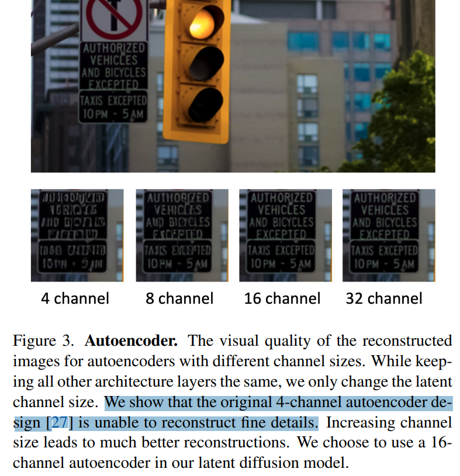
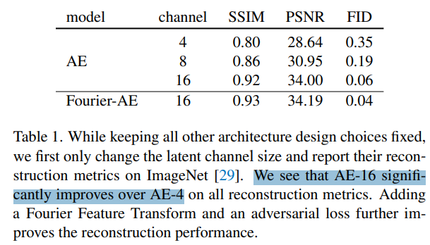
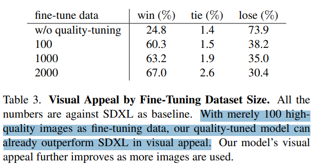

# Emu: Enhancing Image Generation Models Using Photogenic Needles in a Haystack

> "Emu: Enhancing Image Generation Models Using Photogenic Needles in a Haystack" Arxiv, 2023 Sep 27
> [paper](http://arxiv.org/abs/2309.15807v1) [code]() [pdf](./2023_09_Arxiv_Emu--Enhancing-Image-Generation-Models-Using-Photogenic-Needles-in-a-Haystack.pdf) [note](./2023_09_Arxiv_Emu--Enhancing-Image-Generation-Models-Using-Photogenic-Needles-in-a-Haystack_Note.md)
> Authors: Xiaoliang Dai, Ji Hou, Chih-Yao Ma, Sam Tsai, Jialiang Wang, Rui Wang, Peizhao Zhang, Simon Vandenhende, Xiaofang Wang, Abhimanyu Dubey, Matthew Yu, Abhishek Kadian, Filip Radenovic, Dhruv Mahajan, Kunpeng Li, Yue Zhao, Vladan Petrovic, Mitesh Kumar Singh, Simran Motwani, Yi Wen, Yiwen Song, Roshan Sumbaly, Vignesh Ramanathan, Zijian He, Peter Vajda, Devi Parikh (Meta)

## Key-point

- Task: quality-tuning

- Problems

  - 无法生成精细细节的图

  > However, these pre-trained models often face challenges when it comes to generating highly aesthetic images. This creates the need for aesthetic alignment post pre-training

  

- :label: Label:

## Contributions

- 发现 C=4 VAE 无法生成精细细节的图，选择提升 VAE 通道数。提出 EMU，**人工筛选 1kg 高质量图像去微调预训练模型 SDXL**

>  we propose quality-tuning to effectively guide a pre-trained model to exclusively generate highly visually appealing images, while maintaining generality across visual concepts. Our key insight is that **supervised fine-tuning with a set of surprisingly small but extremely visually appealing images** can significantly improve the generation quality
>
> We build Emu, a quality-tuned latent diffusion model that significantly outperforms a publicly available state-of-the-art model SDXLv1.0 on visual appeal.
>
> We pre-train a latent diffusion model on 1.1 billion image-text pairs and fine-tune it with only a few thousand carefully selected high-quality images. The resulting model, Emu, achieves a win rate of 82.9% compared with its pre-trained only counterpart. 

- 对比 SDXL 碾压

> The resulting model, Emu, achieves a win rate of 82.9% compared with its pre-trained only counterpart. Compared to the state-of-the-art SDXLv1.0, Emu is preferred 68.4% and 71.3% of the time on visual appeal on the standard PartiPrompts and our Open User Input benchmark based on the real-world usage of text-to-image models.

- 适用其他框架

## Introduction

发现 VAE C=4 无法恢复细节的。。。**VAE 结构不动，选择提升通道数 C=16，细节提升很多**

## methods

微调 SDXL，人工逐一筛选保证图像质量，得到一个小数据集

> the fine-tuning dataset can be surprisingly small, on the order of a couple of thousand images, (ii) the quality of the dataset needs to be very high, making it difficult to fully automate data curation, requiring manual annotation

quality-tuning 需要保证能用小数据集微调出来

> even with a small fine-tuning dataset, quality-tuning not only significantly improves the aesthetics of the generated images, but does so without sacrificing generality as measured by faithfulness to the input prompt. 

### LDM 结构

提升 VAE C=4->16 提升细节还原能力，**训练一个 Fourier-AE**

> We find that the commonly used 4-channel autoencoder (AE-4) architecture often results in a loss of details in the reconstructed images due to its high compression rate. The issue is especially noticeable in small objects. Intuitively, it compresses the image resolution by 64× with three 2 × 2 downsampling blocks but increases the channel size only from 3 (RGB) to 4 (latent channels). We find that increasing the channel size to 16 significantly improves reconstruction quality (see Table 1). 

使用 adversarial loss & FFT 操作，训练 VAE

> To further improve the reconstruction performance, we use an adversarial loss and apply a non-learnable pre-processing step to RGB images using a Fourier Feature Transform to lift the input channel dimension from 3 (RGB) to a higher dimension to better capture fine structures. 

UNet 结构用 SDXL, 2.8B 参数

> We use a large U-Net with 2.8B trainable parameters. We increase the channel size and number of stacked residual blocks in each stage for larger model capacity. We use text embeddings from both CLIP ViT-L [23] and T5-XXL [24] as the text conditions.

Pre-training 时候，多个阶段改变分辨率，offset-noise

### dataset

根据摄影手法选择数据集，定义不好的样本啥样

> - Composition. The image should adhere to certain principles of professional photography composition
> - Lighting. We are looking for dynamic lighting with balanced exposure that enhances the image,
> - Color and Contrast. We prefer images with vibrant colors and strong color contrast
> - Subject and Background.
> - . Additional Subjective Assessments，判断是否能从图像看出什么故事。。。

## setting

## Experiment

> ablation study 看那个模块有效，总结一下

## Limitations

## Summary :star2:

> learn what

### how to apply to our task

