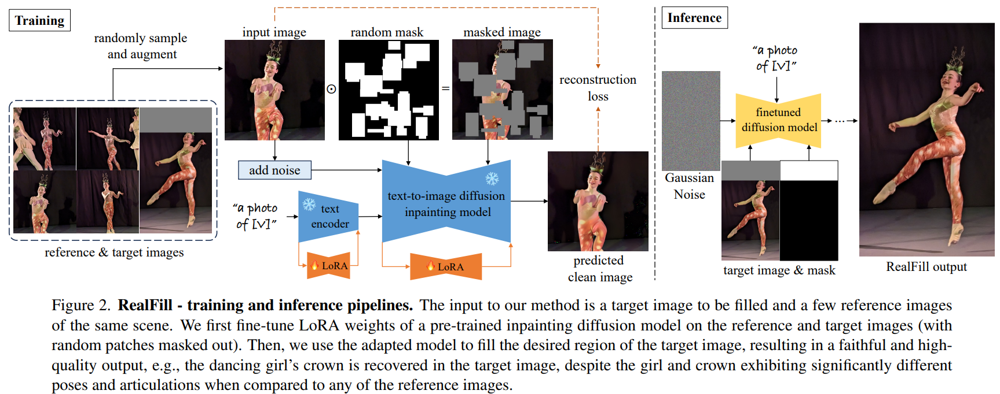

# RealFill: Reference-Driven Generation for Authentic Image Completion

> "RealFill: Reference-Driven Generation for Authentic Image Completion" SIGGRAPH, 2023 Sep 28
> [paper](http://arxiv.org/abs/2309.16668v1) [code](https://github.com/thuanz123/realfill) [website](https://realfill.github.io) [pdf](./2023_09_Arxiv_RealFill--Reference-Driven-Generation-for-Authentic-Image-Completion.pdf) [note](./2023_09_Arxiv_RealFill--Reference-Driven-Generation-for-Authentic-Image-Completion_Note.md)
> Authors: Luming Tang, Nataniel Ruiz, Qinghao Chu, Yuanzhen Li, Aleksander Holynski, David E. Jacobs, Bharath Hariharan, Yael Pritch, Neal Wadhwa, Kfir Aberman, Michael Rubinstein

## Key-point

- Task: `authentic image completion`, multi-reference image inpainting

- Problems

  SD 生成出来内容不真实

  > content these models hallucinate is necessarily inauthentic, since the models lack sufficient context about the true scene

- :label: Label:


用真实场景的参考图像，辅助生成，生成出来内容更加可信

> RealFill is a generative inpainting model that is personalized using only a few reference images of a scene

- Q：辅助图像有非对齐问题


## Contributions


## Introduction

- Q：Motivation？

使用一个例子来说明 motivation :star:

此照片 outpaint 区域的内容在其他照片里面出现，`Authentic Image Completion`

>  Of course, there are many other pictures from the performance that showcase her crown, but they all fail to capture that precise special moment: her pose mid-dance, her facial expression, and the perfect lighting. Given your memories of this event and this collection of imperfect photos, you can certainly imagine the missing parts of this perfect shot, but actually creating a complete version of this image, e.g., to share with family and friends, is a much harder task.


### Q：参考图像有非对齐问题 :star:

> we focus particularly on the more challenging, unconstrained setting in which the target and reference images may have very different viewpoints, environmental conditions, camera apertures, image styles, or even moving objects.

先前使用 correspondence matching, depth estimation, and 3D transformations 的方法，对于复杂场景 or 动态的物体，会失效

> using classical geometry-based pipelines [33, 49, 51] that rely on correspondence matching, depth estimation, and 3D transformations, followed by patch fusion and image harmonization
>
> encounter catastrophic failure when the scene’s structure cannot be accurately estimated, e.g., when the scene geometry is too complex or contains dynamic objects

- "Unleashing text-to-image diffusion models for visual perception"
- " Transfill: Reference-guided image inpainting by merging multiple color and spatial transformations" :star:


**基于生成的方法**，主要依赖 text-prompt，没法利用 reference 图像

> only guided by text prompts, and therefore lack a mechanism for utilizing reference image content.

- Stable-diffusion-2-inpainting [code](https://huggingface.co/stabilityai/stable-diffusion-2-inpainting)
- "Hierarchical text-conditional image generation with clip latents"
- "Imagen editor and editbench: Advancing and evaluating text-guided image inpainting"


## methods



使用已有的 target，reference 图像，去**微调预训练**的 Stable-diffusion-2-inpainting [code](https://huggingface.co/stabilityai/stable-diffusion-2-inpainting)

> For a given scene, we first create a personalized generative model by fine-tuning a **pre-trained inpainting diffusion model [1]** on the reference and target images. **This fine-tuning process** is designed such that the adapted model not only maintains a good image prior, but also learns the contents, lighting, and style of the scene in the input images.

生成随机性太高，出来的内容不真实。**提出基于匹配的 seed 选择模块，对于相似度太低的图像过滤掉不考虑**

> propose Correspondence-Based Seed Selection,


## Experiment

> ablation study 看那个模块有效，总结一下

## Code

- Q：mask 如何生成？


> https://github.com/thuanz123/realfill/blob/70cd2cc04041f84b45da1693c452b998d92115fc/train_realfill.py#L46

```python
def make_mask(images, resolution, times=30):
    mask, times = torch.ones_like(images[0:1, :, :]), np.random.randint(1, times)
    min_size, max_size, margin = np.array([0.03, 0.25, 0.01]) * resolution
    max_size = min(max_size, resolution - margin * 2)

    for _ in range(times):
        width = np.random.randint(int(min_size), int(max_size))
        height = np.random.randint(int(min_size), int(max_size))

        x_start = np.random.randint(int(margin), resolution - int(margin) - width + 1)
        y_start = np.random.randint(int(margin), resolution - int(margin) - height + 1)
        mask[:, y_start:y_start + height, x_start:x_start + width] = 0

    mask = 1 - mask if random.random() < 0.5 else mask
    return mask
```


## Limitations

## Summary :star2:

> learn what & how to apply to our task

